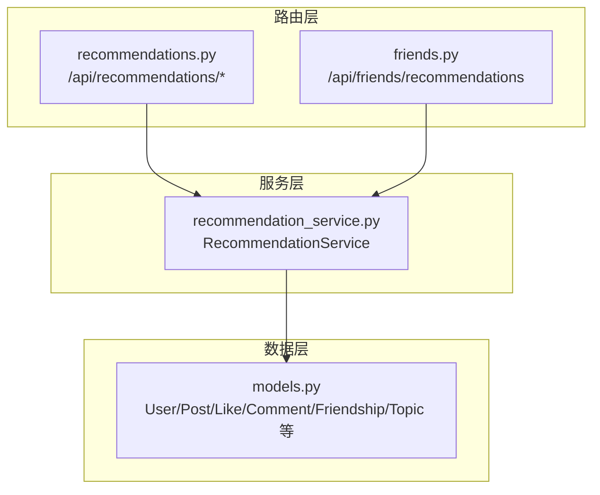
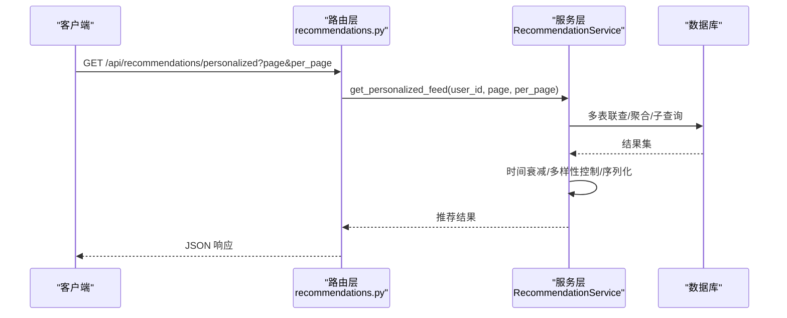
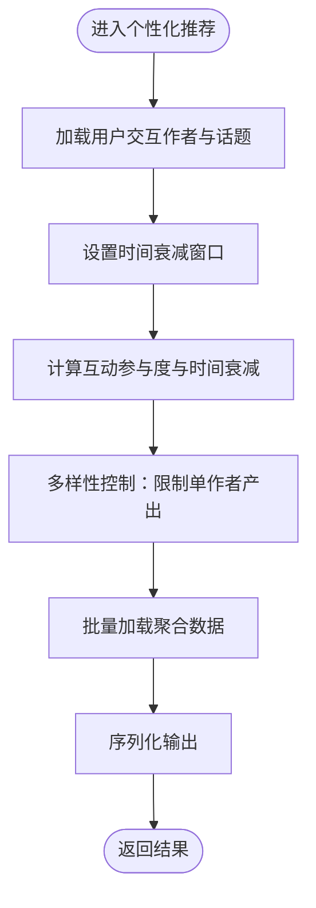
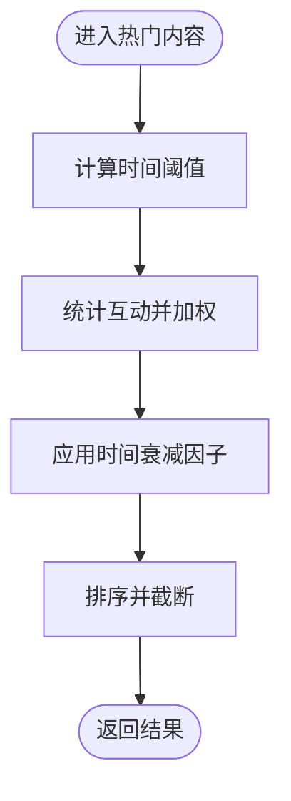
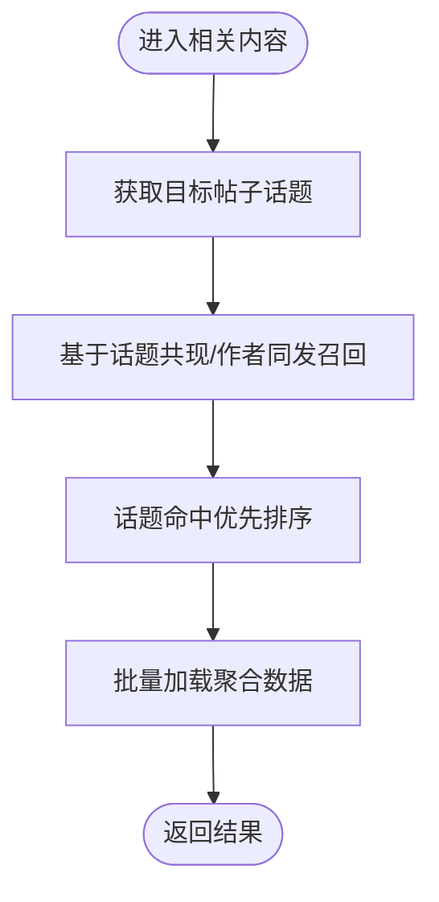
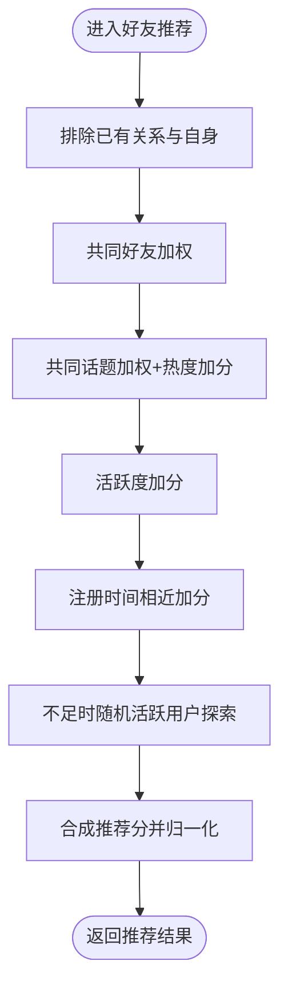
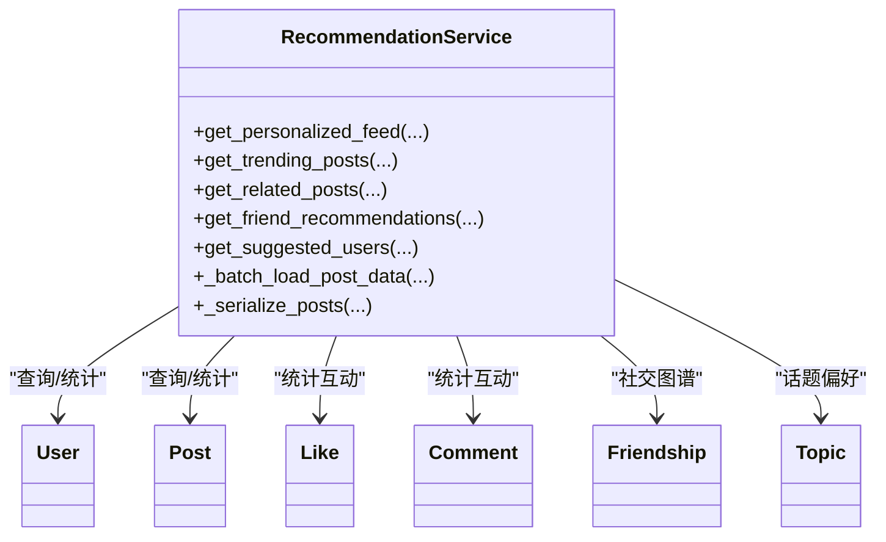

# 推荐算法系统

<cite>
**本文引用的文件**
- [app/services/recommendation_service.py](file://app/services/recommendation_service.py)
- [app/routers/recommendations.py](file://app/routers/recommendations.py)
- [app/main.py](file://app/main.py)
- [app/models/models.py](file://app/models/models.py)
- [openapi.json](file://openapi.json)
- [tests/README_TESTS.md](file://tests/README_TESTS.md)
- [tests/test_complete_api.py](file://tests/test_complete_api.py)
</cite>

## 目录
1. [简介](#简介)
2. [项目结构](#项目结构)
3. [核心组件](#核心组件)
4. [架构总览](#架构总览)
5. [详细组件分析](#详细组件分析)
6. [依赖关系分析](#依赖关系分析)
7. [性能考量](#性能考量)
8. [故障排查指南](#故障排查指南)
9. [结论](#结论)
10. [附录](#附录)

## 简介
本文件为 NanTuPy 推荐算法系统的综合技术文档，聚焦于个性化推荐、热门内容、相关内容与智能好友推荐等能力。文档从系统架构、算法设计、数据流、实时更新、冷启动、评估指标、性能优化、缓存策略、A/B 测试方案、API 设计与扩展开发等方面进行系统化梳理，并结合现有代码实现路径给出可操作的实践建议。

## 项目结构
推荐系统由三层组成：
- 路由层：对外暴露推荐 API，负责参数解析与响应封装
- 服务层：核心推荐算法实现，包含个性化、热门、相关内容与好友推荐
- 模型层：基于 SQLAlchemy 的数据模型与关系映射

图表来源
- [app/routers/recommendations.py](file://app/routers/recommendations.py)
- [app/routers/friends.py](file://app/routers/friends.py)
- [app/services/recommendation_service.py](file://app/services/recommendation_service.py)
- [app/models/models.py](file://app/models/models.py)

章节来源
- [app/main.py:77](file://app/main.py#L77)
- [app/routers/recommendations.py:9](file://app/routers/recommendations.py#L9)

## 核心组件
- RecommendationService：提供个性化推荐、热门内容、相关内容、智能好友推荐与用户画像相关统计
- 路由器 recommendations.py：统一挂载推荐相关接口
- 模型层：User、Post、Like、Comment、Friendship、Topic 及其关联表

关键职责划分：
- 个性化推荐：基于用户交互行为与话题偏好，结合时间衰减与多样性控制
- 热门内容：基于近时互动与时间衰减因子排序
- 相关内容：基于话题共现与作者同发策略
- 智能好友推荐：基于共同好友、共同话题、活跃度、注册时间与探索性随机候选

章节来源
- [app/services/recommendation_service.py:10](file://app/services/recommendation_service.py#L10)
- [app/routers/recommendations.py:22](file://app/routers/recommendations.py#L22)

## 架构总览
推荐系统采用“路由 + 服务 + ORM”的分层架构。路由层负责鉴权与参数校验，服务层执行复杂查询与评分逻辑，ORM 层完成数据访问与聚合。

图表来源
- [app/routers/recommendations.py:22](file://app/routers/recommendations.py#L22)
- [app/services/recommendation_service.py:16](file://app/services/recommendation_service.py#L16)

## 详细组件分析

### 个性化推荐 feed
- 输入参数：当前用户、页码、每页条数
- 关键步骤：
  - 基于用户交互过的作者，统计互动得分（点赞/评论权重不同）
  - 提取用户关注话题集合，用于后续召回
  - 设置时间衰减阈值（新用户与老用户的窗口不同）
  - 计算每个帖子的互动参与度与时间衰减因子
  - 应用多样性策略：限制单作者产出数量，避免信息回音室
  - 批量加载聚合数据，消除 N+1 查询
  - 返回带算法标识、是否新用户、是否应用多样性的结果

图表来源
- [app/services/recommendation_service.py:93](file://app/services/recommendation_service.py#L93)
- [app/services/recommendation_service.py:112](file://app/services/recommendation_service.py#L112)
- [app/services/recommendation_service.py:146](file://app/services/recommendation_service.py#L146)
- [app/services/recommendation_service.py:157](file://app/services/recommendation_service.py#L157)

章节来源
- [app/services/recommendation_service.py:16](file://app/services/recommendation_service.py#L16)

### 热门内容
- 输入参数：条数上限、时间窗口（小时）
- 关键步骤：
  - 计算时间阈值
  - 基于互动统计与时间衰减因子排序
  - 保持参与度与衰减因子字段便于分析
  - 返回算法标识与多样性应用情况

图表来源
- [app/services/recommendation_service.py:171](file://app/services/recommendation_service.py#L171)
- [app/services/recommendation_service.py:206](file://app/services/recommendation_service.py#L206)

章节来源
- [app/services/recommendation_service.py:171](file://app/services/recommendation_service.py#L171)

### 相关内容
- 输入参数：帖子 ID、条数上限
- 关键步骤：
  - 获取目标帖子的话题集合
  - 基于话题共现与作者同发进行召回
  - 优先级排序：话题命中优先于时间
  - 批量加载聚合数据后序列化输出

图表来源
- [app/services/recommendation_service.py:434](file://app/services/recommendation_service.py#L434)
- [app/services/recommendation_service.py:456](file://app/services/recommendation_service.py#L456)

章节来源
- [app/services/recommendation_service.py:434](file://app/services/recommendation_service.py#L434)

### 智能好友推荐
- 输入参数：当前用户 ID、推荐条数
- 关键步骤：
  - 收集当前用户的好友与待定好友列表，排除自身与现有关系
  - 共同好友：按数量加权
  - 共同话题：按数量与话题热度加权
  - 活跃度：按近一周发帖数加权（上限）
  - 注册时间相近：按月份/年份相近给予额外分数
  - 探索性随机候选：当候选不足时补充活跃用户
  - 归一化匹配度并排序输出

图表来源
- [app/services/recommendation_service.py:299](file://app/services/recommendation_service.py#L299)
- [app/services/recommendation_service.py:329](file://app/services/recommendation_service.py#L329)
- [app/services/recommendation_service.py:359](file://app/services/recommendation_service.py#L359)
- [app/services/recommendation_service.py:376](file://app/services/recommendation_service.py#L376)
- [app/services/recommendation_service.py:395](file://app/services/recommendation_service.py#L395)

章节来源
- [app/services/recommendation_service.py:299](file://app/services/recommendation_service.py#L299)

### 用户画像与兴趣标签
- 用户画像维度：
  - 交互作者画像：统计互动次数与权重
  - 话题偏好画像：用户关注话题集合
- 兴趣标签提取：
  - 基于用户互动过的作者与话题集合
  - 可扩展为更细粒度标签（如按话题热度、时间权重）

章节来源
- [app/services/recommendation_service.py:93](file://app/services/recommendation_service.py#L93)
- [app/services/recommendation_service.py:106](file://app/services/recommendation_service.py#L106)

### 相似度计算方法
- 作者相似度：基于共同互动作者的加权计分
- 用户相似度：综合共同好友、共同话题、活跃度、注册时间相近与探索性随机
- 内容相似度：基于话题共现与作者同发

章节来源
- [app/services/recommendation_service.py:93](file://app/services/recommendation_service.py#L93)
- [app/services/recommendation_service.py:299](file://app/services/recommendation_service.py#L299)

### 实时更新机制
- 个性化推荐：以用户最近互动为依据，时间衰减窗口动态调整
- 热门内容：基于近时互动与时间衰减因子滚动更新
- 相关内容：基于话题共现与作者同发即时召回
- 好友推荐：基于当前社交图谱与活跃度即时计算

章节来源
- [app/services/recommendation_service.py:112](file://app/services/recommendation_service.py#L112)
- [app/services/recommendation_service.py:171](file://app/services/recommendation_service.py#L171)
- [app/services/recommendation_service.py:434](file://app/services/recommendation_service.py#L434)
- [app/services/recommendation_service.py:299](file://app/services/recommendation_service.py#L299)

### 冷启动问题解决方案
- 新用户个性化：默认使用时间衰减窗口（更长）与热门内容兜底
- 新用户好友推荐：注册时间相近加分 + 探索性随机活跃用户

章节来源
- [app/services/recommendation_service.py:112](file://app/services/recommendation_service.py#L112)
- [app/services/recommendation_service.py:376](file://app/services/recommendation_service.py#L376)
- [app/services/recommendation_service.py:395](file://app/services/recommendation_service.py#L395)

### 推荐质量评估指标
- 点击率/转化率：曝光到点击/互动
- 多样性：作者分布、话题分布
- 覆盖率：召回池大小与推荐池大小比
- 新鲜度：时间衰减因子与时效性
- 用户满意度：可通过 A/B 测试对比不同算法版本

（本节为通用指导，不直接分析具体文件）

### 性能优化与缓存策略
- 批量加载聚合数据：消除 N+1 查询
- 子查询合并：减少多次扫描
- 时间窗口与多样性控制：降低输出规模与重复度
- 缓存建议：对热门内容与常用统计结果进行短期缓存；对用户画像与相似度矩阵进行周期性预计算

章节来源
- [app/services/recommendation_service.py:16](file://app/services/recommendation_service.py#L16)
- [app/services/recommendation_service.py:115](file://app/services/recommendation_service.py#L115)

### A/B 测试方案
- 分组策略：按用户 ID 或会话 ID 哈希分组
- 指标收集：点击率、互动率、停留时长、跳出率
- 算法对照：个性化 v3 vs v2、热门 v2 vs v1、相关内容 v2 vs v1、好友推荐 v3 vs v2
- 结果评估：显著性检验与置信区间

（本节为通用指导，不直接分析具体文件）

### 推荐 API 接口设计
- 个性化推荐
  - 方法与路径：GET /api/recommendations/personalized
  - 参数：page（页码）、per_page（每页条数）
  - 响应：包含 posts、has_more、current_page、per_page、algorithm、is_new_user、diversity_applied
- 热门内容
  - 方法与路径：GET /api/recommendations/trending
  - 参数：limit（条数）、hours（时间窗口）
  - 响应：包含 posts、time_window_hours、algorithm、diversity_applied
- 相关内容
  - 方法与路径：GET /api/posts/{post_id}/related
  - 参数：post_id（帖子 ID）、limit（条数）
  - 响应：包含 posts、algorithm
- 智能好友推荐
  - 方法与路径：GET /api/friends/recommendations
  - 参数：limit（条数）
  - 响应：包含 recommendations、total_candidates、algorithm、factors

章节来源
- [app/routers/recommendations.py:22](file://app/routers/recommendations.py#L22)
- [app/routers/recommendations.py:34](file://app/routers/recommendations.py#L34)
- [app/routers/recommendations.py:45](file://app/routers/recommendations.py#L45)
- [app/routers/recommendations.py:56](file://app/routers/recommendations.py#L56)
- [openapi.json:913](file://openapi.json#L913)
- [openapi.json:2671](file://openapi.json#L2671)

### 参数配置与扩展开发指南
- 参数配置
  - 个性化：时间衰减窗口、多样性阈值、权重系数
  - 热门：时间窗口、排序权重
  - 好友：共同好友权重、共同话题权重、活跃度权重、注册时间相近加分、探索性随机比例
- 扩展开发
  - 新增算法：在 RecommendationService 中新增静态方法，遵循统一返回结构
  - 新增路由：在 recommendations.py 中新增路由，调用服务层方法
  - 数据模型：根据需要扩展 User/Post/Like/Comment/Friendship/Topic 及其关联表

章节来源
- [app/services/recommendation_service.py:112](file://app/services/recommendation_service.py#L112)
- [app/services/recommendation_service.py:299](file://app/services/recommendation_service.py#L299)
- [app/routers/recommendations.py:9](file://app/routers/recommendations.py#L9)

## 依赖关系分析
- 路由层依赖服务层：recommendations.py 与 friends.py 调用 RecommendationService
- 服务层依赖模型层：通过 SQLAlchemy ORM 访问 User、Post、Like、Comment、Friendship、Topic
- 数据模型关系：User 与 Post、Like、Comment、Friendship、Topic 之间存在多对多/一对多关系

图表来源
- [app/services/recommendation_service.py:10](file://app/services/recommendation_service.py#L10)
- [app/models/models.py](file://app/models/models.py)

章节来源
- [app/services/recommendation_service.py:10](file://app/services/recommendation_service.py#L10)
- [app/models/models.py](file://app/models/models.py)

## 性能考量
- 查询优化
  - 批量加载聚合数据，避免 N+1
  - 合并子查询，减少扫描次数
  - 使用时间窗口与多样性控制，限制输出规模
- 缓存策略
  - 对热门内容与常用统计结果进行短期缓存
  - 对用户画像与相似度矩阵进行周期性预计算
- 并发与限流
  - 在路由层增加速率限制与并发控制
  - 对热点接口进行异步处理或队列化

（本节为通用指导，不直接分析具体文件）

## 故障排查指南
- 接口测试覆盖
  - 推荐模块测试：见测试套件对推荐接口的覆盖说明
  - 完整 API 测试：包含推荐模块的完整测试流程
- 常见问题定位
  - 参数缺失或类型错误：检查路由参数与 OpenAPI 规范
  - 权限问题：确认 Bearer Token 有效性
  - 数据不一致：核对模型与数据库表结构一致性

章节来源
- [tests/README_TESTS.md:19](file://tests/README_TESTS.md#L19)
- [tests/test_complete_api.py:782](file://tests/test_complete_api.py#L782)

## 结论
NanTuPy 推荐系统以服务层为核心，结合 SQLAlchemy ORM 实现了个性化、热门、相关内容与智能好友推荐四大能力。通过时间衰减、多样性控制与批量聚合查询，系统在保证实时性的同时兼顾性能。建议后续引入缓存与 A/B 测试体系，持续优化推荐质量与用户体验。

## 附录
- OpenAPI 文档：参考 openapi.json 中推荐相关接口定义
- 测试用例：参考 tests/README_TESTS.md 与 tests/test_complete_api.py 中的推荐模块测试

章节来源
- [openapi.json:913](file://openapi.json#L913)
- [openapi.json:2671](file://openapi.json#L2671)
- [tests/README_TESTS.md:19](file://tests/README_TESTS.md#L19)
- [tests/test_complete_api.py:782](file://tests/test_complete_api.py#L782)