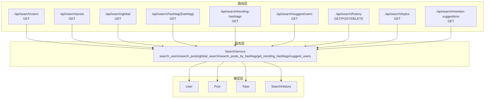
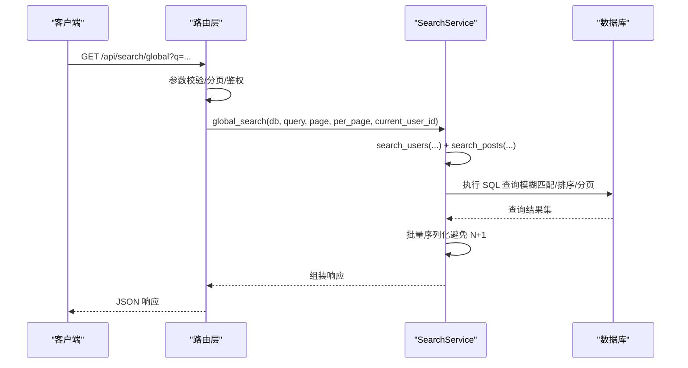
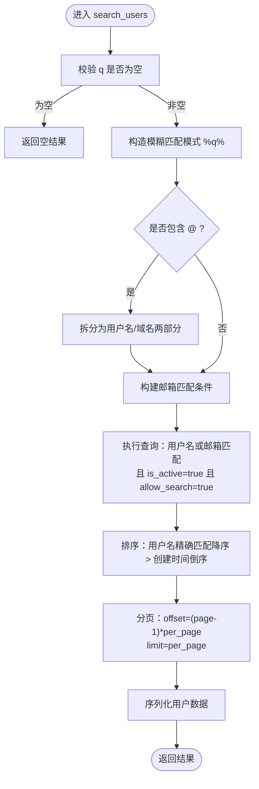
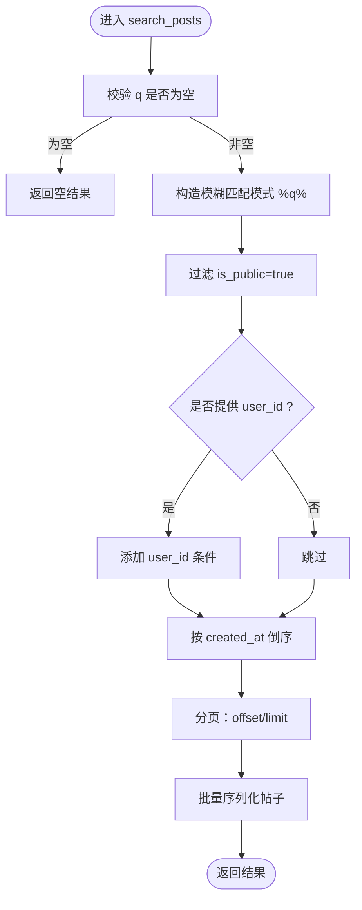
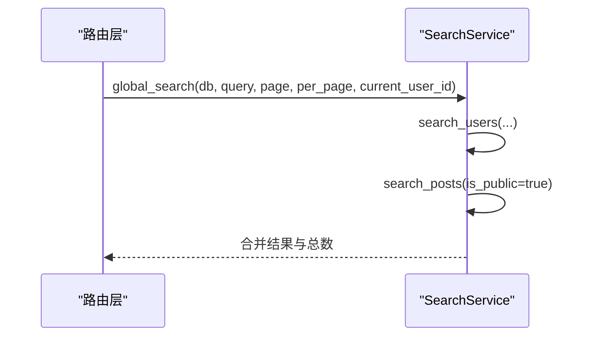
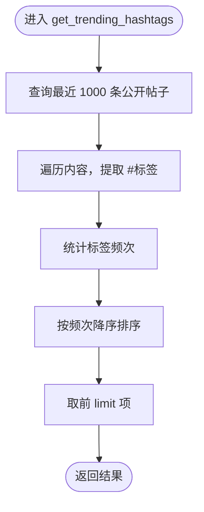
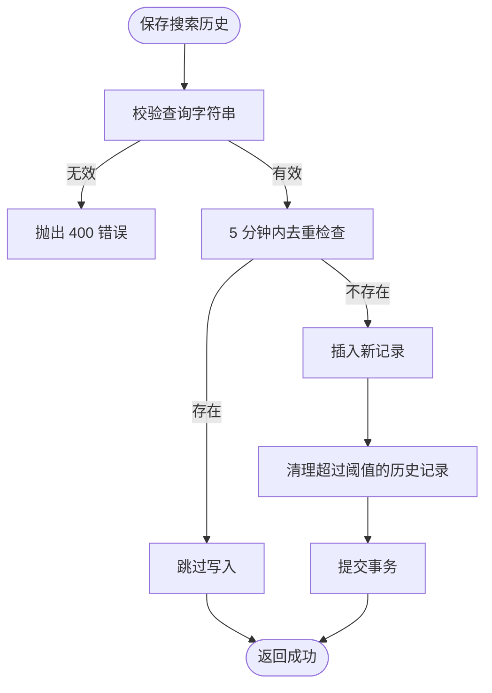
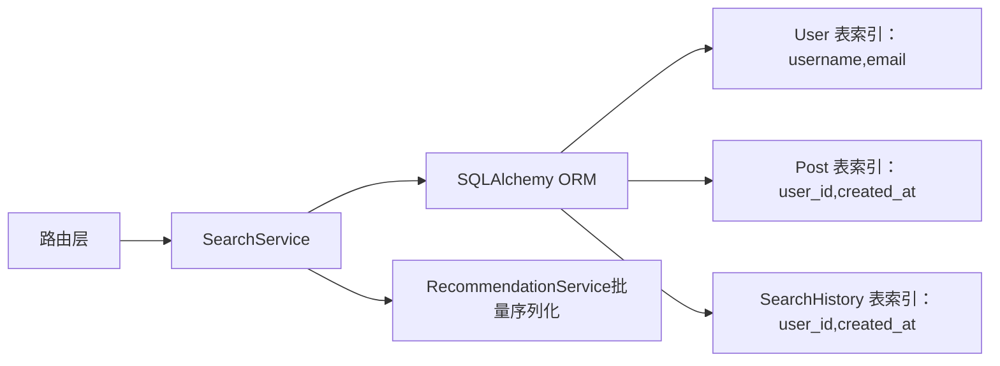

# 搜索功能实现

<cite>
**本文档引用的文件**
- [app/routers/search.py](file://app/routers/search.py)
- [app/services/search_service.py](file://app/services/search_service.py)
- [app/models/models.py](file://app/models/models.py)
- [app/database.py](file://app/database.py)
- [app/dependencies.py](file://app/dependencies.py)
- [app/core/config.py](file://app/core/config.py)
- [tests/test_search_api.py](file://tests/test_search_api.py)
- [tests/diagnose_search.py](file://tests/diagnose_search.py)
- [tests/test_email_search.py](file://tests/test_email_search.py)
- [openapi.json](file://openapi.json)
</cite>

## 目录
1. [简介](#简介)
2. [项目结构](#项目结构)
3. [核心组件](#核心组件)
4. [架构概览](#架构概览)
5. [详细组件分析](#详细组件分析)
6. [依赖分析](#依赖分析)
7. [性能考虑](#性能考虑)
8. [故障排查指南](#故障排查指南)
9. [结论](#结论)
10. [附录](#附录)

## 简介
本文件系统性梳理 NanTuPy 的搜索功能实现，覆盖用户搜索、帖子搜索、全局搜索、标签搜索、搜索历史与热门标签统计、搜索建议等模块。文档重点阐述：
- 搜索算法与 SQL 查询优化策略
- 全文索引设计与模糊匹配技术
- 搜索历史管理、热门搜索统计与搜索建议系统
- 结果排序算法、分页机制与性能优化
- 搜索 API 接口规范（参数、错误处理、响应格式）
- 搜索质量评估指标与用户体验优化策略

## 项目结构
搜索功能主要分布在以下模块：
- 路由层：提供 REST API 接口，负责参数解析与鉴权
- 服务层：封装具体搜索逻辑，复用 SQL 查询与序列化
- 模型层：定义数据模型与索引，支撑搜索与排序
- 依赖与配置：认证、数据库连接池与环境配置

**图表来源**
- [app/routers/search.py:17-269](file://app/routers/search.py#L17-L269)
- [app/services/search_service.py:9-179](file://app/services/search_service.py#L9-L179)
- [app/models/models.py:42-511](file://app/models/models.py#L42-L511)

**章节来源**
- [app/routers/search.py:17-269](file://app/routers/search.py#L17-L269)
- [app/services/search_service.py:9-179](file://app/services/search_service.py#L9-L179)
- [app/models/models.py:42-511](file://app/models/models.py#L42-L511)

## 核心组件
- 路由层：定义搜索相关 API，统一参数校验与鉴权
- 服务层：集中实现搜索算法、排序与分页
- 模型层：提供数据结构与索引，支持模糊匹配与排序
- 依赖与配置：JWT 鉴权、数据库连接池与环境变量

**章节来源**
- [app/routers/search.py:17-269](file://app/routers/search.py#L17-L269)
- [app/services/search_service.py:9-179](file://app/services/search_service.py#L9-L179)
- [app/models/models.py:42-511](file://app/models/models.py#L42-L511)
- [app/dependencies.py:16-62](file://app/dependencies.py#L16-L62)
- [app/database.py:22-32](file://app/database.py#L22-L32)
- [app/core/config.py:7-43](file://app/core/config.py#L7-L43)

## 架构概览
搜索系统采用“路由层 + 服务层 + 模型层”的分层架构，结合 FastAPI 的依赖注入与 SQLAlchemy ORM 实现。

**图表来源**
- [app/routers/search.py:50-66](file://app/routers/search.py#L50-L66)
- [app/services/search_service.py:92-111](file://app/services/search_service.py#L92-L111)

## 详细组件分析

### 用户搜索（/api/search/users）
- 功能：按用户名或邮箱模糊匹配用户，支持邮箱拆分匹配（用户名部分与域名部分）
- 参数：
  - q：查询字符串（必填，最小长度为1）
  - page/per_page：分页参数（默认 1/20，范围 1..100）
- 过滤条件：
  - 用户处于激活状态
  - 允许被搜索（allow_search）
  - 邮箱匹配支持“用户名@”和“@域名”两种拆分模式
- 排序：
  - 优先匹配用户名完全相等的结果
  - 按创建时间倒序
- 分页：
  - 使用 offset/limit 实现
  - 计算总页数：(total + per_page - 1) // per_page

**图表来源**
- [app/services/search_service.py:12-51](file://app/services/search_service.py#L12-L51)

**章节来源**
- [app/routers/search.py:17-31](file://app/routers/search.py#L17-L31)
- [app/services/search_service.py:12-51](file://app/services/search_service.py#L12-L51)

### 帖子搜索（/api/search/posts）
- 功能：按内容模糊匹配公开帖子，可按用户过滤
- 参数：
  - q：查询字符串（必填）
  - page/per_page：分页参数
  - user_id：可选，按作者过滤
- 过滤条件：
  - is_public = true
  - 可选 user_id = 当前用户
- 排序：
  - 按创建时间倒序
- 分页与序列化：
  - 使用 offset/limit
  - 批量序列化以避免 N+1 查询

**图表来源**
- [app/services/search_service.py:63-89](file://app/services/search_service.py#L63-L89)

**章节来源**
- [app/routers/search.py:33-47](file://app/routers/search.py#L33-L47)
- [app/services/search_service.py:63-89](file://app/services/search_service.py#L63-L89)

### 全局搜索（/api/search/global）
- 功能：组合用户搜索与帖子搜索结果
- 参数：
  - q：查询字符串
  - page/per_page：分页参数
- 实现：
  - 调用 search_users 与 search_posts
  - 返回合并后的用户列表、帖子列表及总数

**图表来源**
- [app/routers/search.py:50-66](file://app/routers/search.py#L50-L66)
- [app/services/search_service.py:92-111](file://app/services/search_service.py#L92-L111)

**章节来源**
- [app/routers/search.py:50-66](file://app/routers/search.py#L50-L66)
- [app/services/search_service.py:92-111](file://app/services/search_service.py#L92-L111)

### 标签搜索（/api/search/hashtag/{hashtag}）
- 功能：按内容中的标签（如 #life）搜索公开帖子
- 参数：
  - hashtag：标签名（路径参数）
  - page/per_page：分页参数
- 实现：
  - 内容中包含 “%#{hashtag}%”
  - 过滤 is_public = true
  - 按创建时间倒序

**章节来源**
- [app/routers/search.py:69-79](file://app/routers/search.py#L69-L79)
- [app/services/search_service.py:114-138](file://app/services/search_service.py#L114-L138)

### 热门标签（/api/search/trending-hashtags）
- 功能：统计最近 1000 条公开帖子中的标签出现频率，返回前 N 个热门标签
- 实现：
  - 限制最近 1000 条公开帖子
  - 从内容切词，提取以 # 开头的标签（忽略空标签）
  - 统计频次并排序，返回前 limit 项

**图表来源**
- [app/services/search_service.py:141-157](file://app/services/search_service.py#L141-L157)

**章节来源**
- [app/routers/search.py:82-90](file://app/routers/search.py#L82-L90)
- [app/services/search_service.py:141-157](file://app/services/search_service.py#L141-L157)

### 用户自动补全建议（/api/search/suggest/users）
- 功能：基于前缀匹配返回用户建议
- 参数：
  - prefix：前缀（必填）
  - limit：数量上限（默认 5，范围 1..20）
- 过滤与排序：
  - 用户名前缀匹配
  - is_active = true 且 allow_search = true
  - 限制数量

**章节来源**
- [app/routers/search.py:93-104](file://app/routers/search.py#L93-L104)
- [app/services/search_service.py:160-179](file://app/services/search_service.py#L160-L179)

### @提及用户建议（/api/search/mention-suggestions）
- 功能：生成 @ 提及建议，优先推荐好友
- 参数：
  - prefix：前缀
  - limit：数量上限
- 实现：
  - 查询所有接受的好友关系，构建好友集合
  - 查询用户名前缀匹配的用户，过滤自身
  - 排序：好友优先 > 前缀匹配优先 > 字母序

**章节来源**
- [app/routers/search.py:212-268](file://app/routers/search.py#L212-L268)

### 搜索历史管理（/api/search/history）
- 获取历史：按用户获取最近搜索记录，按时间倒序，限制数量
- 保存历史：防抖（5 分钟内相同查询不重复写入），超过阈值自动清理旧记录
- 清空历史：删除该用户全部历史记录

**图表来源**
- [app/routers/search.py:107-179](file://app/routers/search.py#L107-L179)

**章节来源**
- [app/routers/search.py:107-179](file://app/routers/search.py#L107-L179)

### 话题搜索（/api/search/topics）
- 功能：按话题名称模糊匹配
- 过滤与排序：
  - 名称模糊匹配
  - 按帖子数降序、名称升序

**章节来源**
- [app/routers/search.py:181-209](file://app/routers/search.py#L181-L209)

## 依赖分析
- 路由层依赖：
  - 依赖注入：get_current_user（JWT）、get_db（数据库会话）
  - 模型：User、Post、Topic、SearchHistory
- 服务层依赖：
  - SearchService 使用 SQLAlchemy ORM 执行查询
  - 与 RecommendationService 协作进行批量序列化，避免 N+1
- 数据库与索引：
  - User：username/email 建有索引
  - Post：user_id、created_at 建有索引
  - SearchHistory：user_id、created_at 建有复合索引

**图表来源**
- [app/routers/search.py:9-12](file://app/routers/search.py#L9-L12)
- [app/models/models.py:42-511](file://app/models/models.py#L42-L511)
- [app/services/search_service.py:54-60](file://app/services/search_service.py#L54-L60)

**章节来源**
- [app/routers/search.py:9-12](file://app/routers/search.py#L9-L12)
- [app/models/models.py:42-511](file://app/models/models.py#L42-L511)
- [app/services/search_service.py:54-60](file://app/services/search_service.py#L54-L60)

## 性能考虑
- SQL 查询优化
  - 模糊匹配使用 ilike 或 LIKE，配合索引提升效率
  - 对用户邮箱支持“用户名@”和“@域名”拆分匹配，减少全表扫描
  - 使用 offset/limit 实现分页，避免一次性加载大量数据
- 避免 N+1 查询
  - 帖子批量序列化：先批量加载 like/comment 统计与话题信息，再统一序列化
- 连接池与资源管理
  - 使用连接池（pool_size/max_overflow/pool_recycle/pool_pre_ping）
  - FastAPI 依赖注入确保每个请求独立 Session 并在 finally 中关闭
- 热门标签统计
  - 限制最近 1000 条帖子，避免全表扫描
  - 内存中统计与排序，复杂度 O(n log n)，n 为不同标签数

**章节来源**
- [app/services/search_service.py:54-60](file://app/services/search_service.py#L54-L60)
- [app/database.py:9-16](file://app/database.py#L9-L16)
- [app/database.py:22-32](file://app/database.py#L22-L32)
- [app/core/config.py:20](file://app/core/config.py#L20)

## 故障排查指南
- 常见问题
  - 搜索不到用户：确认用户 is_active = true 且 allow_search = true
  - 邮箱搜索异常：检查邮箱字段是否包含目标关键字；注意“用户名@”和“@域名”拆分匹配
  - 热门标签为空：近期无公开帖子或标签格式不符合“#标签”
  - 搜索历史重复：5 分钟内相同查询不会重复写入
- 诊断工具
  - 提供诊断脚本，展示数据库中匹配用户与不同搜索模式的命中情况
  - 可用于定位邮箱搜索、用户名搜索与激活状态的问题

**章节来源**
- [tests/diagnose_search.py:10-84](file://tests/diagnose_search.py#L10-L84)
- [tests/test_email_search.py:24-104](file://tests/test_email_search.py#L24-L104)

## 结论
NanTuPy 的搜索功能通过清晰的分层架构与合理的 SQL 优化策略，实现了用户、帖子、标签、话题与建议的多维度搜索。服务层集中处理搜索逻辑与批量序列化，路由层统一参数校验与鉴权，模型层提供必要的索引支持。整体设计兼顾了易维护性与性能表现，同时提供了搜索历史与热门标签等增强体验的功能。

## 附录

### 搜索 API 接口规范

- 获取用户列表（/api/search/users）
  - 方法：GET
  - 认证：需要 Bearer Token
  - 查询参数：
    - q：字符串，必填，最小长度 1
    - page：整数，默认 1，≥1
    - per_page：整数，默认 20，范围 [1,100]
  - 响应：
    - users：用户数组
    - total：总数
    - pages：总页数
    - current_page：当前页
    - per_page：每页数量
  - 错误：
    - q 为空时返回空结果

- 获取帖子列表（/api/search/posts）
  - 方法：GET
  - 认证：需要 Bearer Token
  - 查询参数：
    - q：字符串，必填
    - page/per_page：同上
    - user_id：可选，按作者过滤
  - 响应：posts 数组与分页信息
  - 错误：q 为空时返回空结果

- 全局综合搜索（/api/search/global）
  - 方法：GET
  - 认证：需要 Bearer Token
  - 查询参数：q/page/per_page
  - 响应：users、posts、user_total、post_total、total_results、分页信息

- 按标签搜索（/api/search/hashtag/{hashtag}）
  - 方法：GET
  - 认证：需要 Bearer Token
  - 路径参数：hashtag
  - 查询参数：page/per_page
  - 响应：posts 数组与分页信息

- 获取热门标签（/api/search/trending-hashtags）
  - 方法：GET
  - 认证：需要 Bearer Token
  - 查询参数：limit，默认 10，范围 [1,50]
  - 响应：hashtags 数组，每项含 hashtag 与 count

- 用户自动补全建议（/api/search/suggest/users）
  - 方法：GET
  - 认证：需要 Bearer Token
  - 查询参数：prefix（必填）、limit（默认 5，范围 [1,20]）
  - 响应：suggestions 数组与 total

- @提及用户建议（/api/search/mention-suggestions）
  - 方法：GET
  - 认证：需要 Bearer Token
  - 查询参数：prefix、limit
  - 响应：suggestions 数组，包含 id/username/avatar_url/is_friend

- 搜索历史管理（/api/search/history）
  - 获取历史：GET，limit 默认 20，范围 [1,100]
  - 保存历史：POST，body 包含 query 与 type
  - 清空历史：DELETE

- 话题搜索（/api/search/topics）
  - 方法：GET
  - 认证：需要 Bearer Token
  - 查询参数：q/page/per_page
  - 响应：topics 数组与分页信息

**章节来源**
- [app/routers/search.py:17-269](file://app/routers/search.py#L17-L269)
- [openapi.json:4787-4825](file://openapi.json#L4787-L4825)

### 搜索质量评估指标与用户体验优化
- 指标
  - 查准率（Precision）：返回结果中相关结果占比
  - 查全率（Recall）：相关结果中被检索到的比例
  - 平均倒数排名（MRR）：首个相关结果位置的倒数平均值
  - 用户点击率（CTR）：搜索结果被点击的比例
  - 命中延迟：从输入到返回结果的时间
- 优化策略
  - 语义近似：未来可引入向量化相似度或全文索引（如 MySQL 全文索引/外部搜索引擎）
  - 结果重排：基于用户行为与上下文进行个性化重排
  - 输入纠错：拼写纠错与同音字替换
  - 缓存热点：热门查询结果缓存
  - 限流与降级：高并发场景下保护后端