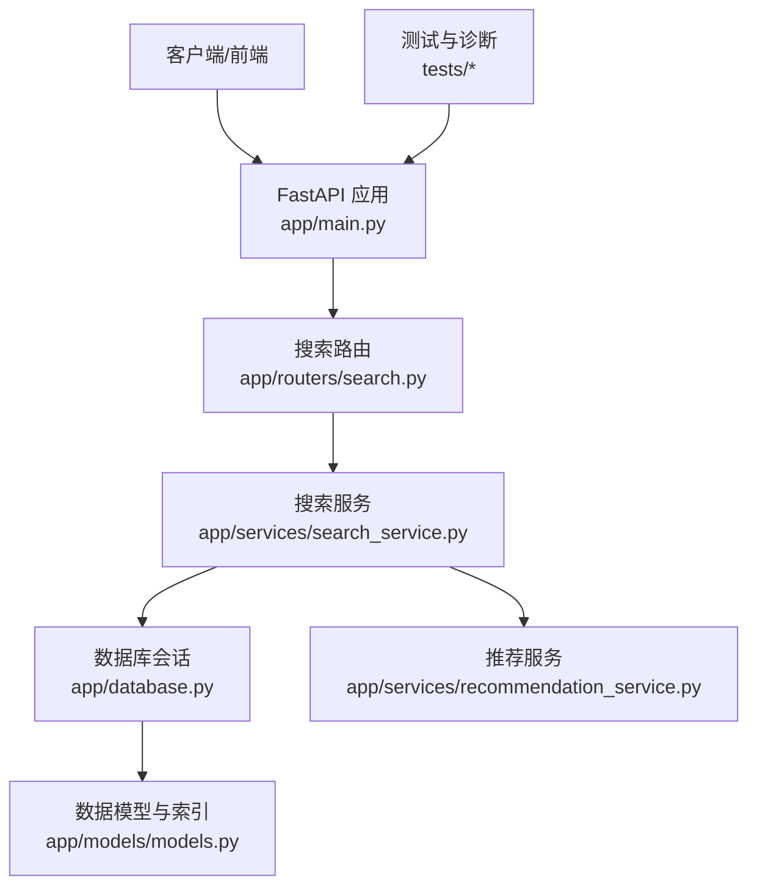
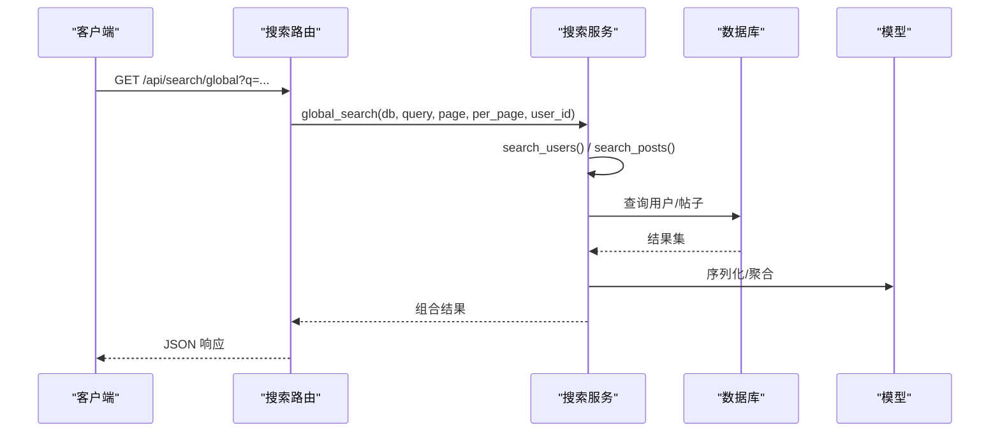
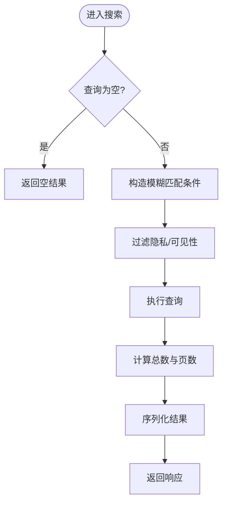
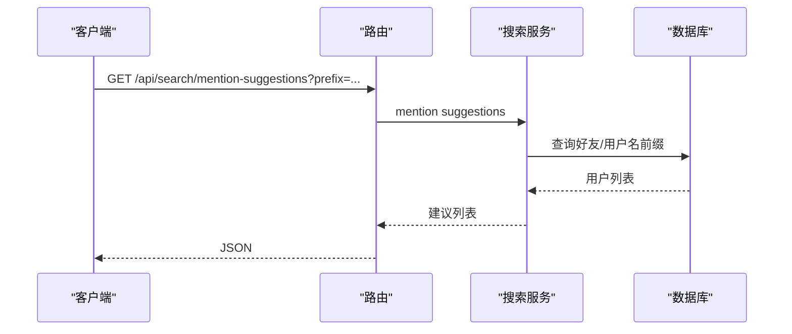
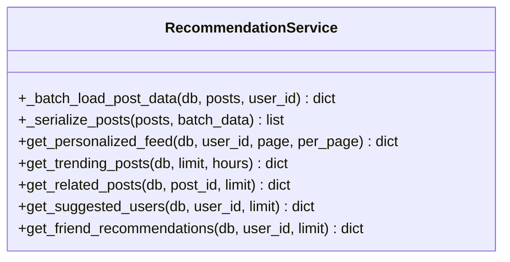
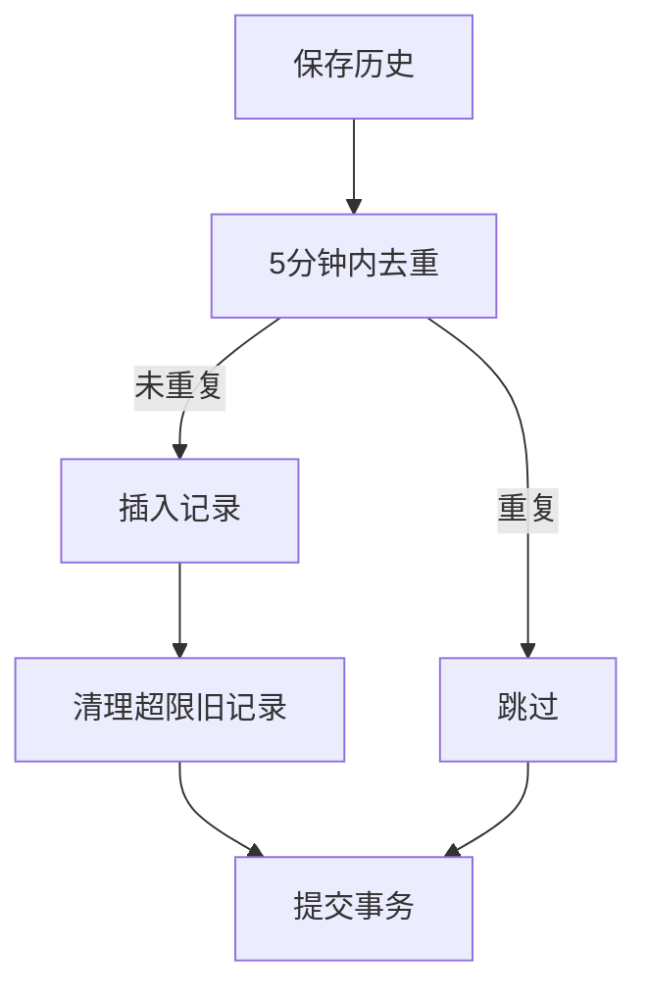
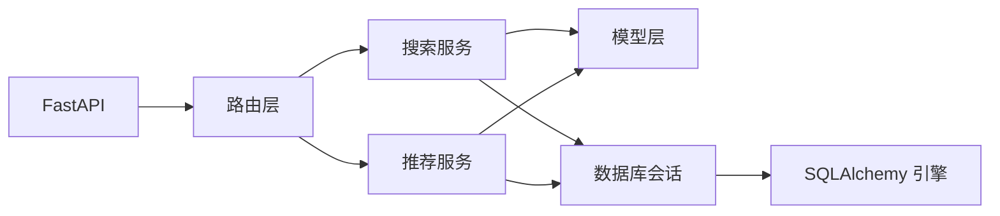

# 搜索发现系统

<cite>
**本文引用的文件**   
- [app/main.py](file://app/main.py)
- [app/database.py](file://app/database.py)
- [app/core/config.py](file://app/core/config.py)
- [app/routers/search.py](file://app/routers/search.py)
- [app/services/search_service.py](file://app/services/search_service.py)
- [app/models/models.py](file://app/models/models.py)
- [app/services/recommendation_service.py](file://app/services/recommendation_service.py)
- [tests/test_search_api.py](file://tests/test_search_api.py)
- [tests/diagnose_search.py](file://tests/diagnose_search.py)
- [requirements.txt](file://requirements.txt)
</cite>

## 目录
1. [简介](#简介)
2. [项目结构](#项目结构)
3. [核心组件](#核心组件)
4. [架构总览](#架构总览)
5. [详细组件分析](#详细组件分析)
6. [依赖分析](#依赖分析)
7. [性能考虑](#性能考虑)
8. [故障排查指南](#故障排查指南)
9. [结论](#结论)
10. [附录](#附录)

## 简介
本文件面向NanTuPy的搜索发现系统，系统性梳理全文搜索算法、索引策略、用户搜索、内容检索与高级筛选、推荐算法与个性化策略、搜索历史与热门标签、排序与SEO、缓存与性能调优、API设计与错误处理、以及扩展开发与效果评估方法。文档以代码为依据，结合测试与诊断脚本，帮助开发者与运维人员快速理解与优化搜索体验。

## 项目结构
搜索发现系统主要由以下模块构成：
- 路由层：对外暴露搜索相关REST接口，负责参数校验与鉴权
- 服务层：封装搜索与推荐的核心逻辑，统一数据库会话与查询
- 模型层：定义用户、帖子、话题、搜索历史等实体及索引
- 数据库与配置：连接池、会话管理、数据库URI与安全配置
- 测试与诊断：接口测试脚本与搜索问题诊断脚本

**图表来源**
- [app/main.py:39-84](file://app/main.py#L39-L84)
- [app/routers/search.py:17-269](file://app/routers/search.py#L17-L269)
- [app/services/search_service.py:9-179](file://app/services/search_service.py#L9-L179)
- [app/database.py:22-37](file://app/database.py#L22-L37)
- [app/models/models.py:42-511](file://app/models/models.py#L42-L511)
- [app/services/recommendation_service.py:10-457](file://app/services/recommendation_service.py#L10-L457)

**章节来源**
- [app/main.py:39-84](file://app/main.py#L39-L84)
- [app/routers/search.py:17-269](file://app/routers/search.py#L17-L269)
- [app/services/search_service.py:9-179](file://app/services/search_service.py#L9-L179)
- [app/database.py:22-37](file://app/database.py#L22-L37)
- [app/models/models.py:42-511](file://app/models/models.py#L42-L511)
- [app/services/recommendation_service.py:10-457](file://app/services/recommendation_service.py#L10-L457)

## 核心组件
- 搜索路由与接口
  - 用户搜索、帖子搜索、全局综合搜索、按标签搜索、热门标签、用户建议、@提及建议、搜索历史管理
- 搜索服务
  - 用户搜索（用户名/邮箱模糊匹配、隐私过滤）、帖子搜索（内容模糊匹配、公开范围）、全局搜索组合、标签搜索、热门标签统计、用户建议
- 推荐服务
  - 个性化动态流、热门趋势、相关推荐、好友推荐等
- 数据模型与索引
  - 用户、帖子、话题、搜索历史等模型及索引字段
- 数据库与配置
  - 连接池、会话管理、数据库URI、CORS与安全头

**章节来源**
- [app/routers/search.py:17-269](file://app/routers/search.py#L17-L269)
- [app/services/search_service.py:9-179](file://app/services/search_service.py#L9-L179)
- [app/services/recommendation_service.py:10-457](file://app/services/recommendation_service.py#L10-L457)
- [app/models/models.py:42-511](file://app/models/models.py#L42-L511)
- [app/database.py:22-37](file://app/database.py#L22-L37)
- [app/core/config.py:7-43](file://app/core/config.py#L7-L43)

## 架构总览
搜索发现系统采用“路由-服务-模型-数据库”的分层架构，配合推荐服务提供个性化体验。整体流程：
- 客户端发起搜索请求
- 路由层进行参数校验与鉴权
- 服务层执行查询与聚合
- 模型层定义数据结构与索引
- 数据库层提供连接池与事务

**图表来源**
- [app/routers/search.py:50-66](file://app/routers/search.py#L50-L66)
- [app/services/search_service.py:92-111](file://app/services/search_service.py#L92-L111)

## 详细组件分析

### 全文搜索算法与索引策略
- 用户搜索
  - 支持用户名与邮箱模糊匹配；当输入包含“@”时拆分为用户名与域名两段分别匹配邮箱
  - 隐私过滤：仅返回激活且允许被搜索的用户
  - 排序：优先完全匹配用户名，其次按创建时间倒序
- 帖子搜索
  - 基于内容字段的模糊匹配，限定为公开帖子
  - 默认按发布时间倒序
- 标签搜索
  - 将输入作为“#标签”进行匹配，限定为公开帖子
- 热门标签
  - 采样最近若干条公开帖子，提取#开头的词，统计频次并降序
- 索引与约束
  - 用户与搜索历史模型具备必要索引字段，提升模糊查询与分页效率

**图表来源**
- [app/services/search_service.py:13-51](file://app/services/search_service.py#L13-L51)
- [app/services/search_service.py:63-89](file://app/services/search_service.py#L63-L89)
- [app/services/search_service.py:114-138](file://app/services/search_service.py#L114-L138)
- [app/services/search_service.py:141-157](file://app/services/search_service.py#L141-L157)

**章节来源**
- [app/services/search_service.py:13-51](file://app/services/search_service.py#L13-L51)
- [app/services/search_service.py:63-89](file://app/services/search_service.py#L63-L89)
- [app/services/search_service.py:114-138](file://app/services/search_service.py#L114-L138)
- [app/services/search_service.py:141-157](file://app/services/search_service.py#L141-L157)
- [app/models/models.py:42-511](file://app/models/models.py#L42-L511)

### 用户搜索、内容检索与高级筛选
- 用户搜索
  - 支持邮箱前缀/域名片段匹配，隐私控制
- 帖子搜索
  - 支持按作者ID筛选、仅公开范围
- 话题搜索
  - 名称模糊匹配，按帖子数与名称排序
- @提及建议
  - 基于好友关系与用户名前缀排序，区分是否好友

**图表来源**
- [app/routers/search.py:212-268](file://app/routers/search.py#L212-L268)
- [app/services/search_service.py:160-179](file://app/services/search_service.py#L160-L179)

**章节来源**
- [app/routers/search.py:17-47](file://app/routers/search.py#L17-L47)
- [app/routers/search.py:181-209](file://app/routers/search.py#L181-L209)
- [app/routers/search.py:212-268](file://app/routers/search.py#L212-L268)
- [app/services/search_service.py:160-179](file://app/services/search_service.py#L160-L179)

### 推荐算法设计与个性化策略
- 个性化动态流
  - 基于好友关系、交互得分（点赞/评论）、话题兴趣、时间衰减因子、多样性限制（按作者去重）
- 热门趋势
  - 时间窗口内点赞/评论加权，结合时间衰减，按作者去重
- 相关推荐
  - 基于相同作者或相同话题的帖子
- 好友推荐
  - 共同好友、共同话题、活跃度、注册月份相似度、探索性随机补充

**图表来源**
- [app/services/recommendation_service.py:16-80](file://app/services/recommendation_service.py#L16-L80)
- [app/services/recommendation_service.py:83-168](file://app/services/recommendation_service.py#L83-L168)
- [app/services/recommendation_service.py:171-232](file://app/services/recommendation_service.py#L171-L232)
- [app/services/recommendation_service.py:434-457](file://app/services/recommendation_service.py#L434-L457)
- [app/services/recommendation_service.py:235-296](file://app/services/recommendation_service.py#L235-L296)
- [app/services/recommendation_service.py:299-431](file://app/services/recommendation_service.py#L299-L431)

**章节来源**
- [app/services/recommendation_service.py:16-80](file://app/services/recommendation_service.py#L16-L80)
- [app/services/recommendation_service.py:83-168](file://app/services/recommendation_service.py#L83-L168)
- [app/services/recommendation_service.py:171-232](file://app/services/recommendation_service.py#L171-L232)
- [app/services/recommendation_service.py:434-457](file://app/services/recommendation_service.py#L434-L457)
- [app/services/recommendation_service.py:235-296](file://app/services/recommendation_service.py#L235-L296)
- [app/services/recommendation_service.py:299-431](file://app/services/recommendation_service.py#L299-L431)

### 搜索历史管理、热门搜索与排序
- 搜索历史
  - 保存接口：防抖（5分钟内重复查询不入库），超过上限自动清理旧记录
  - 获取接口：按时间倒序分页
  - 清空接口：删除当前用户全部历史
- 热门标签
  - 统计最近若干条公开帖子中的#标签出现次数，降序取前N
- 排序
  - 用户：用户名精确匹配优先，创建时间倒序
  - 帖子：发布时间倒序
  - 动态流：多维打分+时间衰减+多样性

**图表来源**
- [app/routers/search.py:124-178](file://app/routers/search.py#L124-L178)
- [app/services/search_service.py:141-157](file://app/services/search_service.py#L141-L157)

**章节来源**
- [app/routers/search.py:107-178](file://app/routers/search.py#L107-L178)
- [app/services/search_service.py:141-157](file://app/services/search_service.py#L141-L157)

### API接口设计与错误处理
- 接口概览
  - GET /api/search/users、/api/search/posts、/api/search/global、/api/search/hashtag/{hashtag}、/api/search/trending-hashtags、/api/search/suggest/users、/api/search/mention-suggestions、/api/search/history（GET/POST/DELETE）
- 参数与校验
  - 分页参数page/per_page范围校验；空查询处理
- 错误处理
  - 保存历史异常回滚并返回500；其余接口遵循FastAPI默认行为
- 认证与依赖
  - 使用依赖注入获取当前用户与数据库会话

**章节来源**
- [app/routers/search.py:17-269](file://app/routers/search.py#L17-L269)

### 搜索质量评估与效果分析
- 测试覆盖
  - 用户搜索、帖子搜索、全局搜索、标签搜索、热门标签、用户建议、@提及建议、搜索历史管理
- 诊断工具
  - 诊断脚本可输出数据库用户全量、不同搜索模式匹配数、非激活用户影响等

**章节来源**
- [tests/test_search_api.py:120-437](file://tests/test_search_api.py#L120-L437)
- [tests/diagnose_search.py:10-79](file://tests/diagnose_search.py#L10-L79)

## 依赖分析
- 外部依赖
  - FastAPI、SQLAlchemy、PyMySQL、Uvicorn、COS SDK等
- 内部依赖
  - 路由依赖服务层；服务层依赖模型层与数据库会话；推荐服务复用批量数据加载与序列化

**图表来源**
- [requirements.txt:1-15](file://requirements.txt#L1-L15)
- [app/main.py:69-84](file://app/main.py#L69-L84)
- [app/routers/search.py:17-269](file://app/routers/search.py#L17-L269)
- [app/services/search_service.py:9-179](file://app/services/search_service.py#L9-L179)
- [app/services/recommendation_service.py:10-457](file://app/services/recommendation_service.py#L10-L457)
- [app/database.py:9-19](file://app/database.py#L9-L19)

**章节来源**
- [requirements.txt:1-15](file://requirements.txt#L1-L15)
- [app/main.py:69-84](file://app/main.py#L69-L84)
- [app/routers/search.py:17-269](file://app/routers/search.py#L17-L269)
- [app/services/search_service.py:9-179](file://app/services/search_service.py#L9-L179)
- [app/services/recommendation_service.py:10-457](file://app/services/recommendation_service.py#L10-L457)
- [app/database.py:9-19](file://app/database.py#L9-L19)

## 性能考虑
- 查询优化
  - 使用索引字段（用户名、邮箱、用户ID、创建时间等）降低LIKE扫描成本
  - 分页使用offset/limit，避免COUNT开销；动态流采用“多取1条判断has_more”
- 批量加载与序列化
  - 推荐服务批量加载点赞/评论/话题/是否点赞，避免N+1查询
- 连接池与会话
  - 配置连接池大小、溢出、回收与预检；每个请求独立Session
- 缓存策略
  - 热门标签可引入Redis缓存（建议实现），设置合理TTL
- 排序与多样性
  - 动态流在排序基础上加入作者去重，平衡相关性与多样性

**章节来源**
- [app/services/search_service.py:54-60](file://app/services/search_service.py#L54-L60)
- [app/services/recommendation_service.py:16-80](file://app/services/recommendation_service.py#L16-L80)
- [app/database.py:9-19](file://app/database.py#L9-L19)
- [app/core/config.py:20](file://app/core/config.py#L20)

## 故障排查指南
- 常见问题
  - 搜索不到用户：确认用户处于激活状态且允许被搜索
  - 邮箱搜索异常：检查“@”前后片段是否正确拆分
  - 热门标签为空：确认近期有公开帖子
  - @提及建议为空：确认好友关系与用户名前缀
- 诊断步骤
  - 使用诊断脚本检查不同LIKE模式匹配数与非激活用户
  - 查看数据库表结构与索引是否存在
  - 检查会话与事务是否正常提交/回滚

**章节来源**
- [tests/diagnose_search.py:10-79](file://tests/diagnose_search.py#L10-L79)
- [app/routers/search.py:124-178](file://app/routers/search.py#L124-L178)

## 结论
NanTuPy的搜索发现系统以清晰的分层架构实现基础搜索与推荐能力，结合隐私过滤、多样性和时间衰减等策略提升用户体验。建议后续引入缓存、全文检索（如Elasticsearch）与更细粒度的指标埋点，持续优化搜索质量与性能。

## 附录
- API端点清单（节选）
  - GET /api/search/users、/api/search/posts、/api/search/global、/api/search/hashtag/{hashtag}、/api/search/trending-hashtags、/api/search/suggest/users、/api/search/mention-suggestions、/api/search/history（GET/POST/DELETE）

**章节来源**
- [app/routers/search.py:17-269](file://app/routers/search.py#L17-L269)