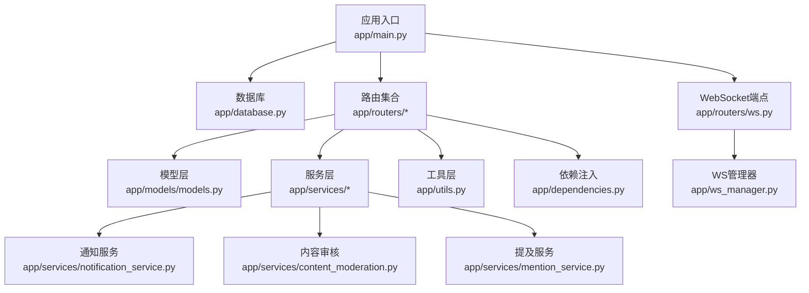
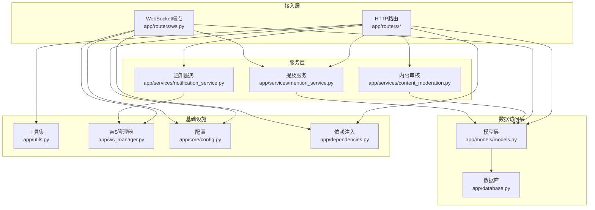
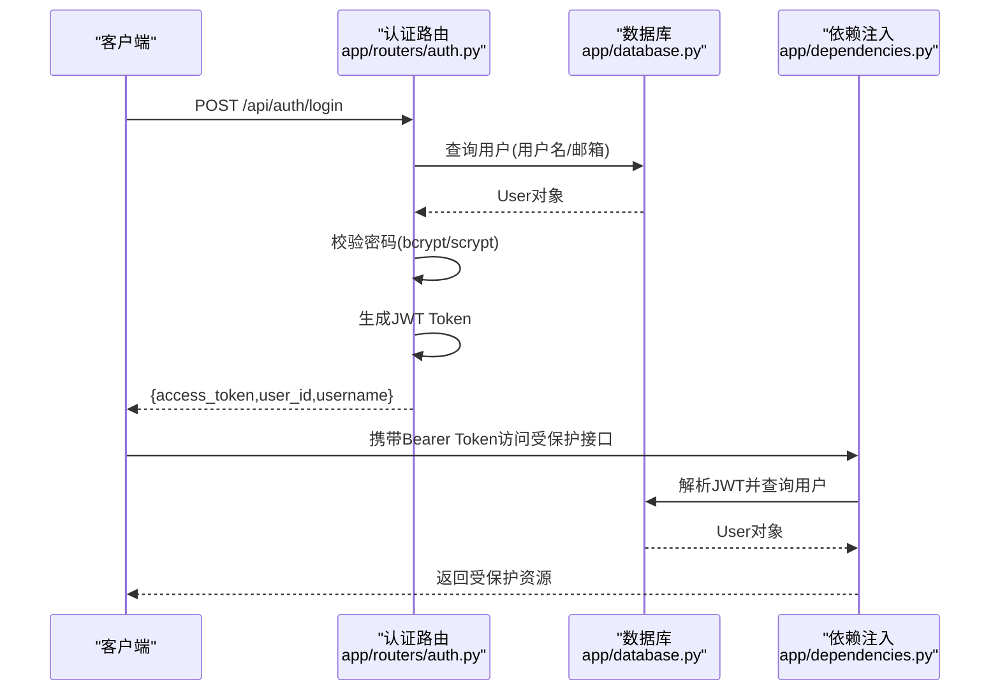
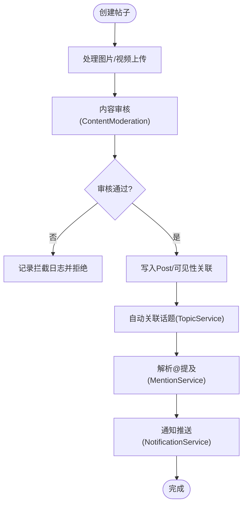
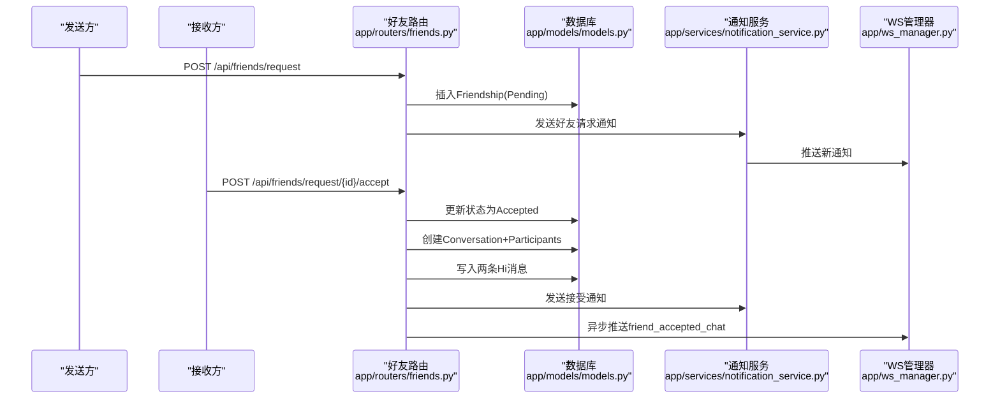
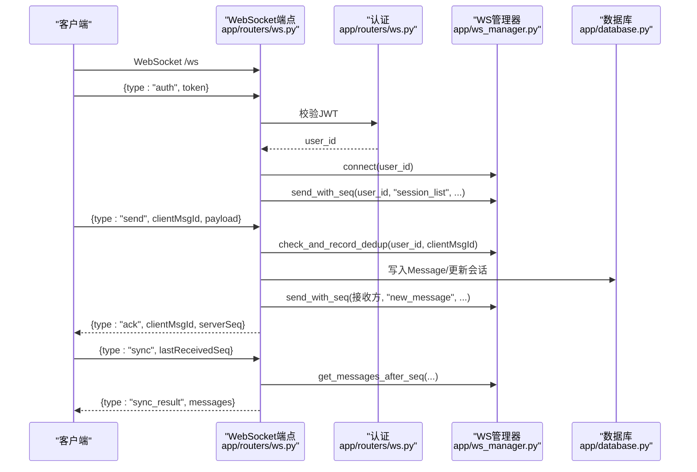
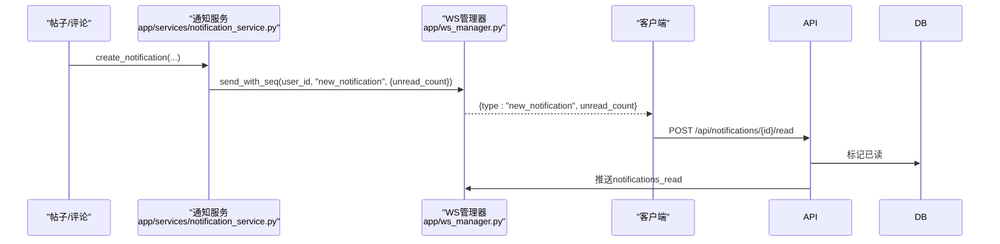
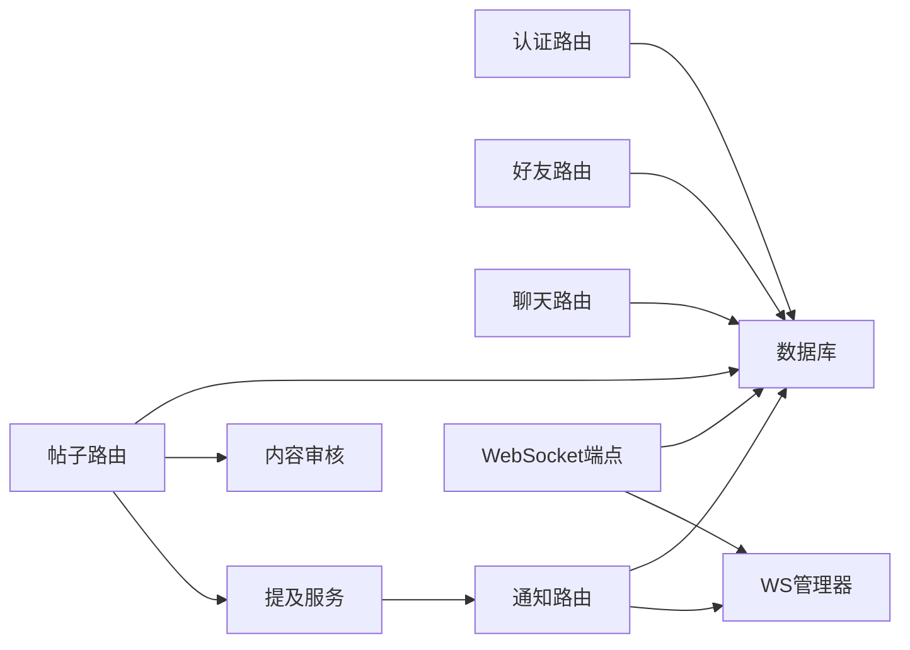

# 核心模块

<cite>
**本文引用的文件**
- [app/main.py](file://app/main.py)
- [app/database.py](file://app/database.py)
- [app/models/models.py](file://app/models/models.py)
- [app/core/config.py](file://app/core/config.py)
- [app/ws_manager.py](file://app/ws_manager.py)
- [app/routers/auth.py](file://app/routers/auth.py)
- [app/routers/friends.py](file://app/routers/friends.py)
- [app/routers/chat.py](file://app/routers/chat.py)
- [app/routers/notifications.py](file://app/routers/notifications.py)
- [app/routers/ws.py](file://app/routers/ws.py)
- [app/routers/posts.py](file://app/routers/posts.py)
- [app/services/notification_service.py](file://app/services/notification_service.py)
- [app/services/content_moderation.py](file://app/services/content_moderation.py)
- [app/services/mention_service.py](file://app/services/mention_service.py)
- [app/utils.py](file://app/utils.py)
- [app/dependencies.py](file://app/dependencies.py)
- [requirements.txt](file://requirements.txt)
</cite>

## 目录
1. [简介](#简介)
2. [项目结构](#项目结构)
3. [核心组件](#核心组件)
4. [架构总览](#架构总览)
5. [详细组件分析](#详细组件分析)
6. [依赖分析](#依赖分析)
7. [性能考量](#性能考量)
8. [故障排查指南](#故障排查指南)
9. [结论](#结论)
10. [附录](#附录)

## 简介
本文件面向NanTuPy后端核心模块，系统性梳理用户认证、社交内容管理、好友系统、实时通信与通知服务等关键能力。文档以“模块职责边界、接口设计、内部实现逻辑”为主线，辅以模块间协作关系、错误处理机制、性能优化建议与扩展点，帮助初学者快速理解，同时为有经验开发者提供深入的技术参考。

## 项目结构
NanTuPy采用FastAPI + SQLAlchemy 2.0的现代化后端架构，核心目录组织如下：
- app/main.py：应用入口与路由注册、中间件与生命周期管理
- app/database.py：数据库引擎、会话工厂与表初始化
- app/models/models.py：ORM模型与关联表定义
- app/core/config.py：运行时配置（数据库、JWT、上传、COS等）
- app/routers/*：各领域路由（认证、好友、聊天、通知、WebSocket等）
- app/services/*：横切服务（通知、内容审核、提及、推荐等）
- app/ws_manager.py：WebSocket连接池与序号/去重/断线补发
- app/utils.py：文件上传（COS）、媒体URL生成等工具
- app/dependencies.py：JWT认证依赖注入与权限校验

图表来源
- [app/main.py:1-110](file://app/main.py#L1-L110)
- [app/database.py:1-38](file://app/database.py#L1-L38)
- [app/models/models.py:1-655](file://app/models/models.py#L1-L655)
- [app/ws_manager.py:1-308](file://app/ws_manager.py#L1-L308)
- [app/routers/ws.py:1-546](file://app/routers/ws.py#L1-L546)
- [app/services/notification_service.py:1-233](file://app/services/notification_service.py#L1-L233)
- [app/services/content_moderation.py:1-258](file://app/services/content_moderation.py#L1-L258)
- [app/services/mention_service.py:1-118](file://app/services/mention_service.py#L1-L118)
- [app/utils.py:1-220](file://app/utils.py#L1-L220)
- [app/dependencies.py:1-63](file://app/dependencies.py#L1-L63)

章节来源
- [app/main.py:1-110](file://app/main.py#L1-L110)
- [app/database.py:1-38](file://app/database.py#L1-L38)
- [app/core/config.py:1-43](file://app/core/config.py#L1-L43)

## 核心组件
- 应用入口与生命周期：负责CORS、安全头、路由注册、数据库初始化与应用生命周期钩子
- 数据库与模型：统一的SQLAlchemy 2.0配置、连接池参数、基础模型与关联表
- 认证与授权：JWT认证、可选认证、管理员权限校验
- 社交内容管理：帖子发布、可见性控制、话题与提及处理、内容审核
- 好友系统：请求发送/接受/拒绝/取消、好友列表、推荐、会话与消息联动
- 实时通信：HTTP降级消息发送、WebSocket认证、序号系统、断线补发、去重、typing广播
- 通知服务：通知创建、推送、标记已读、清理与偏好设置
- 文件上传：COS直传、预签名URL、文件确认与删除、媒体URL生成

章节来源
- [app/main.py:1-110](file://app/main.py#L1-L110)
- [app/database.py:1-38](file://app/database.py#L1-L38)
- [app/models/models.py:1-655](file://app/models/models.py#L1-L655)
- [app/dependencies.py:1-63](file://app/dependencies.py#L1-L63)
- [app/utils.py:1-220](file://app/utils.py#L1-L220)

## 架构总览
NanTuPy采用“路由-服务-模型-工具”的分层架构，配合WebSocket实现低延迟的实时交互。认证通过JWT完成，授权通过依赖注入与权限校验实现。内容审核与提及处理在内容创建阶段执行，通知服务通过WebSocket实时推送。

图表来源
- [app/routers/auth.py:1-486](file://app/routers/auth.py#L1-L486)
- [app/routers/friends.py:1-385](file://app/routers/friends.py#L1-L385)
- [app/routers/chat.py:1-538](file://app/routers/chat.py#L1-L538)
- [app/routers/notifications.py:1-208](file://app/routers/notifications.py#L1-L208)
- [app/routers/ws.py:1-546](file://app/routers/ws.py#L1-L546)
- [app/routers/posts.py:1-405](file://app/routers/posts.py#L1-L405)
- [app/services/notification_service.py:1-233](file://app/services/notification_service.py#L1-L233)
- [app/services/content_moderation.py:1-258](file://app/services/content_moderation.py#L1-L258)
- [app/services/mention_service.py:1-118](file://app/services/mention_service.py#L1-L118)
- [app/models/models.py:1-655](file://app/models/models.py#L1-L655)
- [app/database.py:1-38](file://app/database.py#L1-L38)
- [app/ws_manager.py:1-308](file://app/ws_manager.py#L1-L308)
- [app/core/config.py:1-43](file://app/core/config.py#L1-L43)
- [app/dependencies.py:1-63](file://app/dependencies.py#L1-L63)
- [app/utils.py:1-220](file://app/utils.py#L1-L220)

## 详细组件分析

### 用户认证系统
- 职责边界
  - 提供注册、登录、资料修改、隐私设置、密码重置、Token刷新等能力
  - 通过JWT实现无状态认证；提供可选认证与管理员权限校验
- 接口设计
  - /api/auth/register、/api/auth/login、/api/auth/me、/api/auth/profile、/api/auth/change-password、/api/auth/forgot-password、/api/auth/reset-password、/api/auth/privacy、/api/auth/refresh
- 内部实现逻辑
  - 使用bcrypt/scrypt兼容的密码哈希；Token有效期配置；隐私设置字段映射；密码重置令牌内存缓存（开发态）
- 错误处理
  - 用户名/邮箱重复、无效凭据、权限不足、数据库异常均返回标准化HTTP错误
- 性能与扩展
  - 连接池参数可调；建议生产环境启用HTTPS与更严格的CORS策略；可引入速率限制与双因素认证

图表来源
- [app/routers/auth.py:184-246](file://app/routers/auth.py#L184-L246)
- [app/dependencies.py:16-36](file://app/dependencies.py#L16-L36)
- [app/database.py:22-32](file://app/database.py#L22-L32)

章节来源
- [app/routers/auth.py:1-486](file://app/routers/auth.py#L1-L486)
- [app/dependencies.py:1-63](file://app/dependencies.py#L1-L63)

### 社交内容管理
- 职责边界
  - 帖子创建、列表查询、可见性控制、话题自动关联、@提及通知
- 接口设计
  - /api/posts/（POST创建、GET列表、GET用户帖子等）
- 内部实现逻辑
  - 支持文本、图片（多图URL/上传）、视频上传与优化；内容审核前置；自定义可见性写入关联表；提及解析与通知
- 错误处理
  - 文件大小限制、上传失败、内容审核拒绝、数据库异常
- 性能与扩展
  - 批量加载与序列化减少N+1；可引入CDN与缩略图；话题与提及可异步处理

图表来源
- [app/routers/posts.py:22-140](file://app/routers/posts.py#L22-L140)
- [app/services/content_moderation.py:74-126](file://app/services/content_moderation.py#L74-L126)
- [app/services/mention_service.py:48-94](file://app/services/mention_service.py#L48-L94)
- [app/services/notification_service.py:55-112](file://app/services/notification_service.py#L55-L112)

章节来源
- [app/routers/posts.py:1-405](file://app/routers/posts.py#L1-L405)
- [app/services/content_moderation.py:1-258](file://app/services/content_moderation.py#L1-L258)
- [app/services/mention_service.py:1-118](file://app/services/mention_service.py#L1-L118)
- [app/services/notification_service.py:1-233](file://app/services/notification_service.py#L1-L233)

### 好友系统
- 职责边界
  - 好友请求发送/接受/拒绝/取消；好友列表；待处理请求；好友推荐；与聊天会话联动
- 接口设计
  - /api/friends/request、/api/friends/request/{id}/accept、/api/friends/、/api/friends/status/{user_id}、/api/friends/recommendations 等
- 内部实现逻辑
  - 隐私策略（允许类型）控制请求；接受请求时自动创建1v1会话并推送“Hi”消息；通知服务联动
- 错误处理
  - 重复请求、越权操作、状态不匹配、数据库异常
- 性能与扩展
  - 随机推荐可结合相似度算法；会话创建事务保证一致性

图表来源
- [app/routers/friends.py:19-134](file://app/routers/friends.py#L19-L134)
- [app/services/notification_service.py:144-184](file://app/services/notification_service.py#L144-L184)
- [app/ws_manager.py:359-385](file://app/ws_manager.py#L359-L385)

章节来源
- [app/routers/friends.py:1-385](file://app/routers/friends.py#L1-L385)
- [app/services/notification_service.py:1-233](file://app/services/notification_service.py#L1-L233)
- [app/ws_manager.py:1-308](file://app/ws_manager.py#L1-L308)

### 实时通信（HTTP与WebSocket）
- 职责边界
  - HTTP降级消息发送；WebSocket认证、心跳、断线补发、ACK去重、typing广播、会话房间管理
- 接口设计
  - HTTP: /api/chat/conversations/{id}/messages（发送/分页）
  - WebSocket: /ws（认证后进入协议：auth/send/ack_receive/sync/ping/join/leave/typing/stop_typing）
- 内部实现逻辑
  - WS管理器维护连接池、用户维度序号、消息日志、ACK去重表；消息持久化后按序号推送；断线后按lastReceivedSeq补发
- 错误处理
  - 未认证拒绝、消息发送失败、会话不存在、权限检查失败
- 性能与扩展
  - 序号系统保证有序可靠；去重避免重复处理；广播房间降低冗余推送

图表来源
- [app/routers/ws.py:442-546](file://app/routers/ws.py#L442-L546)
- [app/ws_manager.py:45-247](file://app/ws_manager.py#L45-L247)

章节来源
- [app/routers/ws.py:1-546](file://app/routers/ws.py#L1-L546)
- [app/ws_manager.py:1-308](file://app/ws_manager.py#L1-L308)

### 通知服务
- 职责边界
  - 通知创建、推送、标记已读、清理、偏好设置；与好友、消息、帖子等事件联动
- 接口设计
  - /api/notifications/（分页、未读计数、标记已读、清空、设置）
- 内部实现逻辑
  - 异步推送未读计数；支持多种通知类型（like/comment/friend/message/mention）
- 错误处理
  - 未找到通知、越权、数据库异常
- 性能与扩展
  - 异步推送避免阻塞；可引入队列与批处理

图表来源
- [app/services/notification_service.py:55-84](file://app/services/notification_service.py#L55-L84)
- [app/routers/notifications.py:64-95](file://app/routers/notifications.py#L64-L95)

章节来源
- [app/routers/notifications.py:1-208](file://app/routers/notifications.py#L1-L208)
- [app/services/notification_service.py:1-233](file://app/services/notification_service.py#L1-L233)

### 聊天与会话
- 职责边界
  - 会话列表、消息历史、消息发送（HTTP降级）、标记已读、在线状态
- 接口设计
  - /api/chat/sessions、/api/chat/conversations/{id}/messages、/api/chat/conversations/{id}/messages（HTTP发送）、/api/chat/conversations/{id}/mark-read、/api/chat/users/online、/api/chat/unread-count
- 内部实现逻辑
  - 自动创建1v1会话与参与者；消息写入后通过WS推送；未读计数聚合
- 错误处理
  - 会话不存在、越权、数据库异常
- 性能与扩展
  - 分页与has_more标志；批量查询用户与最后消息；WS在线状态查询

章节来源
- [app/routers/chat.py:1-538](file://app/routers/chat.py#L1-L538)
- [app/ws_manager.py:1-308](file://app/ws_manager.py#L1-L308)

## 依赖分析
- 组件耦合
  - 路由层依赖模型层与服务层；服务层依赖WS管理器与数据库；WS端点依赖认证与工具
- 外部依赖
  - FastAPI、SQLAlchemy、PyMySQL、python-jose、bcrypt、cos-python-sdk-v5、Pillow等
- 潜在风险
  - WS管理器为单例需注意并发与异常恢复；通知服务异步推送可能失败需重试或队列化

图表来源
- [requirements.txt:1-15](file://requirements.txt#L1-L15)
- [app/routers/auth.py:1-486](file://app/routers/auth.py#L1-L486)
- [app/routers/posts.py:1-405](file://app/routers/posts.py#L1-L405)
- [app/routers/friends.py:1-385](file://app/routers/friends.py#L1-L385)
- [app/routers/chat.py:1-538](file://app/routers/chat.py#L1-L538)
- [app/routers/notifications.py:1-208](file://app/routers/notifications.py#L1-L208)
- [app/routers/ws.py:1-546](file://app/routers/ws.py#L1-L546)
- [app/ws_manager.py:1-308](file://app/ws_manager.py#L1-L308)
- [app/services/content_moderation.py:1-258](file://app/services/content_moderation.py#L1-L258)
- [app/services/mention_service.py:1-118](file://app/services/mention_service.py#L1-L118)
- [app/services/notification_service.py:1-233](file://app/services/notification_service.py#L1-L233)

章节来源
- [requirements.txt:1-15](file://requirements.txt#L1-L15)

## 性能考量
- 数据库连接池
  - 通过SQLAlchemy引擎参数配置池大小、溢出、回收与预检，建议根据QPS与峰值合理调整
- 查询优化
  - 批量加载用户、最后消息、未读计数，避免N+1；索引覆盖常见查询条件
- WebSocket
  - 序号系统与消息日志保证可靠性；去重表定期清理；广播房间减少无效推送
- 文件上传
  - 图片优化与COS直传提升用户体验；预签名URL降低服务器压力
- 缓存与队列
  - 通知与提及可引入队列异步处理，避免阻塞请求链路

## 故障排查指南
- 认证失败
  - 检查JWT密钥、Token过期、用户是否存在；查看依赖注入解码逻辑
- WebSocket无法连接
  - 确认认证消息顺序、token有效性、用户存在性；检查WS管理器连接池与日志
- 消息丢失或乱序
  - 核对lastReceivedSeq与sync流程；检查序号系统与消息日志
- 通知未送达
  - 检查异步推送任务、WS连接状态、未读计数计算
- 文件上传失败
  - 校验COS配置、预签名URL有效期、文件大小与类型限制

章节来源
- [app/dependencies.py:16-36](file://app/dependencies.py#L16-L36)
- [app/routers/ws.py:442-546](file://app/routers/ws.py#L442-L546)
- [app/ws_manager.py:170-247](file://app/ws_manager.py#L170-L247)
- [app/services/notification_service.py:25-52](file://app/services/notification_service.py#L25-L52)
- [app/utils.py:37-77](file://app/utils.py#L37-L77)

## 结论
NanTuPy围绕“认证-内容-好友-通信-通知”五大域构建了清晰的分层架构。通过JWT认证、SQLAlchemy ORM、服务化与WebSocket实现实时交互，具备良好的可扩展性与可维护性。建议在生产环境中强化安全头、CORS策略、速率限制与监控告警，并引入队列与缓存进一步提升性能与稳定性。

## 附录
- 关键配置项
  - 数据库连接、JWT密钥、上传目录、COS配置、调试开关等
- 常用接口清单
  - 认证：/api/auth/*；内容：/api/posts/*；好友：/api/friends/*；聊天：/api/chat/*；通知：/api/notifications/*；WebSocket：/ws

章节来源
- [app/core/config.py:1-43](file://app/core/config.py#L1-L43)
- [app/main.py:69-84](file://app/main.py#L69-L84)