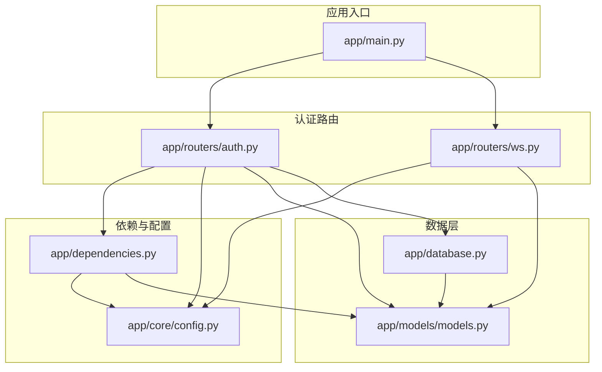
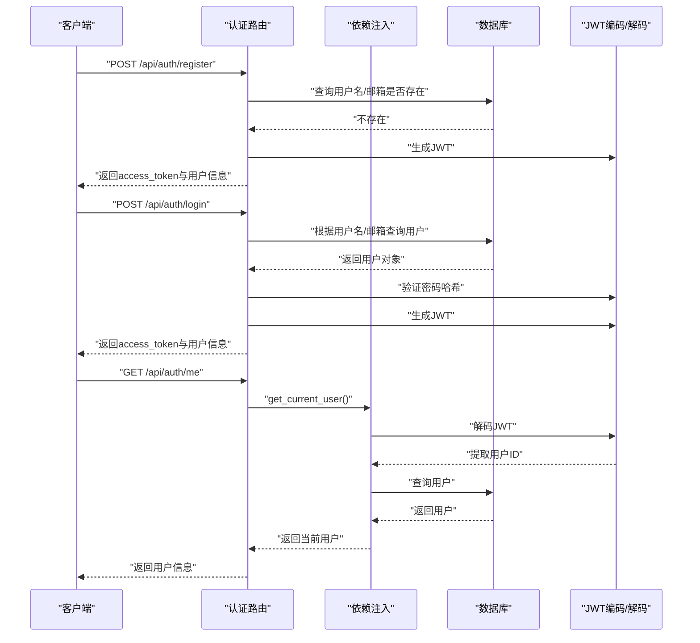
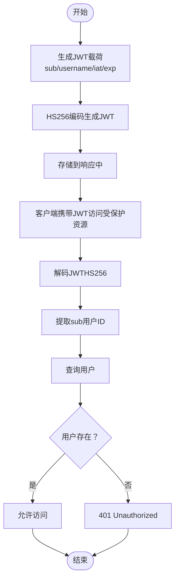
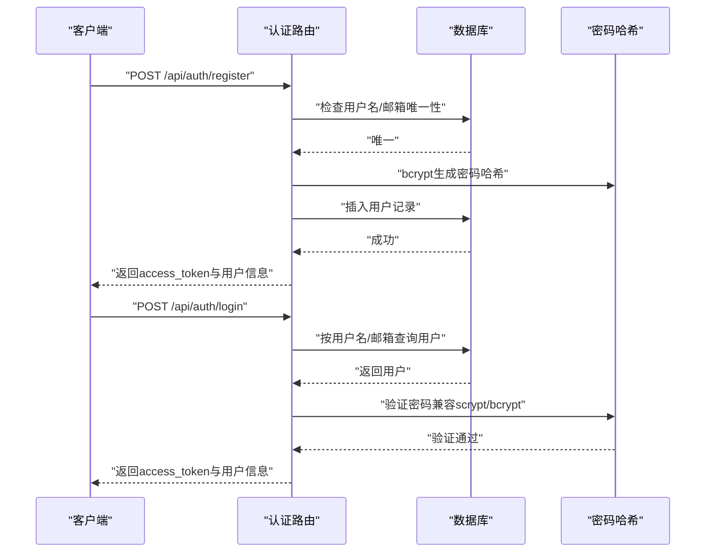
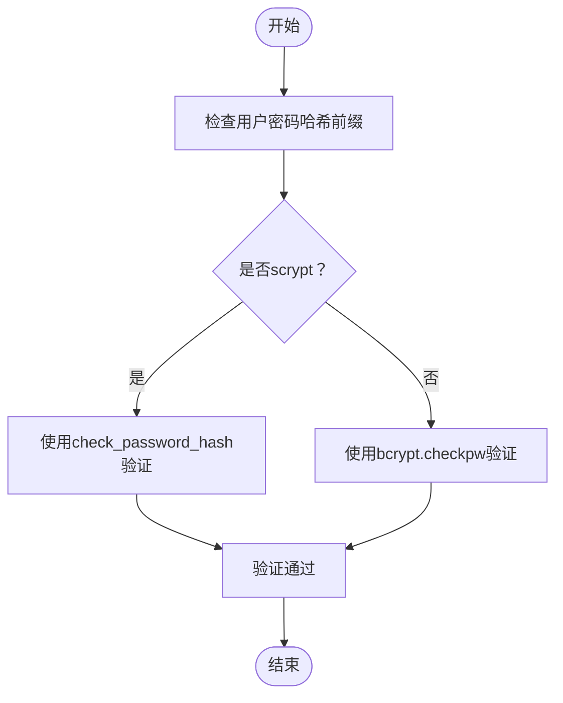
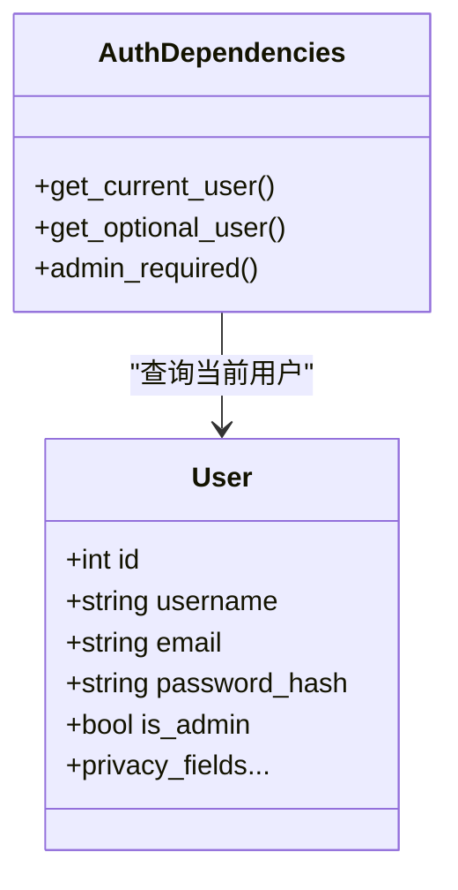
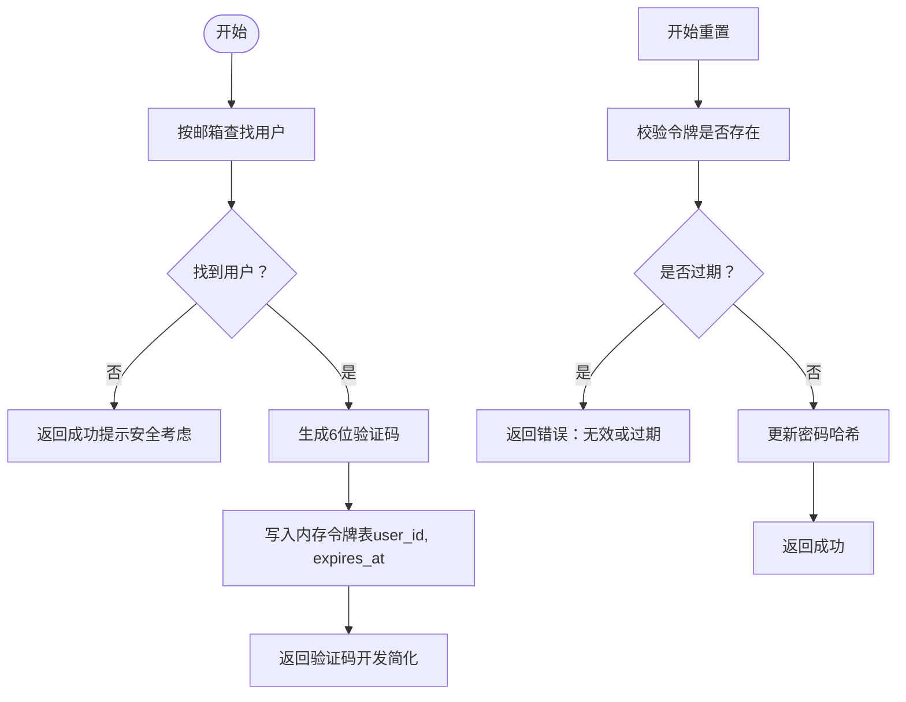
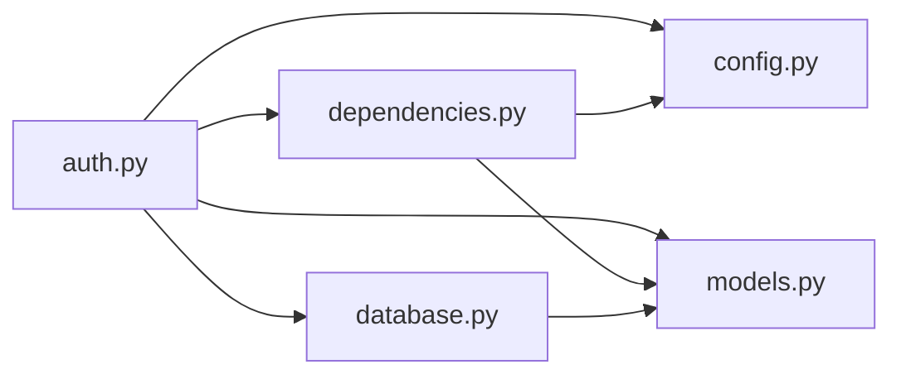

# 用户认证系统

<cite>
**本文档引用的文件**
- [app/routers/auth.py](file://app/routers/auth.py)
- [app/dependencies.py](file://app/dependencies.py)
- [app/core/config.py](file://app/core/config.py)
- [app/models/models.py](file://app/models/models.py)
- [app/database.py](file://app/database.py)
- [app/main.py](file://app/main.py)
- [app/routers/ws.py](file://app/routers/ws.py)
- [requirements.txt](file://requirements.txt)
- [openapi.json](file://openapi.json)
</cite>

## 目录
1. [简介](#简介)
2. [项目结构](#项目结构)
3. [核心组件](#核心组件)
4. [架构总览](#架构总览)
5. [详细组件分析](#详细组件分析)
6. [依赖关系分析](#依赖关系分析)
7. [性能考量](#性能考量)
8. [故障排除指南](#故障排除指南)
9. [结论](#结论)
10. [附录](#附录)

## 简介
本文件面向NanTuPy的用户认证系统，系统采用JWT（JSON Web Token）作为主要认证机制，结合FastAPI路由、依赖注入和数据库模型，实现了完整的用户注册、登录、资料管理、隐私设置以及密码重置流程。同时，系统在设计上兼顾了安全性与可维护性，支持多端访问（HTTP API与WebSocket），并通过环境变量集中管理密钥与配置。

## 项目结构
认证系统主要分布在以下模块：
- 路由层：负责对外暴露认证相关的HTTP接口
- 依赖层：负责从请求中解析JWT并解析当前用户
- 配置层：集中管理密钥、数据库连接与安全参数
- 模型层：定义用户实体及其隐私字段
- 数据库层：提供SQLAlchemy会话与初始化逻辑
- 主程序：注册路由、中间件与安全头

**图表来源**
- [app/main.py:69-84](file://app/main.py#L69-L84)
- [app/routers/auth.py:25-26](file://app/routers/auth.py#L25-L26)
- [app/routers/ws.py:22-22](file://app/routers/ws.py#L22-L22)
- [app/dependencies.py:12-13](file://app/dependencies.py#L12-L13)
- [app/core/config.py:7-10](file://app/core/config.py#L7-L10)
- [app/models/models.py:42-98](file://app/models/models.py#L42-L98)
- [app/database.py:9-32](file://app/database.py#L9-L32)

**章节来源**
- [app/main.py:69-84](file://app/main.py#L69-L84)
- [app/routers/auth.py:25-26](file://app/routers/auth.py#L25-L26)
- [app/dependencies.py:12-13](file://app/dependencies.py#L12-L13)
- [app/core/config.py:7-10](file://app/core/config.py#L7-L10)
- [app/models/models.py:42-98](file://app/models/models.py#L42-L98)
- [app/database.py:9-32](file://app/database.py#L9-L32)

## 核心组件
- JWT认证与解码：通过HTTP Bearer方式传递JWT，使用HS256算法进行解码与验证
- 用户模型与隐私字段：包含用户名、邮箱、密码哈希、隐私设置等字段
- 依赖注入：提供获取当前用户、可选用户与管理员权限校验的依赖
- 数据库会话：统一的SQLAlchemy会话管理与异常回滚
- 配置中心：密钥、数据库连接、JWT过期时间等集中配置
- WebSocket认证：复用JWT认证逻辑，实现会话级认证

**章节来源**
- [app/dependencies.py:16-36](file://app/dependencies.py#L16-L36)
- [app/models/models.py:42-98](file://app/models/models.py#L42-L98)
- [app/database.py:22-32](file://app/database.py#L22-L32)
- [app/core/config.py:7-22](file://app/core/config.py#L7-L22)
- [app/routers/ws.py:29-41](file://app/routers/ws.py#L29-L41)

## 架构总览
认证系统采用分层架构，HTTP与WebSocket共享同一JWT认证逻辑，确保跨端一致性。

**图表来源**
- [app/routers/auth.py:184-212](file://app/routers/auth.py#L184-L212)
- [app/routers/auth.py:215-246](file://app/routers/auth.py#L215-L246)
- [app/dependencies.py:16-36](file://app/dependencies.py#L16-L36)
- [app/core/config.py:22](file://app/core/config.py#L22)

## 详细组件分析

### JWT认证机制
- 令牌生成：注册与登录成功后，系统以HS256算法生成JWT，载荷包含用户ID、用户名、签发时间与过期时间，默认有效期7天
- 令牌验证：依赖注入通过HTTP Bearer头获取JWT，使用相同的密钥与算法进行解码；若解码失败或用户不存在则抛出401
- 令牌刷新：提供刷新接口，基于当前用户重新生成新的JWT
- WebSocket认证：WebSocket端点同样使用JWT进行认证，失败时返回4001状态码

**图表来源**
- [app/routers/auth.py:476-485](file://app/routers/auth.py#L476-L485)
- [app/dependencies.py:20-36](file://app/dependencies.py#L20-L36)
- [app/routers/ws.py:29-41](file://app/routers/ws.py#L29-L41)

**章节来源**
- [app/routers/auth.py:476-485](file://app/routers/auth.py#L476-L485)
- [app/dependencies.py:20-36](file://app/dependencies.py#L20-L36)
- [app/routers/ws.py:29-41](file://app/routers/ws.py#L29-L41)

### 用户注册与登录
- 注册：校验用户名长度与字符集、邮箱格式与密码长度，插入用户记录并生成初始头像URL，随后返回JWT
- 登录：支持用户名或邮箱登录，兼容旧版scrypt哈希与新版bcrypt哈希，验证通过后返回JWT
- 登出：系统未提供专门的登出接口，但可通过刷新令牌覆盖旧令牌的方式实现“登出”效果

**图表来源**
- [app/routers/auth.py:184-212](file://app/routers/auth.py#L184-L212)
- [app/routers/auth.py:215-246](file://app/routers/auth.py#L215-L246)

**章节来源**
- [app/routers/auth.py:184-212](file://app/routers/auth.py#L184-L212)
- [app/routers/auth.py:215-246](file://app/routers/auth.py#L215-L246)

### 密码加密策略
- 新密码使用bcrypt进行哈希并存储
- 兼容旧版scrypt哈希格式，登录时自动判断并验证
- 密码重置流程通过内存令牌（6位验证码，15分钟过期）实现，实际部署建议改为邮件发送

**图表来源**
- [app/routers/auth.py:230-236](file://app/routers/auth.py#L230-L236)
- [app/routers/auth.py:306-312](file://app/routers/auth.py#L306-L312)

**章节来源**
- [app/routers/auth.py:230-236](file://app/routers/auth.py#L230-L236)
- [app/routers/auth.py:306-312](file://app/routers/auth.py#L306-L312)
- [app/core/config.py:22](file://app/core/config.py#L22)

### 会话管理与权限控制
- 会话管理：HTTP端点通过依赖注入获取当前用户；WebSocket端点通过独立的认证流程获取用户ID
- 权限控制：提供管理员权限校验依赖，仅管理员可访问特定管理接口
- 可选认证：部分接口支持可选认证，未提供令牌时返回空用户对象

**图表来源**
- [app/dependencies.py:16-62](file://app/dependencies.py#L16-L62)
- [app/models/models.py:42-98](file://app/models/models.py#L42-L98)

**章节来源**
- [app/dependencies.py:16-62](file://app/dependencies.py#L16-L62)
- [app/models/models.py:42-98](file://app/models/models.py#L42-L98)

### 密码重置流程
- 发送重置令牌：根据邮箱查找用户，生成6位验证码并设置15分钟过期时间，记录在内存字典中
- 验证并重置：提交验证码与新密码，验证令牌有效性与过期时间，成功后更新密码哈希

**图表来源**
- [app/routers/auth.py:365-381](file://app/routers/auth.py#L365-L381)
- [app/routers/auth.py:388-408](file://app/routers/auth.py#L388-L408)

**章节来源**
- [app/routers/auth.py:365-381](file://app/routers/auth.py#L365-L381)
- [app/routers/auth.py:388-408](file://app/routers/auth.py#L388-L408)

### API接口与错误处理
- 接口前缀：/api/auth
- 主要接口：
  - POST /register：注册
  - POST /login：登录
  - GET /me：获取当前用户信息
  - PUT /profile：更新个人资料
  - POST /change-password：修改密码
  - GET /users/{user_id}：获取公开用户信息
  - DELETE /account：注销账号
  - POST /forgot-password：发送密码重置验证码
  - POST /reset-password：重置密码
  - GET /privacy：获取隐私设置
  - PUT /privacy：更新隐私设置
  - POST /refresh：刷新JWT
- 错误处理：
  - 400：请求参数错误（如邮箱/用户名为空、旧密码错误、令牌无效或过期）
  - 401：认证失败（无效或过期令牌、用户名/密码错误）
  - 403：权限不足（管理员接口）
  - 404：用户不存在
  - 409：用户名或邮箱已存在
  - 500：服务器内部错误

**章节来源**
- [app/routers/auth.py:184-212](file://app/routers/auth.py#L184-L212)
- [app/routers/auth.py:215-246](file://app/routers/auth.py#L215-L246)
- [app/routers/auth.py:298-321](file://app/routers/auth.py#L298-L321)
- [app/routers/auth.py:365-408](file://app/routers/auth.py#L365-L408)
- [openapi.json:5458-5464](file://openapi.json#L5458-L5464)

## 依赖关系分析
- 组件耦合：
  - 路由层依赖依赖注入层与配置层
  - 依赖注入层依赖配置层与模型层
  - 数据库层提供会话与初始化
- 外部依赖：
  - fastapi：Web框架
  - python-jose[cryptography]：JWT编解码
  - passlib[bcrypt]：bcrypt哈希
  - sqlalchemy：ORM与数据库连接

**图表来源**
- [app/routers/auth.py:18-22](file://app/routers/auth.py#L18-L22)
- [app/dependencies.py:4-10](file://app/dependencies.py#L4-L10)
- [app/database.py:5-19](file://app/database.py#L5-L19)

**章节来源**
- [app/routers/auth.py:18-22](file://app/routers/auth.py#L18-L22)
- [app/dependencies.py:4-10](file://app/dependencies.py#L4-L10)
- [app/database.py:5-19](file://app/database.py#L5-L19)
- [requirements.txt:1-6](file://requirements.txt#L1-L6)

## 性能考量
- JWT负载较小，解码与验证开销低
- 数据库查询集中在用户表，索引字段（用户名、邮箱）有助于加速登录与注册
- 会话池配置：连接池大小、溢出与回收参数已在配置中设定，适合中等并发场景
- 建议：
  - 生产环境启用HTTPS与安全头
  - 使用Redis等外部缓存存储短期令牌（如需要撤销能力）
  - 对频繁操作（如密码重置）增加速率限制

[本节为通用指导，无需具体文件来源]

## 故障排除指南
- 401 无效或过期令牌
  - 检查客户端是否正确携带Authorization: Bearer头
  - 确认JWT_SECRET_KEY与HS256算法一致
  - 核对系统时间与时区
- 400 用户名/邮箱为空或密码过短
  - 检查请求体字段与校验规则
- 409 用户名/邮箱已存在
  - 确认唯一约束与数据库状态
- 404 用户不存在
  - 确认用户ID或邮箱是否正确
- 500 服务器内部错误
  - 查看应用日志定位异常
- WebSocket认证失败
  - 确认握手阶段发送的JWT有效且未过期

**章节来源**
- [app/dependencies.py:20-36](file://app/dependencies.py#L20-L36)
- [app/routers/ws.py:29-41](file://app/routers/ws.py#L29-L41)

## 结论
NanTuPy的用户认证系统以JWT为核心，结合FastAPI的依赖注入与SQLAlchemy ORM，提供了清晰、可扩展的认证与授权能力。系统在兼容旧版哈希的同时，通过严格的输入校验与错误处理保障了安全性与可用性。建议在生产环境中进一步完善令牌撤销、速率限制与安全头配置，并将密码重置流程改为邮件发送以提升安全性。

[本节为总结，无需具体文件来源]

## 附录

### 安全最佳实践
- 强制HTTPS传输，启用安全头（如COOP/COEP）
- 使用强随机密钥，定期轮换JWT_SECRET_KEY
- 实施速率限制与账户锁定策略
- 对敏感操作（修改密码、注销）增加二次确认
- WebSocket端点需严格校验令牌与会话状态

### 常见攻击防护
- CSRF：通过CSRF令牌或同源策略防护
- XSS：输出编码与CSP策略
- 注入攻击：使用ORM参数化查询
- 暴力破解：登录失败次数限制与验证码

### 调试技巧
- 开启应用日志，观察注册/登录/认证事件
- 使用OpenAPI文档与示例请求验证接口行为
- 在本地开发环境使用较短的JWT过期时间便于测试

**章节来源**
- [app/main.py:60-66](file://app/main.py#L60-L66)
- [openapi.json:5458-5464](file://openapi.json#L5458-L5464)