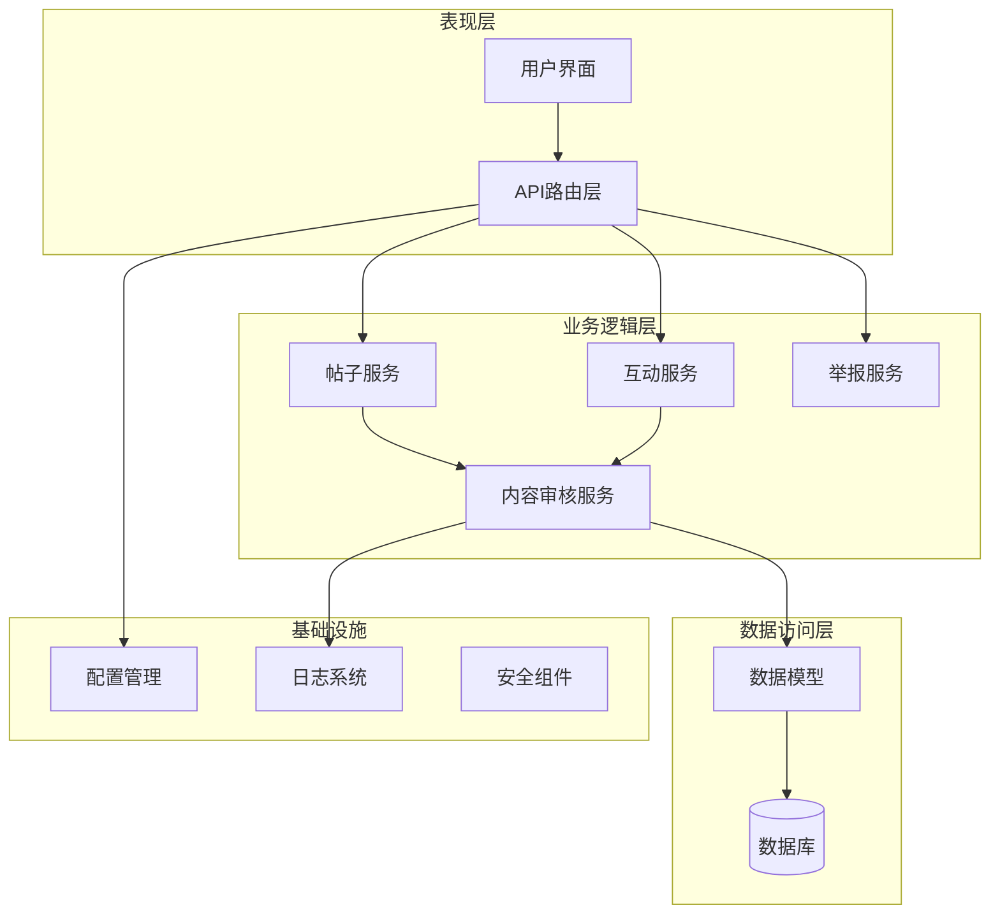
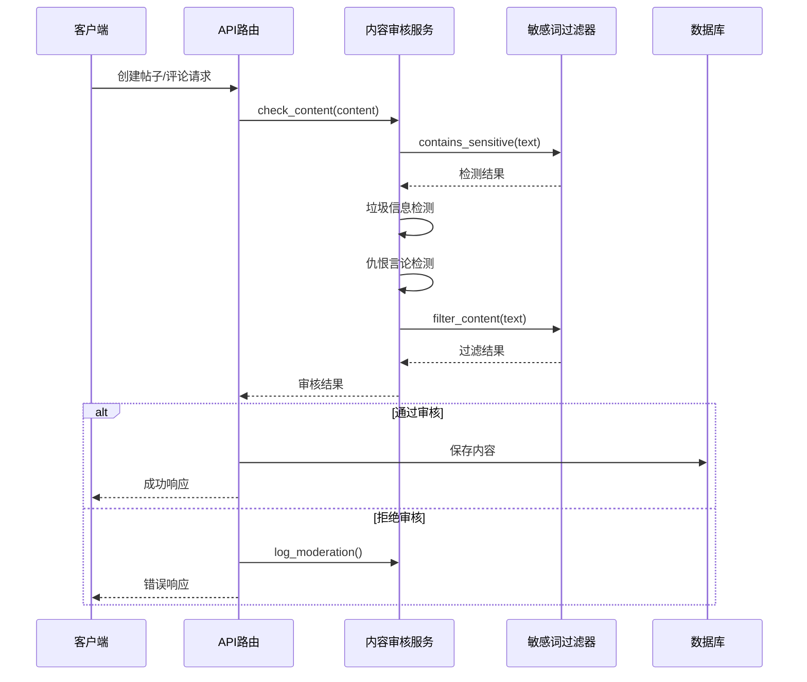
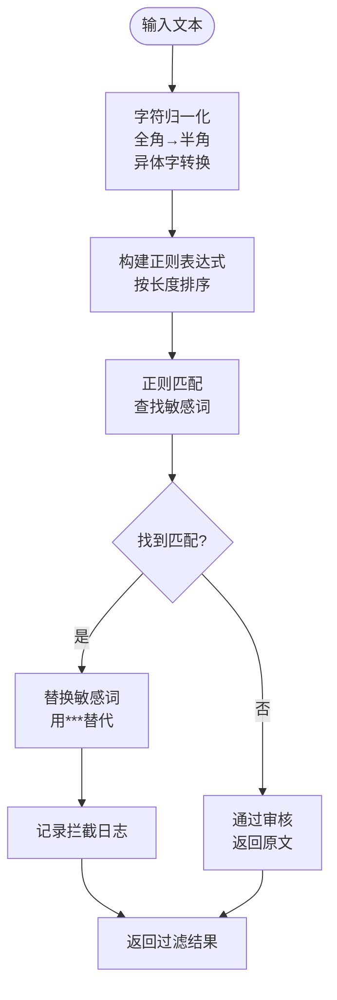
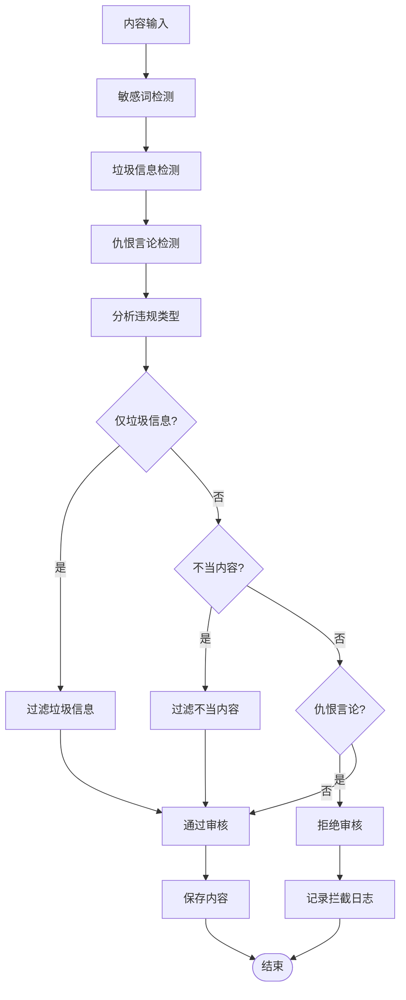
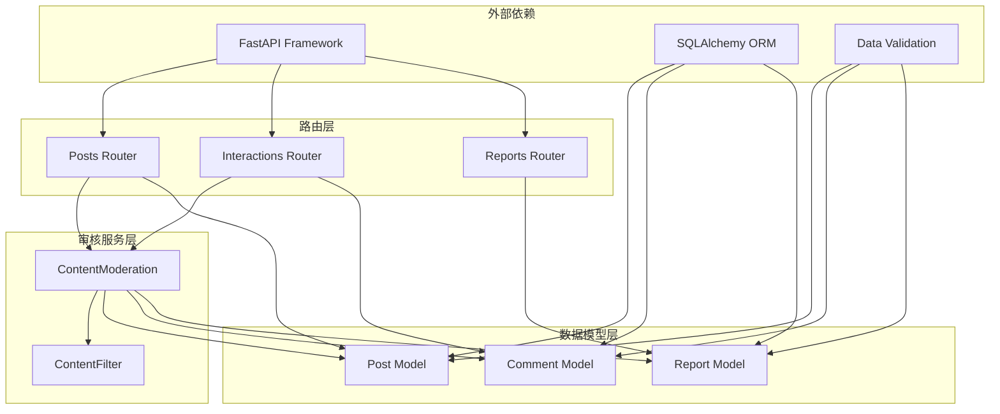

# 内容审核系统

<cite>
**本文档引用的文件**
- [app/services/content_moderation.py](file://app/services/content_moderation.py)
- [app/services/content_filter.py](file://app/services/content_filter.py)
- [app/routers/posts.py](file://app/routers/posts.py)
- [app/routers/interactions.py](file://app/routers/interactions.py)
- [app/routers/reports.py](file://app/routers/reports.py)
- [app/models/models.py](file://app/models/models.py)
- [app/core/config.py](file://app/core/config.py)
- [app/main.py](file://app/main.py)
- [requirements.txt](file://requirements.txt)
</cite>

## 目录
1. [简介](#简介)
2. [项目结构](#项目结构)
3. [核心组件](#核心组件)
4. [架构概览](#架构概览)
5. [详细组件分析](#详细组件分析)
6. [依赖关系分析](#依赖关系分析)
7. [性能考虑](#性能考虑)
8. [故障排除指南](#故障排除指南)
9. [结论](#结论)

## 简介

NanTuPy内容审核系统是一个基于Python FastAPI框架构建的综合性内容安全防护系统。该系统实现了多层次的内容审核机制，包括帖子创建、评论发布和用户内容更新时的自动审核流程。系统采用模块化设计，通过敏感词过滤、垃圾信息检测和仇恨言论识别等算法，确保平台内容的安全性和合规性。

## 项目结构

NanTuPy采用典型的三层架构设计，主要分为以下层次：

**图表来源**
- [app/main.py:69-84](file://app/main.py#L69-L84)
- [app/routers/posts.py:22-140](file://app/routers/posts.py#L22-L140)
- [app/routers/interactions.py:175-240](file://app/routers/interactions.py#L175-L240)

**章节来源**
- [app/main.py:69-84](file://app/main.py#L69-L84)
- [app/core/config.py:1-43](file://app/core/config.py#L1-L43)

## 核心组件

### 内容审核服务

内容审核服务是整个系统的核心组件，负责对用户生成的内容进行全面的安全检查。该服务提供了多种审核算法和策略，包括：

- **敏感词过滤**：基于内置词库和动态词库的敏感内容检测
- **垃圾信息检测**：识别刷屏、重复内容和恶意链接
- **仇恨言论识别**：检测歧视性语言和极端主义内容
- **内容过滤**：将敏感内容替换为安全版本

### 敏感词过滤器

敏感词过滤器采用单例模式设计，支持中英文敏感词检测、字符变体识别和动态词库管理。其核心特性包括：

- **字符变体映射**：支持全角/半角字符转换和异体字识别
- **动态词库管理**：运行时添加、删除和查询敏感词
- **高性能匹配**：使用正则表达式优化的匹配算法

### 审核触发机制

系统在多个关键节点自动触发内容审核：

- **帖子创建**：用户发布新帖子时的实时审核
- **评论发布**：用户发表评论时的内容验证
- **内容更新**：用户修改现有内容时的重新审核

**章节来源**
- [app/services/content_moderation.py:19-258](file://app/services/content_moderation.py#L19-L258)
- [app/services/content_filter.py:13-192](file://app/services/content_filter.py#L13-L192)

## 架构概览

内容审核系统采用事件驱动的架构模式，通过中间件和路由拦截实现无侵入式的审核机制：

**图表来源**
- [app/routers/posts.py:92-107](file://app/routers/posts.py#L92-L107)
- [app/routers/interactions.py:191-197](file://app/routers/interactions.py#L191-L197)
- [app/services/content_moderation.py:74-126](file://app/services/content_moderation.py#L74-L126)

## 详细组件分析

### 内容审核算法详解

#### 敏感词过滤算法

敏感词过滤采用多层匹配策略：

**图表来源**
- [app/services/content_filter.py:104-127](file://app/services/content_filter.py#L104-L127)
- [app/services/content_filter.py:84-100](file://app/services/content_filter.py#L84-L100)

#### 垃圾信息检测算法

垃圾信息检测包含多种模式识别：

| 检测类型 | 规则描述 | 阈值 |
|---------|---------|------|
| 链接刷屏 | 包含3个以上URL链接 | ≥3个 |
| 重复字符 | 连续8个以上相同字符 | ≥8次 |
| 符号刷屏 | 连续5个以上特殊符号 | ≥5个 |
| 全大写 | 大写字母占比>80% | ≥20字符 |
| 重复短语 | 同短语重复3次以上 | ≥3次 |
| 垃圾关键词 | 预定义垃圾词汇 | ≥1次 |

#### 仇恨言论识别算法

系统采用正则表达式匹配方式识别仇恨言论：

- **中文敏感词汇**：包含歧视性词汇的完整匹配
- **英文敏感词汇**：支持大小写不敏感匹配
- **组合检测**：同时检测中英文混合内容

**章节来源**
- [app/services/content_moderation.py:25-71](file://app/services/content_moderation.py#L25-L71)
- [app/services/content_moderation.py:129-163](file://app/services/content_moderation.py#L129-L163)

### 审核决策处理逻辑

系统采用分级审核策略，根据违规严重程度采取不同处理措施：

**图表来源**
- [app/services/content_moderation.py:74-126](file://app/services/content_moderation.py#L74-L126)
- [app/services/content_moderation.py:230-249](file://app/services/content_moderation.py#L230-L249)

### 审核日志记录系统

系统提供完整的审计追踪功能，包括：

- **拦截日志**：记录被拒绝的内容和原因
- **过滤日志**：记录敏感词命中情况
- **操作日志**：跟踪管理员操作和系统事件

日志格式包含时间戳、用户ID、内容类型、违规原因和内容预览等关键信息。

**章节来源**
- [app/services/content_moderation.py:230-249](file://app/services/content_moderation.py#L230-L249)
- [app/services/content_filter.py:147-155](file://app/services/content_filter.py#L147-L155)

### 审核配置选项

系统支持灵活的配置管理：

#### 敏感词库配置
- **内置词库**：50+个常用敏感词
- **动态管理**：运行时添加/删除敏感词
- **词库统计**：实时统计敏感词数量

#### 审核策略配置
- **阈值设置**：调整各检测算法的敏感度
- **规则定制**：支持自定义检测规则
- **白名单管理**：允许特定内容通过审核

**章节来源**
- [app/services/content_filter.py:160-188](file://app/services/content_filter.py#L160-L188)
- [app/services/content_moderation.py:25-71](file://app/services/content_moderation.py#L25-L71)

## 依赖关系分析

内容审核系统与其他模块的依赖关系如下：

**图表来源**
- [app/routers/posts.py:92-107](file://app/routers/posts.py#L92-L107)
- [app/routers/interactions.py:191-197](file://app/routers/interactions.py#L191-L197)
- [app/models/models.py:100-184](file://app/models/models.py#L100-L184)

**章节来源**
- [requirements.txt:1-15](file://requirements.txt#L1-L15)
- [app/models/models.py:100-473](file://app/models/models.py#L100-L473)

## 性能考虑

### 算法优化策略

1. **正则表达式优化**
   - 按敏感词长度排序，优先匹配长词
   - 编译正则表达式一次，重复使用
   - 使用原子组避免回溯

2. **内存管理**
   - 单例模式确保ContentFilter实例唯一
   - 动态重建正则表达式时释放旧实例
   - 及时清理临时数据结构

3. **并发处理**
   - 异步审核处理支持高并发场景
   - 连接池管理数据库连接
   - 缓存热点数据减少查询

### 扩展性设计

系统采用模块化设计，便于功能扩展：

- **插件化架构**：支持第三方审核算法集成
- **配置驱动**：通过配置文件控制审核策略
- **监控集成**：支持Prometheus等监控系统
- **日志聚合**：支持ELK等日志分析平台

## 故障排除指南

### 常见问题及解决方案

#### 审核误判问题
- **症状**：正常内容被错误标记
- **原因**：敏感词库过于严格或规则冲突
- **解决**：调整阈值设置，添加白名单

#### 性能问题
- **症状**：审核响应时间过长
- **原因**：正则表达式复杂度过高
- **解决**：优化正则表达式，启用缓存

#### 配置问题
- **症状**：审核规则不生效
- **原因**：配置文件格式错误
- **解决**：检查配置语法，重启服务

### 调试工具

系统提供多种调试工具：

- **日志分析**：查看详细的审核日志
- **性能监控**：监控审核延迟和吞吐量
- **配置验证**：验证配置文件的有效性

**章节来源**
- [app/services/content_moderation.py:230-249](file://app/services/content_moderation.py#L230-L249)
- [app/services/content_filter.py:147-155](file://app/services/content_filter.py#L147-L155)

## 结论

NanTuPy内容审核系统通过多层次的审核机制和智能化的算法设计，为平台内容安全提供了全面保障。系统采用模块化架构，具有良好的扩展性和维护性。通过持续优化算法性能和扩展审核策略，可以进一步提升系统的准确性和效率。

系统的主要优势包括：
- **实时审核**：在内容发布时即时进行安全检查
- **多层防护**：结合多种检测算法提高准确性
- **灵活配置**：支持动态调整审核策略
- **完整审计**：提供详细的日志记录和追踪能力

未来可以考虑集成更先进的机器学习模型，进一步提升审核的智能化水平。