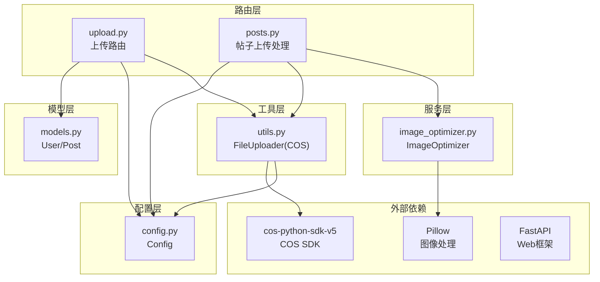
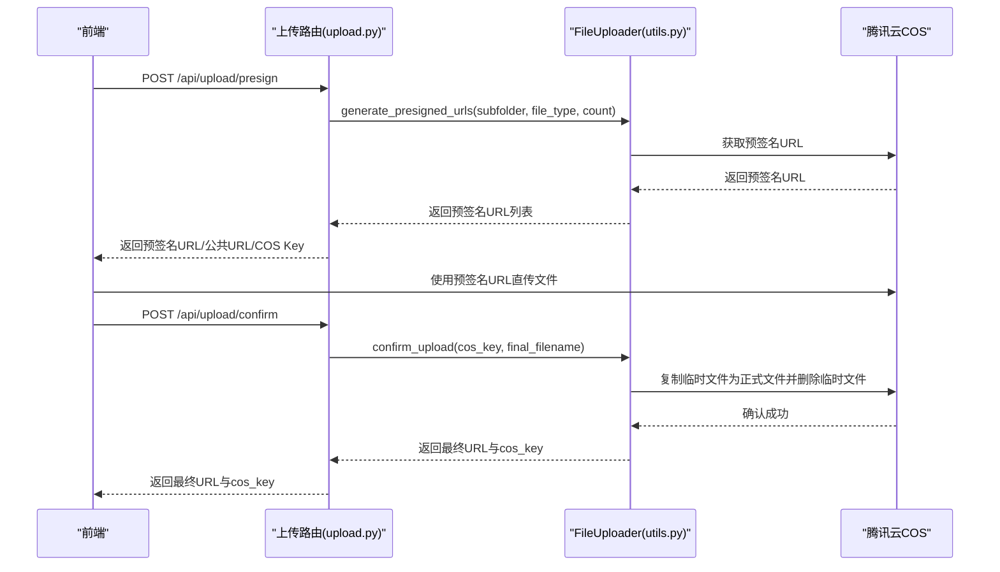
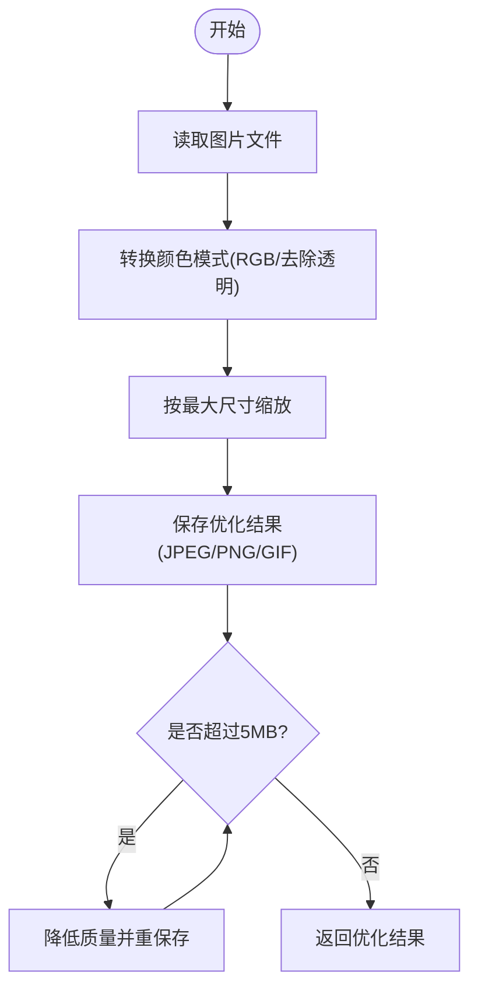
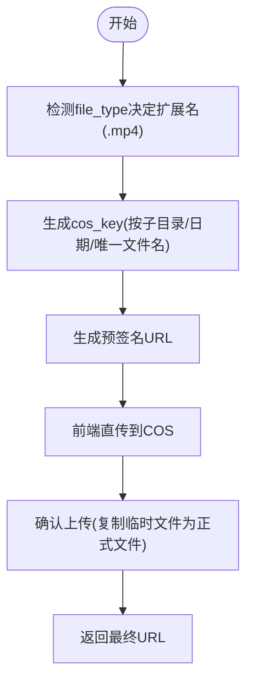
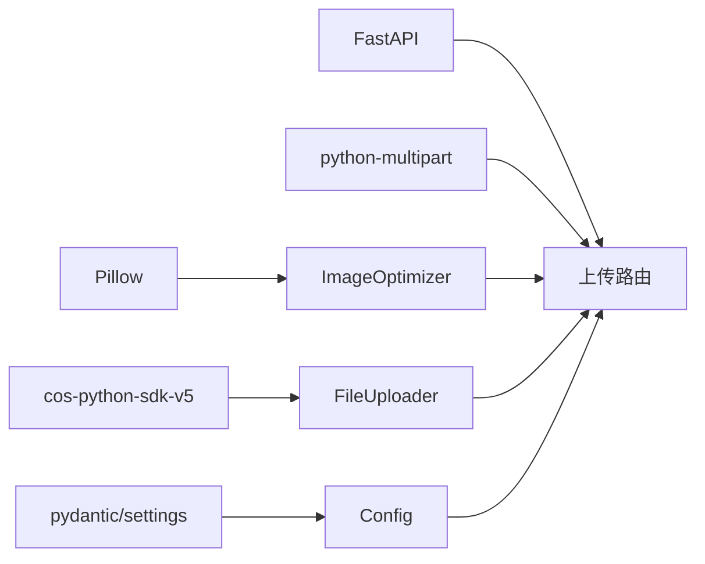

# 媒体文件上传处理

<cite>
**本文档引用的文件**
- [app/routers/upload.py](file://app/routers/upload.py)
- [app/utils.py](file://app/utils.py)
- [app/services/image_optimizer.py](file://app/services/image_optimizer.py)
- [app/core/config.py](file://app/core/config.py)
- [app/models/models.py](file://app/models/models.py)
- [app/routers/posts.py](file://app/routers/posts.py)
- [requirements.txt](file://requirements.txt)
- [openapi.json](file://openapi.json)
- [tests/test_upload.py](file://tests/test_upload.py)
</cite>

## 目录
1. [简介](#简介)
2. [项目结构](#项目结构)
3. [核心组件](#核心组件)
4. [架构总览](#架构总览)
5. [详细组件分析](#详细组件分析)
6. [依赖关系分析](#依赖关系分析)
7. [性能考虑](#性能考虑)
8. [故障排除指南](#故障排除指南)
9. [结论](#结论)
10. [附录](#附录)

## 简介
本文件上传处理系统基于 FastAPI 构建，采用“预签名直传 + 后端确认”的云存储方案，支持图片与视频的上传、优化、尺寸调整与压缩。系统通过腾讯云 COS 实现文件存储，提供头像、封面、帖子、漫画、聊天等多类型上传目录，并在上传流程中集成安全检查与内容审核。本文档将详细说明图片上传的完整流程（验证、格式转换、尺寸优化、压缩策略）、视频上传处理机制（格式支持、转码选项、存储管理）、安全检查（大小限制、类型验证、恶意文件检测）、存储策略（本地与云存储配置）、以及 API 接口文档与前端集成示例。

## 项目结构
系统围绕上传路由、工具类、服务层与配置展开，核心文件如下：
- 路由层：负责接收前端请求、参数校验与业务编排
- 工具层：封装 COS 客户端、预签名 URL 生成、文件确认与删除
- 服务层：图片优化与尺寸调整
- 配置层：统一管理应用配置与云存储参数
- 模型层：用户与帖子模型，支撑头像/封面更新
- 测试与文档：OpenAPI 文档与上传测试脚本

**图表来源**
- [app/routers/upload.py:1-224](file://app/routers/upload.py#L1-L224)
- [app/utils.py:1-220](file://app/utils.py#L1-L220)
- [app/services/image_optimizer.py:1-230](file://app/services/image_optimizer.py#L1-L230)
- [app/core/config.py:1-43](file://app/core/config.py#L1-L43)
- [app/models/models.py:42-98](file://app/models/models.py#L42-L98)

**章节来源**
- [app/routers/upload.py:1-224](file://app/routers/upload.py#L1-L224)
- [app/utils.py:1-220](file://app/utils.py#L1-L220)
- [app/services/image_optimizer.py:1-230](file://app/services/image_optimizer.py#L1-L230)
- [app/core/config.py:1-43](file://app/core/config.py#L1-L43)
- [app/models/models.py:42-98](file://app/models/models.py#L42-L98)

## 核心组件
- 上传路由模块：提供预签名直传、确认上传、头像/封面确认、删除文件、文件信息查询与旧 URL 兼容重定向等接口。
- 文件上传器：封装 COS 客户端，负责生成预签名 URL、确认上传（复制临时文件并删除）、删除文件、直接上传与文件信息查询。
- 图片优化器：提供图片尺寸优化、压缩、缩略图生成与图片信息获取能力。
- 配置中心：集中管理数据库连接、文件大小限制、允许的扩展名、云存储参数等。
- 模型层：用户与帖子模型，支撑头像/封面更新与帖子媒体字段。

**章节来源**
- [app/routers/upload.py:1-224](file://app/routers/upload.py#L1-L224)
- [app/utils.py:14-220](file://app/utils.py#L14-L220)
- [app/services/image_optimizer.py:6-230](file://app/services/image_optimizer.py#L6-L230)
- [app/core/config.py:7-43](file://app/core/config.py#L7-L43)
- [app/models/models.py:42-98](file://app/models/models.py#L42-L98)

## 架构总览
系统采用“前端直传 + 后端确认”的模式，提升上传性能与可靠性：
- 前端向后端申请预签名 URL
- 前端使用预签名 URL 直接上传到 COS
- 上传完成后前端调用确认接口，后端将临时文件重命名为最终文件并返回可访问 URL

**图表来源**
- [app/routers/upload.py:50-129](file://app/routers/upload.py#L50-L129)
- [app/utils.py:37-121](file://app/utils.py#L37-L121)

**章节来源**
- [app/routers/upload.py:50-129](file://app/routers/upload.py#L50-L129)
- [app/utils.py:37-121](file://app/utils.py#L37-L121)

## 详细组件分析

### 图片上传处理流程
- 输入验证：限制单张图片最大 10MB，超过则拒绝优化。
- 图片优化：自动转换为 RGB 模式，按最大宽度 1920、最大高度 1080 缩放；默认 JPEG 质量 85，支持 PNG/GIF 优化；若优化后仍大于 5MB，则逐步降低质量直至满足阈值。
- 生成缩略图：按指定尺寸生成缩略图并保存为 JPEG。
- 上传与命名：通过 FileUploader 将优化后的图片上传到 COS，按子目录与日期组织文件名。

**图表来源**
- [app/services/image_optimizer.py:16-113](file://app/services/image_optimizer.py#L16-L113)

**章节来源**
- [app/services/image_optimizer.py:16-113](file://app/services/image_optimizer.py#L16-L113)
- [app/routers/posts.py:54-78](file://app/routers/posts.py#L54-L78)

### 视频上传处理机制
- 格式支持：配置中声明支持的视频扩展名集合，实际上传时根据 file_type 判断扩展名为 .mp4。
- 存储管理：视频文件同样走 COS 直传流程，按子目录与日期组织文件名。
- 转码选项：当前代码未实现服务端转码逻辑，视频上传仅进行基础的存储与命名。

**图表来源**
- [app/utils.py:53-77](file://app/utils.py#L53-L77)
- [app/utils.py:80-121](file://app/utils.py#L80-L121)

**章节来源**
- [app/utils.py:53-77](file://app/utils.py#L53-L77)
- [app/utils.py:80-121](file://app/utils.py#L80-L121)

### 文件上传安全检查
- 文件大小限制：全局配置 MAX_CONTENT_LENGTH 为 50MB；图片上传前限制单张不超过 10MB 以便优化。
- 类型验证：通过扩展名映射与允许扩展名集合控制上传类型；未在路由层显式校验扩展名，建议在业务层补充校验。
- 恶意文件检测：系统包含内容审核服务模块，可在上传后对文本内容进行审核，但未见针对文件内容的恶意检测逻辑。

**章节来源**
- [app/core/config.py:26-30](file://app/core/config.py#L26-L30)
- [app/routers/posts.py:56-57](file://app/routers/posts.py#L56-L57)

### 文件存储策略
- 云存储：系统默认使用腾讯云 COS，通过环境变量配置密钥、区域、桶名与域名。
- 本地存储：配置中存在本地上传目录常量，但当前上传流程主要依赖 COS，本地存储未在上传路由中启用。

**章节来源**
- [app/core/config.py:26-39](file://app/core/config.py#L26-L39)
- [app/utils.py:19-28](file://app/utils.py#L19-L28)

### API 接口文档
以下为关键上传接口的定义与参数说明（基于 OpenAPI 文档）：
- 预签名直传
  - 方法与路径：POST /api/upload/presign
  - 请求体参数：
    - filename：原始文件名（用于提取扩展名）
    - file_type：扩展名，如 jpg/mp4（优先使用）
    - upload_type：上传类型，如 avatar/cover/post/comic/chat/general
    - count：批量数量，默认 1，范围 1-20
  - 返回值：预签名 URL、公共访问 URL、COS Key、内容类型及批量结果数组
- 确认上传
  - 方法与路径：POST /api/upload/confirm
  - 请求体参数：
    - cos_key：临时文件的 COS Key
    - final_filename：最终文件名
  - 返回值：确认消息、最终 URL 与 COS Key
- 头像/封面确认
  - 方法与路径：POST /api/upload/avatar/confirm 与 POST /api/upload/cover/confirm
  - 请求体参数：url
  - 返回值：确认消息与最终 URL
- 删除文件
  - 方法与路径：POST /api/upload/delete
  - 请求体参数：url 或 file_url
  - 返回值：删除成功消息
- 文件信息查询
  - 方法与路径：GET /api/upload/info
  - 查询参数：url
  - 返回值：文件存在性与元数据
- 旧 URL 兼容
  - 方法与路径：GET /api/upload/uploads/{filename}
  - 行为：302 重定向到 COS

**章节来源**
- [openapi.json:5067-5408](file://openapi.json#L5067-L5408)

### 前端集成示例与错误处理
- 预签名直传流程：前端先调用 /api/upload/presign 获取预签名 URL，再使用该 URL 直接上传文件到 COS。
- 确认上传流程：上传完成后调用 /api/upload/confirm，后端将临时文件重命名为最终文件并返回可访问 URL。
- 错误处理：
  - 预签名生成失败：返回 503，错误详情包含 COS 配置问题
  - 预签名 URL 为空：返回 503，提示检查 COS 配置
  - 确认上传失败：返回 500，错误详情包含具体原因
  - 删除文件失败：返回 404，错误详情包含具体原因
  - 文件信息不存在：返回 404

**章节来源**
- [app/routers/upload.py:50-129](file://app/routers/upload.py#L50-L129)
- [app/utils.py:122-148](file://app/utils.py#L122-L148)

## 依赖关系分析
- Pillow：用于图片读取、转换、缩放与保存。
- cos-python-sdk-v5：用于生成预签名 URL、上传、复制、删除与查询文件信息。
- FastAPI：作为 Web 框架，提供路由与请求处理。
- Python-Multipart：用于解析 multipart/form-data。
- Pydantic/Settings：用于配置管理。

**图表来源**
- [requirements.txt:1-15](file://requirements.txt#L1-L15)
- [app/services/image_optimizer.py:1-3](file://app/services/image_optimizer.py#L1-L3)
- [app/utils.py:10-11](file://app/utils.py#L10-L11)
- [app/core/config.py:4-10](file://app/core/config.py#L4-L10)

**章节来源**
- [requirements.txt:1-15](file://requirements.txt#L1-L15)

## 性能考虑
- 预签名直传：减少后端带宽压力，提升上传吞吐量。
- 图片优化：在上传前进行尺寸与质量优化，降低存储与带宽成本。
- 批量预签名：一次请求生成多个预签名 URL，减少往返次数。
- 文件分层存储：按子目录与日期组织文件，便于后续清理与检索。

[本节为通用指导，无需特定文件来源]

## 故障排除指南
- 预签名生成失败：检查 COS 配置项（ID、Key、Region、Bucket、BucketName、Domain）是否正确。
- 预签名 URL 为空：确认 COS 服务可用且权限配置正确。
- 确认上传失败：检查 cos_key 是否有效，COS 权限是否允许复制与删除操作。
- 删除文件失败：确认 URL 中包含的 COS Key 正确，且文件存在于指定桶中。
- 文件信息查询失败：确认 URL 格式正确，COS 对象存在。

**章节来源**
- [app/routers/upload.py:82-96](file://app/routers/upload.py#L82-L96)
- [app/utils.py:98-120](file://app/utils.py#L98-L120)
- [app/utils.py:133-148](file://app/utils.py#L133-L148)

## 结论
本系统通过“预签名直传 + 后端确认”的模式，结合图片优化与云存储，实现了高效、可靠的媒体文件上传能力。图片上传具备完善的尺寸优化与压缩策略，视频上传支持主流格式并遵循统一的存储规范。安全方面，系统通过配置与路由层的约束实现基本的大小与类型控制，并预留内容审核能力。未来可进一步增强前端类型校验、恶意文件检测与服务端视频转码能力，以提升整体安全性与用户体验。

[本节为总结性内容，无需特定文件来源]

## 附录

### API 接口清单与参数
- 预签名直传
  - 路径：POST /api/upload/presign
  - 参数：filename、file_type、upload_type、count
  - 返回：预签名 URL、公共 URL、COS Key、内容类型、批量结果
- 确认上传
  - 路径：POST /api/upload/confirm
  - 参数：cos_key、final_filename
  - 返回：消息、最终 URL、COS Key
- 头像/封面确认
  - 路径：POST /api/upload/avatar/confirm 与 POST /api/upload/cover/confirm
  - 参数：url
  - 返回：消息、URL
- 删除文件
  - 路径：POST /api/upload/delete
  - 参数：url 或 file_url
  - 返回：消息
- 文件信息查询
  - 路径：GET /api/upload/info
  - 参数：url
  - 返回：文件信息
- 旧 URL 兼容
  - 路径：GET /api/upload/uploads/{filename}
  - 行为：302 重定向到 COS

**章节来源**
- [openapi.json:5067-5408](file://openapi.json#L5067-L5408)

### 前端集成步骤
- 申请预签名 URL：调用 /api/upload/presign，传入文件名、扩展名与上传类型，获取预签名 URL 与 COS Key。
- 直传到 COS：使用预签名 URL 上传文件。
- 确认上传：上传完成后调用 /api/upload/confirm，传入 COS Key 与最终文件名。
- 更新头像/封面：调用对应确认接口，传入最终 URL。

**章节来源**
- [app/routers/upload.py:50-129](file://app/routers/upload.py#L50-L129)