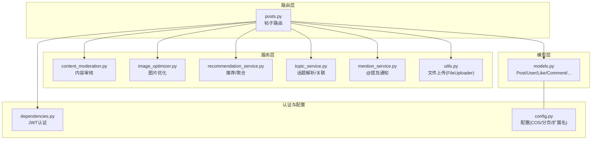
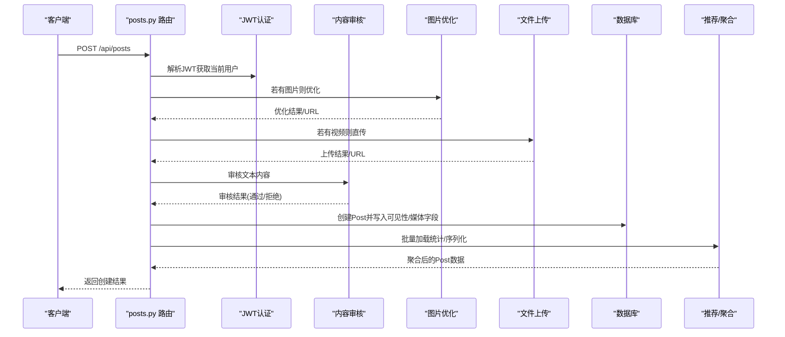
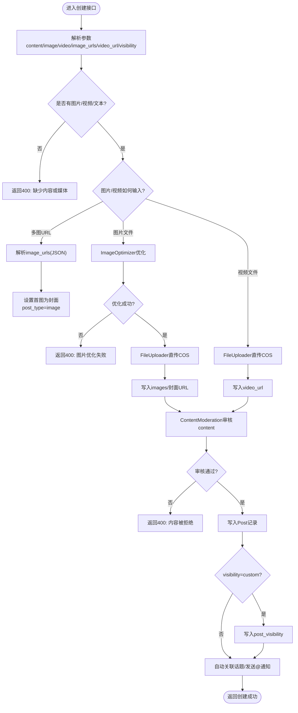
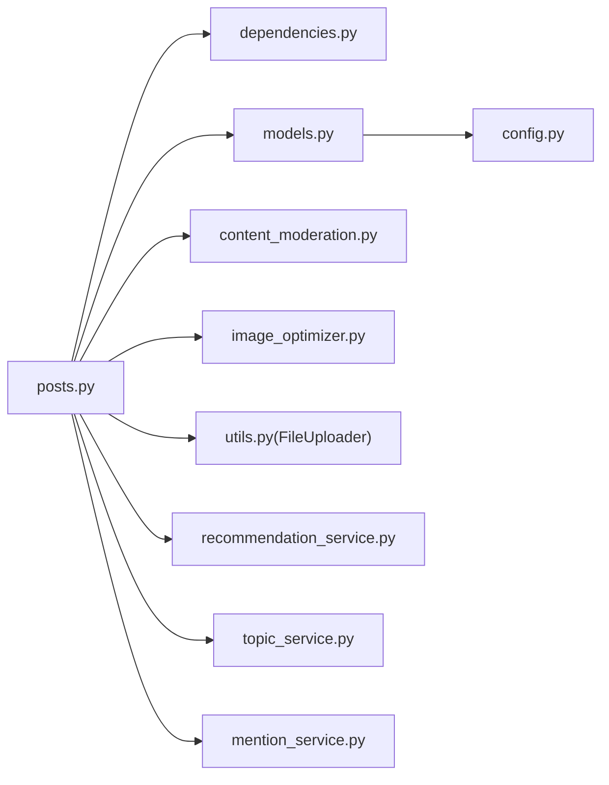

# 帖子管理

<cite>
**本文引用的文件**
- [app/routers/posts.py](file://app/routers/posts.py)
- [app/models/models.py](file://app/models/models.py)
- [app/utils.py](file://app/utils.py)
- [app/services/image_optimizer.py](file://app/services/image_optimizer.py)
- [app/services/content_moderation.py](file://app/services/content_moderation.py)
- [app/services/recommendation_service.py](file://app/services/recommendation_service.py)
- [app/services/topic_service.py](file://app/services/topic_service.py)
- [app/services/mention_service.py](file://app/services/mention_service.py)
- [app/dependencies.py](file://app/dependencies.py)
- [app/core/config.py](file://app/core/config.py)
- [app/main.py](file://app/main.py)
- [openapi.json](file://openapi.json)
</cite>

## 目录
1. [简介](#简介)
2. [项目结构](#项目结构)
3. [核心组件](#核心组件)
4. [架构总览](#架构总览)
5. [详细组件分析](#详细组件分析)
6. [依赖分析](#依赖分析)
7. [性能考量](#性能考量)
8. [故障排查指南](#故障排查指南)
9. [结论](#结论)
10. [附录](#附录)

## 简介
本文件面向NanTuPy的“帖子管理”模块，系统化梳理帖子创建、CRUD、可见性控制、统计与API规范。重点覆盖：
- 帖子创建流程：文本、图片、视频的处理与审核
- CRUD实现：权限验证、数据校验、错误处理
- 可见性控制：公开、好友可见、自定义可见
- 统计功能：浏览量、点赞数、评论数
- API接口规范与使用示例：请求参数、响应格式、错误码

## 项目结构
帖子管理位于应用的路由层与模型层之间，配合服务层完成内容审核、媒体处理、话题与@提及解析、推荐与统计等能力。

图表来源
- [app/routers/posts.py:1-405](file://app/routers/posts.py#L1-L405)
- [app/models/models.py:1-655](file://app/models/models.py#L1-L655)
- [app/utils.py:1-220](file://app/utils.py#L1-L220)
- [app/services/image_optimizer.py:1-230](file://app/services/image_optimizer.py#L1-L230)
- [app/services/content_moderation.py:1-258](file://app/services/content_moderation.py#L1-L258)
- [app/services/recommendation_service.py:1-457](file://app/services/recommendation_service.py#L1-L457)
- [app/services/topic_service.py:1-277](file://app/services/topic_service.py#L1-L277)
- [app/services/mention_service.py:1-118](file://app/services/mention_service.py#L1-L118)
- [app/dependencies.py:1-63](file://app/dependencies.py#L1-L63)
- [app/core/config.py:1-43](file://app/core/config.py#L1-L43)

章节来源
- [app/routers/posts.py:1-405](file://app/routers/posts.py#L1-L405)
- [app/models/models.py:1-655](file://app/models/models.py#L1-L655)
- [app/dependencies.py:1-63](file://app/dependencies.py#L1-L63)
- [app/core/config.py:1-43](file://app/core/config.py#L1-L43)

## 核心组件
- 路由控制器：负责HTTP请求接收、参数解析、权限校验、调用服务与返回响应
- 模型层：定义Post、User、Like、Comment、PostView等实体与关系
- 服务层：
  - 内容审核：敏感词、垃圾信息、仇恨言论、不当内容
  - 图片优化：尺寸、质量、格式转换与二次压缩
  - 推荐/聚合：批量加载统计、序列化输出
  - 话题/提及：自动关联话题、@用户通知
  - 文件上传：COS直传、预签名URL、删除与校验
- 认证与配置：JWT解码获取当前用户；COS、分页、扩展名等配置

章节来源
- [app/routers/posts.py:22-140](file://app/routers/posts.py#L22-L140)
- [app/models/models.py:100-184](file://app/models/models.py#L100-L184)
- [app/services/content_moderation.py:74-127](file://app/services/content_moderation.py#L74-L127)
- [app/services/image_optimizer.py:16-113](file://app/services/image_optimizer.py#L16-L113)
- [app/services/recommendation_service.py:16-81](file://app/services/recommendation_service.py#L16-L81)
- [app/services/topic_service.py:242-257](file://app/services/topic_service.py#L242-L257)
- [app/services/mention_service.py:48-94](file://app/services/mention_service.py#L48-L94)
- [app/utils.py:14-220](file://app/utils.py#L14-L220)
- [app/dependencies.py:16-36](file://app/dependencies.py#L16-L36)
- [app/core/config.py:32-39](file://app/core/config.py#L32-L39)

## 架构总览
帖子管理采用“路由-服务-模型-配置/认证”的分层设计，围绕Post实体展开创建、查询、更新、删除与统计，并在创建阶段集成内容审核、媒体处理与话题/提及解析。

图表来源
- [app/routers/posts.py:22-140](file://app/routers/posts.py#L22-L140)
- [app/services/content_moderation.py:74-127](file://app/services/content_moderation.py#L74-L127)
- [app/services/image_optimizer.py:16-113](file://app/services/image_optimizer.py#L16-L113)
- [app/utils.py:151-187](file://app/utils.py#L151-L187)
- [app/services/recommendation_service.py:16-81](file://app/services/recommendation_service.py#L16-L81)
- [app/dependencies.py:16-36](file://app/dependencies.py#L16-L36)

## 详细组件分析

### 帖子创建流程（文本/图片/视频）
- 输入参数
  - 文本：content（可选）
  - 图片：image（multipart，最大10MB），或 image_urls（JSON数组字符串，多图URL）
  - 视频：video（multipart）
  - 可见性：visibility（默认public），自定义可见需提供 visible_user_ids
- 处理步骤
  - 多图URL解析：若提供image_urls，解析为JSON数组，首图作为封面，post_type设为image
  - 图片上传：读取二进制，限制大小，调用ImageOptimizer优化，再通过FileUploader直传COS，生成URL并写入images字段
  - 视频上传：直接FileUploader.save_file，生成URL
  - 内容审核：对content执行敏感词、垃圾信息、不当内容、仇恨言论检测；若拒绝，记录日志并返回错误
  - 创建Post：填充content、images、video_url、post_type、visibility/is_public、user_id
  - 自定义可见：当visibility为custom时，向post_visibility表插入允许查看的用户ID
  - 话题与@：若content存在，自动抽取话题并关联，解析@用户并发送通知
- 错误处理：参数缺失、文件过大、优化失败、上传失败、审核拒绝、数据库异常均捕获并返回相应HTTP状态码

图表来源
- [app/routers/posts.py:22-140](file://app/routers/posts.py#L22-L140)
- [app/services/content_moderation.py:74-127](file://app/services/content_moderation.py#L74-L127)
- [app/services/image_optimizer.py:16-113](file://app/services/image_optimizer.py#L16-L113)
- [app/utils.py:151-187](file://app/utils.py#L151-L187)
- [app/services/topic_service.py:242-257](file://app/services/topic_service.py#L242-L257)
- [app/services/mention_service.py:48-94](file://app/services/mention_service.py#L48-L94)

章节来源
- [app/routers/posts.py:22-140](file://app/routers/posts.py#L22-L140)
- [app/services/content_moderation.py:74-127](file://app/services/content_moderation.py#L74-L127)
- [app/services/image_optimizer.py:16-113](file://app/services/image_optimizer.py#L16-L113)
- [app/utils.py:151-187](file://app/utils.py#L151-L187)
- [app/services/topic_service.py:242-257](file://app/services/topic_service.py#L242-L257)
- [app/services/mention_service.py:48-94](file://app/services/mention_service.py#L48-L94)

### CRUD操作与权限校验
- 列表/动态流：get_posts
  - 权限：必须登录
  - 可见性：仅公开或好友的帖子
  - 分页：page/per_page，默认20条，最多100条
  - 性能：RecommendationService批量加载点赞/评论/话题/是否点赞，避免N+1
- 用户主页：get_user_posts
  - 权限：必须登录
  - 可见性：仅公开
- 单贴详情：get_post
  - 权限：必须登录
  - 结果：包含is_liked标记
- 更新：update_post
  - 权限：仅作者本人
  - 可更新字段：content、video_url、is_public
  - 更新后：重新解析话题与@提及
- 删除：delete_post
  - 权限：仅作者本人
  - 顺序删除：先删评论点赞、再删帖子点赞、再删回复、再删父评论、再删浏览记录、再删相关通知；最后删除COS上的图片/视频资源

章节来源
- [app/routers/posts.py:142-317](file://app/routers/posts.py#L142-L317)
- [app/services/recommendation_service.py:16-81](file://app/services/recommendation_service.py#L16-L81)
- [app/dependencies.py:16-36](file://app/dependencies.py#L16-L36)

### 可见性控制机制
- 字段：visibility（public/friend/custom）、is_public（布尔）
- 公开：visibility=public，任意登录用户可见
- 好友可见：visibility=friend，仅双方为已接受好友关系的用户可见
- 自定义可见：visibility=custom，通过post_visibility表记录允许查看的用户ID集合
- 查询过滤：动态流与用户主页均按visibility与好友关系筛选

章节来源
- [app/routers/posts.py:142-217](file://app/routers/posts.py#L142-L217)
- [app/models/models.py:18-29](file://app/models/models.py#L18-L29)
- [app/models/models.py:100-120](file://app/models/models.py#L100-L120)

### 统计功能
- 浏览量：record_post_view
  - 逻辑：同一用户对同一帖子重复浏览不重复计数；首次浏览时Post.view_count递增
- 点赞数：get_post_stats
  - 逻辑：统计likes表中对应post_id的数量
- 评论数：get_post_stats
  - 逻辑：统计comments表中对应post_id的数量
- 批量聚合：RecommendationService._batch_load_post_data一次性查询多个帖子的like_count/comment_count/is_liked/topics，序列化时直接使用，避免N+1

章节来源
- [app/routers/posts.py:363-404](file://app/routers/posts.py#L363-L404)
- [app/models/models.py:100-184](file://app/models/models.py#L100-L184)
- [app/services/recommendation_service.py:16-81](file://app/services/recommendation_service.py#L16-L81)

### API接口规范与使用示例
以下为基于OpenAPI定义与代码实现整理的接口清单（以实际路由为准）：

- 创建帖子
  - 方法与路径：POST /api/posts
  - 认证：Bearer Token
  - 请求体：multipart/form-data
    - content: 文本内容（可选）
    - image: 图片文件（可选，<=10MB，优化后上传）
    - video: 视频文件（可选）
    - image_urls: JSON数组字符串（可选，多图URL）
    - video_url: 视频URL（可选，别名video_url）
    - visibility: 可见性(public/friend/custom)，默认public
    - visible_user_ids: 自定义可见时的用户ID列表（逗号分隔）
  - 成功响应：{
      "message": "Post created successfully",
      "post": { ... }
    }
  - 错误码：400（参数/审核/上传失败）、401（未登录/令牌无效）、403（权限不足）、500（服务器错误）

- 获取帖子列表（动态）
  - 方法与路径：GET /api/posts
  - 认证：Bearer Token
  - 查询参数：page（默认1，>=1）、per_page（默认20，1-100）
  - 成功响应：{
      "posts": [...],
      "has_more": true/false,
      "current_page": 1,
      "per_page": 20
    }

- 获取指定用户帖子
  - 方法与路径：GET /api/posts/user/{user_id}
  - 认证：Bearer Token
  - 查询参数：page、per_page
  - 成功响应：同上

- 获取单个帖子详情
  - 方法与路径：GET /api/posts/{post_id}
  - 认证：Bearer Token
  - 成功响应：{
      "post": { ... }
    }

- 更新帖子
  - 方法与路径：PUT /api/posts/{post_id}
  - 认证：Bearer Token
  - 请求体：JSON
    - content: 文本（可选）
    - video_url: 视频URL（可选）
    - is_public: 是否公开（可选）
  - 成功响应：{
      "message": "Post updated successfully",
      "post": { ... }
    }

- 删除帖子
  - 方法与路径：DELETE /api/posts/{post_id}
  - 认证：Bearer Token
  - 成功响应：{
      "message": "Post deleted successfully"
    }

- 记录帖子浏览
  - 方法与路径：POST /api/posts/{post_id}/view
  - 认证：Bearer Token
  - 成功响应：{
      "message": "View recorded/Already viewed",
      "views": 123,
      "view_count": 123
    }

- 获取帖子统计数据
  - 方法与路径：GET /api/posts/{post_id}/stats
  - 认证：Bearer Token
  - 成功响应：{
      "post_id": 123,
      "views": 123,
      "likes": 456,
      "comments": 789
    }

章节来源
- [openapi.json:812-1314](file://openapi.json#L812-L1314)
- [app/routers/posts.py:22-404](file://app/routers/posts.py#L22-L404)
- [app/dependencies.py:16-36](file://app/dependencies.py#L16-L36)

## 依赖分析
- 路由依赖认证：JWT解码获取用户ID，校验用户是否存在
- 业务依赖服务：
  - 内容审核：ContentModeration
  - 媒体处理：ImageOptimizer、FileUploader
  - 聚合统计：RecommendationService
  - 话题与@：TopicService、MentionService
- 模型依赖：Post、User、Like、Comment、PostView、post_visibility关联表
- 配置依赖：COS直传、分页、扩展名、数据库连接

图表来源
- [app/routers/posts.py:1-19](file://app/routers/posts.py#L1-L19)
- [app/dependencies.py:1-63](file://app/dependencies.py#L1-L63)
- [app/models/models.py:1-655](file://app/models/models.py#L1-L655)
- [app/services/content_moderation.py:1-258](file://app/services/content_moderation.py#L1-L258)
- [app/services/image_optimizer.py:1-230](file://app/services/image_optimizer.py#L1-L230)
- [app/utils.py:1-220](file://app/utils.py#L1-L220)
- [app/services/recommendation_service.py:1-457](file://app/services/recommendation_service.py#L1-L457)
- [app/services/topic_service.py:1-277](file://app/services/topic_service.py#L1-L277)
- [app/services/mention_service.py:1-118](file://app/services/mention_service.py#L1-L118)
- [app/core/config.py:1-43](file://app/core/config.py#L1-L43)

章节来源
- [app/routers/posts.py:1-19](file://app/routers/posts.py#L1-L19)
- [app/models/models.py:1-655](file://app/models/models.py#L1-L655)

## 性能考量
- 批量聚合：RecommendationService在查询列表时一次性加载每个帖子的点赞/评论/话题/是否点赞，避免N+1查询
- 分页策略：使用offset/limit分页，has_more通过多取一条判断，减少昂贵COUNT
- 媒体处理：图片上传前先优化，控制文件体积；COS直传避免服务端内存压力
- 可见性过滤：动态流与用户主页均在SQL层面按visibility与好友关系过滤，减少应用层筛选

章节来源
- [app/services/recommendation_service.py:16-81](file://app/services/recommendation_service.py#L16-L81)
- [app/routers/posts.py:142-217](file://app/routers/posts.py#L142-L217)

## 故障排查指南
- 400错误
  - 图片过大：上传图片超过10MB触发
  - 上传失败：FileUploader返回错误
  - 审核拒绝：ContentModeration返回拒绝原因
  - 参数缺失：content与媒体均为空
- 401/403错误
  - 未携带有效Token或Token过期
  - 非本人操作（更新/删除）
- 404错误
  - 帖子不存在
- 500错误
  - 数据库事务回滚异常
  - 媒体处理异常
- 建议排查点
  - 检查JWT是否正确携带与有效
  - 检查COS配置（ID/KEY/REGION/BUCKET/DOMAIN）
  - 检查content_moderation日志与敏感词库
  - 检查图片优化与上传链路

章节来源
- [app/routers/posts.py:56-78](file://app/routers/posts.py#L56-L78)
- [app/routers/posts.py:96-107](file://app/routers/posts.py#L96-L107)
- [app/routers/posts.py:238-242](file://app/routers/posts.py#L238-L242)
- [app/routers/posts.py:267-271](file://app/routers/posts.py#L267-L271)
- [app/utils.py:151-187](file://app/utils.py#L151-L187)
- [app/services/content_moderation.py:230-250](file://app/services/content_moderation.py#L230-L250)

## 结论
帖子管理模块以清晰的分层设计实现了从内容创建、媒体处理、审核、可见性控制到统计与推荐的完整闭环。通过批量聚合与SQL过滤，系统在保证功能完整性的同时兼顾了性能与可维护性。建议在生产环境中强化COS配置校验、完善审核规则与日志审计，并持续优化推荐算法的多样性与公平性。

## 附录
- 路由注册：在主应用中将posts路由挂载到/api/posts前缀
- 主应用入口：参考include_router与路由前缀配置

章节来源
- [app/main.py:69-94](file://app/main.py#L69-L94)