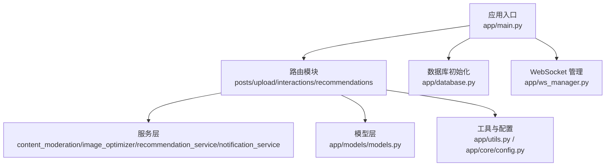
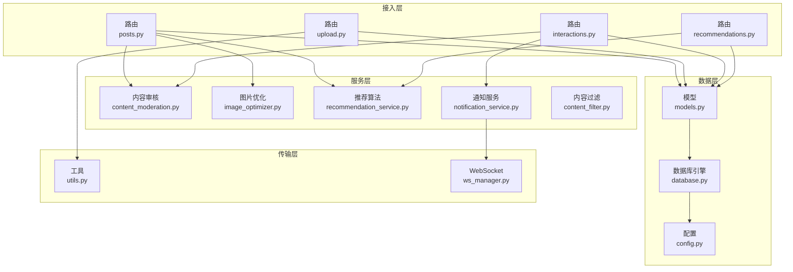
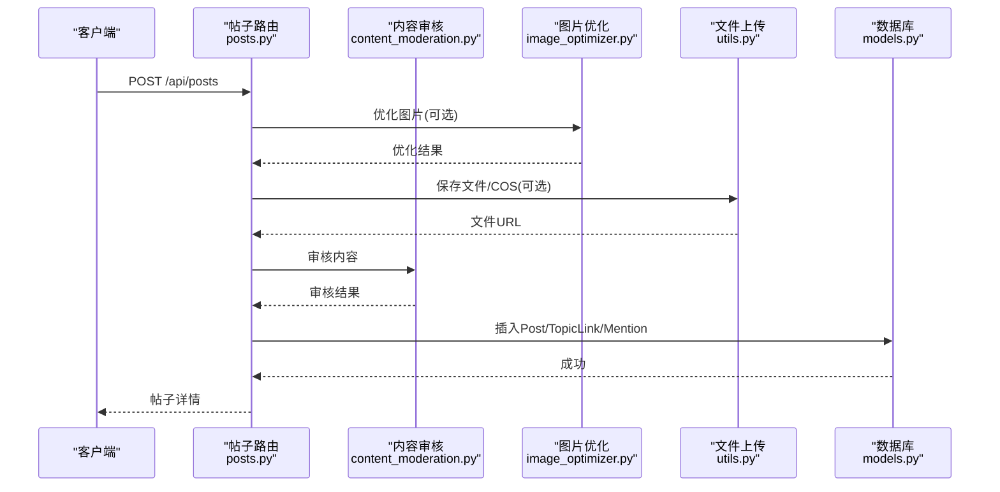
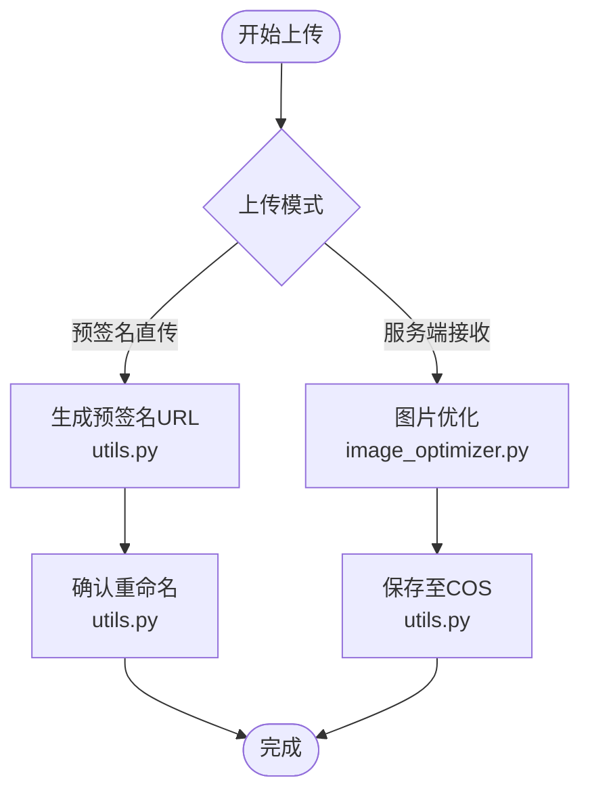
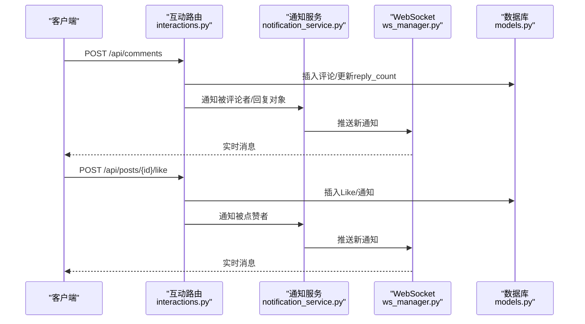
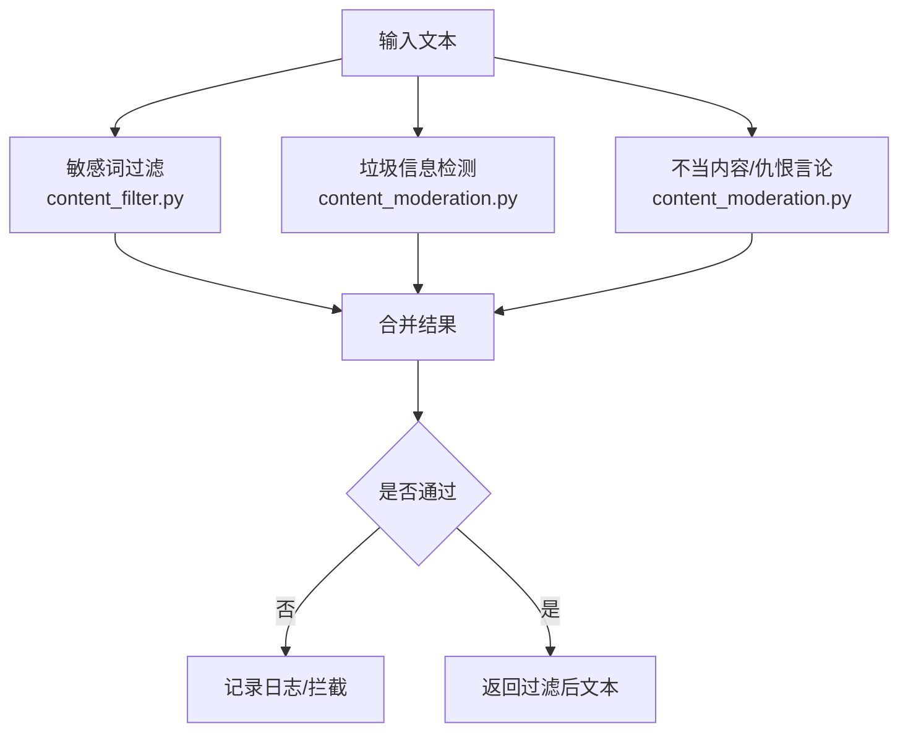
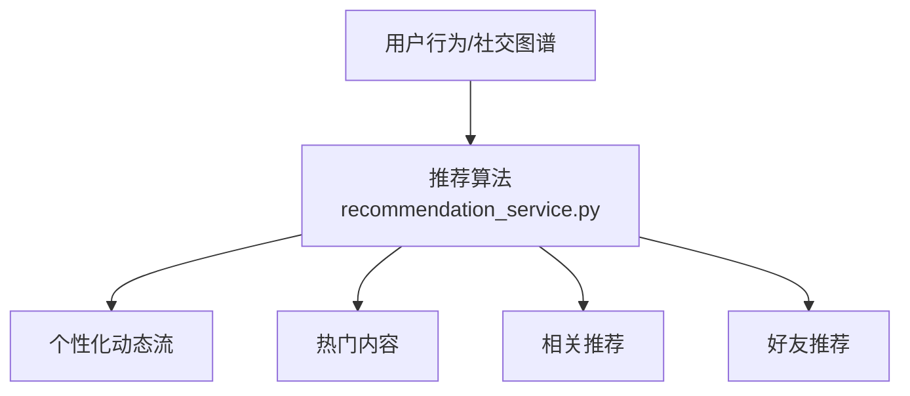
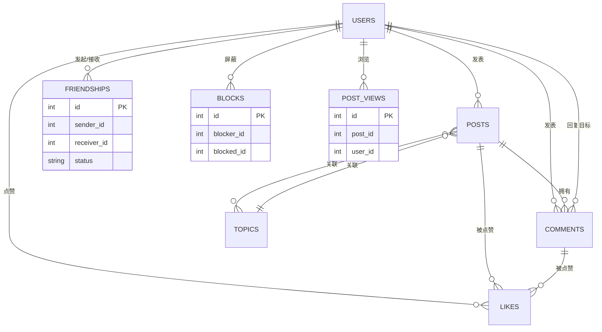
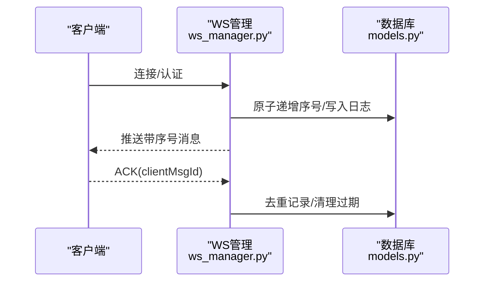
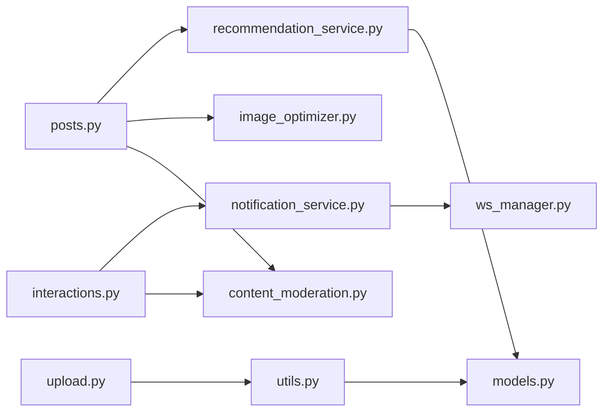

# 社交内容管理

<cite>
**本文档引用的文件**
- [app/main.py](file://app/main.py)
- [app/models/models.py](file://app/models/models.py)
- [app/routers/posts.py](file://app/routers/posts.py)
- [app/routers/upload.py](file://app/routers/upload.py)
- [app/routers/interactions.py](file://app/routers/interactions.py)
- [app/services/image_optimizer.py](file://app/services/image_optimizer.py)
- [app/services/content_moderation.py](file://app/services/content_moderation.py)
- [app/services/content_filter.py](file://app/services/content_filter.py)
- [app/utils.py](file://app/utils.py)
- [app/database.py](file://app/database.py)
- [app/core/config.py](file://app/core/config.py)
- [app/services/recommendation_service.py](file://app/services/recommendation_service.py)
- [app/services/notification_service.py](file://app/services/notification_service.py)
- [app/ws_manager.py](file://app/ws_manager.py)
- [app/routers/recommendations.py](file://app/routers/recommendations.py)
- [comic_tables.sql](file://comic_tables.sql)
</cite>

## 目录
1. [简介](#简介)
2. [项目结构](#项目结构)
3. [核心组件](#核心组件)
4. [架构总览](#架构总览)
5. [详细组件分析](#详细组件分析)
6. [依赖关系分析](#依赖关系分析)
7. [性能考虑](#性能考虑)
8. [故障排查指南](#故障排查指南)
9. [结论](#结论)
10. [附录](#附录)

## 简介
本项目为基于 FastAPI 的社交内容管理系统（NanTuPy v2.0），提供完整的帖子发布、编辑、删除流程；图片上传与优化；评论、点赞与互动；内容审核与敏感词过滤；推荐与趋势；以及 WebSocket 实时通知等能力。系统采用 SQLAlchemy 2.0 ORM、腾讯云 COS 存储、JWT 认证与中间件安全头策略，具备良好的扩展性与生产可用性。

## 项目结构
- 应用入口与中间件：在应用入口集中注册路由、CORS、安全头与健康检查。
- 路由层：按功能模块拆分，如 posts、upload、interactions、recommendations、admin 等。
- 服务层：封装业务逻辑，如内容审核、图片优化、推荐算法、通知、提及解析等。
- 模型层：基于 SQLAlchemy 定义用户、帖子、评论、点赞、话题、举报、漫展等实体及索引。
- 工具与配置：文件上传（COS）、数据库连接、运行配置等。
- WebSocket：连接管理、消息序号、断线补发与去重。

**图表来源**
- [app/main.py:39-84](file://app/main.py#L39-L84)
- [app/database.py:35-38](file://app/database.py#L35-L38)
- [app/models/models.py:100-184](file://app/models/models.py#L100-L184)

**章节来源**
- [app/main.py:1-110](file://app/main.py#L1-L110)
- [app/database.py:1-38](file://app/database.py#L1-L38)

## 核心组件
- 帖子管理：创建、查询、更新、删除、浏览统计与查看记录。
- 上传与图片优化：直传 COS、预签名直传、确认重命名、缩略图与压缩、文件信息查询与删除。
- 互动系统：点赞（帖子/评论）、评论（支持父子回复）、通知推送。
- 内容审核：敏感词过滤、垃圾信息检测、仇恨言论与不当内容识别、审核日志。
- 推荐与趋势：个性化动态流、热门内容、相关推荐、好友推荐。
- WebSocket：连接池、消息序号、断线补发、ACK 去重、实时通知。

**章节来源**
- [app/routers/posts.py:22-140](file://app/routers/posts.py#L22-L140)
- [app/routers/upload.py:50-130](file://app/routers/upload.py#L50-L130)
- [app/routers/interactions.py:54-170](file://app/routers/interactions.py#L54-L170)
- [app/services/content_moderation.py:74-127](file://app/services/content_moderation.py#L74-L127)
- [app/services/recommendation_service.py:83-168](file://app/services/recommendation_service.py#L83-L168)
- [app/ws_manager.py:74-95](file://app/ws_manager.py#L74-L95)

## 架构总览
系统采用分层架构：路由层负责请求接入与参数校验；服务层封装业务规则；模型层抽象数据结构；工具层提供存储与通用能力；WebSocket 独立管理实时通信。

**图表来源**
- [app/routers/posts.py:1-405](file://app/routers/posts.py#L1-L405)
- [app/routers/upload.py:1-224](file://app/routers/upload.py#L1-L224)
- [app/routers/interactions.py:1-433](file://app/routers/interactions.py#L1-L433)
- [app/services/content_moderation.py:1-258](file://app/services/content_moderation.py#L1-L258)
- [app/services/image_optimizer.py:1-230](file://app/services/image_optimizer.py#L1-L230)
- [app/services/recommendation_service.py:1-457](file://app/services/recommendation_service.py#L1-L457)
- [app/services/notification_service.py:1-233](file://app/services/notification_service.py#L1-L233)
- [app/models/models.py:1-655](file://app/models/models.py#L1-L655)
- [app/database.py:1-38](file://app/database.py#L1-L38)
- [app/core/config.py:1-43](file://app/core/config.py#L1-L43)
- [app/utils.py:1-220](file://app/utils.py#L1-L220)
- [app/ws_manager.py:1-308](file://app/ws_manager.py#L1-L308)

## 详细组件分析

### 帖子发布、编辑、删除流程
- 创建帖子：支持文本、多图 URL、单图上传（直传优化）、视频上传；内容审核通过后入库；自动关联话题与@提及；公开/隐私可见性控制。
- 更新帖子：仅作者可修改，支持内容、视频 URL、公开状态；更新后重新解析话题与@。
- 删除帖子：级联删除点赞、评论（含回复）、浏览记录、相关通知；同步删除 COS 文件资源。

**图表来源**
- [app/routers/posts.py:22-140](file://app/routers/posts.py#L22-L140)
- [app/services/content_moderation.py:74-127](file://app/services/content_moderation.py#L74-L127)
- [app/services/image_optimizer.py:16-112](file://app/services/image_optimizer.py#L16-L112)
- [app/utils.py:151-187](file://app/utils.py#L151-L187)

**章节来源**
- [app/routers/posts.py:22-140](file://app/routers/posts.py#L22-L140)
- [app/models/models.py:100-184](file://app/models/models.py#L100-L184)

### 图片上传处理机制
- 直传 COS：生成预签名 URL，客户端直传，服务端确认重命名并返回最终 URL。
- 本地上传：服务端接收文件，进行尺寸与质量优化，保存至 COS。
- 缩略图与压缩：支持生成缩略图与压缩文件，满足不同场景需求。
- 文件信息与删除：支持查询与删除 COS 文件。

**图表来源**
- [app/routers/upload.py:50-130](file://app/routers/upload.py#L50-L130)
- [app/utils.py:37-187](file://app/utils.py#L37-L187)
- [app/services/image_optimizer.py:16-112](file://app/services/image_optimizer.py#L16-L112)

**章节来源**
- [app/routers/upload.py:19-130](file://app/routers/upload.py#L19-L130)
- [app/utils.py:14-187](file://app/utils.py#L14-L187)
- [app/services/image_optimizer.py:16-112](file://app/services/image_optimizer.py#L16-L112)

### 评论系统、点赞功能与互动机制
- 评论：支持父子回复、批量加载与 is_liked 批量查询、回复计数；内容审核与通知、@提及处理。
- 点赞：支持帖子与评论点赞，去重、计数与通知；取消点赞更新计数。
- 通知：点赞、评论、@提及、好友请求等通过 WebSocket 实时推送。

**图表来源**
- [app/routers/interactions.py:175-241](file://app/routers/interactions.py#L175-L241)
- [app/routers/interactions.py:54-99](file://app/routers/interactions.py#L54-L99)
- [app/services/notification_service.py:87-141](file://app/services/notification_service.py#L87-L141)
- [app/ws_manager.py:74-95](file://app/ws_manager.py#L74-L95)

**章节来源**
- [app/routers/interactions.py:175-241](file://app/routers/interactions.py#L175-L241)
- [app/services/notification_service.py:14-141](file://app/services/notification_service.py#L14-L141)
- [app/ws_manager.py:74-95](file://app/ws_manager.py#L74-L95)

### 内容审核与敏感内容过滤
- 敏感词过滤：内置敏感词库，支持全角/半角与形近字归一化，动态词库管理。
- 垃圾信息检测：链接密度、重复字符、刷屏模式、全大写比例等。
- 不当内容与仇恨言论：关键词匹配与模式识别。
- 审核日志：拦截记录与原因摘要，便于审计与改进。

**图表来源**
- [app/services/content_filter.py:104-142](file://app/services/content_filter.py#L104-L142)
- [app/services/content_moderation.py:74-127](file://app/services/content_moderation.py#L74-L127)

**章节来源**
- [app/services/content_filter.py:13-192](file://app/services/content_filter.py#L13-L192)
- [app/services/content_moderation.py:19-258](file://app/services/content_moderation.py#L19-L258)

### 推荐与趋势、相关推荐
- 个性化动态流：基于好友关系、交互得分、话题兴趣、时间衰减与多样性策略。
- 热门内容：基于点赞与评论的参与度与时间衰减因子。
- 相关推荐：基于相同话题与作者相似度。
- 好友推荐：共同好友、共同话题、活跃度、注册时间相近与探索性随机。

**图表来源**
- [app/services/recommendation_service.py:83-168](file://app/services/recommendation_service.py#L83-L168)
- [app/services/recommendation_service.py:171-232](file://app/services/recommendation_service.py#L171-L232)
- [app/services/recommendation_service.py:434-457](file://app/services/recommendation_service.py#L434-L457)
- [app/services/recommendation_service.py:299-431](file://app/services/recommendation_service.py#L299-L431)

**章节来源**
- [app/services/recommendation_service.py:10-457](file://app/services/recommendation_service.py#L10-L457)
- [app/routers/recommendations.py:15-70](file://app/routers/recommendations.py#L15-L70)

### 数据模型设计
- 用户：基础资料、隐私与通知偏好、与帖子/评论/点赞/好友/屏蔽等关系。
- 帖子：内容、图片数组（JSON）、视频 URL、类型、可见性、统计字段。
- 评论：支持父子回复、回复计数、点赞计数、与用户/帖子/回复目标的关系。
- 点赞：统一点赞表，支持帖子与评论。
- 关系与索引：好友关系、话题关联、关注、屏蔽、浏览记录、搜索历史、敏感词等。
- WebSocket 协议表：消息序号、日志与 ACK 去重。

**图表来源**
- [app/models/models.py:42-184](file://app/models/models.py#L42-L184)
- [app/models/models.py:261-444](file://app/models/models.py#L261-L444)
- [app/models/models.py:625-655](file://app/models/models.py#L625-L655)

**章节来源**
- [app/models/models.py:1-655](file://app/models/models.py#L1-L655)

### WebSocket 实时通知与协议
- 连接管理：单例管理用户连接，支持广播与会话房间。
- 序号机制：为每用户维护单调递增序号，持久化消息日志，支持断线补发。
- ACK 去重：基于 clientMsgId 去重，定期清理过期记录。
- 通知推送：点赞、评论、@提及等事件通过 WebSocket 实时下发。

**图表来源**
- [app/ws_manager.py:74-95](file://app/ws_manager.py#L74-L95)
- [app/ws_manager.py:214-247](file://app/ws_manager.py#L214-L247)
- [app/ws_manager.py:265-303](file://app/ws_manager.py#L265-L303)

**章节来源**
- [app/ws_manager.py:20-308](file://app/ws_manager.py#L20-L308)

## 依赖关系分析
- 路由依赖：各路由模块依赖数据库会话、当前用户依赖注入、模型与服务层。
- 服务依赖：内容审核依赖敏感词过滤；图片上传依赖 COS 客户端；通知依赖 WebSocket 管理器。
- 数据库依赖：统一通过 SessionLocal 获取会话，初始化时创建所有表。

**图表来源**
- [app/routers/posts.py:1-405](file://app/routers/posts.py#L1-L405)
- [app/routers/upload.py:1-224](file://app/routers/upload.py#L1-L224)
- [app/routers/interactions.py:1-433](file://app/routers/interactions.py#L1-L433)
- [app/services/content_moderation.py:1-258](file://app/services/content_moderation.py#L1-L258)
- [app/services/image_optimizer.py:1-230](file://app/services/image_optimizer.py#L1-L230)
- [app/services/recommendation_service.py:1-457](file://app/services/recommendation_service.py#L1-L457)
- [app/utils.py:1-220](file://app/utils.py#L1-L220)
- [app/services/notification_service.py:1-233](file://app/services/notification_service.py#L1-L233)
- [app/ws_manager.py:1-308](file://app/ws_manager.py#L1-L308)
- [app/models/models.py:1-655](file://app/models/models.py#L1-L655)

**章节来源**
- [app/database.py:22-38](file://app/database.py#L22-L38)

## 性能考虑
- 批量加载与 N+1 避免：推荐服务批量加载点赞/评论计数、话题与 is_liked，序列化时复用聚合数据。
- 分页与 has_more：动态列表多取 1 条判断“更多”，避免昂贵 COUNT。
- 索引与查询优化：评论/点赞/帖子等关键字段建立索引，减少排序与过滤成本。
- 图片优化：限制最大尺寸与文件大小，必要时二次压缩以控制体积。
- 连接池：数据库连接池参数可调，启用 pre-ping 与回收策略。
- WebSocket：序号与去重减少重复推送，断线补发提升可靠性。

[本节为通用指导，无需特定文件引用]

## 故障排查指南
- 帖子创建失败：检查内容审核返回的拒绝原因与日志；确认图片大小与格式；检查 COS 配置。
- 上传失败：确认预签名生成与确认流程；检查 COS 凭据与桶配置；查看文件删除与信息查询接口。
- 评论/点赞异常：检查权限与存在性；确认批量 is_liked 查询是否命中；查看通知推送是否成功。
- 推荐结果异常：调整 per_page 与页面参数；检查好友关系与交互数据；核对时间窗口与多样性策略。
- WebSocket 不在线：确认连接状态与序号递增；检查断线补发与 ACK 去重记录。

**章节来源**
- [app/routers/posts.py:136-140](file://app/routers/posts.py#L136-L140)
- [app/routers/upload.py:82-97](file://app/routers/upload.py#L82-L97)
- [app/services/content_moderation.py:241-249](file://app/services/content_moderation.py#L241-L249)
- [app/services/notification_service.py:22-53](file://app/services/notification_service.py#L22-L53)
- [app/ws_manager.py:170-212](file://app/ws_manager.py#L170-L212)

## 结论
NanTuPy v2.0 通过清晰的分层架构、完善的审核与优化机制、高性能的推荐与批量化查询、可靠的 WebSocket 实时通知，构建了可扩展、可维护的社交内容管理平台。建议在生产环境中进一步完善监控与告警、灰度发布与 A/B 实验、以及更细粒度的缓存策略。

[本节为总结性内容，无需特定文件引用]

## 附录

### API 接口概览（按模块）
- 帖子
  - POST /api/posts：创建帖子（支持文本、多图 URL、图片上传、视频上传、可见性）
  - GET /api/posts：获取动态流（分页、has_more）
  - GET /api/posts/user/{user_id}：获取指定用户帖子
  - GET /api/posts/{post_id}：获取帖子详情
  - PUT /api/posts/{post_id}：更新帖子
  - DELETE /api/posts/{post_id}：删除帖子
  - POST /api/posts/{post_id}/view：记录浏览
  - GET /api/posts/{post_id}/stats：获取统计
- 上传
  - POST /api/upload/presign：生成预签名 URL
  - POST /api/upload/confirm：确认上传并重命名
  - POST /api/upload/avatar/confirm：确认头像并更新用户资料
  - POST /api/upload/cover/confirm：确认封面并更新用户资料
  - POST /api/upload/delete：删除 COS 文件
  - GET /api/upload/info：获取文件信息
  - GET /api/upload/uploads/{filename}：旧 URL 重定向
- 互动
  - POST /api/posts/{post_id}/like：点赞
  - DELETE /api/posts/{post_id}/like：取消点赞
  - GET /api/posts/{post_id}/likes：获取点赞列表
  - POST /api/comments/{comment_id}/like：评论点赞
  - DELETE /api/comments/{comment_id}/like：取消评论点赞
  - POST /api/posts/{post_id}/comments：创建评论
  - GET /api/posts/{post_id}/comments：获取评论列表（支持父评论回复）
  - GET /api/comments/{comment_id}：获取评论详情
  - PUT /api/comments/{comment_id}：更新评论
  - DELETE /api/comments/{comment_id}：删除评论
- 推荐
  - GET /api/recommendations/feed：个性化动态流
  - GET /api/recommendations/trending：热门内容
  - GET /api/recommendations/users/suggest：用户推荐
  - GET /api/recommendations/friends/recommend：好友推荐
  - GET /api/recommendations/posts/{post_id}/related：相关推荐

**章节来源**
- [app/routers/posts.py:22-405](file://app/routers/posts.py#L22-L405)
- [app/routers/upload.py:50-224](file://app/routers/upload.py#L50-L224)
- [app/routers/interactions.py:54-433](file://app/routers/interactions.py#L54-L433)
- [app/routers/recommendations.py:15-70](file://app/routers/recommendations.py#L15-L70)

### 配置要点
- 数据库：连接字符串、连接池参数、字符集。
- 云存储：COS 地区、桶名、域名、凭据。
- 安全：JWT 密钥、CORS、COOP/COEP 安全头。
- 上传：允许的图片/视频扩展名、最大内容长度。

**章节来源**
- [app/core/config.py:7-43](file://app/core/config.py#L7-L43)

### 漫展相关表结构（迁移参考）
- 城市、标签、事件、图片、标签关联、关注等表结构，支持漫展功能扩展。

**章节来源**
- [comic_tables.sql:1-68](file://comic_tables.sql#L1-L68)