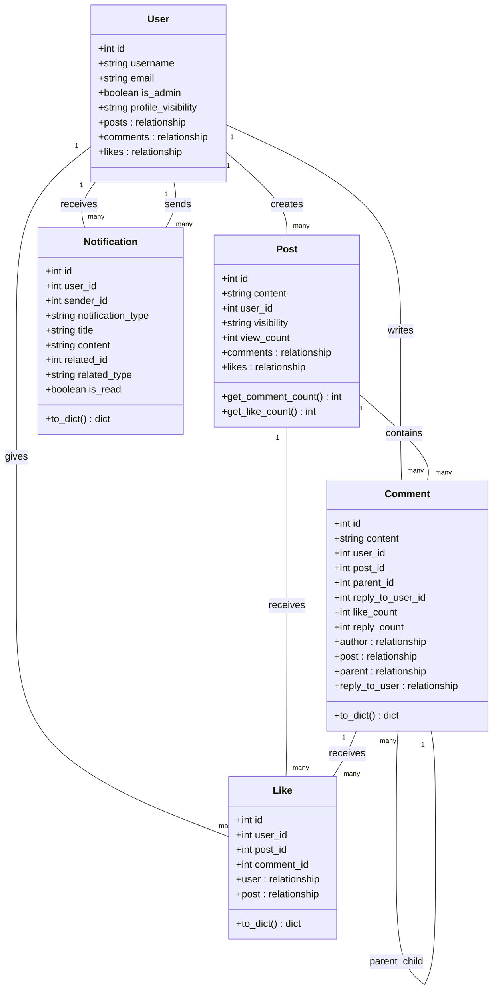
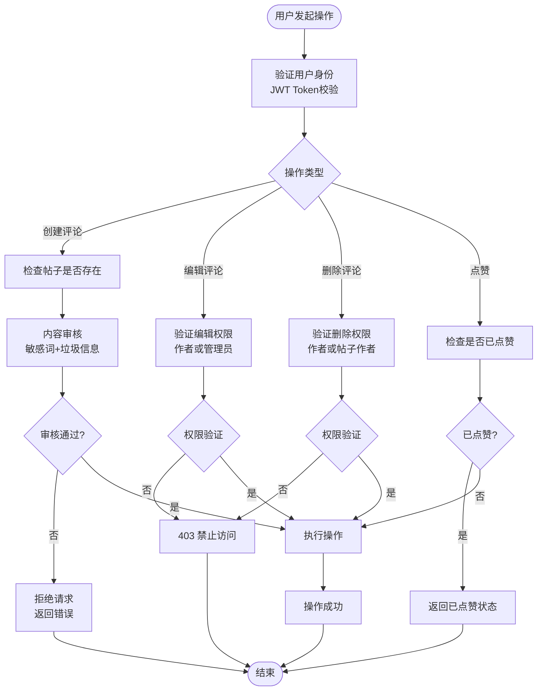
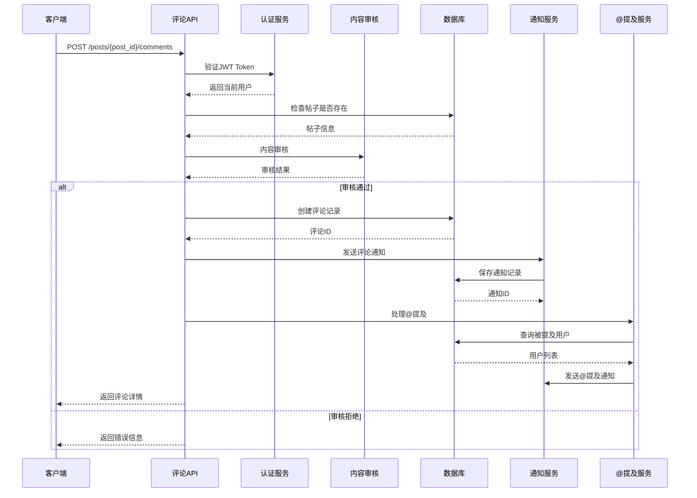
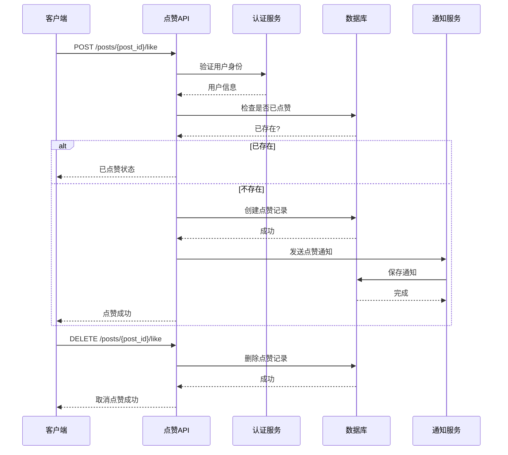
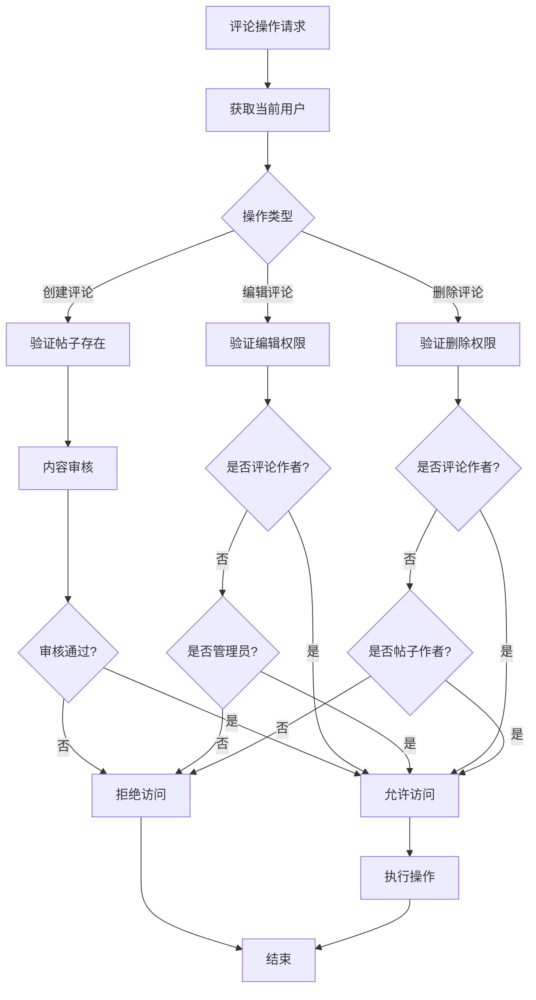
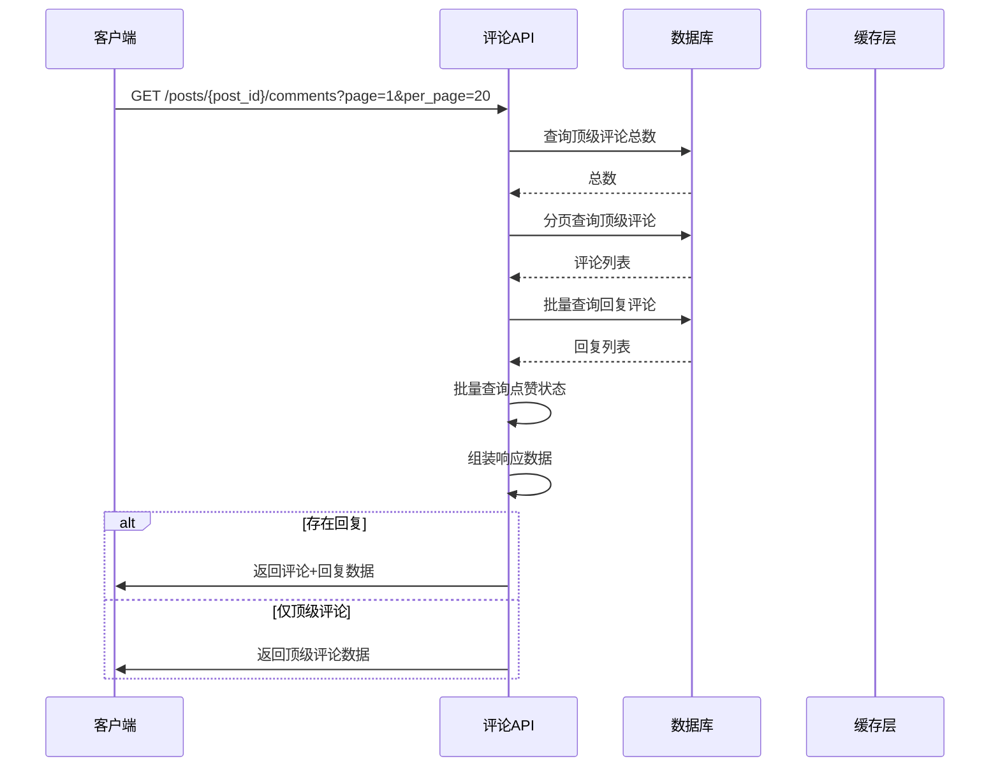
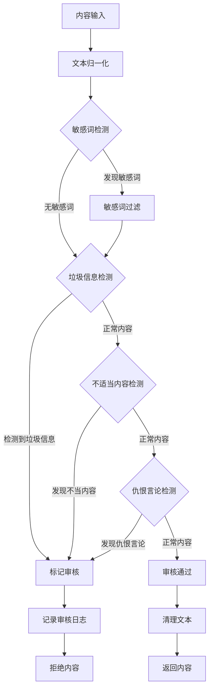
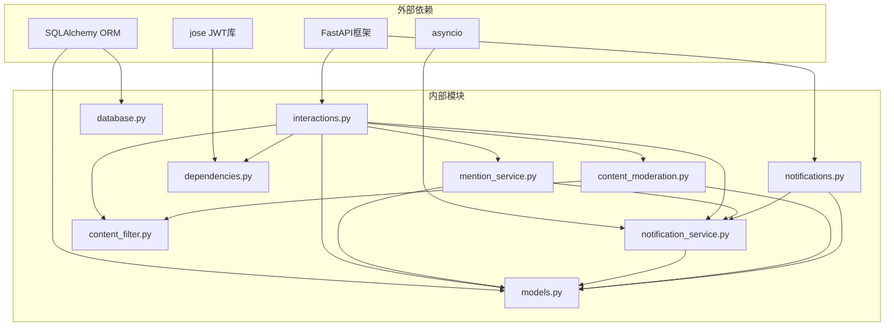

# 评论互动系统

<cite>
**本文档引用的文件**
- [app/routers/interactions.py](file://app/routers/interactions.py)
- [app/services/mention_service.py](file://app/services/mention_service.py)
- [app/services/notification_service.py](file://app/services/notification_service.py)
- [app/services/content_filter.py](file://app/services/content_filter.py)
- [app/services/content_moderation.py](file://app/services/content_moderation.py)
- [app/models/models.py](file://app/models/models.py)
- [app/routers/notifications.py](file://app/routers/notifications.py)
- [app/dependencies.py](file://app/dependencies.py)
- [app/database.py](file://app/database.py)
</cite>

## 目录
1. [简介](#简介)
2. [项目结构](#项目结构)
3. [核心组件](#核心组件)
4. [架构概览](#架构概览)
5. [详细组件分析](#详细组件分析)
6. [依赖关系分析](#依赖关系分析)
7. [性能考虑](#性能考虑)
8. [故障排除指南](#故障排除指南)
9. [结论](#结论)
10. [附录](#附录)

## 简介

NanTuPy的评论互动系统是一个完整的社交平台评论功能模块，提供了丰富的用户交互能力。该系统支持多层次的评论结构、智能的内容审核、实时的通知推送以及完善的权限控制机制。

系统的核心特性包括：
- **嵌套评论系统**：支持无限层级的评论回复
- **智能内容审核**：集成敏感词过滤和垃圾信息检测
- **实时通知机制**：通过WebSocket实现实时消息推送
- **@提及功能**：自动识别和通知被提及的用户
- **权限控制系统**：基于用户角色和隐私设置的访问控制
- **点赞功能**：支持帖子和评论的点赞操作
- **分页加载**：优化大数据量场景下的性能表现

## 项目结构

评论互动系统主要分布在以下目录结构中：

```mermaid
graph TB
subgraph "路由层"
IR[interactions.py<br/>评论路由]
NR[notifications.py<br/>通知路由]
end
subgraph "服务层"
MS[MentionService<br/>@提及服务]
NS[NotificationService<br/>通知服务]
CF[ContentFilter<br/>敏感词过滤]
CM[ContentModeration<br/>内容审核]
end
subgraph "模型层"
UM[User模型]
PM[Post模型]
CM[Comment模型]
LM[Like模型]
NM[Notification模型]
end
subgraph "基础设施"
DB[database.py<br/>数据库配置]
DE[dependencies.py<br/>认证依赖]
end
IR --> MS
IR --> NS
IR --> CM
IR --> CF
IR --> UM
IR --> PM
IR --> CM
IR --> LM
NR --> NS
NS --> NM
MS --> UM
CM --> CF
```

**图表来源**
- [app/routers/interactions.py:1-433](file://app/routers/interactions.py#L1-L433)
- [app/services/mention_service.py:1-118](file://app/services/mention_service.py#L1-L118)
- [app/services/notification_service.py:1-233](file://app/services/notification_service.py#L1-L233)

**章节来源**
- [app/routers/interactions.py:1-50](file://app/routers/interactions.py#L1-L50)
- [app/services/mention_service.py:1-25](file://app/services/mention_service.py#L1-L25)
- [app/services/notification_service.py:1-20](file://app/services/notification_service.py#L1-L20)

## 核心组件

### 评论模型设计

评论系统的核心数据模型采用层次化的设计，支持复杂的嵌套关系：



**图表来源**
- [app/models/models.py:42-232](file://app/models/models.py#L42-L232)

### 权限控制机制

系统实现了多层权限控制，确保评论功能的安全性和合规性：



**图表来源**
- [app/routers/interactions.py:175-433](file://app/routers/interactions.py#L175-L433)
- [app/dependencies.py:16-63](file://app/dependencies.py#L16-L63)

**章节来源**
- [app/models/models.py:187-232](file://app/models/models.py#L187-L232)
- [app/routers/interactions.py:380-433](file://app/routers/interactions.py#L380-L433)
- [app/dependencies.py:53-63](file://app/dependencies.py#L53-L63)

## 架构概览

评论互动系统采用分层架构设计，各层职责明确，耦合度低：

```mermaid
graph TB
subgraph "表现层"
API[RESTful API]
WS[WebSocket连接]
end
subgraph "应用层"
IR[评论路由层]
NR[通知路由层]
AS[业务逻辑层]
end
subgraph "服务层"
MS[@提及服务]
NS[通知服务]
CF[内容过滤]
CM[内容审核]
end
subgraph "数据访问层"
ORM[SQLAlchemy ORM]
DB[(数据库)]
end
subgraph "基础设施"
AUTH[JWT认证]
LOG[日志系统]
WS[WebSocket管理]
end
API --> IR
API --> NR
WS --> WS
IR --> AS
NR --> AS
AS --> MS
AS --> NS
AS --> CF
AS --> CM
AS --> ORM
ORM --> DB
API --> AUTH
WS --> AUTH
AS --> LOG
NS --> WS
```

**图表来源**
- [app/routers/interactions.py:1-15](file://app/routers/interactions.py#L1-L15)
- [app/services/notification_service.py:20-53](file://app/services/notification_service.py#L20-L53)

## 详细组件分析

### 评论创建机制

评论创建流程是整个系统的核心，涉及多个服务的协同工作：



**图表来源**
- [app/routers/interactions.py:175-241](file://app/routers/interactions.py#L175-L241)
- [app/services/content_moderation.py:74-127](file://app/services/content_moderation.py#L74-L127)

#### 评论创建的关键流程

1. **用户身份验证**：通过JWT Token验证用户身份
2. **内容审核**：使用ContentModeration服务进行多维度审核
3. **@提及处理**：MentionService自动识别和通知被提及用户
4. **通知推送**：NotificationService发送实时通知
5. **数据库持久化**：原子性地保存所有变更

**章节来源**
- [app/routers/interactions.py:175-241](file://app/routers/interactions.py#L175-L241)
- [app/services/mention_service.py:48-94](file://app/services/mention_service.py#L48-L94)
- [app/services/notification_service.py:115-141](file://app/services/notification_service.py#L115-L141)

### 点赞功能实现

系统提供了完整的点赞功能，支持帖子和评论两个层面：



**图表来源**
- [app/routers/interactions.py:54-99](file://app/routers/interactions.py#L54-L99)
- [app/routers/interactions.py:119-170](file://app/routers/interactions.py#L119-L170)

#### 点赞功能特性

1. **防重复点赞**：通过唯一约束防止重复点赞
2. **实时通知**：点赞时自动通知被点赞用户
3. **数据一致性**：使用事务保证数据完整性
4. **性能优化**：批量查询减少数据库访问次数

**章节来源**
- [app/routers/interactions.py:54-170](file://app/routers/interactions.py#L54-L170)
- [app/models/models.py:234-259](file://app/models/models.py#L234-L259)

### @提及功能处理

@提及功能提供了智能的用户发现和通知机制：

```mermaid
flowchart TD
Content[评论内容] --> Extract["@提及提取"]
Extract --> Regex[正则表达式匹配<br/>@用户名]
Regex --> Filter[去重处理]
Filter --> Lookup[用户查询]
Lookup --> CheckActive{检查活跃状态}
CheckActive --> |活跃用户| Notify[发送通知]
CheckActive --> |非活跃| Skip[跳过]
Notify --> SelfCheck{是否@自己}
SelfCheck --> |是| Skip
SelfCheck --> |否| Save[保存通知记录]
Skip --> End[完成]
Save --> End
```

**图表来源**
- [app/services/mention_service.py:8-25](file://app/services/mention_service.py#L8-L25)
- [app/services/mention_service.py:26-46](file://app/services/mention_service.py#L26-L46)
- [app/services/mention_service.py:48-94](file://app/services/mention_service.py#L48-L94)

#### @提及处理流程

1. **内容解析**：使用正则表达式提取@用户名
2. **用户查找**：根据用户名查询活跃用户
3. **通知发送**：向被@用户发送实时通知
4. **去重机制**：避免重复通知和自我通知

**章节来源**
- [app/services/mention_service.py:1-118](file://app/services/mention_service.py#L1-L118)
- [app/services/notification_service.py:212-233](file://app/services/notification_service.py#L212-L233)

### 评论权限控制

系统实现了严格的权限控制机制，确保内容的安全性和合规性：



**图表来源**
- [app/routers/interactions.py:380-433](file://app/routers/interactions.py#L380-L433)
- [app/dependencies.py:53-63](file://app/dependencies.py#L53-L63)

#### 权限控制策略

1. **作者权限**：评论作者可以编辑和删除自己的评论
2. **管理员权限**：管理员拥有系统最高权限
3. **隐私设置**：用户可以通过隐私设置控制可见性
4. **实时验证**：每次操作都进行权限验证

**章节来源**
- [app/routers/interactions.py:380-433](file://app/routers/interactions.py#L380-L433)
- [app/models/models.py:42-98](file://app/models/models.py#L42-L98)

### 分页加载机制

系统实现了高效的分页加载机制，支持大数据量场景：



**图表来源**
- [app/routers/interactions.py:243-341](file://app/routers/interactions.py#L243-L341)

#### 分页优化策略

1. **批量查询**：减少数据库查询次数
2. **索引优化**：合理使用数据库索引
3. **内存缓存**：缓存热门内容
4. **延迟加载**：按需加载回复内容

**章节来源**
- [app/routers/interactions.py:243-341](file://app/routers/interactions.py#L243-L341)

### 内容审核流程

系统实现了多层次的内容审核机制，确保平台内容的安全性：



**图表来源**
- [app/services/content_moderation.py:74-127](file://app/services/content_moderation.py#L74-L127)
- [app/services/content_filter.py:104-143](file://app/services/content_filter.py#L104-L143)

#### 审核规则体系

1. **敏感词过滤**：内置50+敏感词库
2. **垃圾信息检测**：URL链接、重复字符、刷屏等
3. **不适当内容**：仇恨言论、暴力威胁、非法内容
4. **实时日志记录**：完整审计追踪

**章节来源**
- [app/services/content_moderation.py:1-258](file://app/services/content_moderation.py#L1-L258)
- [app/services/content_filter.py:13-192](file://app/services/content_filter.py#L13-L192)

## 依赖关系分析

评论互动系统的依赖关系清晰，各组件职责明确：



**图表来源**
- [app/routers/interactions.py:1-14](file://app/routers/interactions.py#L1-L14)
- [app/services/notification_service.py:4-11](file://app/services/notification_service.py#L4-L11)

### 组件耦合度分析

系统采用了松耦合的设计原则：

1. **服务层解耦**：各服务独立运行，通过接口通信
2. **模型层抽象**：数据模型与业务逻辑分离
3. **路由层薄化**：路由只负责参数处理和错误处理
4. **依赖注入**：通过FastAPI依赖系统管理组件生命周期

**章节来源**
- [app/routers/interactions.py:1-14](file://app/routers/interactions.py#L1-L14)
- [app/dependencies.py:1-14](file://app/dependencies.py#L1-L14)

## 性能考虑

### 数据库优化策略

1. **索引优化**：为常用查询字段建立合适索引
   - `comments.post_id` 和 `comments.parent_id` 复合索引
   - `likes.comment_id` 和 `likes.user_id` 复合索引
   - `users.username` 和 `users.email` 唯一索引

2. **批量操作**：减少数据库往返次数
   - 批量查询点赞状态
   - 批量查询回复评论
   - 批量更新统计字段

3. **查询优化**：使用高效查询模式
   - 使用`EXISTS`替代`IN`子查询
   - 合理使用`LIMIT`和`OFFSET`
   - 避免N+1查询问题

### 缓存策略

1. **热点数据缓存**：缓存热门帖子和评论
2. **统计信息缓存**：缓存点赞数和评论数
3. **用户信息缓存**：缓存用户基本信息

### 异步处理

1. **通知异步化**：使用`asyncio`处理通知推送
2. **批处理作业**：后台处理耗时任务
3. **连接池管理**：优化数据库连接使用

## 故障排除指南

### 常见问题诊断

#### 1. 评论创建失败

**症状**：POST `/posts/{post_id}/comments` 返回400错误

**可能原因**：
- 内容审核拒绝
- 帖子不存在
- JWT Token无效

**解决方案**：
1. 检查内容是否包含敏感词
2. 验证帖子ID有效性
3. 确认JWT Token格式正确

#### 2. 权限不足错误

**症状**：编辑或删除评论返回403错误

**可能原因**：
- 非评论作者尝试编辑
- 非帖子作者尝试删除回复
- 用户不是管理员

**解决方案**：
1. 确认用户身份验证
2. 检查用户权限级别
3. 验证目标资源归属关系

#### 3. 通知未送达

**症状**：@提及或点赞通知未到达

**可能原因**：
- WebSocket连接异常
- 用户未启用通知
- 通知服务异常

**解决方案**：
1. 检查WebSocket连接状态
2. 验证用户通知设置
3. 查看通知服务日志

### 性能监控指标

1. **数据库查询时间**：监控慢查询
2. **API响应时间**：跟踪接口性能
3. **内存使用情况**：监控内存泄漏
4. **并发连接数**：监控系统负载

**章节来源**
- [app/routers/interactions.py:175-241](file://app/routers/interactions.py#L175-L241)
- [app/services/notification_service.py:20-53](file://app/services/notification_service.py#L20-L53)

## 结论

NanTuPy的评论互动系统是一个设计精良、功能完备的社交平台评论模块。系统通过合理的架构设计、严格的安全控制和高效的性能优化，为用户提供了一个稳定可靠的评论体验。

### 主要优势

1. **完整的功能覆盖**：从基础评论到高级功能一应俱全
2. **强大的安全机制**：多层次的内容审核和权限控制
3. **优秀的性能表现**：优化的数据库设计和缓存策略
4. **良好的扩展性**：模块化设计便于功能扩展

### 技术亮点

1. **智能内容审核**：结合多种检测算法确保内容质量
2. **实时通知系统**：通过WebSocket提供即时反馈
3. **@提及功能**：提升用户互动体验
4. **权限控制机制**：保护用户隐私和内容安全

## 附录

### API接口文档

#### 评论相关接口

| 方法 | 路径 | 描述 | 请求参数 | 响应 |
|------|------|------|----------|------|
| POST | `/posts/{post_id}/comments` | 创建评论 | content, parent_id, reply_to_user_id | 评论详情 |
| GET | `/posts/{post_id}/comments` | 获取评论列表 | page, per_page, parent_id | 评论列表 |
| GET | `/comments/{comment_id}` | 获取评论详情 | page, per_page | 评论+回复 |
| PUT | `/comments/{comment_id}` | 更新评论 | content | 更新后的评论 |
| DELETE | `/comments/{comment_id}` | 删除评论 | - | 删除结果 |

#### 点赞相关接口

| 方法 | 路径 | 描述 | 请求参数 | 响应 |
|------|------|------|----------|------|
| POST | `/posts/{post_id}/like` | 点赞帖子 | - | 点赞状态 |
| DELETE | `/posts/{post_id}/like` | 取消点赞 | - | 取消结果 |
| POST | `/comments/{comment_id}/like` | 点赞评论 | - | 点赞状态 |
| DELETE | `/comments/{comment_id}/like` | 取消点赞 | - | 取消结果 |

#### 通知相关接口

| 方法 | 路径 | 描述 | 请求参数 | 响应 |
|------|------|------|----------|------|
| GET | `/` | 获取通知列表 | page, per_page, unread_only | 通知列表 |
| GET | `/unread-count` | 获取未读数量 | - | 未读数量 |
| POST | `/{notification_id}/read` | 标记为已读 | - | 已读通知 |
| DELETE | `/{notification_id}` | 删除通知 | - | 删除结果 |

### 配置选项

#### 内容审核配置

| 配置项 | 默认值 | 描述 |
|--------|--------|------|
| 敏感词数量 | 50+ | 内置敏感词库大小 |
| 最大分页大小 | 100 | 单页最大评论数 |
| 回复分页大小 | 10 | 默认回复分页大小 |
| 通知推送 | 开启 | WebSocket通知开关 |

#### 性能配置

| 配置项 | 默认值 | 描述 |
|--------|--------|------|
| 数据库连接池 | 10 | 初始连接数 |
| 最大溢出连接 | 20 | 最大额外连接 |
| 连接回收时间 | 3600秒 | 连接生命周期 |
| 池预检查 | 开启 | 连接健康检查 |