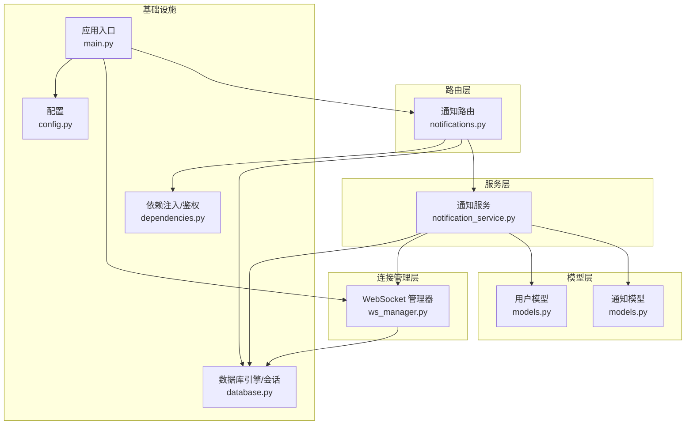
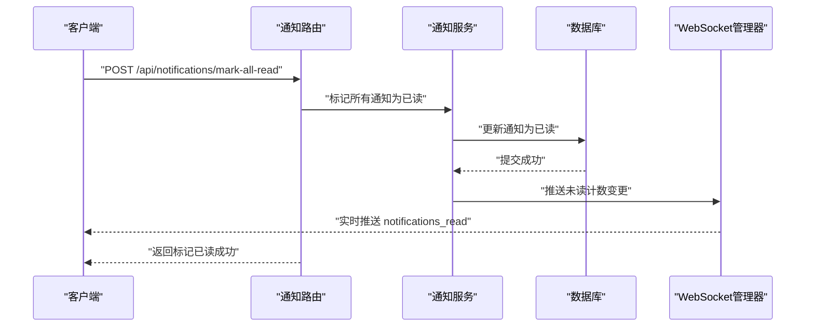
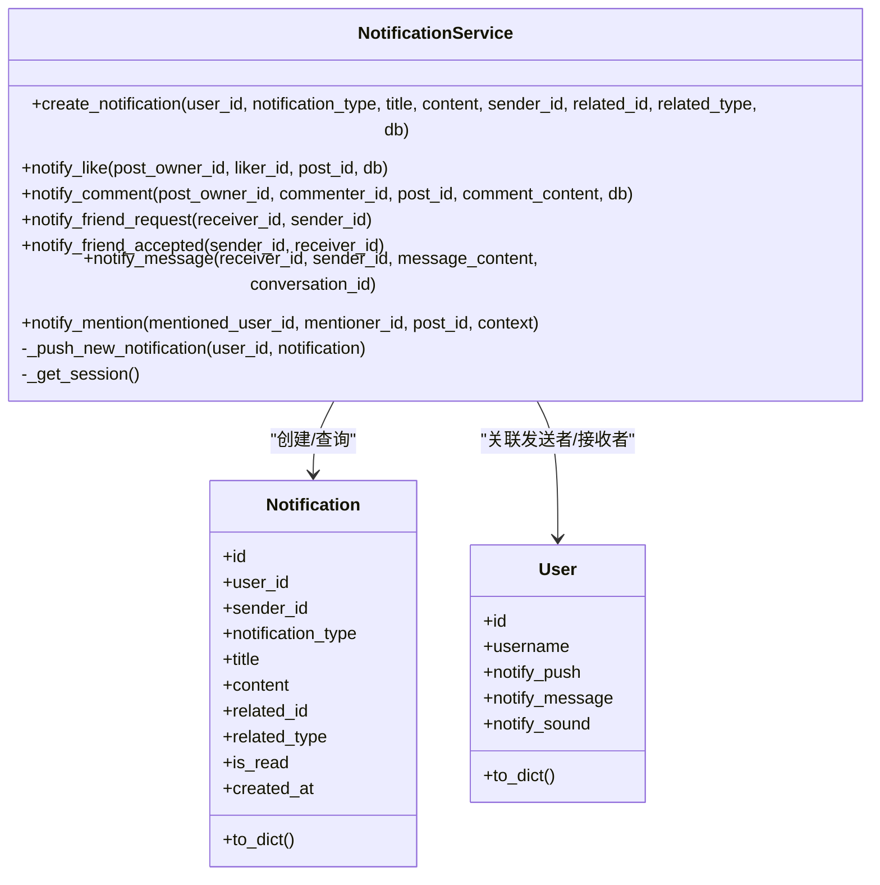
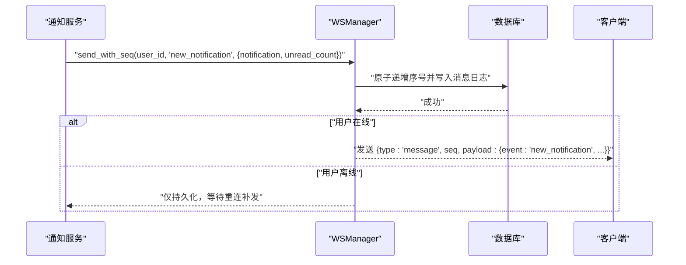
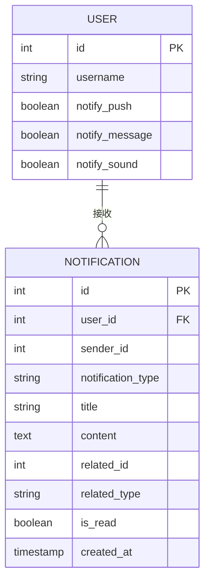
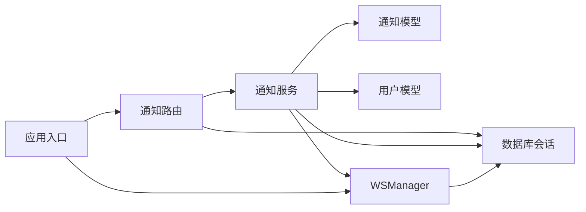

# 通知服务系统

<cite>
**本文档引用的文件**
- [notification_service.py](file://app/services/notification_service.py)
- [notifications.py](file://app/routers/notifications.py)
- [models.py](file://app/models/models.py)
- [ws_manager.py](file://app/ws_manager.py)
- [main.py](file://app/main.py)
- [database.py](file://app/database.py)
- [dependencies.py](file://app/dependencies.py)
- [config.py](file://app/core/config.py)
- [websocket_api.json](file://websocket_api.json)
- [openapi.json](file://openapi.json)
- [mention_service.py](file://app/services/mention_service.py)
- [friends.py](file://app/routers/friends.py)
</cite>

## 目录
1. [简介](#简介)
2. [项目结构](#项目结构)
3. [核心组件](#核心组件)
4. [架构总览](#架构总览)
5. [详细组件分析](#详细组件分析)
6. [依赖分析](#依赖分析)
7. [性能考虑](#性能考虑)
8. [故障排查指南](#故障排查指南)
9. [结论](#结论)
10. [附录](#附录)

## 简介
本文件面向NanTuPy通知服务系统，全面阐述通知生成、分发与管理的完整流程，覆盖系统通知、社交互动通知与消息提醒三类场景；文档化通知模板系统、多渠道推送与个性化配置；提供通知状态跟踪、已读标记与历史记录的实现细节；包含性能优化策略、队列管理与错误处理机制，并给出API接口设计、扩展开发与监控调试方案。

## 项目结构
通知服务位于应用的分层架构中，采用“路由-服务-模型-连接管理”的清晰分层：
- 路由层：提供REST接口，负责参数解析、鉴权与响应封装
- 服务层：封装业务逻辑，负责通知创建、类型化触发与推送
- 模型层：定义通知与用户等数据结构，提供序列化方法
- 连接管理层：维护WebSocket连接，提供有序消息投递与断线补发



图表来源
- [notifications.py:1-208](file://app/routers/notifications.py#L1-L208)
- [notification_service.py:14-233](file://app/services/notification_service.py#L14-L233)
- [models.py:359-390](file://app/models/models.py#L359-L390)
- [ws_manager.py:20-308](file://app/ws_manager.py#L20-L308)
- [database.py:1-38](file://app/database.py#L1-L38)
- [dependencies.py:16-63](file://app/dependencies.py#L16-L63)
- [main.py:13-110](file://app/main.py#L13-L110)
- [config.py:7-43](file://app/core/config.py#L7-L43)

章节来源
- [main.py:13-110](file://app/main.py#L13-L110)
- [dependencies.py:16-63](file://app/dependencies.py#L16-L63)
- [database.py:1-38](file://app/database.py#L1-L38)
- [config.py:7-43](file://app/core/config.py#L7-L43)

## 核心组件
- 通知服务（NotificationService）：集中处理通知创建与各类触发场景（点赞、评论、好友请求/接受、消息、@提及），并负责通过WebSocket实时推送
- 通知路由（notifications.py）：提供REST接口，支持分页查询、未读统计、单条/全部标记已读、删除与清空、以及通知偏好设置的读取与更新
- 通知模型（Notification）：持久化通知元数据，包含类型、标题、内容、关联ID与类型、已读状态与时间戳
- WebSocket管理器（WSManager）：维护用户连接、分配消息序号、持久化消息日志、断线补发与ACK去重
- 用户模型（User）：包含通知偏好的字段，用于控制推送、消息与声音等偏好
- 数据库与依赖：统一的数据库引擎与会话管理，JWT鉴权依赖注入

章节来源
- [notification_service.py:14-233](file://app/services/notification_service.py#L14-L233)
- [notifications.py:15-208](file://app/routers/notifications.py#L15-L208)
- [models.py:359-390](file://app/models/models.py#L359-L390)
- [ws_manager.py:20-308](file://app/ws_manager.py#L20-L308)
- [models.py:42-98](file://app/models/models.py#L42-L98)

## 架构总览
通知系统采用“事件驱动 + 实时推送”的架构：
- 业务事件触发：如点赞、评论、好友操作、消息到达、@提及
- 通知服务创建通知：写入数据库并构造推送负载
- WebSocket管理器分配序号并投递：在线用户即时收到，离线用户持久化等待重连补发
- 路由层提供REST接口：查询、标记已读、删除、清空与偏好设置



图表来源
- [notifications.py:98-120](file://app/routers/notifications.py#L98-L120)
- [notification_service.py:78-85](file://app/services/notification_service.py#L78-L85)
- [ws_manager.py:74-106](file://app/ws_manager.py#L74-L106)

## 详细组件分析

### 通知服务（NotificationService）
职责与特性：
- 统一创建通知：封装创建流程，确保事务性与异常回滚
- 类型化触发：针对点赞、评论、好友请求/接受、消息、@提及分别生成标题与内容
- 实时推送：通过WebSocket向接收用户推送“new_notification”事件，并附带未读计数
- 异步推送：在运行时循环不可用时，使用异步运行器兜底



图表来源
- [notification_service.py:14-233](file://app/services/notification_service.py#L14-L233)
- [models.py:359-390](file://app/models/models.py#L359-L390)
- [models.py:42-98](file://app/models/models.py#L42-L98)

章节来源
- [notification_service.py:14-233](file://app/services/notification_service.py#L14-L233)

### 通知路由（notifications.py）
功能点：
- 列表查询：支持分页、按未读过滤、按创建时间倒序
- 未读统计：快速获取当前用户未读通知数量
- 标记已读：单条与全部标记，完成后通过WebSocket推送未读计数
- 删除与清空：单条删除与全部清空
- 偏好设置：读取与更新通知偏好（推送、消息、声音）

```mermaid
flowchart TD
Start(["进入路由"]) --> CheckAuth["鉴权：获取当前用户"]
CheckAuth --> Choice{"请求类型？"}
Choice --> |GET /| List["查询通知列表<br/>分页/未读过滤/排序"]
Choice --> |GET /unread-count| Unread["计算未读数量"]
Choice --> |POST /{id}/read| MarkOne["标记单条为已读<br/>推送未读计数"]
Choice --> |POST /mark-all-read| MarkAll["标记全部为已读<br/>推送未读计数"]
Choice --> |DELETE /{id}| DeleteOne["删除单条"]
Choice --> |DELETE /clear-all| ClearAll["清空全部"]
Choice --> |GET /settings| GetSettings["读取通知偏好"]
Choice --> |PUT /settings| UpdateSettings["更新通知偏好"]
List --> End(["返回JSON"])
Unread --> End
MarkOne --> End
MarkAll --> End
DeleteOne --> End
ClearAll --> End
GetSettings --> End
UpdateSettings --> End
```

图表来源
- [notifications.py:15-208](file://app/routers/notifications.py#L15-L208)

章节来源
- [notifications.py:15-208](file://app/routers/notifications.py#L15-L208)

### WebSocket管理器（WSManager）
能力：
- 连接管理：注册/断开连接、在线用户查询、会话房间广播
- 序号系统：为每用户分配单调递增序号，持久化消息日志，支持断线补发
- ACK去重：基于clientMsgId的幂等处理与24小时清理
- 错误推送：向指定用户推送错误消息



图表来源
- [notification_service.py:20-53](file://app/services/notification_service.py#L20-L53)
- [ws_manager.py:74-106](file://app/ws_manager.py#L74-L106)
- [ws_manager.py:170-213](file://app/ws_manager.py#L170-L213)

章节来源
- [ws_manager.py:20-308](file://app/ws_manager.py#L20-L308)

### 通知模型与用户偏好
- 通知模型（Notification）：包含类型枚举（like/comment/friend_request/friend_accept/message/mention）、标题、内容、关联ID与类型、已读标志与时间戳
- 用户模型（User）：包含通知偏好字段（推送、消息、声音），路由层直接读取与更新



图表来源
- [models.py:42-98](file://app/models/models.py#L42-L98)
- [models.py:359-390](file://app/models/models.py#L359-L390)

章节来源
- [models.py:42-98](file://app/models/models.py#L42-L98)
- [models.py:359-390](file://app/models/models.py#L359-L390)

### 触发场景与处理逻辑
- 点赞通知：当他人点赞自己的帖子时，生成“like”类型通知
- 评论通知：当他人评论自己的帖子时，生成“comment”类型通知，内容含预览
- 好友请求/接受通知：分别生成“friend_request”与“friend_accept”，后者携带跳转信息
- 消息通知：当收到私信时，生成“message”类型通知，内容含预览
- @提及通知：在内容中发现@某用户时，生成“mention”类型通知，内容含上下文片段

章节来源
- [notification_service.py:87-112](file://app/services/notification_service.py#L87-L112)
- [notification_service.py:115-141](file://app/services/notification_service.py#L115-L141)
- [notification_service.py:144-184](file://app/services/notification_service.py#L144-L184)
- [notification_service.py:187-209](file://app/services/notification_service.py#L187-L209)
- [notification_service.py:212-233](file://app/services/notification_service.py#L212-L233)

### 通知模板系统
- 标题与内容模板：根据触发事件动态拼装标题与内容，如“用户名 赞了你的帖子”、“用户名 评论了你的帖子”等
- 上下文截断：对长内容进行截断并追加省略号，保证展示友好
- 关联信息：保存related_id与related_type，便于前端跳转到具体资源（帖子、会话等）

章节来源
- [notification_service.py:97-98](file://app/services/notification_service.py#L97-L98)
- [notification_service.py:125-127](file://app/services/notification_service.py#L125-L127)
- [notification_service.py:150-151](file://app/services/notification_service.py#L150-L151)
- [notification_service.py:171-172](file://app/services/notification_service.py#L171-L172)
- [notification_service.py:195-197](file://app/services/notification_service.py#L195-L197)
- [notification_service.py:220-221](file://app/services/notification_service.py#L220-L221)

### 多渠道推送与个性化配置
- WebSocket实时推送：通过WSManager的序号系统与断线补发机制，确保消息可靠送达
- 偏好设置：用户可控制是否接收推送、消息与声音提示，路由层提供读取与更新接口
- 扩展点：可在通知服务中增加新的类型与模板，或在WS层扩展消息格式

章节来源
- [ws_manager.py:74-106](file://app/ws_manager.py#L74-L106)
- [notifications.py:159-207](file://app/routers/notifications.py#L159-L207)
- [models.py:65-68](file://app/models/models.py#L65-L68)

### 通知状态跟踪、已读标记与历史记录
- 已读标记：支持单条与全部标记，完成后通过WebSocket推送未读计数变更
- 历史记录：通知作为持久化实体，支持分页查询与删除/清空
- 未读统计：提供独立接口快速获取未读数量

章节来源
- [notifications.py:64-120](file://app/routers/notifications.py#L64-L120)
- [notifications.py:15-47](file://app/routers/notifications.py#L15-L47)

### API接口设计
- 列表查询：GET /api/notifications/
- 未读统计：GET /api/notifications/unread-count
- 标记已读：POST /api/notifications/{notification_id}/read
- 全部已读：POST /api/notifications/mark-all-read
- 删除通知：DELETE /api/notifications/{notification_id}
- 清空通知：DELETE /api/notifications/clear-all
- 获取偏好：GET /api/notifications/settings
- 更新偏好：PUT /api/notifications/settings

章节来源
- [openapi.json:2232-2440](file://openapi.json#L2232-L2440)
- [websocket_api.json:481-510](file://websocket_api.json#L481-L510)

## 依赖分析
- 路由依赖服务：通知路由依赖通知服务执行业务逻辑
- 服务依赖模型与连接：通知服务依赖通知与用户模型，以及数据库会话
- 服务依赖连接管理：通知服务通过WSManager进行实时推送
- 应用入口注册：主程序注册通知路由与WebSocket端点



图表来源
- [notifications.py:15-208](file://app/routers/notifications.py#L15-L208)
- [notification_service.py:14-233](file://app/services/notification_service.py#L14-L233)
- [ws_manager.py:20-308](file://app/ws_manager.py#L20-L308)
- [main.py:68-84](file://app/main.py#L68-L84)

章节来源
- [main.py:68-84](file://app/main.py#L68-L84)

## 性能考虑
- 数据库连接池：通过配置项设置池大小、溢出与回收策略，减少连接开销
- 事务与回滚：在通知创建与标记已读等关键路径上使用try/except与回滚，避免脏数据
- 异步推送：在事件循环不可用时使用异步运行器兜底，降低阻塞风险
- 序号与持久化：WSManager的序号系统与消息日志确保可靠性，同时限制补发数量以控制查询压力
- 分页与索引：通知列表查询使用分页与索引，避免大结果集扫描

章节来源
- [config.py:12-21](file://app/core/config.py#L12-L21)
- [database.py:9-19](file://app/database.py#L9-L19)
- [notification_service.py:78-85](file://app/services/notification_service.py#L78-L85)
- [notifications.py:24-47](file://app/routers/notifications.py#L24-L47)
- [ws_manager.py:170-213](file://app/ws_manager.py#L170-L213)

## 故障排查指南
- WebSocket推送失败：检查WSManager连接状态与发送日志，确认用户是否在线
- 未读计数异常：核对标记已读后的推送逻辑与数据库更新
- 通知创建失败：查看服务层异常回滚与日志输出
- 偏好设置无效：确认路由层读取与更新逻辑，检查数据库提交

章节来源
- [ws_manager.py:107-117](file://app/ws_manager.py#L107-L117)
- [notification_service.py:40-53](file://app/services/notification_service.py#L40-L53)
- [notifications.py:77-95](file://app/routers/notifications.py#L77-L95)

## 结论
NanTuPy通知服务系统以清晰的分层架构实现了通知的生成、持久化与实时推送，结合用户偏好与断线补发机制，提供了可靠的用户体验。通过REST接口与WebSocket通道的协同，系统能够高效处理多种通知场景，并具备良好的扩展性与可维护性。

## 附录
- 扩展开发建议：
  - 新增通知类型：在通知服务中添加对应触发方法，完善标题与内容模板
  - 多渠道推送：可在WS层扩展消息格式或引入外部推送服务
  - 监控与告警：在关键路径埋点与日志采集，结合未读计数与推送成功率指标
- 测试参考：
  - 使用测试脚本验证通知列表、未读统计、标记已读与偏好设置等流程