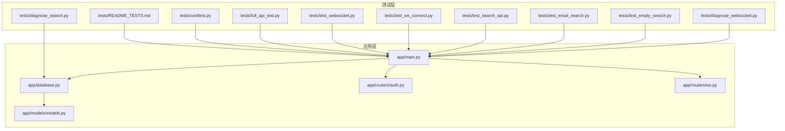
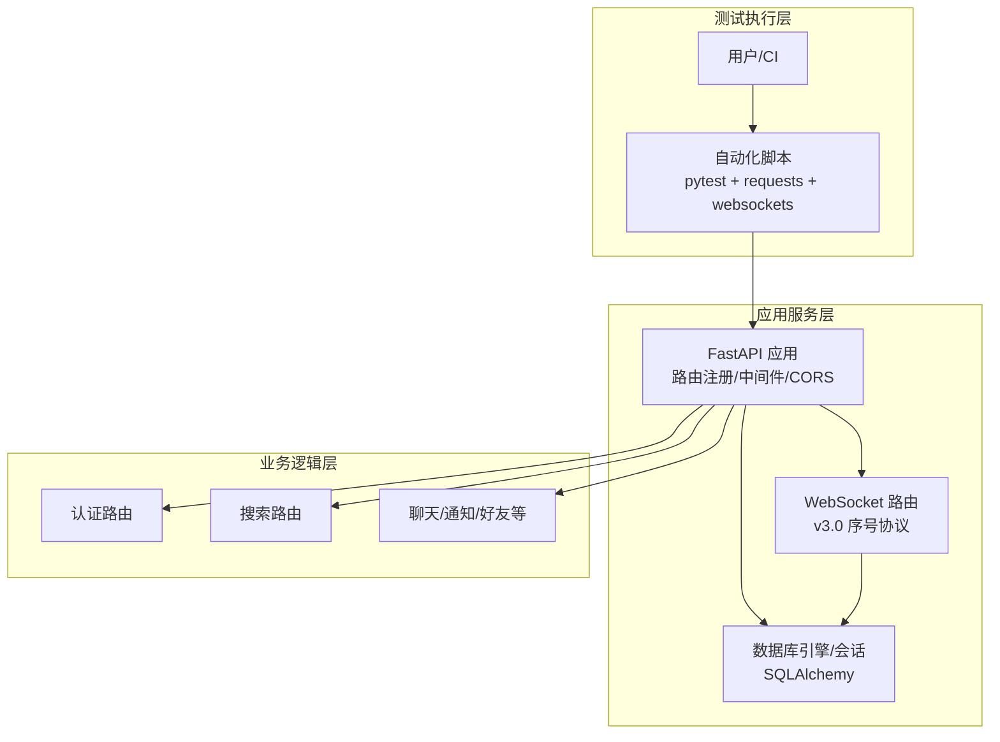
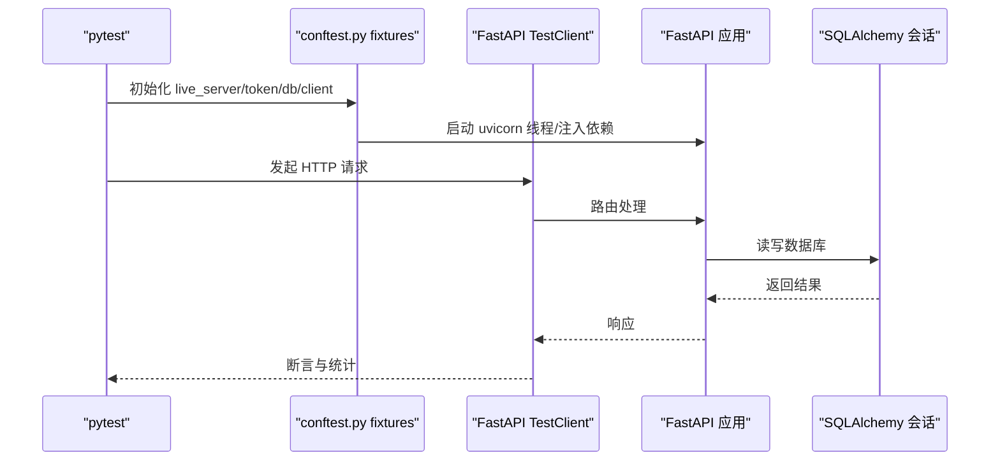
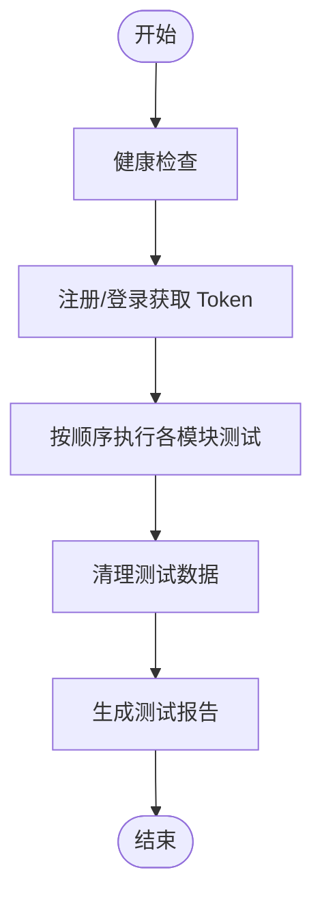
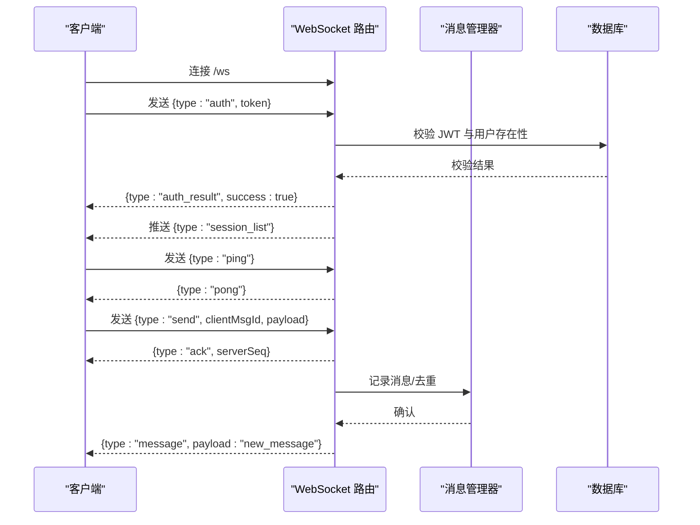
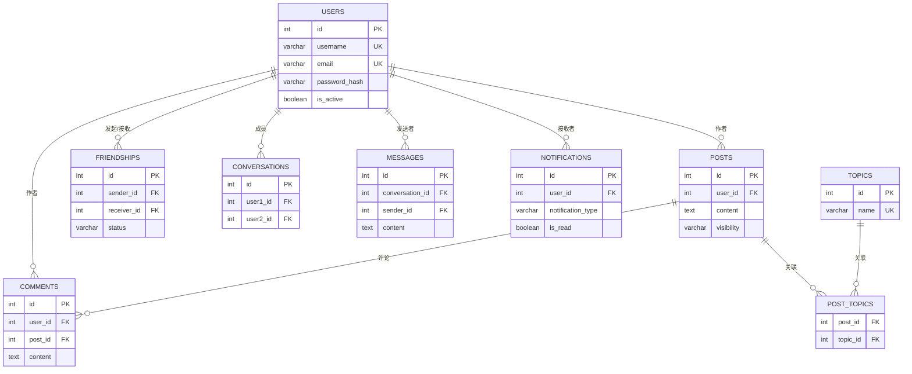
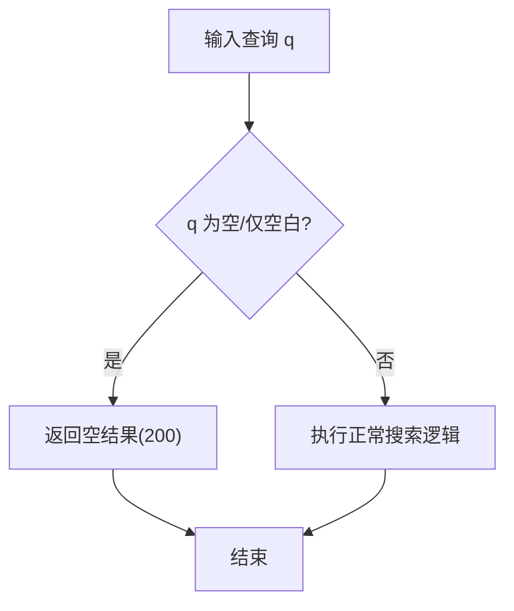
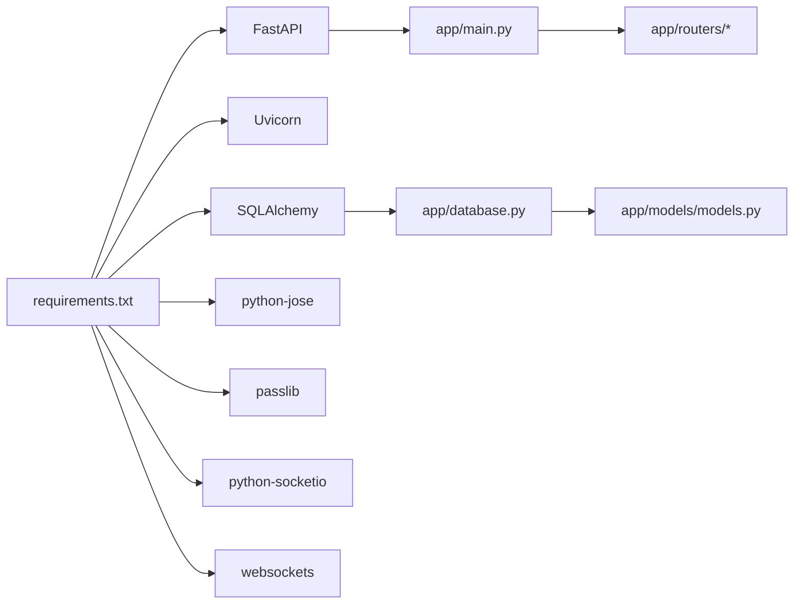

# 测试策略

<cite>
**本文引用的文件**
- [README_TESTS.md](file://tests/README_TESTS.md)
- [conftest.py](file://tests/conftest.py)
- [full_api_test.py](file://tests/full_api_test.py)
- [test_websocket.py](file://tests/test_websocket.py)
- [test_ws_connect.py](file://tests/test_ws_connect.py)
- [test_search_api.py](file://tests/test_search_api.py)
- [test_email_search.py](file://tests/test_email_search.py)
- [test_empty_search.py](file://tests/test_empty_search.py)
- [diagnose_search.py](file://tests/diagnose_search.py)
- [diagnose_websocket.py](file://tests/diagnose_websocket.py)
- [requirements.txt](file://requirements.txt)
- [main.py](file://app/main.py)
- [database.py](file://app/database.py)
- [auth.py](file://app/routers/auth.py)
- [ws.py](file://app/routers/ws.py)
- [models.py](file://app/models/models.py)
</cite>

## 目录
1. [引言](#引言)
2. [项目结构](#项目结构)
3. [核心组件](#核心组件)
4. [架构总览](#架构总览)
5. [详细组件分析](#详细组件分析)
6. [依赖分析](#依赖分析)
7. [性能考量](#性能考量)
8. [故障排除指南](#故障排除指南)
9. [结论](#结论)
10. [附录](#附录)

## 引言
本测试策略文档面向 NanTuPy 项目，旨在建立一套系统化的测试体系，覆盖单元测试、集成测试、API 测试、WebSocket 测试、数据库测试与端到端测试。文档明确测试框架与工具、测试环境配置、测试数据管理、测试用例设计方法、覆盖率与质量标准、自动化流程与持续集成建议、测试报告与最佳实践，并提供调试技巧与常见问题排查方案，确保代码质量与系统稳定性。

## 项目结构
NanTuPy 采用 FastAPI + SQLAlchemy 的后端架构，测试目录 tests 下包含多种测试脚本与诊断工具，覆盖认证、帖子、互动、好友、聊天、通知、搜索、话题、上传、推荐、屏蔽、举报、漫画、健康检查、WebSocket 等模块；应用入口与路由集中在 app 目录，数据库与模型位于 app/database.py 与 app/models/models.py。

图示来源
- [main.py:1-110](file://app/main.py#L1-L110)
- [database.py:1-38](file://app/database.py#L1-L38)
- [auth.py:1-486](file://app/routers/auth.py#L1-L486)
- [ws.py:1-546](file://app/routers/ws.py#L1-L546)
- [models.py:1-655](file://app/models/models.py#L1-L655)
- [README_TESTS.md:1-189](file://tests/README_TESTS.md#L1-L189)
- [conftest.py:1-155](file://tests/conftest.py#L1-L155)
- [full_api_test.py:1-730](file://tests/full_api_test.py#L1-L730)
- [test_websocket.py:1-203](file://tests/test_websocket.py#L1-L203)
- [test_ws_connect.py:1-319](file://tests/test_ws_connect.py#L1-L319)
- [test_search_api.py:1-457](file://tests/test_search_api.py#L1-L457)
- [test_email_search.py:1-104](file://tests/test_email_search.py#L1-L104)
- [test_empty_search.py:1-196](file://tests/test_empty_search.py#L1-L196)
- [diagnose_search.py:1-84](file://tests/diagnose_search.py#L1-L84)
- [diagnose_websocket.py:1-239](file://tests/diagnose_websocket.py#L1-L239)

章节来源
- [README_TESTS.md:1-189](file://tests/README_TESTS.md#L1-L189)
- [main.py:1-110](file://app/main.py#L1-L110)

## 核心组件
- 测试框架与工具
  - requests：HTTP 接口测试
  - websockets：WebSocket 协议测试
  - python-socketio：Socket.IO 客户端测试
  - fastapi.testclient：FastAPI TestClient
  - pytest：会话级 fixture 管理
- 测试环境
  - 本地开发服务器：uvicorn（conftest.py 启动后台线程）
  - 数据库：SQLAlchemy 引擎 + SessionLocal（支持池化与预 ping）
  - CORS 与安全头：统一配置，便于跨域与前端联调
- 测试夹具（Fixtures）
  - fastapi_app、live_server、token、client、db、image_url、search_query
  - 自动注册/登录测试用户，提供 JWT 访问令牌
- 测试数据
  - 自动创建测试用户与资源，测试结束后清理
  - 搜索测试包含测试帖子与标签，支持空查询场景

章节来源
- [conftest.py:1-155](file://tests/conftest.py#L1-L155)
- [requirements.txt:1-15](file://requirements.txt#L1-L15)
- [database.py:1-38](file://app/database.py#L1-L38)
- [main.py:1-110](file://app/main.py#L1-L110)

## 架构总览
测试策略围绕“接口层 + 业务层 + 数据层”三层展开，结合同步 HTTP 与异步 WebSocket，形成端到端闭环。

图示来源
- [main.py:1-110](file://app/main.py#L1-L110)
- [ws.py:1-546](file://app/routers/ws.py#L1-L546)
- [database.py:1-38](file://app/database.py#L1-L38)

## 详细组件分析

### 单元测试与集成测试设计
- 单元测试
  - 使用 FastAPI TestClient 与 pytest fixture，针对路由层进行独立校验
  - 通过 conftest.py 提供 live_server、token、db、client 等共享资源
  - 针对认证、搜索、上传等模块编写独立测试函数，便于定位问题
- 集成测试
  - 通过 TestClient 直连应用，绕过网络层，提升速度与可控性
  - 结合数据库 fixture，验证 ORM 操作与事务回滚行为

图示来源
- [conftest.py:23-60](file://tests/conftest.py#L23-L60)
- [conftest.py:110-125](file://tests/conftest.py#L110-L125)
- [main.py:1-110](file://app/main.py#L1-L110)

章节来源
- [conftest.py:1-155](file://tests/conftest.py#L1-L155)
- [main.py:1-110](file://app/main.py#L1-L110)

### API 测试规范
- 覆盖范围
  - 健康检查、认证、帖子、互动、好友、聊天、通知、搜索、话题、上传、推荐、屏蔽、举报、漫画、管理员、WebSocket
- 测试流程
  - 健康检查与服务器可达性
  - 注册/登录获取 token
  - 逐模块调用，记录状态码与响应体
  - 清理测试数据（删除评论、帖子、话题、通知、会话等）
- 报告与统计
  - 统计总数、通过数、失败数、错误数、跳过数与通过率

图示来源
- [full_api_test.py:688-730](file://tests/full_api_test.py#L688-L730)

章节来源
- [README_TESTS.md:1-189](file://tests/README_TESTS.md#L1-L189)
- [full_api_test.py:1-730](file://tests/full_api_test.py#L1-L730)

### WebSocket 测试
- 连接与认证
  - 通过 URL query 参数携带 token 进行认证
  - 收到 connected/pong 消息表示握手成功
- 序号协议与幂等
  - auth -> ping/pong -> session_list -> sync -> send/ack -> 无效 token
  - 幂等去重：相同 clientMsgId 返回 duplicate 标识
- 诊断工具
  - diagnose_websocket.py：服务器运行、端口监听、WebSocket 端点、Socket.IO 连接检查
  - test_websocket.py：基于 socketio 客户端的连接与事件监听

图示来源
- [ws.py:442-546](file://app/routers/ws.py#L442-L546)
- [test_ws_connect.py:33-176](file://tests/test_ws_connect.py#L33-L176)

章节来源
- [test_websocket.py:1-203](file://tests/test_websocket.py#L1-L203)
- [test_ws_connect.py:1-319](file://tests/test_ws_connect.py#L1-L319)
- [diagnose_websocket.py:1-239](file://tests/diagnose_websocket.py#L1-L239)
- [ws.py:1-546](file://app/routers/ws.py#L1-L546)

### 数据库测试与数据管理
- 数据库配置
  - SQLAlchemy 2.0+ 同步引擎 + SessionLocal，启用池化与 pre_ping
  - init_db() 创建所有表
- 测试数据
  - 自动注册测试用户，避免冲突
  - 搜索测试创建测试帖子与标签
  - 诊断脚本支持检查用户激活状态与 LIKE 查询匹配
- 清理策略
  - 测试完成后删除评论、帖子、话题、通知、会话等

图示来源
- [models.py:1-655](file://app/models/models.py#L1-L655)
- [database.py:1-38](file://app/database.py#L1-L38)

章节来源
- [database.py:1-38](file://app/database.py#L1-L38)
- [models.py:1-655](file://app/models/models.py#L1-L655)
- [diagnose_search.py:1-84](file://tests/diagnose_search.py#L1-L84)

### 搜索测试与边界条件
- 功能测试
  - 用户搜索、帖子搜索、全局搜索、标签搜索、热门标签、用户/提及建议、搜索历史
- 边界测试
  - 空查询返回空结果而非 400
  - 邮箱搜索支持完整邮箱、部分用户名、包含 @ 的片段等
- 诊断工具
  - diagnose_search.py：检查 LIKE 匹配与非激活用户影响

图示来源
- [test_empty_search.py:24-161](file://tests/test_empty_search.py#L24-L161)
- [test_email_search.py:24-66](file://tests/test_email_search.py#L24-L66)

章节来源
- [test_search_api.py:1-457](file://tests/test_search_api.py#L1-L457)
- [test_empty_search.py:1-196](file://tests/test_empty_search.py#L1-L196)
- [test_email_search.py:1-104](file://tests/test_email_search.py#L1-L104)
- [diagnose_search.py:1-84](file://tests/diagnose_search.py#L1-L84)

### 端到端测试方法
- 全量 API 测试
  - 顺序执行健康检查、认证、帖子、互动、好友、聊天、通知、搜索、话题、上传、推荐、屏蔽、举报、漫画、管理员、WebSocket、清理
- 端到端链路
  - 服务器启动 -> 注册/登录 -> 业务操作 -> WebSocket 交互 -> 数据清理 -> 报告输出

章节来源
- [full_api_test.py:688-730](file://tests/full_api_test.py#L688-L730)

## 依赖分析
- 外部依赖
  - FastAPI、Uvicorn、SQLAlchemy、PyMySQL、python-jose、passlib、Pillow、python-socketio、websockets 等
- 内部依赖
  - app.main 负责路由注册与中间件
  - app.database 提供引擎与会话
  - app.routers.* 实现业务路由
  - app.models.* 定义数据模型
- 测试依赖
  - conftest.py 提供 live_server、token、db、client 等 fixture
  - requirements.txt 约束版本

图示来源
- [requirements.txt:1-15](file://requirements.txt#L1-L15)
- [main.py:1-110](file://app/main.py#L1-L110)
- [database.py:1-38](file://app/database.py#L1-L38)
- [models.py:1-655](file://app/models/models.py#L1-L655)

章节来源
- [requirements.txt:1-15](file://requirements.txt#L1-L15)
- [main.py:1-110](file://app/main.py#L1-L110)

## 性能考量
- 测试并发与吞吐
  - 使用 TestClient 与同步请求，减少网络开销
  - WebSocket 测试采用 asyncio，避免阻塞
- 数据库性能
  - 连接池与 pre_ping 降低连接抖动
  - 事务回滚避免脏数据
- 资源管理
  - daemon 线程启动服务器，测试结束后随主进程退出
  - 自动清理测试数据，避免数据库膨胀

## 故障排除指南
- 服务器与网络
  - 服务器未启动：检查 uvicorn 进程与端口占用
  - 端口未监听：检查防火墙与绑定地址
  - WebSocket 端点不可达：确认路由与中间件配置
- 认证与权限
  - Token 无效：重新注册/登录获取新 Token
  - 403/401：确认权限与隐私设置
- 数据库问题
  - 用户不存在/非激活：使用 diagnose_search.py 检查 LIKE 匹配与激活状态
- WebSocket 连接
  - 无法连接：使用 diagnose_websocket.py 逐步排查
  - 连接后断开：检查服务端日志与异常捕获

章节来源
- [diagnose_websocket.py:1-239](file://tests/diagnose_websocket.py#L1-L239)
- [diagnose_search.py:1-84](file://tests/diagnose_search.py#L1-L84)
- [ws.py:442-546](file://app/routers/ws.py#L442-L546)

## 结论
本测试策略通过“接口层 + 业务层 + 数据层”的分层测试，结合 HTTP 与 WebSocket 的端到端验证，辅以诊断工具与自动清理机制，能够有效保障 NanTuPy 的功能正确性与系统稳定性。建议在 CI 中集成 pytest 与全量 API 测试，设定覆盖率阈值与质量门禁，持续优化测试用例与报告。

## 附录
- 测试工具与版本
  - FastAPI、Uvicorn、SQLAlchemy、PyMySQL、python-jose、passlib、Pillow、python-socketio、websockets
- 测试环境配置要点
  - CORS 与安全头配置
  - 数据库连接池与预热
  - WebSocket 序号与去重机制
- 质量标准与覆盖率
  - 建议通过率 ≥ 95%，关键路径与异常分支覆盖 ≥ 90%
  - 对认证、搜索、WebSocket、上传等核心模块进行重点覆盖