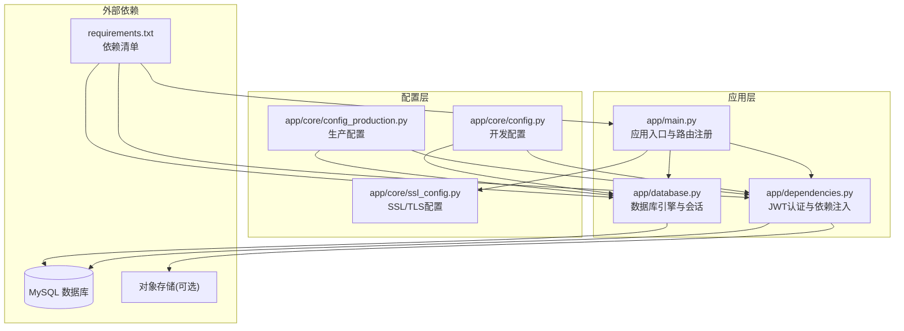
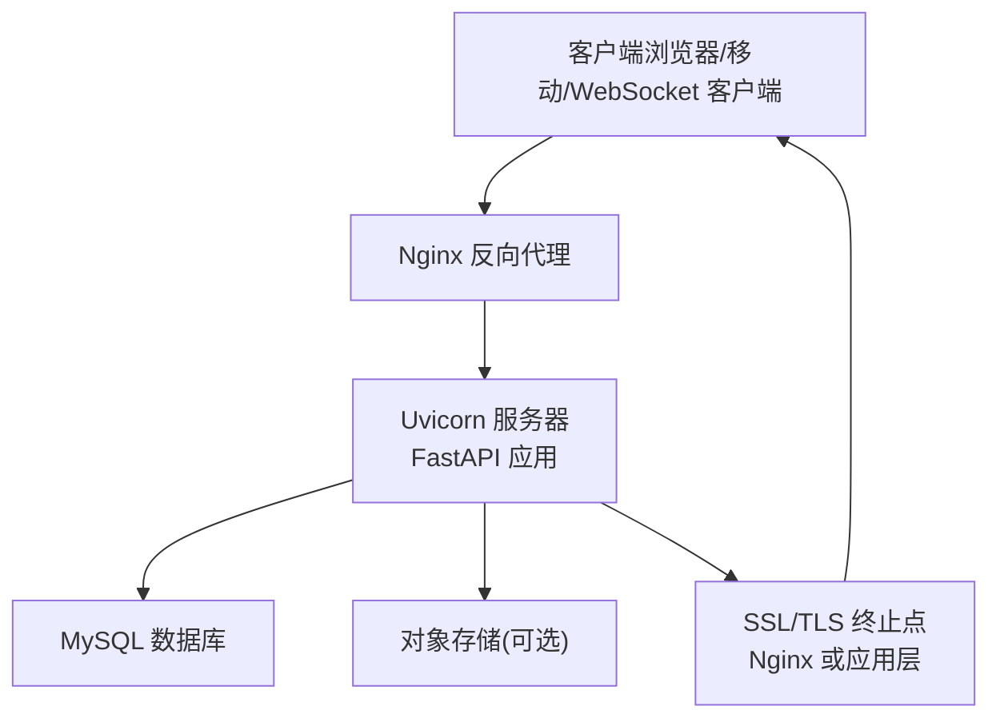
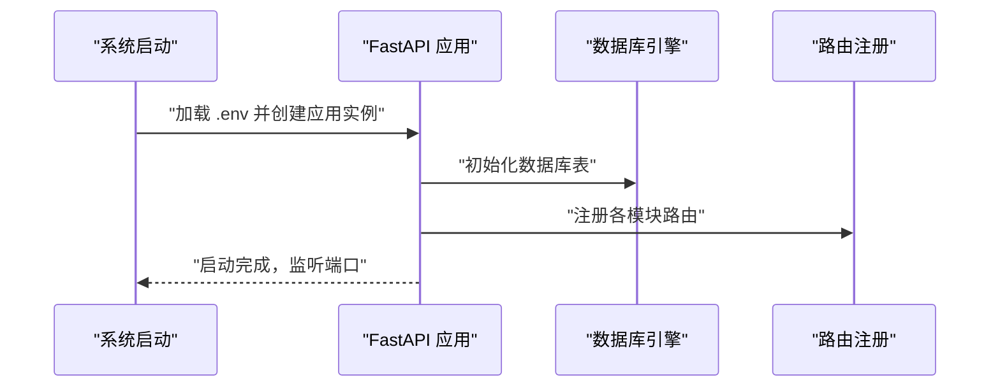
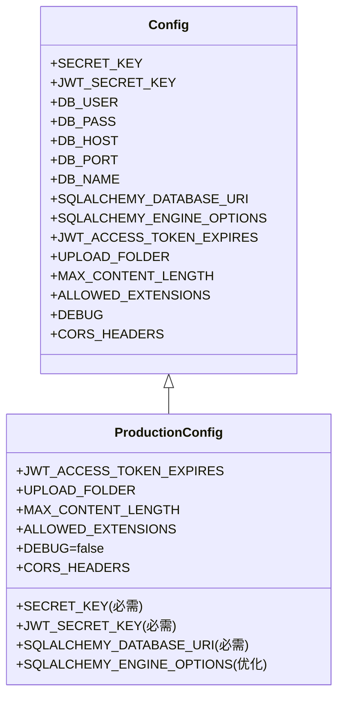
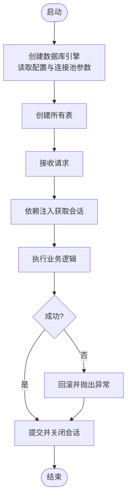
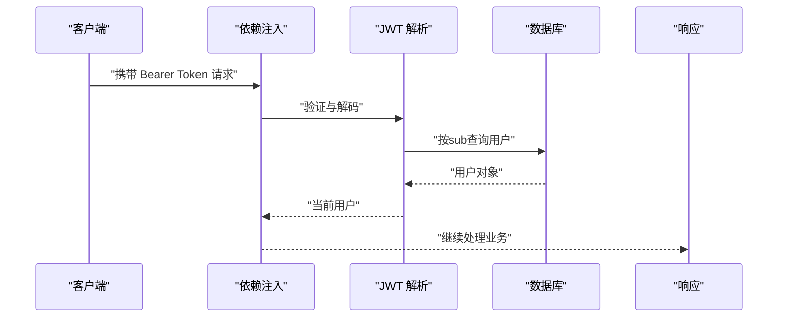
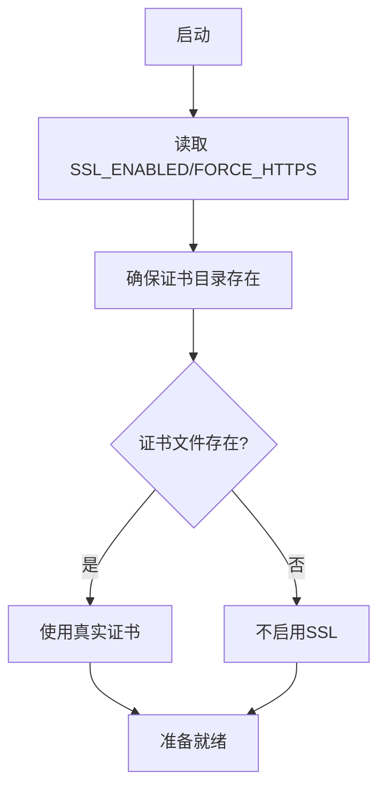
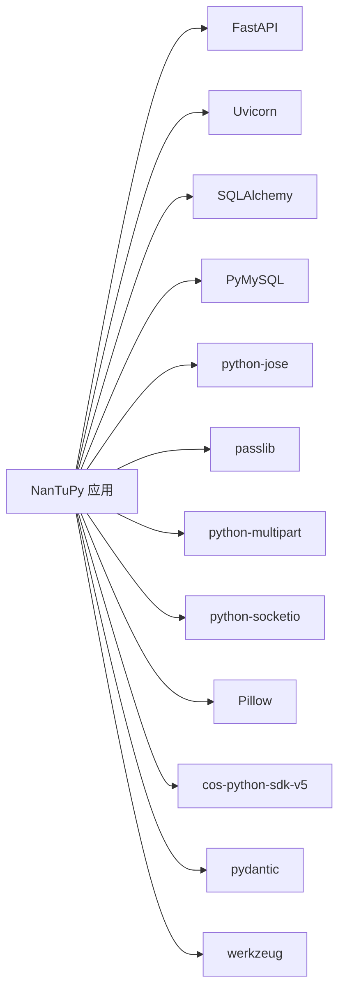

# 部署配置

<cite>
**本文引用的文件**
- [app/main.py](file://app/main.py)
- [app/core/config.py](file://app/core/config.py)
- [app/core/config_production.py](file://app/core/config_production.py)
- [app/core/ssl_config.py](file://app/core/ssl_config.py)
- [app/database.py](file://app/database.py)
- [app/dependencies.py](file://app/dependencies.py)
- [requirements.txt](file://requirements.txt)
- [migrations/add_ws_protocol_tables.sql](file://migrations/add_ws_protocol_tables.sql)
</cite>

## 目录
1. [简介](#简介)
2. [项目结构](#项目结构)
3. [核心组件](#核心组件)
4. [架构总览](#架构总览)
5. [详细组件分析](#详细组件分析)
6. [依赖分析](#依赖分析)
7. [性能考虑](#性能考虑)
8. [故障排查指南](#故障排查指南)
9. [结论](#结论)
10. [附录](#附录)

## 简介
本指南面向NanTuPy项目的生产部署，覆盖生产环境配置、Docker容器化部署、反向代理与Nginx配置、SSL证书与HTTPS强制跳转、安全加固、环境变量与敏感信息保护、日志与监控、性能调优、负载均衡与容器编排、备份与灾备以及常见部署问题诊断与解决。文档中的实现细节均基于仓库现有源码与配置文件进行归纳总结。

## 项目结构
NanTuPy采用FastAPI框架，核心入口位于应用入口模块，配置分为开发与生产两套，数据库连接通过SQLAlchemy配置，依赖注入与JWT认证在独立模块中实现；另有WebSocket相关的协议表结构迁移脚本。

图表来源
- [app/main.py:1-110](file://app/main.py#L1-L110)
- [app/database.py:1-38](file://app/database.py#L1-L38)
- [app/dependencies.py:1-63](file://app/dependencies.py#L1-L63)
- [app/core/config.py:1-43](file://app/core/config.py#L1-L43)
- [app/core/config_production.py:1-49](file://app/core/config_production.py#L1-L49)
- [app/core/ssl_config.py:1-32](file://app/core/ssl_config.py#L1-L32)
- [requirements.txt:1-15](file://requirements.txt#L1-L15)

章节来源
- [app/main.py:1-110](file://app/main.py#L1-L110)
- [app/database.py:1-38](file://app/database.py#L1-L38)
- [app/dependencies.py:1-63](file://app/dependencies.py#L1-L63)
- [app/core/config.py:1-43](file://app/core/config.py#L1-L43)
- [app/core/config_production.py:1-49](file://app/core/config_production.py#L1-L49)
- [app/core/ssl_config.py:1-32](file://app/core/ssl_config.py#L1-L32)
- [requirements.txt:1-15](file://requirements.txt#L1-L15)

## 核心组件
- 应用入口与生命周期：应用启动时初始化数据库表，注册路由与中间件，提供健康检查端点。
- 配置体系：开发与生产两套配置类，分别定义数据库连接、JWT密钥、文件上传限制、CORS与调试开关等。
- 数据库与会话：基于SQLAlchemy同步引擎与Session，支持连接池参数与自动回滚/提交。
- 认证与授权：基于HTTP Bearer Token的JWT解析，提供当前用户与可选用户解析，以及管理员权限校验。
- SSL/TLS：集中式SSL配置类，支持证书目录、证书文件路径、是否启用SSL与强制HTTPS跳转。

章节来源
- [app/main.py:17-109](file://app/main.py#L17-L109)
- [app/core/config.py:7-43](file://app/core/config.py#L7-L43)
- [app/core/config_production.py:4-49](file://app/core/config_production.py#L4-L49)
- [app/database.py:9-38](file://app/database.py#L9-L38)
- [app/dependencies.py:16-63](file://app/dependencies.py#L16-L63)
- [app/core/ssl_config.py:3-32](file://app/core/ssl_config.py#L3-L32)

## 架构总览
下图展示生产部署的关键交互：客户端经Nginx反向代理访问Uvicorn服务，服务通过SQLAlchemy访问MySQL，必要时访问对象存储；SSL由Nginx或应用层处理，取决于部署策略。

图表来源
- [app/main.py:69-84](file://app/main.py#L69-L84)
- [app/database.py:9-16](file://app/database.py#L9-L16)
- [app/core/ssl_config.py:10-14](file://app/core/ssl_config.py#L10-L14)

## 详细组件分析

### 应用入口与生命周期
- 生命周期钩子：应用启动时初始化数据库表，关闭时优雅退出。
- 路由注册：按模块注册认证、内容、社交、通知、搜索、话题、上传、推荐、屏蔽、举报、健康检查、管理与漫画等路由，并注册WebSocket端点。
- 中间件：CORS中间件使用正则允许来源以避免简单请求路径缺陷；添加COOP/COEP安全响应头。
- 日志：同时输出至控制台与文件，便于生产日志采集。

图表来源
- [app/main.py:29-37](file://app/main.py#L29-L37)
- [app/main.py:69-84](file://app/main.py#L69-L84)
- [app/database.py:35-38](file://app/database.py#L35-L38)

章节来源
- [app/main.py:17-109](file://app/main.py#L17-L109)

### 配置体系（开发与生产）
- 开发配置：默认密钥与数据库连接字符串，调试开启，上传目录相对路径，允许的媒体类型集合。
- 生产配置：要求必须提供密钥与数据库URL，连接池参数优化，禁用调试，设置JWT过期时间，上传大小限制与扩展名白名单。
- 共享特性：统一的POSTS_PER_PAGE、CORS头部配置。

图表来源
- [app/core/config.py:7-43](file://app/core/config.py#L7-L43)
- [app/core/config_production.py:4-49](file://app/core/config_production.py#L4-L49)

章节来源
- [app/core/config.py:7-43](file://app/core/config.py#L7-L43)
- [app/core/config_production.py:4-49](file://app/core/config_production.py#L4-L49)

### 数据库与会话
- 引擎创建：从配置读取数据库URI与连接池参数，echo关闭。
- 会话管理：依赖注入函数提供会话，异常时回滚并抛出，最终关闭会话。
- 初始化：创建所有模型对应的表。

图表来源
- [app/database.py:9-38](file://app/database.py#L9-L38)

章节来源
- [app/database.py:9-38](file://app/database.py#L9-L38)

### 认证与授权（JWT）
- 当前用户：从Authorization头解析JWT，解码后查询用户，不存在或过期返回401。
- 可选用户：解析失败返回None，便于匿名场景。
- 管理员校验：非管理员返回403。

图表来源
- [app/dependencies.py:16-36](file://app/dependencies.py#L16-L36)

章节来源
- [app/dependencies.py:16-63](file://app/dependencies.py#L16-L63)

### SSL/TLS与HTTPS
- SSL配置类：集中管理证书目录、证书与私钥文件路径、是否启用SSL与强制HTTPS。
- 证书目录：若不存在则自动创建；生产环境优先使用真实证书文件。
- HTTPS策略：可通过环境变量控制是否启用SSL与是否将HTTP重定向至HTTPS。

图表来源
- [app/core/ssl_config.py:10-31](file://app/core/ssl_config.py#L10-L31)

章节来源
- [app/core/ssl_config.py:3-32](file://app/core/ssl_config.py#L3-L32)

### WebSocket协议表结构
- 表结构：消息日志、用户序列号、去重ACK三张表，含索引与外键约束。
- 清理建议：提供定期清理历史数据的注释SQL，建议纳入运维计划。

章节来源
- [migrations/add_ws_protocol_tables.sql:1-31](file://migrations/add_ws_protocol_tables.sql#L1-L31)

## 依赖分析
- 运行时依赖：FastAPI、Uvicorn、SQLAlchemy、PyMySQL、JWT加密、密码散列、多部分上传、WebSocket、Pillow、对象存储SDK、Pydantic、Werkzeug等。
- 版本约束：明确指定FastAPI、Uvicorn、SQLAlchemy、PyMySQL、Pydantic等版本范围。

图表来源
- [requirements.txt:1-15](file://requirements.txt#L1-L15)

章节来源
- [requirements.txt:1-15](file://requirements.txt#L1-L15)

## 性能考虑
- 连接池参数：生产配置中增大连接池大小、降低溢出数量，提升并发能力；启用pre_ping与recycle增强连接稳定性。
- 上传限制：限制最大内容长度与允许的媒体类型，避免资源滥用。
- 缓存与CDN：建议在Nginx层启用静态资源缓存与Gzip压缩，配合对象存储CDN加速。
- 数据库查询：对热点查询建立合适索引，避免N+1查询；批量查询与聚合计算可参考推荐服务中的子查询合并思路。
- 日志级别：生产环境建议调整日志级别，避免过多I/O开销。

章节来源
- [app/core/config_production.py:22-27](file://app/core/config_production.py#L22-L27)
- [app/core/config.py:25-30](file://app/core/config.py#L25-L30)

## 故障排查指南
- 启动失败（数据库连接）：检查DATABASE_URL或DB_*环境变量是否正确；确认MySQL可达且账号有权限。
- JWT鉴权失败：核对SECRET_KEY与JWT_SECRET_KEY是否一致且未泄露；确认Token格式与过期时间。
- CORS跨域问题：确认前端Origin与后端allow_origin_regex配置；避免同时使用allow_origins与credentials导致冲突。
- SSL证书问题：确认证书与私钥文件路径存在；如使用Nginx终止SSL，需确保上游Uvicorn监听在内网端口。
- WebSocket连接异常：检查Nginx WebSocket配置与超时设置；确认应用端WebSocket路由注册正确。
- 日志定位：查看应用日志文件与标准输出，结合错误栈快速定位问题。

章节来源
- [app/core/config_production.py:17-19](file://app/core/config_production.py#L17-L19)
- [app/dependencies.py:20-36](file://app/dependencies.py#L20-L36)
- [app/main.py:46-58](file://app/main.py#L46-L58)
- [app/core/ssl_config.py:23-31](file://app/core/ssl_config.py#L23-L31)

## 结论
NanTuPy的部署以“配置分离、环境变量驱动、最小化应用层安全逻辑”为核心原则。生产部署应重点落实：严格的环境变量管理、完善的SSL/TLS策略、合理的连接池与日志配置、以及配套的Nginx与对象存储方案。通过上述实践，可在保障安全性与可靠性的同时，获得良好的可维护性与可扩展性。

## 附录

### A. 生产环境配置清单
- 必填环境变量
  - SECRET_KEY：用于应用签名与会话加密
  - JWT_SECRET_KEY：用于JWT签名
  - DATABASE_URL：完整数据库连接字符串
- 可选环境变量
  - DB_HOST/DB_PORT/DB_USER/DB_PASS/DB_NAME：用于开发配置的替代项（生产建议直接使用DATABASE_URL）
  - SSL_ENABLED：是否启用SSL
  - FORCE_HTTPS：是否将HTTP重定向至HTTPS
  - COS_*：对象存储相关配置（ID、KEY、REGION、BUCKET、DOMAIN等）

章节来源
- [app/core/config_production.py:8-19](file://app/core/config_production.py#L8-L19)
- [app/core/ssl_config.py:10-14](file://app/core/ssl_config.py#L10-L14)
- [app/core/config.py:32-38](file://app/core/config.py#L32-L38)

### B. Docker部署要点
- 基础镜像：建议使用官方Python运行时镜像，安装系统依赖后安装Python依赖。
- 工作目录与启动命令：设置工作目录，使用Uvicorn运行应用入口。
- 端口映射：仅暴露应用监听端口（默认5000），由Nginx对外提供HTTPS。
- 挂载卷：挂载日志文件与上传目录（如需持久化），注意权限与SELinux。
- 环境变量：通过Docker环境变量注入生产配置所需变量。
- 健康检查：利用应用内置健康检查端点进行容器健康探测。

章节来源
- [app/main.py:107-109](file://app/main.py#L107-L109)
- [requirements.txt:1-15](file://requirements.txt#L1-L15)

### C. Nginx反向代理与HTTPS配置要点
- 监听与上游：监听443（或前置LB/ALB），转发至Uvicorn内网端口。
- SSL证书：指向Let’s Encrypt或其他CA签发的证书与私钥；或交由Nginx终止TLS。
- 强制HTTPS：根据需求启用HTTP到HTTPS重定向。
- WebSocket：启用proxy_set_header Upgrade与Connection字段，设置合理超时。
- 缓存与压缩：对静态资源启用缓存与Gzip压缩；对动态接口谨慎缓存。
- 安全头：结合应用侧COOP/COEP响应头，统一安全策略。

章节来源
- [app/core/ssl_config.py:10-14](file://app/core/ssl_config.py#L10-L14)
- [app/main.py:60-66](file://app/main.py#L60-L66)

### D. 监控与日志
- 日志：应用同时输出至控制台与文件，建议在容器编排中统一收集日志。
- 健康检查：使用应用内置健康端点作为Kubernetes/容器编排的存活/就绪探针。
- APM：可接入APM工具（如OpenTelemetry）对关键链路进行采样与追踪。

章节来源
- [app/main.py:17-26](file://app/main.py#L17-L26)
- [app/main.py:102-104](file://app/main.py#L102-L104)

### E. 负载均衡与容器编排
- 负载均衡：使用Nginx或云厂商LB，启用会话亲和（如需）或无状态部署。
- 容器编排：建议使用Kubernetes，设置副本数、HPA、滚动更新与资源限制。
- 数据一致性：确保数据库只读副本与主库同步策略，避免写放大。
- 对象存储：静态资源与上传文件建议走CDN与对象存储，降低数据库压力。

章节来源
- [app/core/config_production.py:22-27](file://app/core/config_production.py#L22-L27)
- [app/core/config.py:32-38](file://app/core/config.py#L32-L38)

### F. 备份策略与灾备
- 数据库备份：定期全量+增量备份，保留至少7天恢复窗口；测试恢复流程。
- 配置与证书：将环境变量与证书纳入版本化管理或安全密钥管理服务。
- 灾难恢复：制定RTO/RPO目标，演练跨可用区/跨区域恢复。

章节来源
- [migrations/add_ws_protocol_tables.sql:28-31](file://migrations/add_ws_protocol_tables.sql#L28-L31)