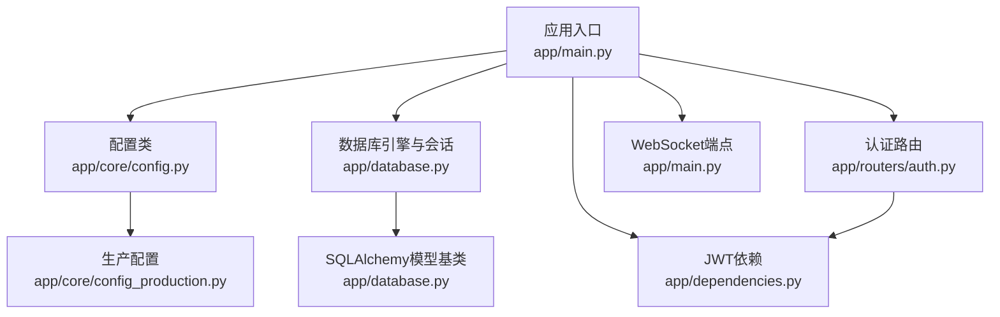
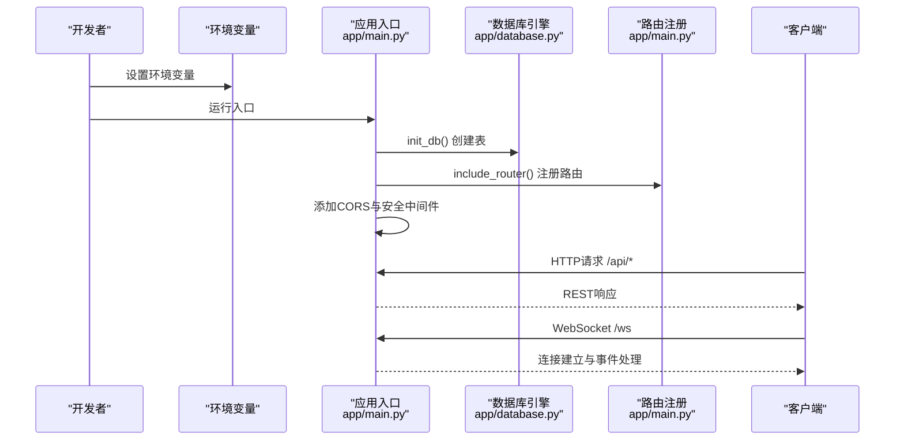
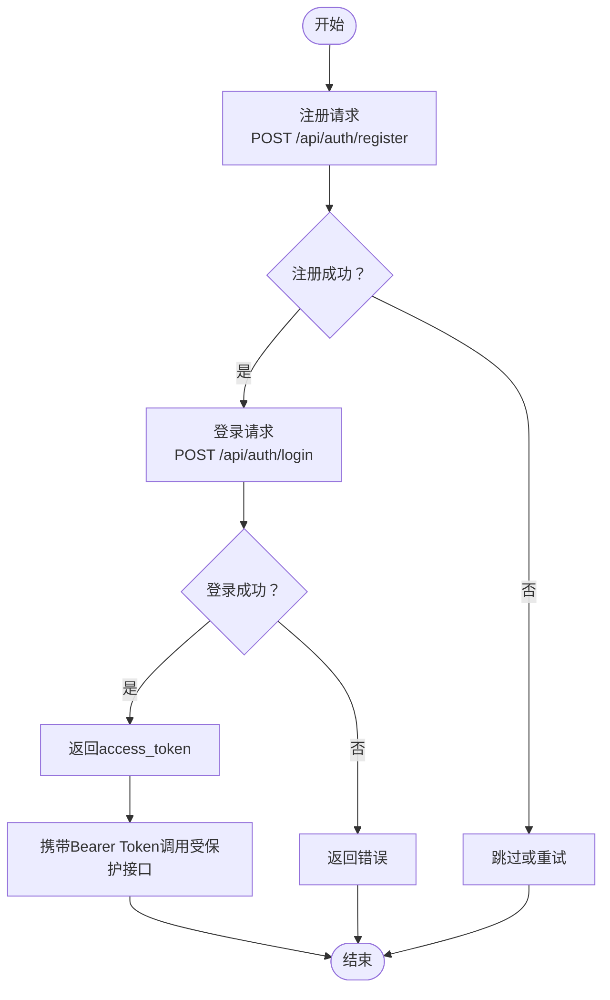
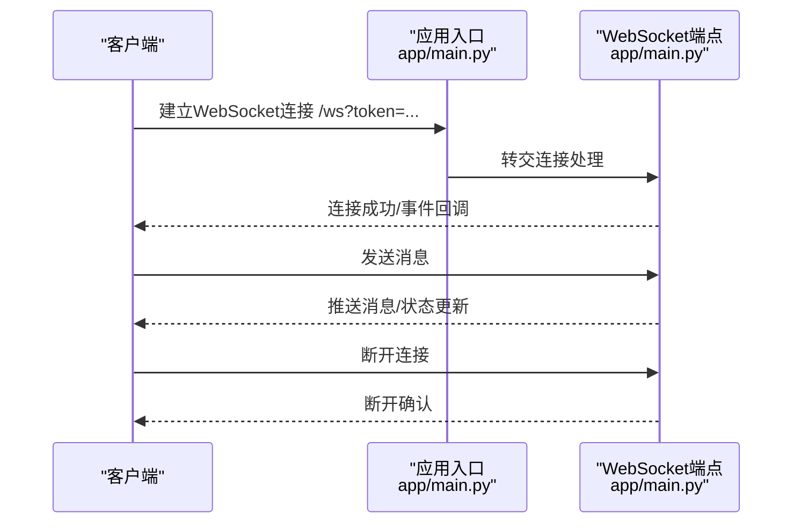
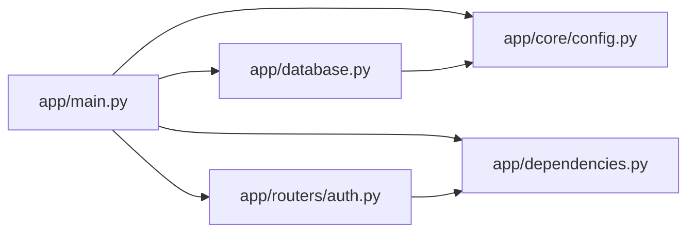

# 快速开始指南

<cite>
**本文引用的文件**
- [requirements.txt](file://requirements.txt)
- [app/core/config.py](file://app/core/config.py)
- [app/core/config_production.py](file://app/core/config_production.py)
- [app/main.py](file://app/main.py)
- [app/database.py](file://app/database.py)
- [comic_tables.sql](file://comic_tables.sql)
- [migrations/add_ws_protocol_tables.sql](file://migrations/add_ws_protocol_tables.sql)
- [app/routers/auth.py](file://app/routers/auth.py)
- [app/dependencies.py](file://app/dependencies.py)
- [tests/conftest.py](file://tests/conftest.py)
- [tests/test_websocket.py](file://tests/test_websocket.py)
- [tests/test_complete_api.py](file://tests/test_complete_api.py)
- [.gitignore](file://.gitignore)
</cite>

## 目录
1. [简介](#简介)
2. [项目结构](#项目结构)
3. [核心组件](#核心组件)
4. [架构总览](#架构总览)
5. [详细组件分析](#详细组件分析)
6. [依赖关系分析](#依赖关系分析)
7. [性能考虑](#性能考虑)
8. [故障排除指南](#故障排除指南)
9. [结论](#结论)
10. [附录](#附录)

## 简介
本指南面向新手开发者，帮助你在30分钟内完成NanTuPy项目的环境搭建、配置与本地运行，并进行基础功能测试。你将学会：
- Python版本与依赖安装
- 环境变量与配置文件设置
- 数据库准备与表初始化
- 启动应用服务器
- 基本API与WebSocket使用示例
- 常见问题排查与调试技巧

## 项目结构
NanTuPy采用FastAPI框架，后端基于MySQL数据库，提供认证、社交动态、聊天、通知、搜索、推荐、上传、漫画信息等模块。核心文件与职责如下：
- 应用入口与路由注册：app/main.py
- 配置管理：app/core/config.py（开发）、app/core/config_production.py（生产）
- 数据库初始化与会话：app/database.py
- 认证与用户相关接口：app/routers/auth.py
- JWT认证依赖：app/dependencies.py
- 测试与示例：tests/ 目录下的多个脚本

图表来源
- [app/main.py:1-110](file://app/main.py#L1-L110)
- [app/core/config.py:1-43](file://app/core/config.py#L1-L43)
- [app/database.py:1-38](file://app/database.py#L1-L38)
- [app/routers/auth.py:1-200](file://app/routers/auth.py#L1-L200)
- [app/dependencies.py:1-63](file://app/dependencies.py#L1-L63)

章节来源
- [app/main.py:1-110](file://app/main.py#L1-L110)
- [app/core/config.py:1-43](file://app/core/config.py#L1-L43)
- [app/database.py:1-38](file://app/database.py#L1-L38)

## 核心组件
- 配置系统：通过环境变量加载密钥、数据库连接、CORS与上传限制等；开发默认开启调试与宽松CORS，生产需严格配置。
- 数据库层：使用SQLAlchemy 2.0+同步引擎与Session，统一依赖注入；启动时自动创建所有表。
- 路由与中间件：注册全部业务路由与CORS中间件；添加COOP/COEP安全头以支持Flutter Web。
- 认证与授权：基于JWT的Bearer认证，提供当前用户解析与可选用户解析，支持管理员权限校验。

章节来源
- [app/core/config.py:1-43](file://app/core/config.py#L1-L43)
- [app/database.py:1-38](file://app/database.py#L1-L38)
- [app/main.py:1-110](file://app/main.py#L1-L110)
- [app/dependencies.py:1-63](file://app/dependencies.py#L1-L63)

## 架构总览
下图展示应用启动时的关键流程：加载环境变量、初始化数据库、注册路由与中间件、对外提供REST与WebSocket服务。

图表来源
- [app/main.py:29-84](file://app/main.py#L29-L84)
- [app/database.py:35-38](file://app/database.py#L35-L38)

## 详细组件分析

### 环境与依赖安装
- Python版本：建议使用Python 3.10及以上（具体以依赖要求为准）。
- 创建虚拟环境：使用venv或conda创建隔离环境。
- 安装依赖：使用提供的依赖清单一次性安装所有必要包。

章节来源
- [requirements.txt:1-15](file://requirements.txt#L1-L15)
- [.gitignore:7-11](file://.gitignore#L7-L11)

### 配置文件设置
- 安全密钥
  - SECRET_KEY：用于签名Cookie与会话，开发默认值仅为占位，请务必在生产环境设置强密钥并通过环境变量注入。
  - JWT_SECRET_KEY：用于JWT签名，同样需要在生产环境设置。
- 数据库连接
  - DB_USER/DB_PASS/DB_HOST/DB_PORT/DB_NAME：默认连接本地MySQL，字符集为utf8mb4。
  - SQLALCHEMY_DATABASE_URI：由上述字段拼接而成。
  - SQLALCHEMY_ENGINE_OPTIONS：连接池大小、溢出、回收与预检查等参数。
- CORS设置
  - 开发环境默认允许Origin为任意，且允许凭据；生产环境应明确allow_origins并谨慎配置。
- 上传与云存储
  - UPLOAD_FOLDER：上传目录相对路径。
  - MAX_CONTENT_LENGTH/ALLOWED_EXTENSIONS：上传大小与扩展名限制。
  - COS_*：腾讯云COS相关配置项。
- 生产环境配置差异
  - 生产配置要求必须提供SECRET_KEY、JWT_SECRET_KEY与DATABASE_URL，且关闭DEBUG，调整连接池与JWT过期时间。

章节来源
- [app/core/config.py:7-42](file://app/core/config.py#L7-L42)
- [app/core/config_production.py:4-48](file://app/core/config_production.py#L4-L48)

### 本地运行步骤
- 准备数据库
  - 启动本地MySQL服务，确保能以DB_USER/DB_PASS访问DB_HOST:DB_PORT。
  - 首次运行会自动创建基础表；如需额外表结构，可按需执行漫画与WebSocket协议相关SQL。
- 初始化数据表
  - 应用启动时会自动创建所有表；若需手动触发，可调用初始化函数。
- 启动应用服务器
  - 默认监听0.0.0.0:5000；可通过命令行或IDE运行入口文件。
- 访问健康检查
  - GET /health 返回服务健康状态。

章节来源
- [app/database.py:35-38](file://app/database.py#L35-L38)
- [app/main.py:107-110](file://app/main.py#L107-L110)
- [app/main.py:102-104](file://app/main.py#L102-L104)

### 基本使用示例

#### REST API调用示例
- 健康检查
  - 方法：GET
  - 路径：/health
  - 说明：验证服务是否正常运行。
- 认证
  - 注册：POST /api/auth/register
  - 登录：POST /api/auth/login
  - 获取当前用户：GET /api/auth/me
  - 更新当前用户：PUT /api/auth/me
- 上传
  - 图片上传（示例）：POST /api/upload/post/image（需携带Bearer Token）

章节来源
- [tests/test_complete_api.py:108-200](file://tests/test_complete_api.py#L108-L200)
- [app/routers/auth.py:184-200](file://app/routers/auth.py#L184-L200)

#### WebSocket连接示例
- 端点：/ws
- 传输：Socket.IO，支持websocket与polling两种传输方式。
- 认证：通过URL查询参数token传递JWT。
- 测试脚本：提供连接测试、事件回调与错误处理示例。

章节来源
- [app/main.py:84](file://app/main.py#L84)
- [tests/test_websocket.py:80-146](file://tests/test_websocket.py#L80-L146)

### 关键流程图解

#### 认证流程（注册/登录）

图表来源
- [app/routers/auth.py:184-200](file://app/routers/auth.py#L184-L200)
- [tests/test_complete_api.py:130-200](file://tests/test_complete_api.py#L130-L200)

#### WebSocket连接流程

图表来源
- [app/main.py:84](file://app/main.py#L84)
- [tests/test_websocket.py:117-138](file://tests/test_websocket.py#L117-L138)

## 依赖关系分析
- 组件耦合
  - app/main.py依赖配置、数据库与各路由模块；路由依赖数据库与认证依赖。
  - app/dependencies.py依赖配置与数据库，提供JWT解析与权限校验。
- 外部依赖
  - FastAPI/Uvicorn：Web框架与ASGI服务器。
  - SQLAlchemy：ORM与连接池。
  - python-jose/passlib：JWT与密码哈希。
  - python-socketio/Pillow/cos-python-sdk-v5：WebSocket、图片处理与云存储。
- 可能的循环依赖
  - 当前结构通过模块导入避免了循环依赖；如需新增模块，注意避免相互import。

图表来源
- [app/main.py:13-15](file://app/main.py#L13-L15)
- [app/routers/auth.py:18-22](file://app/routers/auth.py#L18-L22)
- [app/dependencies.py:4-10](file://app/dependencies.py#L4-L10)
- [app/database.py:5-7](file://app/database.py#L5-L7)

章节来源
- [app/main.py:13-15](file://app/main.py#L13-L15)
- [app/routers/auth.py:18-22](file://app/routers/auth.py#L18-L22)
- [app/dependencies.py:4-10](file://app/dependencies.py#L4-L10)
- [app/database.py:5-7](file://app/database.py#L5-L7)

## 性能考虑
- 连接池参数：根据并发量调整pool_size与max_overflow；生产环境建议更严格的回收与预检查策略。
- 上传限制：MAX_CONTENT_LENGTH与ALLOWED_EXTENSIONS限制上传体积与类型，避免资源滥用。
- 日志级别：开发阶段DEBUG便于排错，生产建议降低日志级别以减少I/O开销。
- CORS策略：生产环境尽量缩小allow_origins范围，减少跨域风险与头部开销。

## 故障排除指南
- 无法连接数据库
  - 检查DB_HOST/DB_PORT/DB_USER/DB_PASS/DB_NAME是否正确；确认MySQL服务已启动。
  - 若首次运行，确认init_db已执行并创建表。
- JWT认证失败
  - 确认JWT_SECRET_KEY已在环境变量中设置；检查Token是否过期或被篡改。
  - 使用受保护接口时，确保请求头携带正确的Authorization: Bearer <token>。
- CORS跨域问题
  - 开发环境允许任意Origin与凭据；生产环境需明确allow_origins并避免与凭据冲突。
- WebSocket连接失败
  - 确认通过URL查询参数传递token；检查后端控制台输出的连接与断开信息。
  - 如无websocket-client依赖，将回落到polling模式，可能影响实时性。
- 上传失败
  - 检查MAX_CONTENT_LENGTH与文件扩展名是否在ALLOWED_EXTENSIONS范围内。
  - 确认上传目录权限与磁盘空间充足。
- 健康检查失败
  - 确认应用已启动并监听在预期端口；访问/health验证服务状态。

章节来源
- [app/core/config.py:12-18](file://app/core/config.py#L12-L18)
- [app/dependencies.py:20-36](file://app/dependencies.py#L20-L36)
- [app/main.py:46-58](file://app/main.py#L46-L58)
- [tests/test_websocket.py:117-146](file://tests/test_websocket.py#L117-L146)
- [tests/conftest.py:20-60](file://tests/conftest.py#L20-L60)

## 结论
按照本指南，你可以在30分钟内完成NanTuPy的环境搭建、配置与本地运行，并通过API与WebSocket进行基础测试。建议在开发完成后，完善生产配置与安全策略，逐步接入CI/CD与监控体系。

## 附录

### 环境变量清单
- SECRET_KEY：应用安全密钥（生产必填）
- JWT_SECRET_KEY：JWT签名密钥（生产必填）
- DB_USER/DB_PASS/DB_HOST/DB_PORT/DB_NAME：数据库连接信息
- DATABASE_URL：生产数据库连接字符串（生产必填）
- SSL_ENABLED/FORCE_HTTPS：HTTPS开关与强制跳转
- COS_ID/COS_KEY/COS_REGION/COS_BUCKET/COS_BUCKET_NAME/COS_DOMAIN：云存储配置

章节来源
- [app/core/config.py:8-38](file://app/core/config.py#L8-L38)
- [app/core/config_production.py:7-19](file://app/core/config_production.py#L7-L19)
- [app/core/ssl_config.py:10-14](file://app/core/ssl_config.py#L10-L14)

### 表结构参考
- 基础表：应用启动时自动创建
- 漫画相关表：comic_cities、comic_tags、comic_events、comic_event_images、comic_event_tag_rel、comic_event_follows
- WebSocket协议表：ws_message_log、ws_user_seq、ws_ack_dedup

章节来源
- [app/database.py:35-38](file://app/database.py#L35-L38)
- [comic_tables.sql:1-68](file://comic_tables.sql#L1-L68)
- [migrations/add_ws_protocol_tables.sql:1-32](file://migrations/add_ws_protocol_tables.sql#L1-L32)