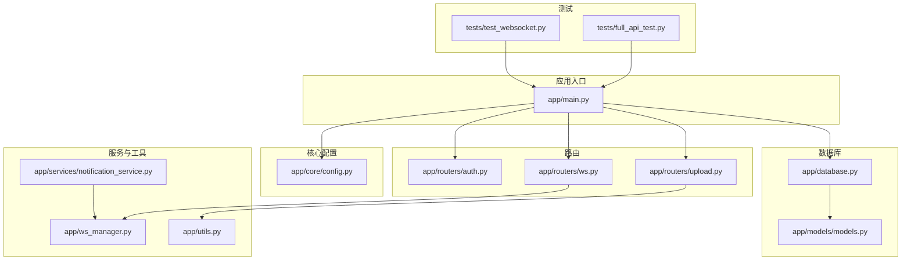
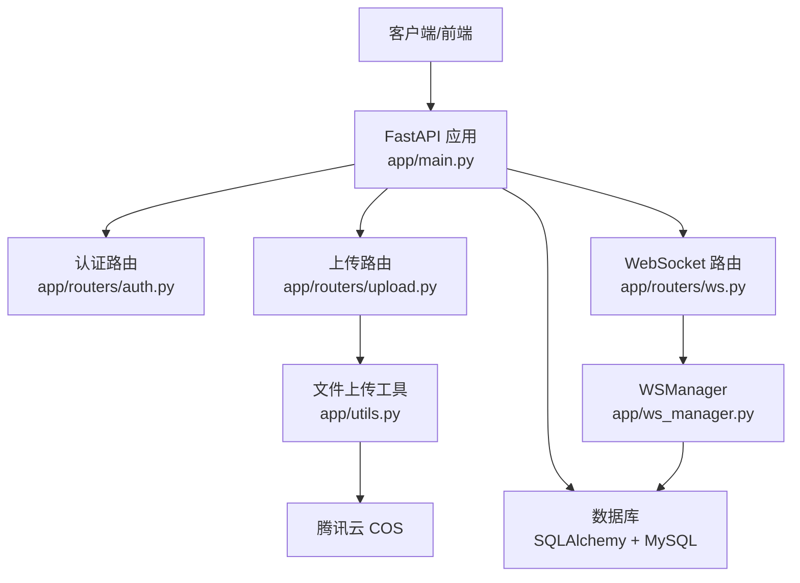
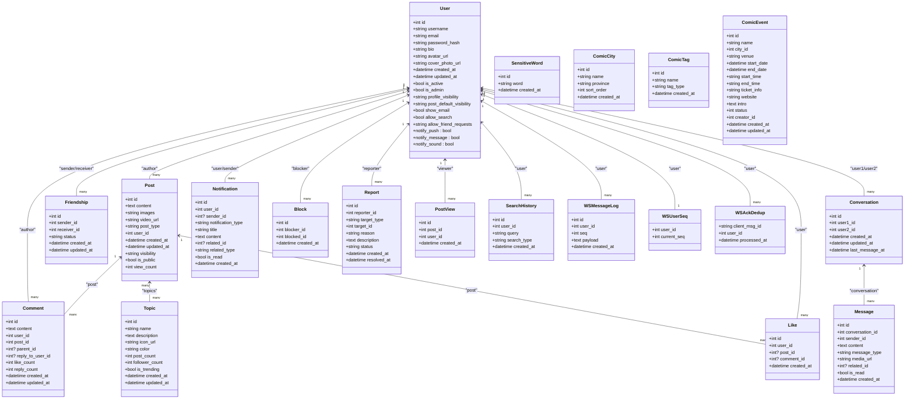
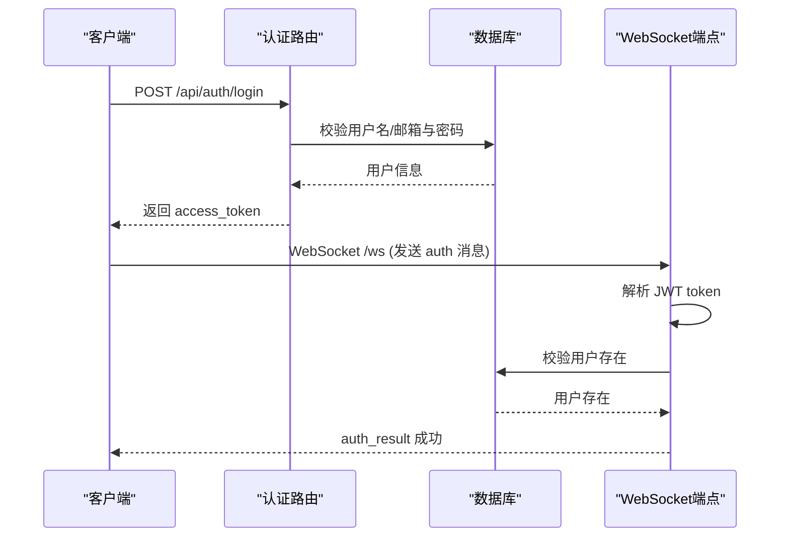
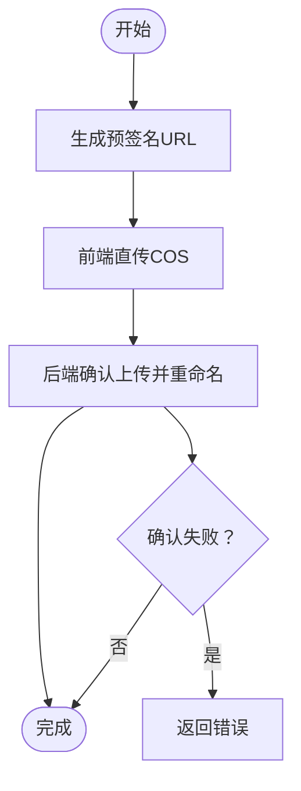
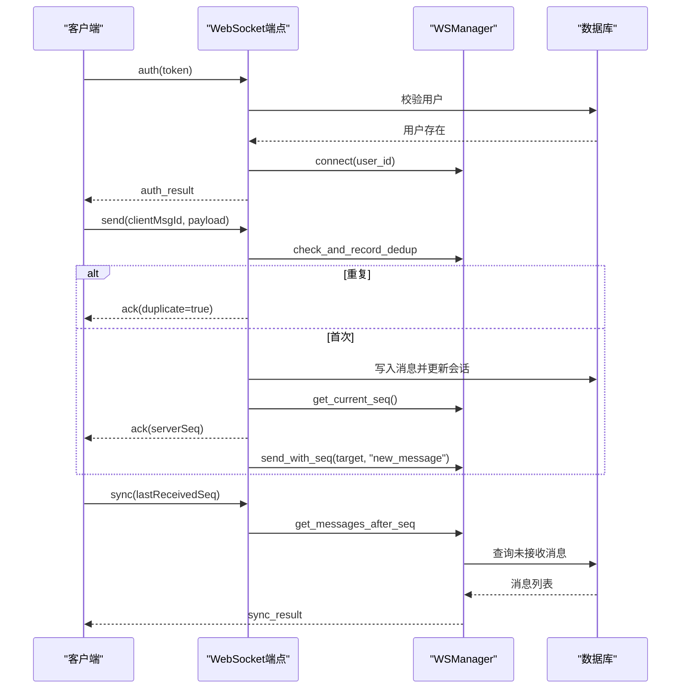
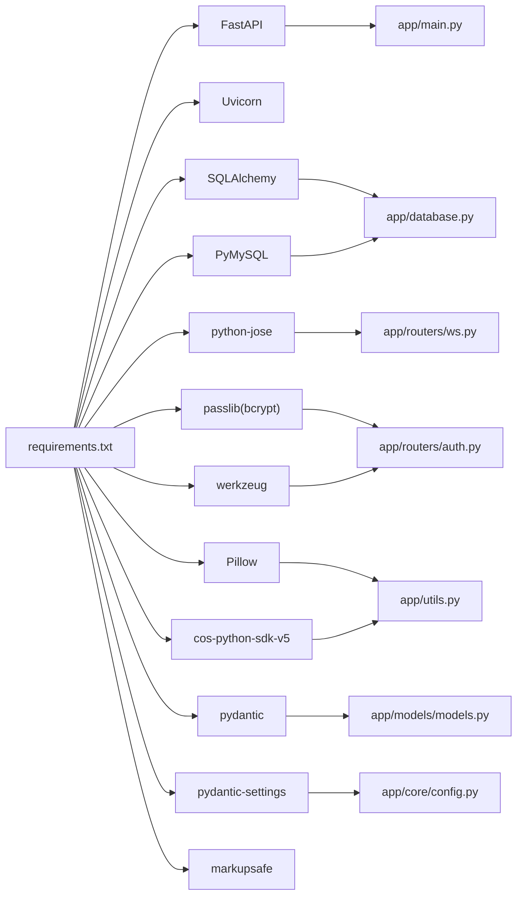

# 技术栈概览

<cite>
**本文档引用的文件**
- [requirements.txt](file://requirements.txt)
- [app/main.py](file://app/main.py)
- [app/database.py](file://app/database.py)
- [app/core/config.py](file://app/core/config.py)
- [app/models/models.py](file://app/models/models.py)
- [app/routers/ws.py](file://app/routers/ws.py)
- [app/ws_manager.py](file://app/ws_manager.py)
- [app/services/notification_service.py](file://app/services/notification_service.py)
- [app/utils.py](file://app/utils.py)
- [app/routers/auth.py](file://app/routers/auth.py)
- [app/routers/upload.py](file://app/routers/upload.py)
- [tests/full_api_test.py](file://tests/full_api_test.py)
- [tests/test_websocket.py](file://tests/test_websocket.py)
</cite>

## 目录
1. [引言](#引言)
2. [项目结构](#项目结构)
3. [核心组件](#核心组件)
4. [架构总览](#架构总览)
5. [详细组件分析](#详细组件分析)
6. [依赖关系分析](#依赖关系分析)
7. [性能考量](#性能考量)
8. [故障排查指南](#故障排查指南)
9. [结论](#结论)
10. [附录](#附录)

## 引言
本文件面向初学者与有经验的开发者，系统性梳理 NanTuPy 项目的技术栈与实现要点。项目基于 FastAPI 构建，采用 Uvicorn 作为 ASGI 服务器，使用 SQLAlchemy 2.x 进行数据库访问，并通过 PyMySQL 连接 MySQL；认证采用 JWT；文件上传集成腾讯云 COS；WebSocket 使用原生 FastAPI WebSocket 实现，具备序号机制、断线补发与去重能力；测试覆盖 HTTP 与 WebSocket 端点。

## 项目结构
项目采用 FastAPI 标准分层组织：核心配置、数据库与模型、路由模块、服务层、工具与 WebSocket 管理器、测试脚本等。整体结构清晰，便于扩展与维护。

图表来源
- [app/main.py:1-110](file://app/main.py#L1-L110)
- [app/database.py:1-38](file://app/database.py#L1-L38)
- [app/models/models.py:1-655](file://app/models/models.py#L1-L655)
- [app/routers/auth.py:1-200](file://app/routers/auth.py#L1-L200)
- [app/routers/upload.py:1-200](file://app/routers/upload.py#L1-L200)
- [app/routers/ws.py:1-538](file://app/routers/ws.py#L1-L538)
- [app/ws_manager.py:1-308](file://app/ws_manager.py#L1-L308)
- [app/services/notification_service.py:1-233](file://app/services/notification_service.py#L1-L233)
- [app/utils.py:1-220](file://app/utils.py#L1-L220)
- [tests/full_api_test.py:1-200](file://tests/full_api_test.py#L1-L200)
- [tests/test_websocket.py:1-200](file://tests/test_websocket.py#L1-L200)

章节来源
- [app/main.py:1-110](file://app/main.py#L1-L110)
- [app/database.py:1-38](file://app/database.py#L1-L38)
- [app/core/config.py:1-43](file://app/core/config.py#L1-L43)

## 核心组件
- Web 框架与服务器
  - FastAPI 0.115.0：提供高性能异步 API、自动生成 OpenAPI 文档、类型安全的路由与依赖注入。
  - Uvicorn 0.30.0：标准 ASGI 服务器，支持热重载与多进程部署。
- 数据库与 ORM
  - SQLAlchemy >= 2.0.50：对象关系映射，支持声明式模型与同步 Session 管理。
  - PyMySQL 1.1.0：MySQL 驱动，配合 SQLAlchemy 连接数据库。
- 认证与安全
  - python-jose[cryptography] 3.3.0：JWT 编解码，用于 WebSocket 认证。
  - passlib[bcrypt] 1.7.4：密码哈希，结合 Werkzeug 提供密码校验。
- 文件处理与云存储
  - Pillow >= 10.2.0：图像处理（项目中用于 COS 上传工具类）。
  - cos-python-sdk-v5：腾讯云 COS SDK，提供预签名 URL、上传、删除等能力。
- WebSocket 实时通信
  - 原生 FastAPI WebSocket：实现认证、消息编排、房间广播、心跳与断线补发。
- 配置与校验
  - pydantic >= 2.0.0：请求/响应模型校验。
  - pydantic-settings >= 2.0.0：配置加载与类型校验。
  - werkzeug >= 3.0.0：密码哈希与安全工具。
  - markupsafe >= 2.1.0：模板安全渲染（间接支持）。

章节来源
- [requirements.txt:1-15](file://requirements.txt#L1-L15)
- [app/main.py:8-110](file://app/main.py#L8-L110)
- [app/database.py:5-38](file://app/database.py#L5-L38)
- [app/core/config.py:7-43](file://app/core/config.py#L7-L43)
- [app/routers/auth.py:10-25](file://app/routers/auth.py#L10-L25)
- [app/utils.py:14-220](file://app/utils.py#L14-L220)

## 架构总览
NanTuPy 采用“路由-服务-模型-数据库”的分层架构。HTTP 路由负责请求接入与参数校验，服务层封装业务逻辑并与数据库交互，模型层定义数据结构与关系，数据库层通过 SQLAlchemy 与 MySQL 交互。WebSocket 独立于 HTTP，通过 WSManager 统一管理连接、序号、去重与补发。

图表来源
- [app/main.py:68-84](file://app/main.py#L68-L84)
- [app/routers/auth.py:184-200](file://app/routers/auth.py#L184-L200)
- [app/routers/upload.py:50-107](file://app/routers/upload.py#L50-L107)
- [app/routers/ws.py:434-538](file://app/routers/ws.py#L434-L538)
- [app/ws_manager.py:20-308](file://app/ws_manager.py#L20-L308)
- [app/utils.py:14-220](file://app/utils.py#L14-L220)

## 详细组件分析

### FastAPI 应用与中间件
- 生命周期管理：通过 lifespan 钩子在启动时初始化数据库，在关闭时优雅退出。
- CORS 策略：使用正则允许源以规避简单请求路径中的冲突问题；同时设置 COOP/COEP 安全头以适配特定前端运行环境。
- 路由注册：集中注册各模块路由，并挂载原生 WebSocket 端点。
- 健康检查：根路径与 /health 提供基础健康状态。

章节来源
- [app/main.py:29-44](file://app/main.py#L29-L44)
- [app/main.py:46-67](file://app/main.py#L46-L67)
- [app/main.py:68-84](file://app/main.py#L68-L84)
- [app/main.py:87-104](file://app/main.py#L87-L104)

### 数据库与模型（SQLAlchemy 2.x）
- 引擎与会话：创建同步引擎与 SessionLocal，启用连接池参数与预检查。
- 依赖注入：get_db 提供 FastAPI 依赖，自动提交/回滚/关闭。
- 初始化：init_db 创建所有表。
- 模型设计：采用声明式基类，定义用户、帖子、评论、点赞、好友、会话、消息、通知、话题、屏蔽、举报、搜索历史、敏感词以及漫展相关模型；包含索引、外键与级联删除。

图表来源
- [app/models/models.py:42-655](file://app/models/models.py#L42-L655)

章节来源
- [app/database.py:9-38](file://app/database.py#L9-L38)
- [app/models/models.py:14-655](file://app/models/models.py#L14-L655)

### 认证与安全（JWT + 密码哈希）
- JWT：WebSocket 端点通过 HS256 算法解码 token 获取用户标识；HTTP 路由使用 HTTP Bearer 保护接口。
- 密码：bcrypt 生成哈希，Werkzeug 提供校验；注册时生成默认头像。
- 配置：密钥与 JWT 过期时间在配置类中集中管理。

图表来源
- [app/routers/auth.py:184-200](file://app/routers/auth.py#L184-L200)
- [app/routers/ws.py:27-40](file://app/routers/ws.py#L27-L40)
- [app/routers/ws.py:446-470](file://app/routers/ws.py#L446-L470)

章节来源
- [app/routers/auth.py:10-25](file://app/routers/auth.py#L10-L25)
- [app/routers/auth.py:184-200](file://app/routers/auth.py#L184-L200)
- [app/routers/ws.py:27-40](file://app/routers/ws.py#L27-L40)
- [app/core/config.py:8-22](file://app/core/config.py#L8-L22)

### 文件上传与云存储（COS）
- 预签名直传：生成短期有效的上传 URL，前端直传 COS，后端确认重命名与清理临时文件。
- 删除与信息查询：支持按 URL 删除文件与获取对象元信息。
- 类型推断与目录组织：根据 upload_type 与扩展名推断 content-type 并组织子目录。

图表来源
- [app/routers/upload.py:50-107](file://app/routers/upload.py#L50-L107)
- [app/routers/upload.py:110-129](file://app/routers/upload.py#L110-L129)
- [app/utils.py:37-77](file://app/utils.py#L37-L77)
- [app/utils.py:80-120](file://app/utils.py#L80-L120)

章节来源
- [app/routers/upload.py:19-36](file://app/routers/upload.py#L19-L36)
- [app/routers/upload.py:50-107](file://app/routers/upload.py#L50-L107)
- [app/utils.py:14-220](file://app/utils.py#L14-L220)

### WebSocket 实时通信（序号、断线补发、ACK 去重）
- 认证：接收 auth 消息，验证 JWT 并检查用户存在性。
- 初始化：建立连接、推送会话列表、加入已有房间。
- 消息处理：send（幂等检查、创建消息、ACK 返回、推送）、sync（断线补发）、join/leave（房间管理）、typing/stop_typing（广播）。
- 序号系统：WSUserSeq 原子递增，WSMessageLog 持久化，支持按 seq 补发。
- ACK 去重：WSAckDedup 基于 clientMsgId 去重，定期清理旧记录。
- 通知推送：NotificationService 异步推送新通知事件给在线用户。

图表来源
- [app/routers/ws.py:434-538](file://app/routers/ws.py#L434-L538)
- [app/ws_manager.py:20-308](file://app/ws_manager.py#L20-L308)
- [app/services/notification_service.py:20-53](file://app/services/notification_service.py#L20-L53)

章节来源
- [app/routers/ws.py:27-40](file://app/routers/ws.py#L27-L40)
- [app/routers/ws.py:215-315](file://app/routers/ws.py#L215-L315)
- [app/routers/ws.py:317-330](file://app/routers/ws.py#L317-L330)
- [app/routers/ws.py:332-373](file://app/routers/ws.py#L332-L373)
- [app/ws_manager.py:170-213](file://app/ws_manager.py#L170-L213)
- [app/ws_manager.py:214-247](file://app/ws_manager.py#L214-L247)
- [app/ws_manager.py:265-303](file://app/ws_manager.py#L265-L303)
- [app/services/notification_service.py:20-53](file://app/services/notification_service.py#L20-L53)

### 配置与环境变量
- 数据库连接：从环境变量读取用户、密码、主机、端口、库名，拼接 SQLAlchemy URI。
- 安全密钥：JWT 与应用密钥从环境变量读取。
- 上传限制：最大内容长度、允许的扩展名集合。
- 云存储：COS ID/Key/Region/Bucket/Domain 等。

章节来源
- [app/core/config.py:7-43](file://app/core/config.py#L7-L43)

## 依赖关系分析
- 运行时依赖
  - FastAPI 与 Uvicorn：Web 框架与服务器。
  - SQLAlchemy 与 PyMySQL：数据库访问与驱动。
  - JWT 与密码库：认证与安全。
  - COS SDK：云存储直传。
  - 图像处理库：文件处理。
- 组件耦合
  - 路由依赖数据库 Session 与配置。
  - WebSocket 路由依赖 WSManager 与模型。
  - 通知服务依赖 WSManager 与模型。
  - 上传路由依赖工具类与配置。

图表来源
- [requirements.txt:1-15](file://requirements.txt#L1-L15)
- [app/main.py:8-110](file://app/main.py#L8-L110)
- [app/database.py:5-19](file://app/database.py#L5-L19)
- [app/routers/ws.py:12-16](file://app/routers/ws.py#L12-L16)
- [app/routers/auth.py:15-22](file://app/routers/auth.py#L15-L22)
- [app/utils.py:11-28](file://app/utils.py#L11-L28)
- [app/models/models.py:6-11](file://app/models/models.py#L6-L11)
- [app/core/config.py:4-20](file://app/core/config.py#L4-L20)

章节来源
- [requirements.txt:1-15](file://requirements.txt#L1-L15)
- [app/main.py:13-15](file://app/main.py#L13-L15)

## 性能考量
- 异步与并发：FastAPI 基于异步，适合高并发 I/O；WebSocket 与通知推送采用异步事件循环。
- 数据库连接池：SQLAlchemy 引擎配置连接池大小、溢出与回收策略，减少连接开销。
- 序号与补发：WSManager 通过原子递增与持久化日志，保证消息有序与可靠，降低重传压力。
- 去重与幂等：ACK 去重避免重复处理，提升吞吐。
- 文件直传：COS 预签名直传减轻服务器负载，提高上传效率。

## 故障排查指南
- WebSocket 认证失败
  - 检查 token 是否有效与过期；确认用户存在。
  - 查看后端日志中认证阶段的错误信息。
- 消息丢失或乱序
  - 客户端发送 send 时提供 clientMsgId；服务端返回 ack 并记录序号；客户端需按 seq 补发。
  - 若出现异常，使用 sync 请求 lastReceivedSeq 后续消息。
- 通知未到达
  - 确认用户在线；检查 WSManager 连接状态；查看通知服务异步推送日志。
- 上传失败
  - 检查 COS 配置与权限；确认预签名 URL 有效；确认 confirm 接口调用与返回。
- CORS 与安全头
  - 若前端跨域或特定运行环境报错，检查 COOP/COEP 头设置与 allow_origin_regex 配置。

章节来源
- [app/routers/ws.py:446-470](file://app/routers/ws.py#L446-L470)
- [app/ws_manager.py:214-247](file://app/ws_manager.py#L214-L247)
- [app/services/notification_service.py:20-53](file://app/services/notification_service.py#L20-L53)
- [app/routers/upload.py:82-97](file://app/routers/upload.py#L82-L97)
- [app/main.py:46-67](file://app/main.py#L46-L67)

## 结论
NanTuPy 的技术栈围绕 FastAPI 与 SQLAlchemy 构建，兼顾高性能与易维护性；通过 JWT 实现认证，通过 COS 实现高效文件直传；WebSocket 采用原生实现并内置序号、补发与去重机制，满足实时通信需求。整体架构清晰、模块职责明确，适合进一步扩展社交平台功能。

## 附录
- 测试策略
  - 全量 API 测试：覆盖 HTTP 端点与 WebSocket 端点，包含注册、登录、发帖、评论、好友、聊天、通知、搜索、话题、上传、推荐、屏蔽、举报、漫展、管理、健康等。
  - WebSocket 测试：验证连接、认证、消息收发与断线补发流程。

章节来源
- [tests/full_api_test.py:1-200](file://tests/full_api_test.py#L1-L200)
- [tests/test_websocket.py:1-200](file://tests/test_websocket.py#L1-L200)