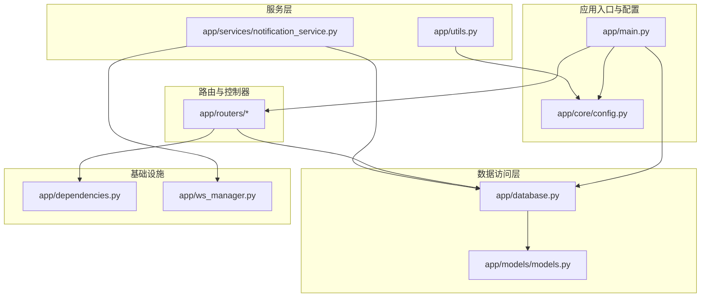
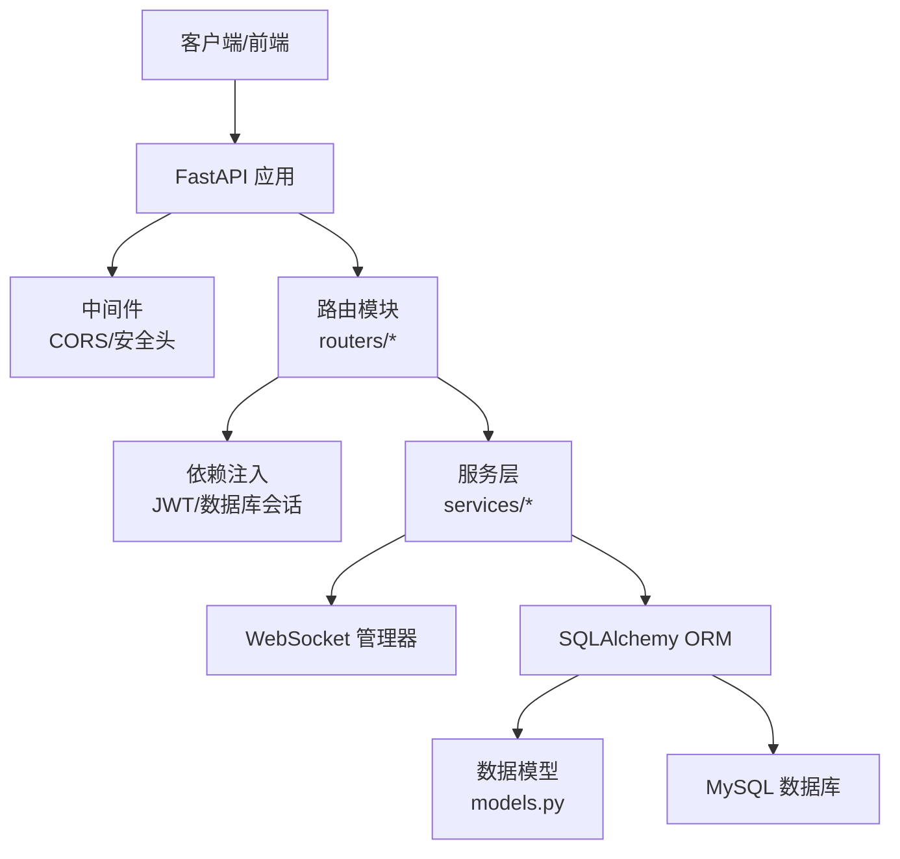
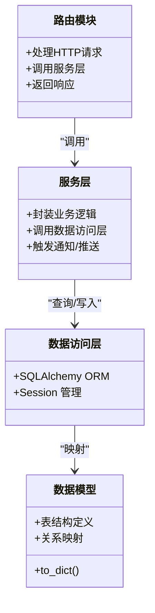
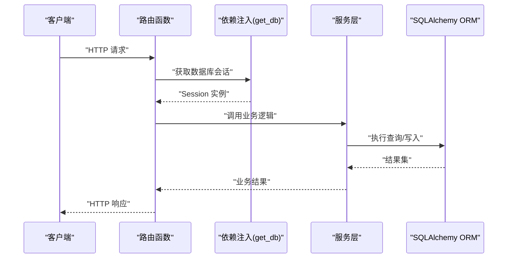
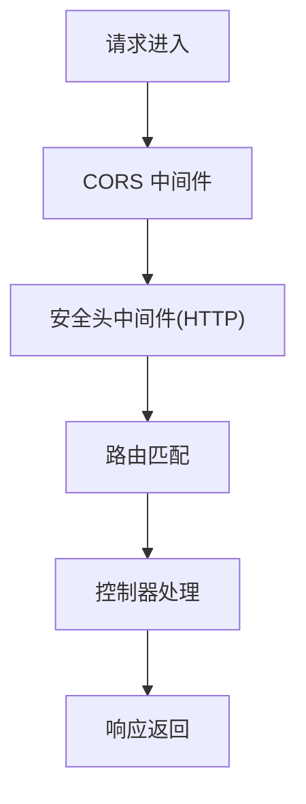
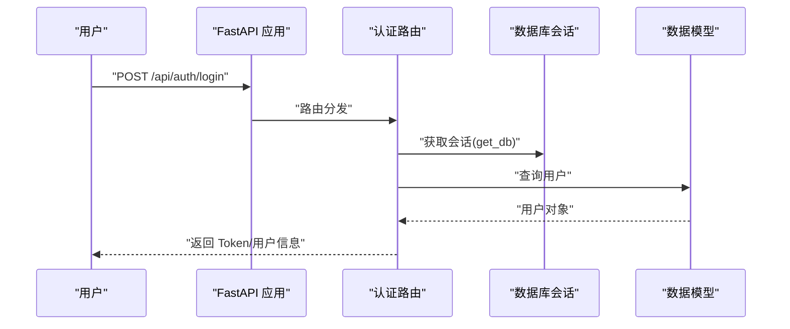
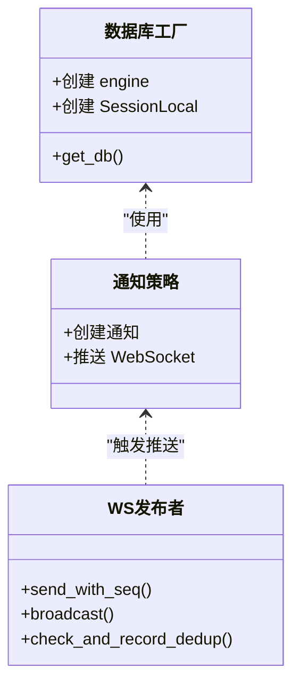
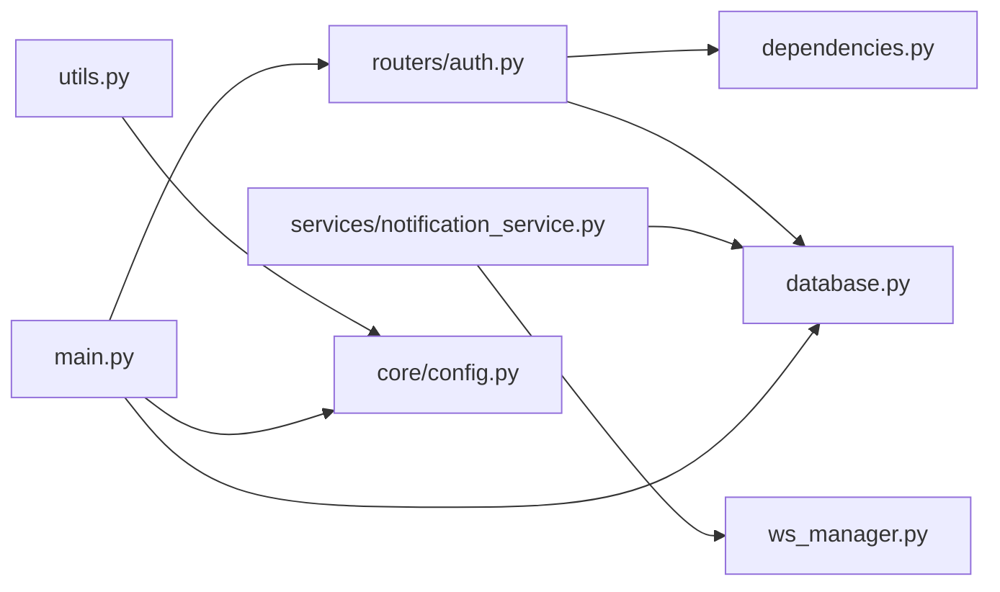

# 架构设计理念

<cite>
**本文引用的文件**
- [app/main.py](file://app/main.py)
- [app/core/config.py](file://app/core/config.py)
- [app/database.py](file://app/database.py)
- [app/dependencies.py](file://app/dependencies.py)
- [app/ws_manager.py](file://app/ws_manager.py)
- [app/models/models.py](file://app/models/models.py)
- [app/routers/auth.py](file://app/routers/auth.py)
- [app/services/notification_service.py](file://app/services/notification_service.py)
- [app/utils.py](file://app/utils.py)
</cite>

## 目录
1. [引言](#引言)
2. [项目结构](#项目结构)
3. [核心组件](#核心组件)
4. [架构总览](#架构总览)
5. [详细组件分析](#详细组件分析)
6. [依赖分析](#依赖分析)
7. [性能考量](#性能考量)
8. [故障排查指南](#故障排查指南)
9. [结论](#结论)
10. [附录](#附录)

## 引言
本文件系统性阐述 NanTuPy 的架构设计理念，围绕“基于 FastAPI 的异步架构、分层设计原则、模块化组织方式”展开；详解 MVC 模式在路由层与模型层的落地、依赖注入在认证与数据库会话中的应用、中间件体系的安全与跨域策略；梳理从 HTTP 请求到数据库操作的数据流；总结设计模式（工厂、策略、观察者）在系统中的体现；并给出可扩展性、性能优化与安全性的实践建议与可视化图示，帮助开发者快速理解并高效扩展系统。

## 项目结构
NanTuPy 采用以功能域为中心的模块化组织方式，核心目录包括：
- 核心配置与入口：app/main.py、app/core/config.py
- 数据访问层：app/database.py、app/models/models.py
- 路由与控制器：app/routers/*（如认证、帖子、通知等）
- 服务层：app/services/*（如通知、推荐、搜索等）
- 工具与基础设施：app/utils.py、app/ws_manager.py、app/dependencies.py

**图表来源**
- [app/main.py:1-110](file://app/main.py#L1-L110)
- [app/core/config.py:1-43](file://app/core/config.py#L1-L43)
- [app/database.py:1-38](file://app/database.py#L1-L38)
- [app/models/models.py:1-655](file://app/models/models.py#L1-L655)
- [app/dependencies.py:1-63](file://app/dependencies.py#L1-L63)
- [app/ws_manager.py:1-308](file://app/ws_manager.py#L1-L308)
- [app/services/notification_service.py:1-233](file://app/services/notification_service.py#L1-L233)
- [app/utils.py:1-220](file://app/utils.py#L1-L220)

**章节来源**
- [app/main.py:1-110](file://app/main.py#L1-L110)
- [app/core/config.py:1-43](file://app/core/config.py#L1-L43)

## 核心组件
- 应用入口与生命周期：通过 FastAPI 应用实例与 lifespan 管理数据库初始化与优雅关闭，统一注册路由与中间件。
- 配置中心：集中管理数据库、JWT、上传、CORS 等配置项。
- 数据访问层：SQLAlchemy 同步引擎 + Session，提供 get_db 依赖注入与 init_db 初始化。
- 路由与控制器：按功能域拆分，每个路由模块负责一组 API，遵循 REST 风格。
- 服务层：封装业务逻辑，如通知服务、搜索、推荐等，部分服务异步推送 WebSocket。
- 工具与基础设施：文件上传（COS）、WebSocket 管理器（序号、去重、断线补发）。
- 认证与依赖注入：JWT 解析、可选认证、管理员权限校验，贯穿各路由。

**章节来源**
- [app/main.py:29-84](file://app/main.py#L29-L84)
- [app/core/config.py:7-43](file://app/core/config.py#L7-L43)
- [app/database.py:9-38](file://app/database.py#L9-L38)
- [app/dependencies.py:16-62](file://app/dependencies.py#L16-L62)
- [app/ws_manager.py:20-308](file://app/ws_manager.py#L20-L308)
- [app/services/notification_service.py:14-233](file://app/services/notification_service.py#L14-L233)
- [app/utils.py:14-220](file://app/utils.py#L14-L220)

## 架构总览
NanTuPy 采用“路由层（Controller）—服务层（Service）—数据访问层（DAO/ORM）—模型层（Model）”的分层架构，结合 FastAPI 的异步特性与依赖注入，形成清晰的职责边界与高内聚低耦合的模块组织。

**图表来源**
- [app/main.py:39-84](file://app/main.py#L39-L84)
- [app/dependencies.py:16-62](file://app/dependencies.py#L16-L62)
- [app/database.py:22-38](file://app/database.py#L22-L38)
- [app/models/models.py:42-655](file://app/models/models.py#L42-L655)
- [app/ws_manager.py:20-308](file://app/ws_manager.py#L20-L308)

## 详细组件分析

### MVC 架构模式应用
- 视图层：由 FastAPI 的 OpenAPI 文档与 WebSocket 消息承载，向客户端呈现数据与状态。
- 控制器层：位于 app/routers/*，负责接收请求、参数校验、调用服务、返回响应。
- 模型层：位于 app/models/models.py，定义数据结构与关系，提供 to_dict 等序列化方法。

**图表来源**
- [app/routers/auth.py:184-246](file://app/routers/auth.py#L184-L246)
- [app/services/notification_service.py:55-84](file://app/services/notification_service.py#L55-L84)
- [app/database.py:22-38](file://app/database.py#L22-L38)
- [app/models/models.py:42-184](file://app/models/models.py#L42-L184)

**章节来源**
- [app/routers/auth.py:184-246](file://app/routers/auth.py#L184-L246)
- [app/models/models.py:42-184](file://app/models/models.py#L42-L184)

### 依赖注入设计思想
- 数据库会话注入：通过 get_db 提供 Session 生命周期管理，自动 commit/rollback/close。
- 认证注入：get_current_user 从 JWT 中解析用户并注入到路由函数，支持可选认证 get_optional_user 与管理员校验 admin_required。
- 配置注入：Config 类集中提供数据库、JWT、上传等配置，路由与服务层按需依赖。

**图表来源**
- [app/dependencies.py:16-62](file://app/dependencies.py#L16-L62)
- [app/database.py:22-38](file://app/database.py#L22-L38)
- [app/services/notification_service.py:55-84](file://app/services/notification_service.py#L55-L84)

**章节来源**
- [app/dependencies.py:16-62](file://app/dependencies.py#L16-L62)
- [app/database.py:22-38](file://app/database.py#L22-L38)

### 中间件系统实现
- CORS 中间件：通过 allow_origin_regex 绕开简单请求路径的冲突问题，正确回显 Origin。
- 安全头中间件：添加 Cross-Origin-Opener-Policy 与 Cross-Origin-Embedder-Policy，满足特定运行环境需求。
- 路由注册：统一在应用入口 include_router，前缀与标签规范化 API 分组。

**图表来源**
- [app/main.py:46-84](file://app/main.py#L46-L84)

**章节来源**
- [app/main.py:46-84](file://app/main.py#L46-L84)

### 数据流设计：从 HTTP 请求到数据库
- 请求入口：app/main.py 注册路由与中间件，lifespan 负责数据库初始化。
- 路由处理：以认证路由为例，接收请求体、参数校验、调用依赖注入获取数据库会话。
- 服务与模型：服务层封装业务规则，ORM 层执行数据库操作，模型提供 to_dict 序列化。
- 响应返回：路由组装响应模型并返回给客户端。

**图表来源**
- [app/main.py:68-84](file://app/main.py#L68-L84)
- [app/routers/auth.py:215-246](file://app/routers/auth.py#L215-L246)
- [app/database.py:22-38](file://app/database.py#L22-L38)
- [app/models/models.py:42-98](file://app/models/models.py#L42-L98)

**章节来源**
- [app/main.py:68-84](file://app/main.py#L68-L84)
- [app/routers/auth.py:215-246](file://app/routers/auth.py#L215-L246)
- [app/database.py:22-38](file://app/database.py#L22-L38)
- [app/models/models.py:42-98](file://app/models/models.py#L42-L98)

### 设计模式应用
- 工厂模式：数据库连接工厂（SQLAlchemy engine/session）集中配置，通过 get_db 提供会话实例。
- 策略模式：服务层对不同业务场景采用策略化封装（如通知策略），便于替换与扩展。
- 观察者模式：WebSocket 管理器作为发布者，服务层在关键事件发生时推送消息，订阅者为在线用户。

**图表来源**
- [app/database.py:9-38](file://app/database.py#L9-L38)
- [app/services/notification_service.py:55-84](file://app/services/notification_service.py#L55-L84)
- [app/ws_manager.py:74-131](file://app/ws_manager.py#L74-L131)

**章节来源**
- [app/database.py:9-38](file://app/database.py#L9-L38)
- [app/services/notification_service.py:55-84](file://app/services/notification_service.py#L55-L84)
- [app/ws_manager.py:74-131](file://app/ws_manager.py#L74-L131)

## 依赖分析
- 组件耦合：路由依赖依赖注入与数据库会话；服务层依赖 ORM 与 WebSocket 管理器；工具类依赖配置中心。
- 外部依赖：FastAPI、SQLAlchemy、PyJWT、bcrypt、腾讯云 COS SDK。
- 循环依赖：当前结构未见循环导入，模块职责清晰。

**图表来源**
- [app/routers/auth.py:18-22](file://app/routers/auth.py#L18-L22)
- [app/dependencies.py:7-10](file://app/dependencies.py#L7-L10)
- [app/database.py:7](file://app/database.py#L7)
- [app/services/notification_service.py:23](file://app/services/notification_service.py#L23)
- [app/ws_manager.py:15](file://app/ws_manager.py#L15)
- [app/utils.py:11](file://app/utils.py#L11)
- [app/core/config.py:7](file://app/core/config.py#L7)
- [app/main.py:13-15](file://app/main.py#L13-L15)

**章节来源**
- [app/routers/auth.py:18-22](file://app/routers/auth.py#L18-L22)
- [app/dependencies.py:7-10](file://app/dependencies.py#L7-L10)
- [app/database.py:7](file://app/database.py#L7)
- [app/services/notification_service.py:23](file://app/services/notification_service.py#L23)
- [app/ws_manager.py:15](file://app/ws_manager.py#L15)
- [app/utils.py:11](file://app/utils.py#L11)
- [app/core/config.py:7](file://app/core/config.py#L7)
- [app/main.py:13-15](file://app/main.py#L13-L15)

## 性能考量
- 数据库连接池：通过 SQLALCHEMY_ENGINE_OPTIONS 配置 pool_size、max_overflow、pool_recycle、pool_pre_ping，提升并发与连接复用效率。
- ORM 批量查询：模型层提供批量统计与懒加载策略，避免 N+1 查询；服务层在需要时传入已计算的统计值。
- 异步推送：通知服务在创建通知后异步触发 WebSocket 推送，避免阻塞主请求链路。
- 文件上传：COS 预签名直传与复制删除流程减少服务端内存占用与网络延迟。
- WebSocket 序号与去重：通过序号机制与 ACK 去重表保证消息可靠投递与幂等处理。

**章节来源**
- [app/core/config.py:20](file://app/core/config.py#L20)
- [app/models/models.py:121-184](file://app/models/models.py#L121-L184)
- [app/services/notification_service.py:25-53](file://app/services/notification_service.py#L25-L53)
- [app/utils.py:37-77](file://app/utils.py#L37-L77)
- [app/ws_manager.py:170-213](file://app/ws_manager.py#L170-L213)
- [app/ws_manager.py:265-304](file://app/ws_manager.py#L265-L304)

## 故障排查指南
- 认证失败：检查 JWT_SECRET_KEY、token 解析与用户存在性；确认依赖注入 get_current_user 的使用。
- 数据库异常：查看 get_db 的 commit/rollback 逻辑与异常捕获；核对 SQLALCHEMY_ENGINE_OPTIONS 配置。
- WebSocket 推送失败：确认 ws_manager 的连接状态、序号分配与日志记录；检查去重表清理策略。
- 文件上传失败：核对 COS_REGION、COS_ID、COS_KEY、COS_BUCKET_NAME 等配置；检查预签名 URL 有效期与权限。
- CORS 问题：确认 allow_origin_regex 设置与浏览器跨域策略；避免与 credentials 冲突。

**章节来源**
- [app/dependencies.py:20-36](file://app/dependencies.py#L20-L36)
- [app/database.py:25-32](file://app/database.py#L25-L32)
- [app/ws_manager.py:107-117](file://app/ws_manager.py#L107-L117)
- [app/utils.py:20-28](file://app/utils.py#L20-L28)
- [app/main.py:46-58](file://app/main.py#L46-L58)

## 结论
NanTuPy 以 FastAPI 为核心，构建了清晰的分层架构与模块化组织，配合依赖注入、中间件与数据库连接池，实现了高性能与可维护性。通过工厂、策略与观察者等设计模式，系统在可扩展性与业务灵活性上具备良好基础。建议后续持续完善测试覆盖、引入缓存与限流策略，并进一步细化服务层抽象以增强可测试性与可替换性。

## 附录
- 配置项概览：数据库连接、JWT 密钥、上传目录、CORS 与云存储参数。
- 关键流程：认证登录、通知推送、文件上传、WebSocket 序号与去重。

**章节来源**
- [app/core/config.py:7-43](file://app/core/config.py#L7-L43)
- [app/routers/auth.py:215-246](file://app/routers/auth.py#L215-L246)
- [app/services/notification_service.py:55-84](file://app/services/notification_service.py#L55-L84)
- [app/utils.py:37-77](file://app/utils.py#L37-L77)
- [app/ws_manager.py:170-213](file://app/ws_manager.py#L170-L213)
- [app/ws_manager.py:265-304](file://app/ws_manager.py#L265-L304)