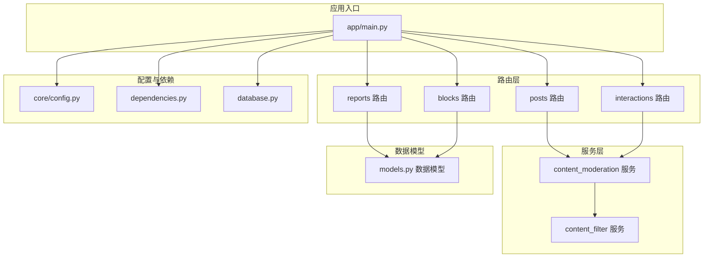
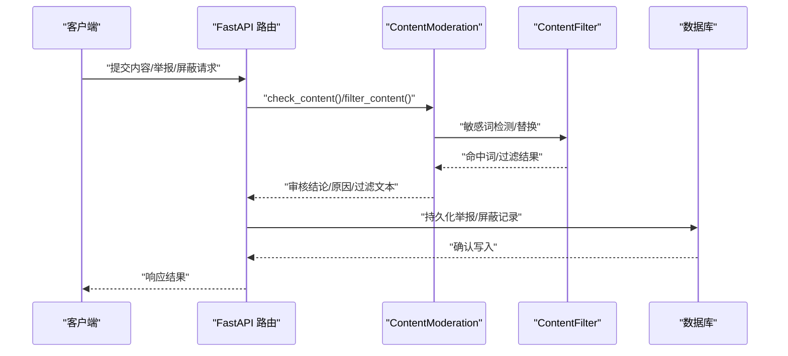
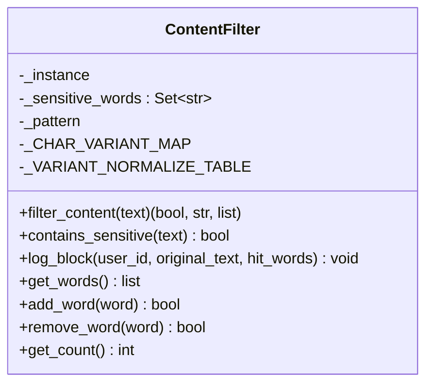
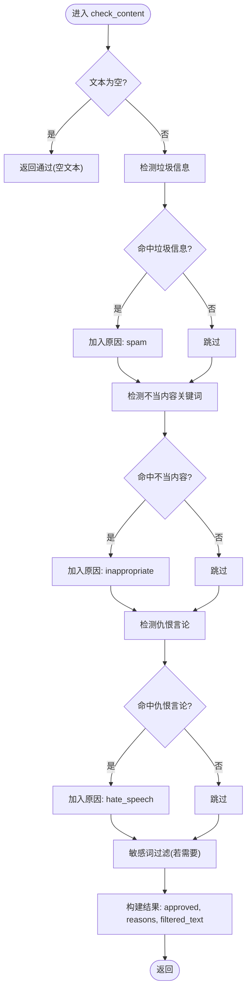
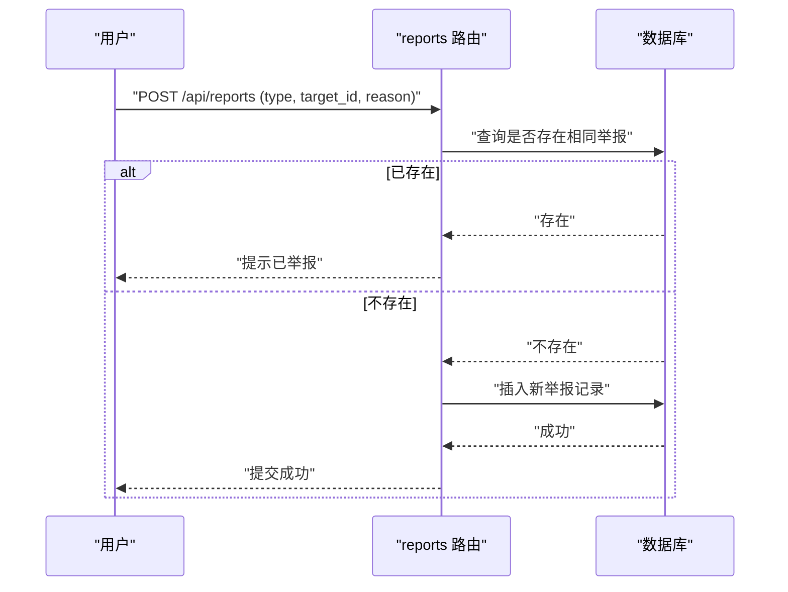
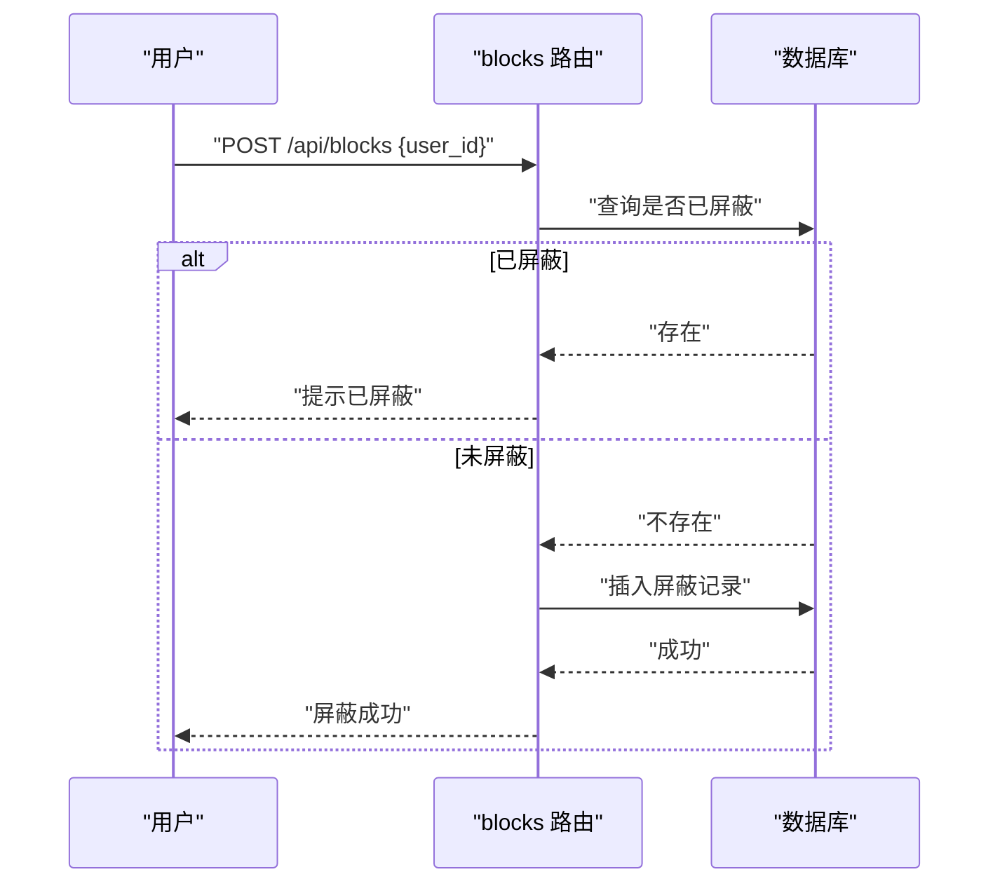
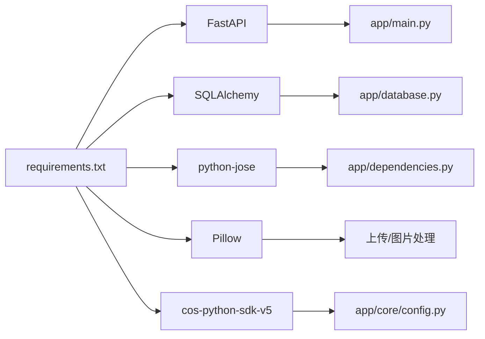

# 内容审核系统

<cite>
**本文引用的文件**
- [app/main.py](file://app/main.py)
- [app/database.py](file://app/database.py)
- [app/dependencies.py](file://app/dependencies.py)
- [app/core/config.py](file://app/core/config.py)
- [app/services/content_filter.py](file://app/services/content_filter.py)
- [app/services/content_moderation.py](file://app/services/content_moderation.py)
- [app/routers/reports.py](file://app/routers/reports.py)
- [app/routers/blocks.py](file://app/routers/blocks.py)
- [app/models/models.py](file://app/models/models.py)
- [requirements.txt](file://requirements.txt)
</cite>

## 目录
1. [简介](#简介)
2. [项目结构](#项目结构)
3. [核心组件](#核心组件)
4. [架构总览](#架构总览)
5. [详细组件分析](#详细组件分析)
6. [依赖分析](#依赖分析)
7. [性能考虑](#性能考虑)
8. [故障排查指南](#故障排查指南)
9. [结论](#结论)
10. [附录](#附录)

## 简介
本文件为内容审核系统的安全文档，聚焦以下目标：
- 解释内容过滤机制的实现原理，包括敏感词检测、文本垃圾信息与不当内容识别算法。
- 设计自动审核策略，覆盖阈值设置、风险评估与处理决策。
- 文档化举报处理流程，包括举报提交、状态查询、处理结果与反馈机制。
- 解释人工审核系统的集成方案，包括审核员管理、任务分配与质量控制。
- 说明内容封禁与恢复机制，包括违规记录、处罚执行与申诉处理。
- 提供完整的审核相关API接口文档与安全配置指南，包含常见威胁的防护措施与应急响应方案。

## 项目结构
系统采用 FastAPI + SQLAlchemy 架构，核心模块围绕“路由层-服务层-数据模型-配置与依赖”组织。内容审核相关能力主要分布在服务层与路由层，数据持久化通过 SQLAlchemy 模型完成。

图表来源
- [app/main.py:68-84](file://app/main.py#L68-L84)
- [app/routers/reports.py:11](file://app/routers/reports.py#L11)
- [app/routers/blocks.py:11](file://app/routers/blocks.py#L11)
- [app/services/content_moderation.py:19](file://app/services/content_moderation.py#L19)
- [app/services/content_filter.py:13](file://app/services/content_filter.py#L13)
- [app/models/models.py:446-474](file://app/models/models.py#L446-L474)

章节来源
- [app/main.py:68-84](file://app/main.py#L68-L84)
- [app/database.py:1-38](file://app/database.py#L1-L38)
- [app/dependencies.py:1-63](file://app/dependencies.py#L1-L63)
- [app/core/config.py:1-43](file://app/core/config.py#L1-L43)

## 核心组件
- 内容过滤器（敏感词检测）
  - 支持内置敏感词库、字符变体归一化（全角/半角、常见异体字）、动态词库增删与正则重建。
  - 提供快速检测与文本过滤两个核心方法，返回命中词列表与过滤后的文本。
- 内容审核器（综合审核）
  - 组合敏感词检测、垃圾信息检测、不当内容关键词检测与仇恨言论检测。
  - 返回审核结论、原因列表与过滤后的文本；提供审核日志记录。
- 举报路由
  - 支持统一与分类（帖子/评论/用户）举报提交，查询我的举报记录，检查是否已举报。
- 屏蔽路由
  - 支持用户屏蔽、取消屏蔽、查询屏蔽列表与检查屏蔽状态。
- 数据模型
  - Report、Block 等模型承载举报与屏蔽业务数据，含状态字段与时间戳。
- 配置与依赖
  - JWT 认证、数据库连接池、CORS 安全头、上传限制与云存储配置。

章节来源
- [app/services/content_filter.py:13-192](file://app/services/content_filter.py#L13-L192)
- [app/services/content_moderation.py:19-258](file://app/services/content_moderation.py#L19-L258)
- [app/routers/reports.py:14-151](file://app/routers/reports.py#L14-L151)
- [app/routers/blocks.py:14-101](file://app/routers/blocks.py#L14-L101)
- [app/models/models.py:446-474](file://app/models/models.py#L446-L474)
- [app/core/config.py:7-43](file://app/core/config.py#L7-L43)
- [app/dependencies.py:16-62](file://app/dependencies.py#L16-L62)

## 架构总览
内容审核在系统中的位置与交互如下：

图表来源
- [app/services/content_moderation.py:74-126](file://app/services/content_moderation.py#L74-L126)
- [app/services/content_filter.py:104-142](file://app/services/content_filter.py#L104-L142)
- [app/routers/reports.py:14-50](file://app/routers/reports.py#L14-L50)
- [app/routers/blocks.py:14-44](file://app/routers/blocks.py#L14-L44)

## 详细组件分析

### 敏感词过滤器（ContentFilter）
- 设计要点
  - 单例模式确保全局共享词库与正则缓存。
  - 字符变体归一化表覆盖全角英文字母、数字与常见异体字，提升匹配鲁棒性。
  - 动态词库支持增删，每次变更触发正则重建，保证匹配准确性。
  - 提供日志记录，便于审计与追踪。
- 复杂度与性能
  - 匹配复杂度与词库大小与输入长度相关；优先按词长降序编译正则，有助于减少回溯。
  - 归一化与正则重建为 O(n) 级别操作，建议在词库变更时批处理。
- 错误处理
  - 输入为空或词库为空时直接放行，避免异常传播。
- 优化建议
  - 词库过大时可引入前缀树或 AC 自动机以降低多模式匹配成本。
  - 引入缓存命中率统计与热词迁移策略。

图表来源
- [app/services/content_filter.py:13-192](file://app/services/content_filter.py#L13-L192)

章节来源
- [app/services/content_filter.py:13-192](file://app/services/content_filter.py#L13-L192)

### 内容审核器（ContentModeration）
- 设计要点
  - 组合多种检测规则：敏感词（委托 ContentFilter）、垃圾信息（URL、重复字符、刷屏、全大写比例、重复短语、关键词）、不当内容关键词、仇恨言论。
  - 审核结论为“通过/不通过”，原因列表去重保序；过滤文本确保敏感词与垃圾关键词被替换。
  - 提供模块级便捷函数，便于在路由层直接调用。
- 处理流程
  - 顺序检测：敏感词 → 垃圾信息 → 不当内容 → 仇恨言论。
  - 若敏感词命中但未触发过滤，则补充一次过滤以确保输出一致。
- 性能与复杂度
  - 垃圾信息检测为多正则扫描，整体复杂度与规则数量与输入长度成线性关系。
  - 建议对高频规则进行缓存与阈值优化，避免对正常文本产生误判。
- 日志与审计
  - 审核拦截日志包含时间、用户ID、内容类型、原因与文本预览，便于后续追溯。

图表来源
- [app/services/content_moderation.py:74-126](file://app/services/content_moderation.py#L74-L126)

章节来源
- [app/services/content_moderation.py:19-258](file://app/services/content_moderation.py#L19-L258)

### 举报处理流程（Reports）
- 流程概述
  - 统一入口与分类入口（帖子/评论/用户）均可提交举报。
  - 防重复提交：同一用户对同一目标类型与ID仅允许一次有效举报。
  - 查询接口支持分页与当前页信息。
  - 状态检查接口用于前端快速判断是否已举报。
- 数据模型
  - Report 模型包含举报者ID、目标类型与ID、原因、状态与时间戳。
- 安全与合规
  - 所有接口均需鉴权，防止匿名滥用。
  - 建议增加举报频率限制与内容长度限制，避免刷屏。

图表来源
- [app/routers/reports.py:14-50](file://app/routers/reports.py#L14-L50)
- [app/models/models.py:446-474](file://app/models/models.py#L446-L474)

章节来源
- [app/routers/reports.py:14-151](file://app/routers/reports.py#L14-L151)
- [app/models/models.py:446-474](file://app/models/models.py#L446-L474)

### 屏蔽机制（Blocks）
- 功能点
  - 屏蔽他人、取消屏蔽、查询屏蔽列表、检查屏蔽状态。
  - 自己不能屏蔽自己，避免自我封禁。
- 数据模型
  - Block 模型记录屏蔽者与被屏蔽者ID及创建时间。
- 安全建议
  - 建议对频繁屏蔽行为进行风控监控，结合举报数据进行交叉验证。

图表来源
- [app/routers/blocks.py:14-44](file://app/routers/blocks.py#L14-L44)
- [app/models/models.py:424-444](file://app/models/models.py#L424-L444)

章节来源
- [app/routers/blocks.py:14-101](file://app/routers/blocks.py#L14-L101)
- [app/models/models.py:424-444](file://app/models/models.py#L424-L444)

### 自动审核策略设计
- 阈值与权重
  - 垃圾信息：多规则阈值组合（如URL数量、重复字符、刷屏、全大写比例、重复短语、关键词）。
  - 不当内容：关键词命中即计入，与敏感词共用“inappropriate”原因。
  - 仇恨言论：独立规则，命中即计入“hate_speech”。
- 风险评估
  - 结合命中原因数量与类型进行风险分级（低/中/高），用于决定是否进入人工审核队列。
- 处理决策
  - 低风险：自动通过并输出过滤后文本。
  - 中高风险：自动拦截并记录日志，同时进入人工审核流程。
- 动态调整
  - 建议引入A/B测试与实时指标（误判率、漏判率、人工处理时延）驱动阈值与规则权重迭代。

章节来源
- [app/services/content_moderation.py:25-43](file://app/services/content_moderation.py#L25-L43)
- [app/services/content_moderation.py:128-196](file://app/services/content_moderation.py#L128-L196)

### 人工审核系统集成方案
- 审核员管理
  - 通过管理员接口进行角色分配与权限控制（管理员权限校验）。
- 任务分配
  - 将高风险内容推送到人工审核队列，按优先级与专家领域分派。
- 质量控制
  - 审核结果记录与复核机制，结合误判率与一致性评分持续优化。
- 与现有模块的衔接
  - 审核器输出的“reasons”与“filtered_text”作为人工复核依据。
  - 举报与屏蔽数据可作为人工审核的上下文参考。

章节来源
- [app/dependencies.py:53-62](file://app/dependencies.py#L53-L62)
- [app/services/content_moderation.py:230-249](file://app/services/content_moderation.py#L230-L249)

### 内容封禁与恢复机制
- 违规记录
  - 审核日志与举报记录共同构成违规证据链。
- 处罚执行
  - 对高风险违规内容执行删除/隐藏与作者限制（如封禁）。
- 申诉处理
  - 提供申诉入口与流程，结合人工复核与历史记录进行判定。
- 与屏蔽联动
  - 用户可主动屏蔽他人，系统可基于举报与屏蔽数据进行联动处置。

章节来源
- [app/services/content_moderation.py:230-249](file://app/services/content_moderation.py#L230-L249)
- [app/models/models.py:446-474](file://app/models/models.py#L446-L474)

## 依赖分析
- 外部依赖
  - FastAPI、SQLAlchemy、PyMySQL、python-jose、Pillow、cos-python-sdk-v5 等。
- 内部依赖
  - 路由层依赖服务层；服务层依赖配置与数据库；模型层提供数据契约。
- 安全中间件
  - CORS 配置与 COOP/COEP 安全头，保障跨域与嵌入资源安全。

图表来源
- [requirements.txt:1-15](file://requirements.txt#L1-L15)
- [app/main.py:13-15](file://app/main.py#L13-L15)
- [app/database.py:5-19](file://app/database.py#L5-L19)
- [app/dependencies.py:4-10](file://app/dependencies.py#L4-L10)
- [app/core/config.py:32-39](file://app/core/config.py#L32-L39)

章节来源
- [requirements.txt:1-15](file://requirements.txt#L1-L15)
- [app/main.py:13-15](file://app/main.py#L13-L15)
- [app/database.py:5-19](file://app/database.py#L5-L19)
- [app/dependencies.py:4-10](file://app/dependencies.py#L4-L10)
- [app/core/config.py:32-39](file://app/core/config.py#L32-L39)

## 性能考虑
- 正则匹配优化
  - 词库按长度降序编译，减少回溯；敏感词正则重建仅在词库变更时触发。
- 垃圾信息检测
  - 多规则扫描建议并行化或早停策略，避免对正常文本造成延迟。
- 数据库连接池
  - 通过配置参数控制池大小与回收周期，结合 pre_ping 保障连接可用性。
- 图像与媒体处理
  - 上传限制与扩展白名单，结合云存储SDK进行高效传输与缩略图生成。

## 故障排查指南
- 审核不通过但文本未被过滤
  - 检查敏感词是否命中但未触发替换逻辑，必要时强制执行一次过滤。
- 重复举报未生效
  - 确认防重复逻辑是否正确，检查数据库唯一约束与查询条件。
- 屏蔽失败
  - 检查是否尝试屏蔽自身、目标用户是否存在、数据库事务是否回滚。
- 审核日志缺失
  - 确认日志级别与输出路径配置，检查拦截日志记录调用点。

章节来源
- [app/services/content_moderation.py:116-126](file://app/services/content_moderation.py#L116-L126)
- [app/routers/reports.py:29-35](file://app/routers/reports.py#L29-L35)
- [app/routers/blocks.py:24-29](file://app/routers/blocks.py#L24-L29)
- [app/services/content_moderation.py:230-249](file://app/services/content_moderation.py#L230-L249)

## 结论
本系统通过“敏感词过滤 + 垃圾信息与不当内容检测 + 仇恨言论识别”的组合策略，实现了基础的自动审核能力；配合举报与屏蔽机制，形成闭环治理。建议在现有基础上引入人工审核、风险分级与动态阈值优化，并完善日志与审计体系，以满足更严格的安全与合规要求。

## 附录

### 审核相关API接口文档
- 举报接口
  - POST /api/reports
    - 请求体：{ type: "post|comment|user", target_id: number, reason: string }
    - 成功：返回提交状态与举报对象
    - 失败：400 缺少参数；500 数据库错误
  - POST /api/reports/post
    - 请求体：{ post_id: number, reason: string }
  - POST /api/reports/comment
    - 请求体：{ comment_id: number, reason: string }
  - POST /api/reports/user
    - 请求体：{ user_id: number, reason: string }
  - GET /api/reports/
    - 查询我的举报记录（分页）
  - GET /api/reports/check
    - 查询是否已举报（参数：type, target_id）

- 屏蔽接口
  - POST /api/blocks
    - 请求体：{ user_id: number }
    - 成功：返回屏蔽结果与对象
    - 失败：400 自己不能屏蔽自己；404 目标用户不存在
  - DELETE /api/blocks/{user_id}
    - 取消屏蔽
  - GET /api/blocks/
    - 查询屏蔽列表（分页）
  - GET /api/blocks/check/{user_id}
    - 检查是否屏蔽了某用户

章节来源
- [app/routers/reports.py:52-151](file://app/routers/reports.py#L52-L151)
- [app/routers/blocks.py:14-101](file://app/routers/blocks.py#L14-L101)

### 安全配置指南
- 认证与授权
  - 使用 JWT 进行用户身份校验，管理员接口需具备管理员权限。
- CORS 与安全头
  - 正确配置 allow_origin_regex，避免与 credentials 冲突；启用 COOP/COEP 以支持特定前端运行环境。
- 数据库与连接池
  - 合理设置池大小、溢出与回收周期，开启 pre_ping 保障稳定性。
- 上传与媒体
  - 严格限制文件类型与大小，结合云存储SDK进行安全传输与访问控制。
- 日志与审计
  - 审核拦截日志包含时间、用户ID、原因与文本预览，建议落盘并定期归档。

章节来源
- [app/dependencies.py:16-62](file://app/dependencies.py#L16-L62)
- [app/main.py:46-66](file://app/main.py#L46-L66)
- [app/database.py:9-19](file://app/database.py#L9-L19)
- [app/core/config.py:26-39](file://app/core/config.py#L26-L39)