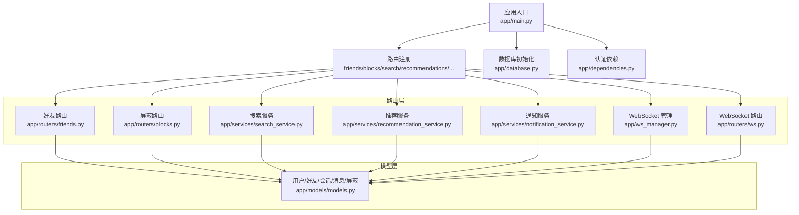
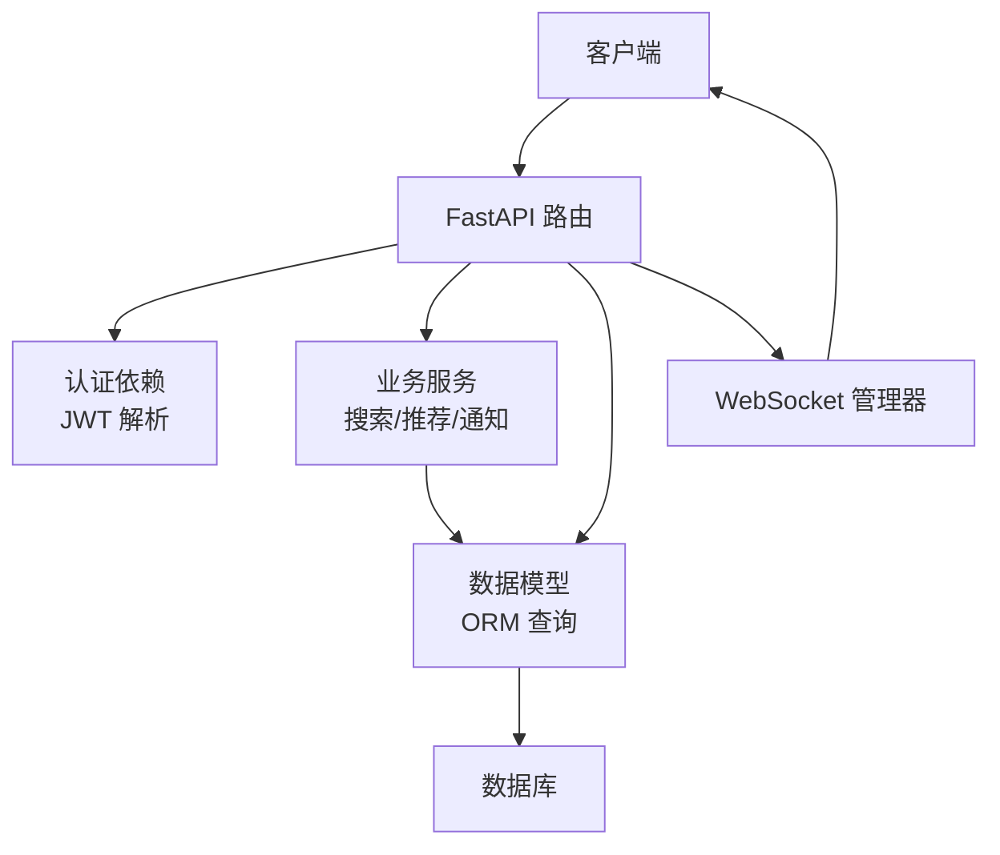
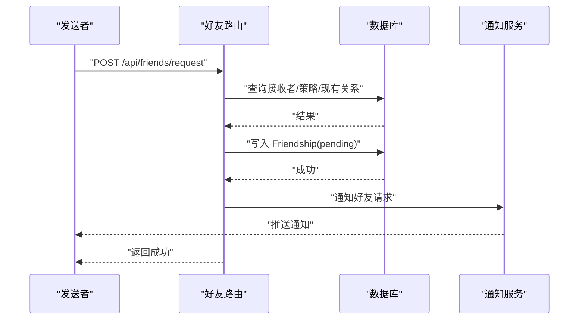
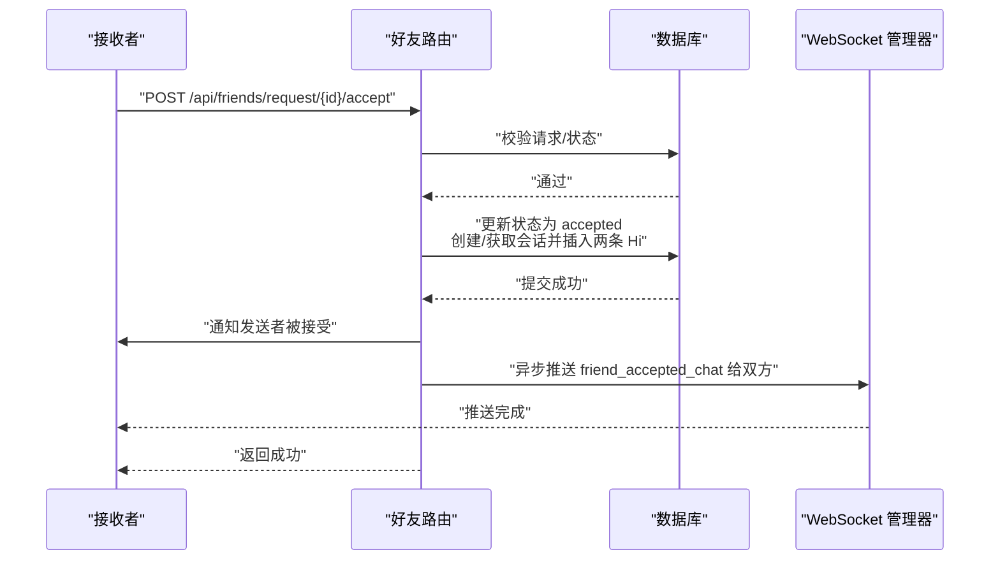
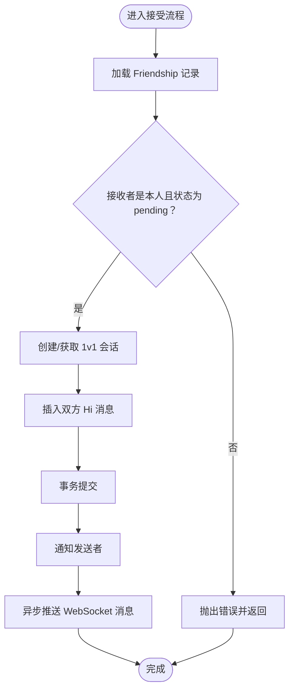
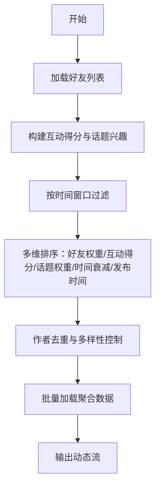
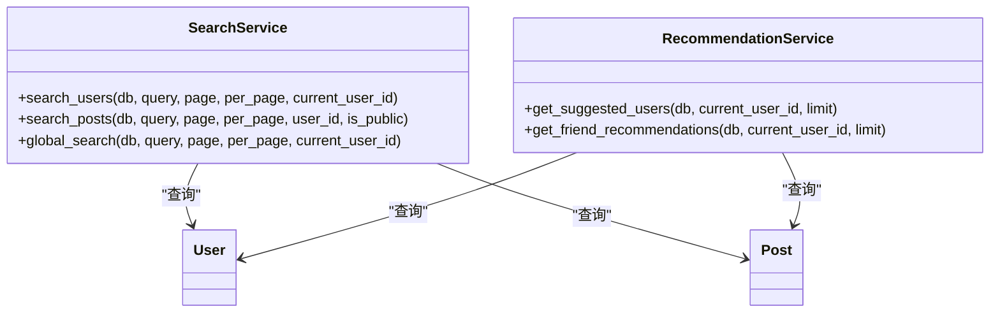
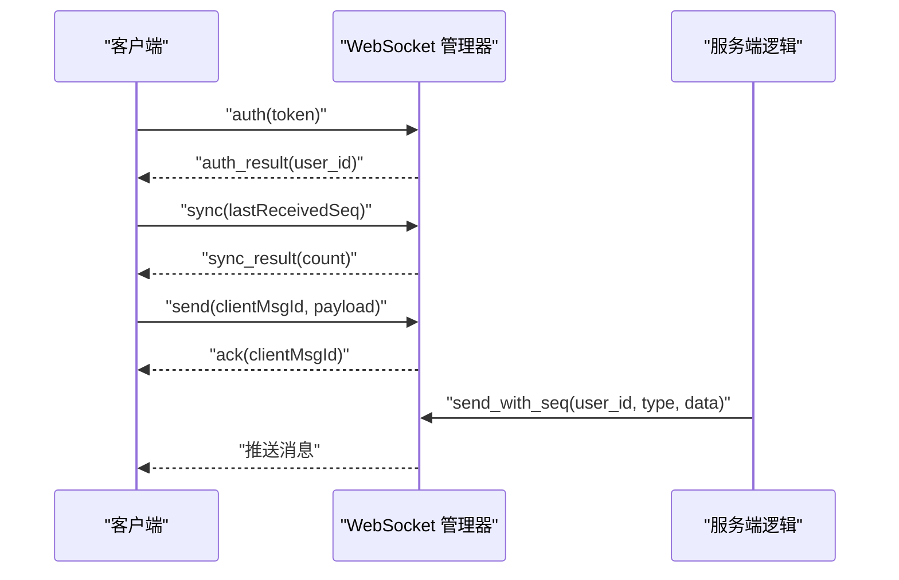
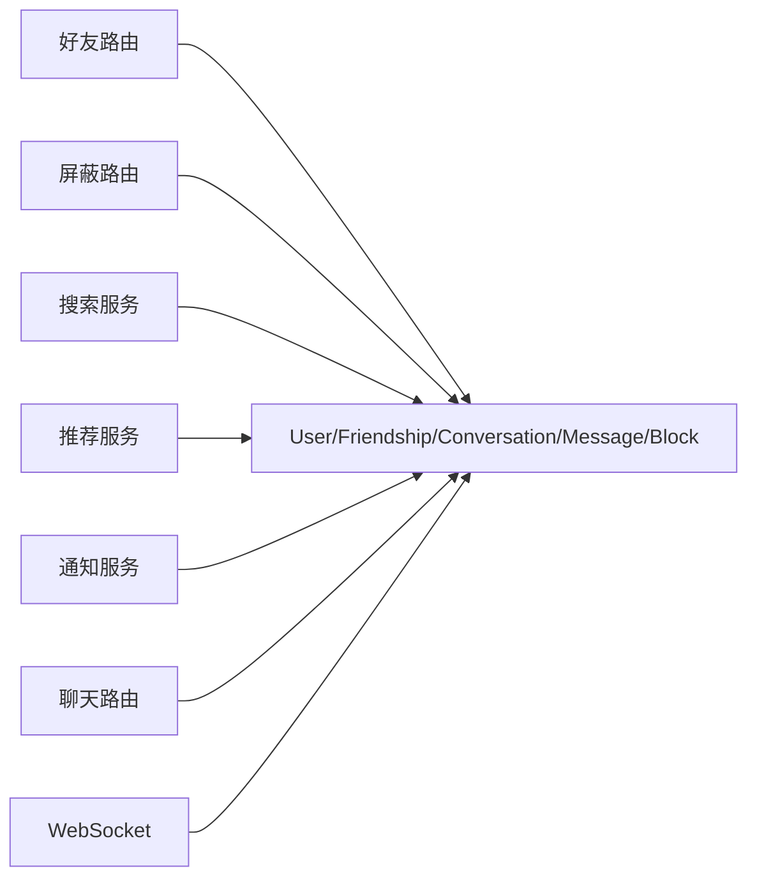

# 好友社交系统

<cite>
**本文引用的文件**
- [app/main.py](file://app/main.py)
- [app/database.py](file://app/database.py)
- [app/dependencies.py](file://app/dependencies.py)
- [app/models/models.py](file://app/models/models.py)
- [app/routers/friends.py](file://app/routers/friends.py)
- [app/routers/blocks.py](file://app/routers/blocks.py)
- [app/services/notification_service.py](file://app/services/notification_service.py)
- [app/services/recommendation_service.py](file://app/services/recommendation_service.py)
- [app/services/search_service.py](file://app/services/search_service.py)
- [app/ws_manager.py](file://app/ws_manager.py)
- [app/routers/ws.py](file://app/routers/ws.py)
- [openapi.json](file://openapi.json)
</cite>

## 目录
1. [简介](#简介)
2. [项目结构](#项目结构)
3. [核心组件](#核心组件)
4. [架构总览](#架构总览)
5. [详细组件分析](#详细组件分析)
6. [依赖分析](#依赖分析)
7. [性能考虑](#性能考虑)
8. [故障排查指南](#故障排查指南)
9. [结论](#结论)
10. [附录](#附录)

## 简介
本文件面向“好友社交系统”的功能与实现，围绕以下主题展开：
- 好友关系管理：请求发送、接受/拒绝、取消、删除、状态查询与批量推荐
- 隐私设置控制：可见性配置、信息保护与访问权限
- 黑名单机制：拉黑、解除与影响范围
- 社交动态生成：动态类型、排序规则与个性化展示
- 好友搜索与推荐：匹配算法、权重与排序
- 完整 API 文档与使用示例：覆盖常见业务场景

系统基于 FastAPI + SQLAlchemy 2.x 构建，采用模块化路由与服务层分离设计，配合 WebSocket 实现实时交互。

## 项目结构
- 应用入口与路由注册：app/main.py
- 数据库与依赖注入：app/database.py、app/dependencies.py
- 数据模型：app/models/models.py（含用户、好友关系、会话、消息、屏蔽等）
- 功能路由：
  - 好友：app/routers/friends.py
  - 屏蔽：app/routers/blocks.py
  - 搜索与推荐：app/services/search_service.py、app/services/recommendation_service.py
  - 通知：app/services/notification_service.py
  - WebSocket：app/ws_manager.py、app/routers/ws.py
- OpenAPI 规范：openapi.json（包含隐私设置字段与枚举）

图表来源
- [app/main.py:69-84](file://app/main.py#L69-L84)
- [app/routers/friends.py:16](file://app/routers/friends.py#L16)
- [app/routers/blocks.py:11](file://app/routers/blocks.py#L11)
- [app/services/search_service.py:9](file://app/services/search_service.py#L9)
- [app/services/recommendation_service.py:10](file://app/services/recommendation_service.py#L10)
- [app/services/notification_service.py:14](file://app/services/notification_service.py#L14)
- [app/ws_manager.py:20](file://app/ws_manager.py#L20)
- [app/routers/ws.py:434](file://app/routers/ws.py#L434)
- [app/models/models.py:42](file://app/models/models.py#L42)

章节来源
- [app/main.py:69-84](file://app/main.py#L69-L84)
- [app/database.py:35-38](file://app/database.py#L35-L38)
- [app/dependencies.py:16-36](file://app/dependencies.py#L16-L36)

## 核心组件
- 数据模型：用户、好友关系、会话、消息、屏蔽、通知等
- 路由层：好友请求、接受/拒绝、取消、删除、状态查询、好友列表、待处理请求、推荐
- 服务层：搜索、推荐、通知
- WebSocket：连接管理、消息序号与断线补发、实时推送
- 认证与依赖：JWT 解析、当前用户注入、可选用户注入、管理员校验

章节来源
- [app/models/models.py:42-444](file://app/models/models.py#L42-L444)
- [app/routers/friends.py:19-385](file://app/routers/friends.py#L19-L385)
- [app/services/search_service.py:12-179](file://app/services/search_service.py#L12-L179)
- [app/services/recommendation_service.py:82-431](file://app/services/recommendation_service.py#L82-L431)
- [app/services/notification_service.py:14-233](file://app/services/notification_service.py#L14-L233)
- [app/ws_manager.py:20-43](file://app/ws_manager.py#L20-L43)
- [app/routers/ws.py:434-443](file://app/routers/ws.py#L434-L443)

## 架构总览
系统采用分层架构：
- 表现层：FastAPI 路由与依赖注入
- 业务层：服务类封装算法与流程
- 数据层：SQLAlchemy 模型与查询
- 实时层：WebSocket 管理器与协议

图表来源
- [app/main.py:69-84](file://app/main.py#L69-L84)
- [app/dependencies.py:16-36](file://app/dependencies.py#L16-L36)
- [app/services/search_service.py:12](file://app/services/search_service.py#L12)
- [app/services/recommendation_service.py:82](file://app/services/recommendation_service.py#L82)
- [app/services/notification_service.py:14](file://app/services/notification_service.py#L14)
- [app/ws_manager.py:20](file://app/ws_manager.py#L20)

## 详细组件分析

### 好友关系管理
- 请求发送
  - 校验接收者、自身不能添加自己
  - 检查接收者的“允许好友请求”策略：所有人、仅好友的好友、禁止
  - 若策略为“仅好友的好友”，需验证发送者与接收者之间存在至少一个共同好友
  - 防重复：若已存在相同方向或反向请求则直接返回状态
  - 成功后写入 Friendship 并触发通知
- 接受请求
  - 校验请求存在、接收者身份、状态必须为 pending
  - 将状态置为 accepted，并确保双方 1v1 会话存在（user1_id 与 user2_id 有序）
  - 自动插入双方各一条“Hi”消息，更新会话最后消息时间
  - 事务内提交，失败回滚
  - 通知发送者被接受，并异步推送 WebSocket 消息给双方
- 拒绝请求
  - 校验请求存在、接收者身份、状态必须为 pending
  - 将状态置为 rejected 并提交
- 取消请求
  - 校验请求存在、发送者身份、状态必须为 pending
  - 删除该条请求
- 好友列表与状态
  - 列表：查询双方任一侧为当前用户且状态为 accepted 的关系
  - 状态：按双向条件查询，返回 none 或具体状态与关系对象
  - 好友数量：统计任一侧为指定用户且状态为 accepted 的条目数
- 待处理请求
  - 分别列出“收到的”和“发出的” pending 请求，附带计数
- 批量推荐
  - 基于随机采样，排除自身与已关联用户，返回若干候选

图表来源
- [app/routers/friends.py:19-74](file://app/routers/friends.py#L19-L74)
- [app/services/notification_service.py:144-162](file://app/services/notification_service.py#L144-L162)

图表来源
- [app/routers/friends.py:76-134](file://app/routers/friends.py#L76-L134)
- [app/services/notification_service.py:165-184](file://app/services/notification_service.py#L165-L184)
- [app/routers/friends.py:359-385](file://app/routers/friends.py#L359-L385)

图表来源
- [app/routers/friends.py:76-134](file://app/routers/friends.py#L76-L134)

章节来源
- [app/routers/friends.py:19-385](file://app/routers/friends.py#L19-L385)
- [app/models/models.py:261-284](file://app/models/models.py#L261-L284)
- [app/services/notification_service.py:144-184](file://app/services/notification_service.py#L144-L184)

### 隐私设置控制系统
- 字段与取值
  - profile_visibility：公开、仅好友、私密
  - post_default_visibility：公开、仅好友、私密、自定义
  - show_email：是否显示邮箱
  - allow_search：是否允许被搜索
  - allow_friend_requests：所有人、仅好友的好友、禁止
- 控制逻辑
  - 好友请求策略：根据接收者设置决定是否可被请求
  - 搜索可见性：搜索服务过滤 allow_search=True 的用户
  - 默认内容可见性：用于帖子默认可见性（可在发布时覆盖）
- 更新接口
  - 通过 PUT 更新当前用户隐私设置，支持部分字段更新

章节来源
- [app/models/models.py:58-68](file://app/models/models.py#L58-L68)
- [openapi.json:5651-5691](file://openapi.json#L5651-L5691)
- [app/routers/friends.py:38-56](file://app/routers/friends.py#L38-L56)
- [app/services/search_service.py:32-39](file://app/services/search_service.py#L32-L39)

### 黑名单机制
- 拉黑
  - 校验目标用户存在且不可拉黑自己
  - 防重复：若已存在则直接返回
  - 成功后写入 Block 记录
- 解除
  - 校验存在性，删除记录
- 查询
  - 分页列出当前用户拉黑的用户，支持页码与每页数量
- 影响范围
  - 搜索：被拉黑用户不会出现在搜索结果中
  - 好友：拉黑不影响已存在的好友关系，但后续请求会被拒绝
  - 通知：拉黑后不再接收来自被拉黑用户的互动通知

章节来源
- [app/routers/blocks.py:14-101](file://app/routers/blocks.py#L14-L101)
- [app/models/models.py:424-444](file://app/models/models.py#L424-L444)

### 社交动态生成
- 个性化动态流
  - 基于用户互动（点赞、评论）与话题兴趣，结合时间衰减因子排序
  - 新用户与老用户的窗口期不同，以提升新鲜度
  - 作者去重与多样性控制，限制单作者产出密度
  - 批量加载聚合数据，避免 N+1 查询
- 趋势动态
  - 按近 24 小时内的互动量与时间衰减综合评分排序
  - 作者去重与多样性控制
- 相关动态
  - 基于相同作者或相同话题标签的帖子进行关联推荐

图表来源
- [app/services/recommendation_service.py:82-168](file://app/services/recommendation_service.py#L82-L168)

章节来源
- [app/services/recommendation_service.py:82-232](file://app/services/recommendation_service.py#L82-L232)
- [app/services/recommendation_service.py:434-457](file://app/services/recommendation_service.py#L434-L457)

### 好友搜索与推荐
- 好友搜索
  - 支持用户名与邮箱模糊匹配；邮箱支持“用户名@域”拆分匹配
  - 仅返回 allow_search=True 的活跃用户
  - 结果按用户名精确匹配优先、创建时间倒序
- 好友推荐
  - 基于共同好友、共同话题、近期活跃度、注册月份相近、探索性随机
  - 综合打分并生成匹配百分比与推荐理由
- 全局搜索
  - 同时返回用户与公开帖子结果，支持分页

图表来源
- [app/services/search_service.py:12-111](file://app/services/search_service.py#L12-L111)
- [app/services/recommendation_service.py:235-296](file://app/services/recommendation_service.py#L235-L296)
- [app/services/recommendation_service.py:299-431](file://app/services/recommendation_service.py#L299-L431)

章节来源
- [app/services/search_service.py:12-179](file://app/services/search_service.py#L12-L179)
- [app/services/recommendation_service.py:235-431](file://app/services/recommendation_service.py#L235-L431)

### WebSocket 实时交互
- 连接管理
  - 单例管理器维护用户到 WebSocket 的映射
  - 支持每用户序号计数、消息日志与 ACK 去重
- 协议要点
  - 认证：auth
  - 断线补发：sync（携带 lastReceivedSeq）
  - 消息发送：send（幂等 clientMsgId）
  - 读取确认：conversation_read、notifications_read
- 与好友/聊天集成
  - 好友接受：异步推送 friend_accepted_chat，包含会话与 Hi 消息
  - 聊天消息：发送后向对方推送 new_message，包含未读计数

图表来源
- [app/ws_manager.py:20-43](file://app/ws_manager.py#L20-L43)
- [app/routers/ws.py:434-443](file://app/routers/ws.py#L434-L443)
- [app/routers/friends.py:359-385](file://app/routers/friends.py#L359-L385)

章节来源
- [app/ws_manager.py:20-43](file://app/ws_manager.py#L20-L43)
- [app/routers/ws.py:434-443](file://app/routers/ws.py#L434-L443)
- [app/routers/friends.py:359-385](file://app/routers/friends.py#L359-L385)

## 依赖分析
- 路由到模型
  - 好友路由依赖 User、Friendship、Conversation、ConversationParticipant、Message
  - 屏蔽路由依赖 User、Block
  - 搜索/推荐依赖 User、Post、Friendship、Topic、Like、Comment
  - 通知服务依赖 Notification、User
- 路由到服务
  - 好友路由调用 NotificationService
  - 搜索路由调用 RecommendationService 批量序列化
- 服务到模型
  - RecommendationService 使用 Friendship、User、Post、Like、Comment、Topic
  - SearchService 使用 User、Post
  - NotificationService 使用 Notification、User

图表来源
- [app/routers/friends.py:10-14](file://app/routers/friends.py#L10-L14)
- [app/routers/blocks.py:7-9](file://app/routers/blocks.py#L7-L9)
- [app/services/search_service.py:4-6](file://app/services/search_service.py#L4-L6)
- [app/services/recommendation_service.py:4](file://app/services/recommendation_service.py#L4)
- [app/services/notification_service.py:6-9](file://app/services/notification_service.py#L6-L9)

章节来源
- [app/routers/friends.py:10-14](file://app/routers/friends.py#L10-L14)
- [app/routers/blocks.py:7-9](file://app/routers/blocks.py#L7-L9)
- [app/services/search_service.py:4-6](file://app/services/search_service.py#L4-L6)
- [app/services/recommendation_service.py:4](file://app/services/recommendation_service.py#L4)
- [app/services/notification_service.py:6-9](file://app/services/notification_service.py#L6-L9)

## 性能考虑
- 批量查询与序列化
  - 推荐服务批量加载点赞/评论计数、话题与“我是否点赞”，避免 N+1
- 时间衰减与窗口控制
  - 个性化动态流按时间窗口与指数衰减排序，兼顾新鲜度与稳定性
- 作者去重与多样性
  - 限制单作者产出密度，提升内容多样性
- 分页与预取
  - 搜索与推荐均支持分页；动态流多取 1 条判断 has_more，减少昂贵 COUNT
- 事务一致性
  - 好友接受流程在单事务中完成，保证会话、参与者与消息的一致性

章节来源
- [app/services/recommendation_service.py:16-81](file://app/services/recommendation_service.py#L16-L81)
- [app/routers/friends.py:92-118](file://app/routers/friends.py#L92-L118)

## 故障排查指南
- 好友请求失败
  - 检查接收者 allow_friend_requests 设置
  - 若为“仅好友的好友”，确认发送者与接收者之间存在共同好友
  - 查看是否存在重复请求
- 接受/拒绝/取消异常
  - 确认请求存在且当前用户为接收者（接受/拒绝）或发送者（取消）
  - 确认请求状态为 pending
- 通知未到达
  - 检查通知服务是否正常推送 WebSocket
  - 确认客户端已连接并认证
- 搜索结果为空
  - 确认目标用户 allow_search=True
  - 检查查询关键词长度与格式
- WebSocket 未收到消息
  - 确认已认证并保持连接
  - 使用 sync(lastReceivedSeq) 进行断线补发
  - 检查 clientMsgId 是否重复导致去重

章节来源
- [app/routers/friends.py:38-56](file://app/routers/friends.py#L38-L56)
- [app/routers/friends.py:82-90](file://app/routers/friends.py#L82-L90)
- [app/services/notification_service.py:20-53](file://app/services/notification_service.py#L20-L53)
- [app/services/search_service.py:14-18](file://app/services/search_service.py#L14-L18)
- [app/routers/ws.py:434-443](file://app/routers/ws.py#L434-L443)

## 结论
本系统以清晰的分层与模块化设计实现了完整的好友社交能力：
- 好友关系管理具备完善的策略与事务保障
- 隐私与黑名单控制覆盖搜索与互动边界
- 动态流与推荐算法结合时间衰减与多样性策略
- WebSocket 提供可靠的实时交互体验
建议在生产环境中持续优化索引与缓存策略，进一步降低复杂查询成本，并完善监控与告警体系。

## 附录

### API 接口概览与使用示例

- 好友请求
  - 发送请求：POST /api/friends/request
  - 接受请求：POST /api/friends/request/{request_id}/accept
  - 拒绝请求：POST /api/friends/request/{request_id}/reject
  - 取消请求：DELETE /api/friends/request/{request_id}
- 好友管理
  - 获取好友列表：GET /api/friends/
  - 获取状态：GET /api/friends/status/{user_id}
  - 获取好友数量：GET /api/friends/count/{user_id}
  - 删除好友：DELETE /api/friends/{user_id}
- 请求管理
  - 获取待处理请求：GET /api/friends/requests/pending
  - 获取我发出的请求：GET /api/friends/requests/sent
  - 获取我收到的请求：GET /api/friends/requests/received
- 推荐
  - 好友推荐：GET /api/friends/recommendations
- 屏蔽
  - 拉黑：POST /api/blocks/
  - 解除：DELETE /api/blocks/{user_id}
  - 列表：GET /api/blocks/?page=&per_page=
  - 检查：GET /api/blocks/check/{user_id}
- 搜索
  - 用户搜索：GET /api/search/users?q=&page=&per_page=
  - 全局搜索：GET /api/search/global?q=&page=&per_page=
  - 帖子搜索：GET /api/search/posts?q=&page=&per_page=
  - 话题搜索：GET /api/search/posts/hashtag?q=&page=&per_page=
  - 趋势话题：GET /api/search/trending-hashtags?limit=
  - 用户建议：GET /api/search/suggest-users?prefix=&limit=
- WebSocket
  - 端点：/ws
  - 类型：auth、sync、send、ack、conversation_read、notifications_read、new_notification、new_message、friend_accepted_chat

章节来源
- [app/routers/friends.py:19-385](file://app/routers/friends.py#L19-L385)
- [app/routers/blocks.py:14-101](file://app/routers/blocks.py#L14-L101)
- [app/services/search_service.py:12-179](file://app/services/search_service.py#L12-L179)
- [app/routers/ws.py:434-443](file://app/routers/ws.py#L434-L443)