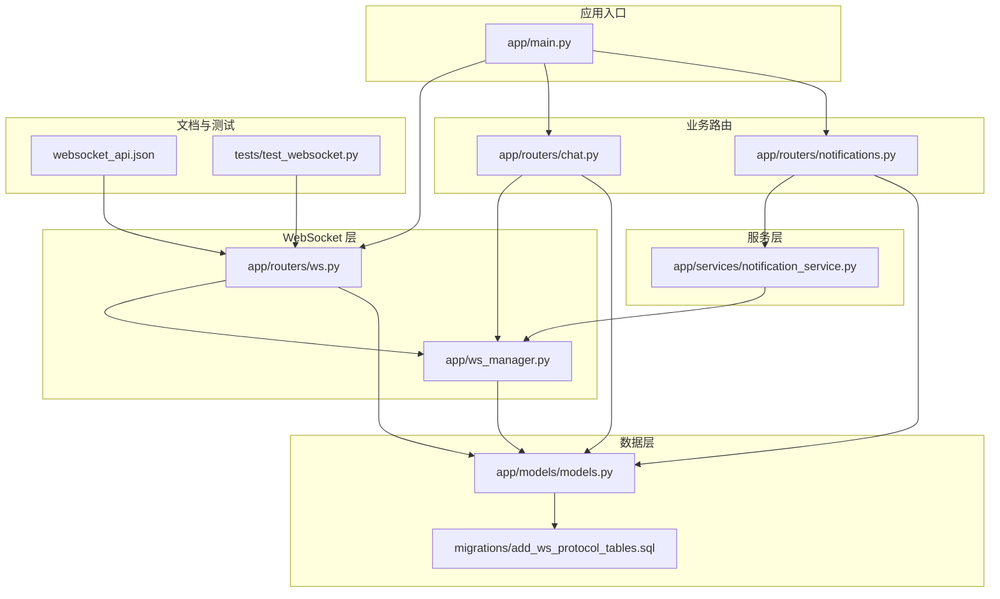
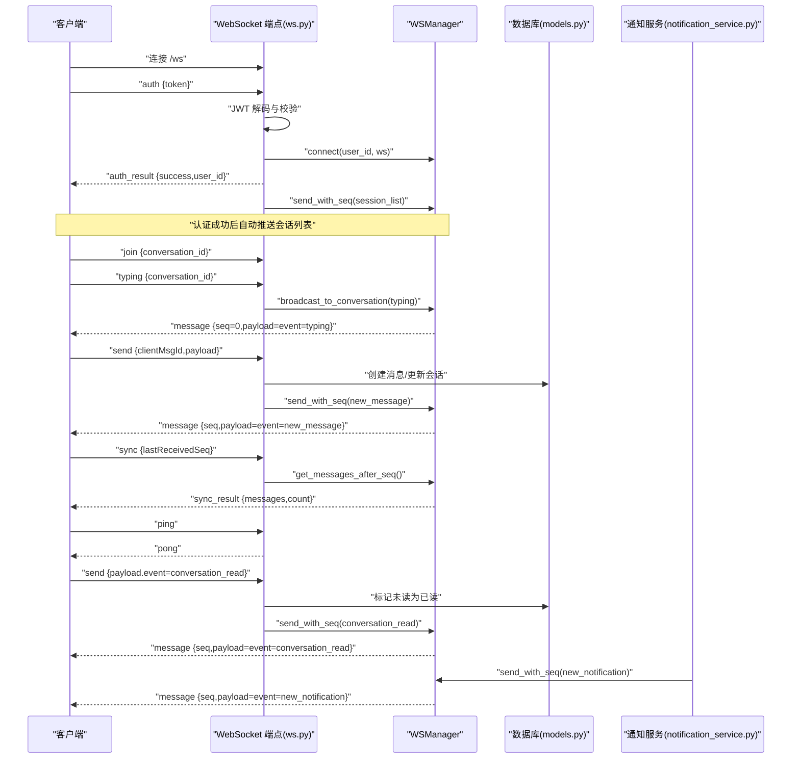
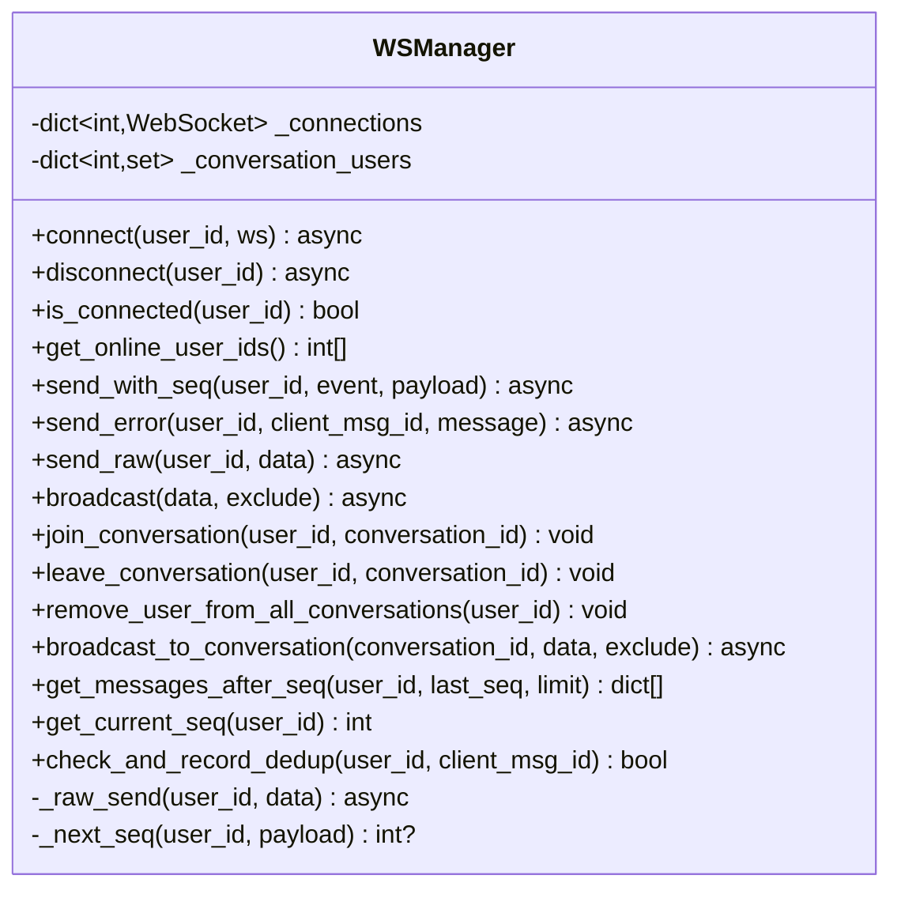
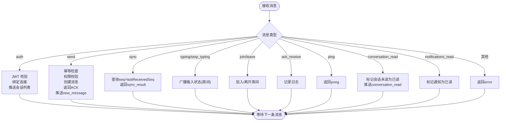
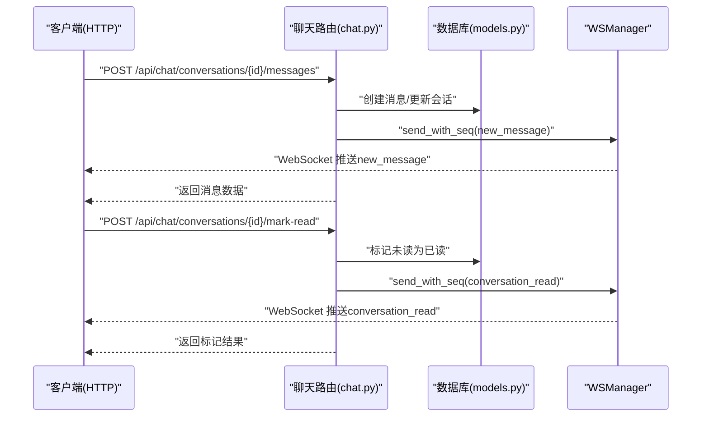
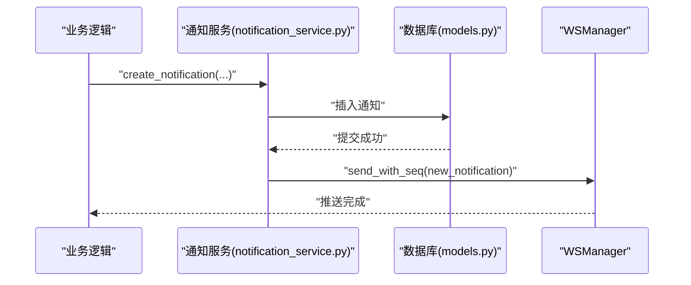
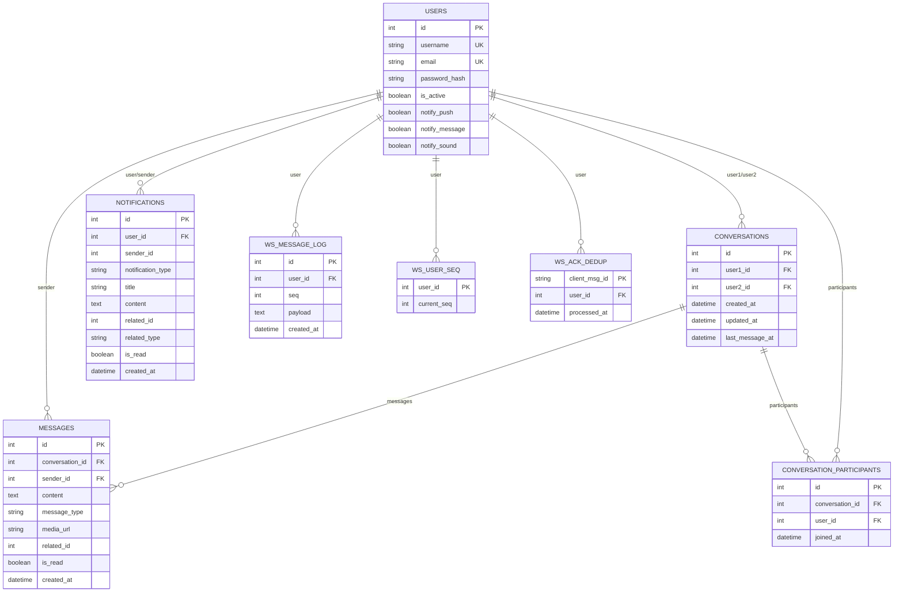
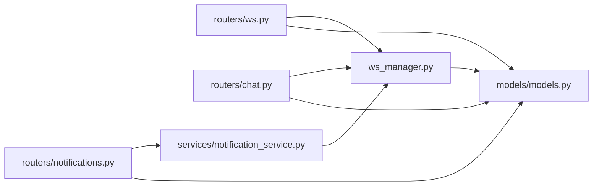

# 实时通信系统

<cite>
**本文档引用的文件**
- [app/main.py](file://app/main.py)
- [app/ws_manager.py](file://app/ws_manager.py)
- [app/routers/ws.py](file://app/routers/ws.py)
- [app/routers/chat.py](file://app/routers/chat.py)
- [app/routers/notifications.py](file://app/routers/notifications.py)
- [app/models/models.py](file://app/models/models.py)
- [app/services/notification_service.py](file://app/services/notification_service.py)
- [websocket_api.json](file://websocket_api.json)
- [migrations/add_ws_protocol_tables.sql](file://migrations/add_ws_protocol_tables.sql)
- [tests/test_websocket.py](file://tests/test_websocket.py)
</cite>

## 目录
1. [引言](#引言)
2. [项目结构](#项目结构)
3. [核心组件](#核心组件)
4. [架构总览](#架构总览)
5. [详细组件分析](#详细组件分析)
6. [依赖分析](#依赖分析)
7. [性能考虑](#性能考虑)
8. [故障排查指南](#故障排查指南)
9. [结论](#结论)
10. [附录](#附录)

## 引言
本技术文档面向实时通信系统，围绕 WebSocket 架构与连接管理、消息广播与房间管理、在线状态与通知推送、聊天室功能与权限控制、以及 WebSocket API 文档与客户端集成进行全面解析。系统采用 FastAPI + SQLAlchemy + 原生 WebSocket 的组合，提供基于序号的可靠消息投递、断线补发、ACK 去重与会话房间广播能力。

## 项目结构
系统采用模块化组织，核心模块包括：
- 应用入口与中间件：app/main.py
- WebSocket 管理器：app/ws_manager.py
- WebSocket 端点与协议处理：app/routers/ws.py
- 聊天与会话管理：app/routers/chat.py
- 通知路由与推送：app/routers/notifications.py
- 数据模型与协议表：app/models/models.py
- 通知服务：app/services/notification_service.py
- WebSocket 协议文档：websocket_api.json
- 协议表迁移脚本：migrations/add_ws_protocol_tables.sql
- WebSocket 测试脚本：tests/test_websocket.py

**图表来源**
- [app/main.py:39-84](file://app/main.py#L39-L84)
- [app/routers/ws.py:434-538](file://app/routers/ws.py#L434-L538)
- [app/ws_manager.py:20-308](file://app/ws_manager.py#L20-L308)
- [app/routers/chat.py:1-538](file://app/routers/chat.py#L1-L538)
- [app/routers/notifications.py:1-208](file://app/routers/notifications.py#L1-L208)
- [app/services/notification_service.py:14-233](file://app/services/notification_service.py#L14-L233)
- [app/models/models.py:625-655](file://app/models/models.py#L625-L655)
- [websocket_api.json:47-452](file://websocket_api.json#L47-L452)
- [tests/test_websocket.py:80-146](file://tests/test_websocket.py#L80-L146)

**章节来源**
- [app/main.py:39-84](file://app/main.py#L39-L84)
- [websocket_api.json:47-452](file://websocket_api.json#L47-L452)

## 核心组件
- WebSocket 管理器（WSManager）：单例连接池、序号分配与持久化、ACK 去重、会话房间管理、广播与补发。
- WebSocket 端点（ws.py）：认证、消息处理（发送、同步、输入状态、会话房间、已读标记）、心跳。
- 聊天路由（chat.py）：会话列表、消息历史、HTTP 发送消息并触发 WebSocket 推送、在线状态查询。
- 通知路由与服务（notifications.py、notification_service.py）：通知 CRUD、批量标记已读、异步推送 WebSocket 通知。
- 数据模型（models.py）：会话、消息、通知、用户等核心模型，以及 WebSocket 协议表（消息日志、序号计数器、ACK 去重）。
- 协议表迁移（add_ws_protocol_tables.sql）：MySQL 下的协议表结构与索引。
- WebSocket API 文档（websocket_api.json）：协议规范、消息类型、事件、流程示例与客户端集成指南。

**章节来源**
- [app/ws_manager.py:20-308](file://app/ws_manager.py#L20-L308)
- [app/routers/ws.py:23-538](file://app/routers/ws.py#L23-L538)
- [app/routers/chat.py:1-538](file://app/routers/chat.py#L1-L538)
- [app/routers/notifications.py:1-208](file://app/routers/notifications.py#L1-L208)
- [app/models/models.py:286-390](file://app/models/models.py#L286-L390)
- [app/models/models.py:625-655](file://app/models/models.py#L625-L655)
- [migrations/add_ws_protocol_tables.sql:1-32](file://migrations/add_ws_protocol_tables.sql#L1-L32)
- [websocket_api.json:1-590](file://websocket_api.json#L1-L590)

## 架构总览
系统采用“原生 WebSocket + 序号协议”的设计，核心特性：
- 认证：连接后发送 auth 消息，JWT 验证通过后绑定 user_id。
- 序号与持久化：每用户单调递增序号，消息写入 ws_message_log，支持断线补发。
- ACK 去重：clientMsgId 幂等，记录于 ws_ack_dedup，定期清理。
- 房间广播：会话房间（typing/stop_typing）广播，非持久化消息（seq=0）。
- 通知推送：通知服务异步推送 new_notification，含全局未读计数。
- HTTP 降级：HTTP 发送消息同样触发 WebSocket 推送，确保多端一致性。

**图表来源**
- [app/routers/ws.py:434-538](file://app/routers/ws.py#L434-L538)
- [app/ws_manager.py:45-117](file://app/ws_manager.py#L45-L117)
- [app/ws_manager.py:170-213](file://app/ws_manager.py#L170-L213)
- [app/services/notification_service.py:21-53](file://app/services/notification_service.py#L21-L53)
- [websocket_api.json:47-452](file://websocket_api.json#L47-L452)

## 详细组件分析

### WebSocket 管理器（WSManager）
- 连接管理：注册/断开连接，重复连接替换旧连接，记录在线用户集合。
- 序号系统：原子递增用户序号，持久化消息日志，支持补发与去重。
- ACK 去重：基于 clientMsgId 的幂等检查，定期清理旧记录。
- 房间管理：加入/离开会话房间，向房间内在线用户广播（typing/stop_typing）。
- 广播：向所有连接用户广播（排除自身），失败自动断开。

**图表来源**
- [app/ws_manager.py:20-308](file://app/ws_manager.py#L20-L308)

**章节来源**
- [app/ws_manager.py:20-308](file://app/ws_manager.py#L20-L308)

### WebSocket 端点（ws.py）
- 认证：JWT 解析与校验，用户存在性检查，认证成功后推送会话列表并加入房间。
- 消息处理：
  - send：幂等检查、权限校验、创建消息、返回 ACK、向接收方推送 new_message。
  - sync：根据 lastReceivedSeq 补发消息。
  - typing/stop_typing：广播输入状态。
  - join/leave：房间订阅管理。
  - ack_receive：可选流量控制记录。
  - conversation_read/notifications_read：标记已读并推送回执。
- 心跳：ping/pong。
- 错误处理：未认证拒绝、未知类型错误、连接断开清理。

**图表来源**
- [app/routers/ws.py:440-538](file://app/routers/ws.py#L440-L538)
- [app/routers/ws.py:215-315](file://app/routers/ws.py#L215-L315)
- [app/routers/ws.py:317-330](file://app/routers/ws.py#L317-L330)
- [app/routers/ws.py:332-373](file://app/routers/ws.py#L332-L373)
- [app/routers/ws.py:375-411](file://app/routers/ws.py#L375-L411)
- [app/routers/ws.py:481-483](file://app/routers/ws.py#L481-L483)

**章节来源**
- [app/routers/ws.py:23-538](file://app/routers/ws.py#L23-L538)

### 聊天与会话管理（chat.py）
- 会话列表：与 WebSocket 的 session_list 结构一致，包含最后消息、未读计数、在线状态。
- 会话详情：获取与特定用户的会话，自动创建并返回消息历史。
- HTTP 发送消息：创建消息并触发 WebSocket 推送 new_message 给双方。
- 标记已读：HTTP 接口标记会话未读为已读，推送 conversation_read 并返回全局未读计数。
- 在线状态：查询在线用户列表与单个用户在线状态。

**图表来源**
- [app/routers/chat.py:351-481](file://app/routers/chat.py#L351-L481)
- [app/ws_manager.py:74-95](file://app/ws_manager.py#L74-L95)

**章节来源**
- [app/routers/chat.py:1-538](file://app/routers/chat.py#L1-L538)

### 通知推送（notifications.py 与 notification_service.py）
- 通知路由：查询通知列表、未读计数、标记单个/全部已读、删除与清空通知、读取与更新通知偏好。
- 通知服务：异步创建通知并在事务提交后推送 WebSocket new_notification，包含全局未读计数。
- 通知类型：like、comment、friend_request、friend_accept、message、mention 等。

**图表来源**
- [app/services/notification_service.py:54-84](file://app/services/notification_service.py#L54-L84)
- [app/services/notification_service.py:21-53](file://app/services/notification_service.py#L21-L53)
- [websocket_api.json:293-313](file://websocket_api.json#L293-L313)

**章节来源**
- [app/routers/notifications.py:1-208](file://app/routers/notifications.py#L1-L208)
- [app/services/notification_service.py:14-233](file://app/services/notification_service.py#L14-L233)

### 数据模型与协议表
- 核心模型：User、Conversation、Message、Notification、Friendship、ConversationParticipant 等。
- WebSocket 协议表：
  - ws_message_log：消息日志，唯一索引 (user_id, seq)，支持断线补发。
  - ws_user_seq：每用户序号计数器，原子递增。
  - ws_ack_dedup：ACK 去重表，client_msg_id 主键，定期清理。
- 迁移脚本：提供 MySQL 下的建表语句与索引约束。

**图表来源**
- [app/models/models.py:42-390](file://app/models/models.py#L42-L390)
- [app/models/models.py:625-655](file://app/models/models.py#L625-L655)
- [migrations/add_ws_protocol_tables.sql:4-26](file://migrations/add_ws_protocol_tables.sql#L4-L26)

**章节来源**
- [app/models/models.py:286-390](file://app/models/models.py#L286-L390)
- [app/models/models.py:625-655](file://app/models/models.py#L625-L655)
- [migrations/add_ws_protocol_tables.sql:1-32](file://migrations/add_ws_protocol_tables.sql#L1-L32)

## 依赖分析
- 组件耦合：
  - ws.py 依赖 ws_manager 进行连接管理与消息推送。
  - chat.py 与 notifications.py 通过 ws_manager 触发 WebSocket 推送。
  - notification_service.py 通过 ws_manager 推送 new_notification。
  - 所有模块共享 models.py 的数据模型与数据库会话。
- 外部依赖：
  - FastAPI、SQLAlchemy、JWTPy（JWT 验证）、数据库（MySQL）。
- 潜在循环依赖：未发现直接循环；各模块通过 ws_manager 作为中介进行推送。

**图表来源**
- [app/routers/ws.py:16-16](file://app/routers/ws.py#L16-L16)
- [app/ws_manager.py:15-15](file://app/ws_manager.py#L15-L15)
- [app/routers/chat.py:13-13](file://app/routers/chat.py#L13-L13)
- [app/routers/notifications.py:10-10](file://app/routers/notifications.py#L10-L10)
- [app/services/notification_service.py:23-23](file://app/services/notification_service.py#L23-L23)

**章节来源**
- [app/routers/ws.py:16-16](file://app/routers/ws.py#L16-L16)
- [app/ws_manager.py:15-15](file://app/ws_manager.py#L15-L15)
- [app/routers/chat.py:13-13](file://app/routers/chat.py#L13-L13)
- [app/routers/notifications.py:10-10](file://app/routers/notifications.py#L10-L10)
- [app/services/notification_service.py:23-23](file://app/services/notification_service.py#L23-L23)

## 性能考虑
- 序号与持久化：ws_message_log 与 ws_user_seq 的原子递增与唯一索引保证消息有序与可补发，建议合理设置数据库连接池与索引。
- ACK 去重：ws_ack_dedup 使用 client_msg_id 主键，定期清理（迁移脚本提供示例），避免长期膨胀。
- 房间广播：broadcast_to_conversation 仅对在线用户广播，避免对离线用户 IO。
- HTTP 降级：HTTP 发送消息同样触发 WebSocket 推送，减少客户端分支逻辑。
- 心跳：建议客户端每 30 秒发送 ping，服务端立即 pong，维持长连接活性。

[本节为通用性能指导，无需特定文件引用]

## 故障排查指南
- 认证失败：检查 JWT 是否有效、是否过期、用户是否存在；服务端会在认证阶段关闭连接（code=4001）。
- 重复连接：同一用户的新连接会关闭旧连接（code=1000），确保客户端正确处理重连。
- 未认证发送业务消息：服务端返回错误，要求先发送 auth。
- 发送失败：检查权限（好友关系/隐私设置）、内容合法性；服务端返回 error 并包含 clientMsgId。
- 断线补发：客户端重连后发送 sync，服务端返回 sync_result；若缺失消息，检查 ws_message_log 与 ws_user_seq。
- 输入状态广播：需先 join 会话房间，typing/stop_typing 为非持久化消息（seq=0）。
- 通知推送：检查通知服务是否成功创建并触发推送，确认 ws_manager 的连接状态。

**章节来源**
- [app/routers/ws.py:451-456](file://app/routers/ws.py#L451-L456)
- [app/routers/ws.py:472-478](file://app/routers/ws.py#L472-L478)
- [app/routers/ws.py:527-529](file://app/routers/ws.py#L527-L529)
- [websocket_api.json:66-69](file://websocket_api.json#L66-L69)
- [websocket_api.json:359-367](file://websocket_api.json#L359-L367)

## 结论
本系统通过原生 WebSocket 与序号协议实现了可靠的实时通信能力，结合房间广播、断线补发与 ACK 去重，满足多端一致性与高可用需求。聊天室功能覆盖私聊与消息历史，通知推送支持多种类型并具备异步推送能力。WebSocket API 文档提供了完整的协议规范与客户端集成指南，便于前后端协作与扩展。

[本节为总结性内容，无需特定文件引用]

## 附录

### WebSocket API 文档要点
- 端点：/ws，原生 WebSocket，连接后发送 auth 消息认证。
- 心跳：ping/pong，建议 30 秒间隔。
- 认证：JWT HS256，payload 包含 sub（user_id）。
- 消息类型：auth、send、sync、ack_receive、ping、join、leave、typing、stop_typing。
- 下行事件：auth_result、message（带序号）、ack、sync_result、pong、error。
- 重要概念：seq（用户维度序号）、clientMsgId（幂等）、message_envelope（统一信封）。

**章节来源**
- [websocket_api.json:47-452](file://websocket_api.json#L47-L452)

### 客户端集成指南（摘要）
- 建立连接：new WebSocket('ws://host:5000/ws')。
- 认证：连接成功后发送 {type: 'auth', token: '<JWT>'}。
- 自动推送：认证成功后收到会话列表（带序号）。
- 进入聊天：发送 {type: 'join', conversation_id: N}。
- 收发消息：发送 {type: 'send', clientMsgId: '<UUID>', payload: {...}}，接收 {type: 'ack'} 与 {type: 'message'}。
- 断线重连：发送 {type: 'sync', lastReceivedSeq: N} 补发遗漏消息。
- 心跳：每 30 秒发送 {type: 'ping'}。

**章节来源**
- [websocket_api.json:17-45](file://websocket_api.json#L17-L45)

### 测试与验证
- 测试脚本：tests/test_websocket.py 提供 WebSocket 连接测试流程，包含登录获取 token、Socket.IO 连接与断开。
- 建议：在本地启动服务后，使用测试脚本观察连接日志与断开行为，验证认证与重连逻辑。

**章节来源**
- [tests/test_websocket.py:80-146](file://tests/test_websocket.py#L80-L146)