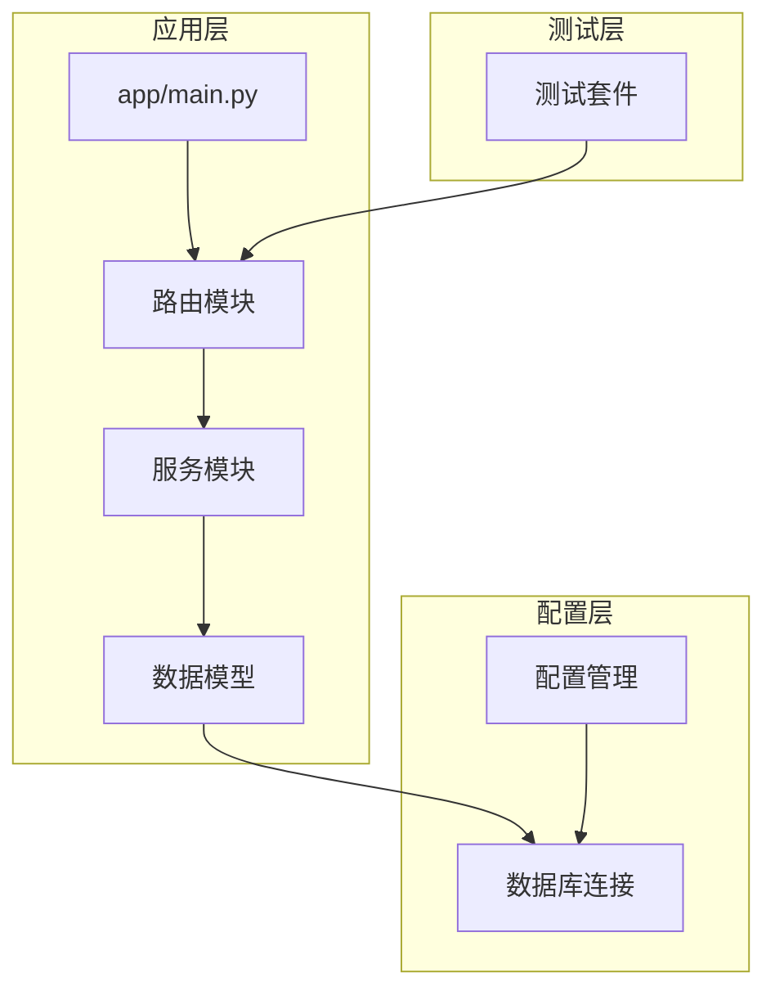
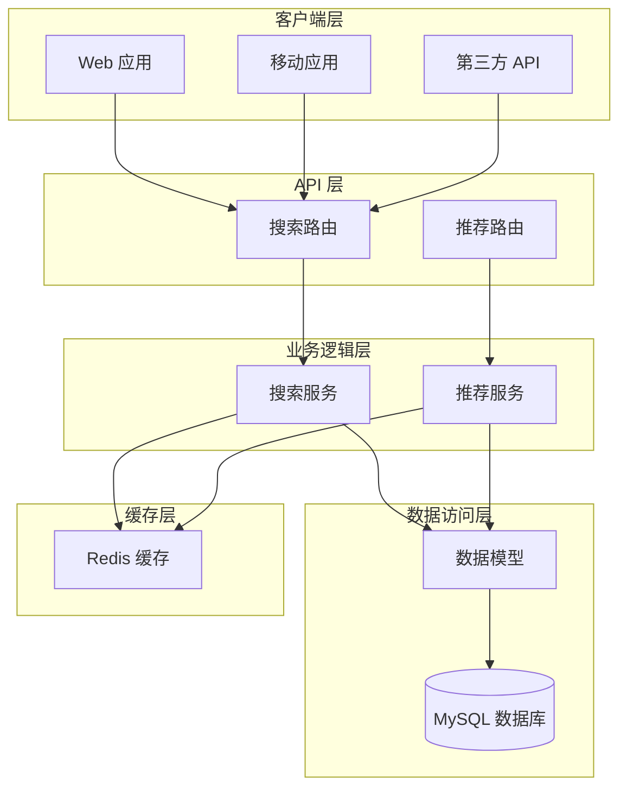
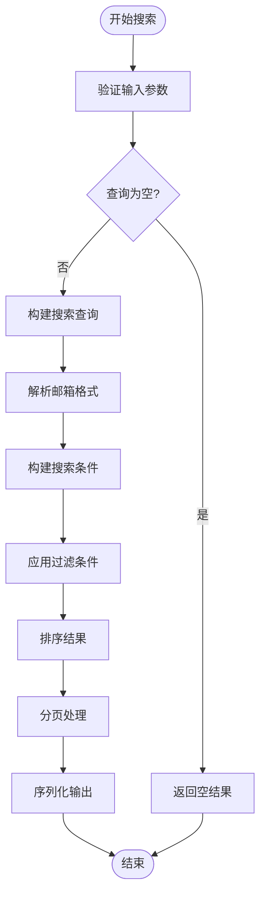
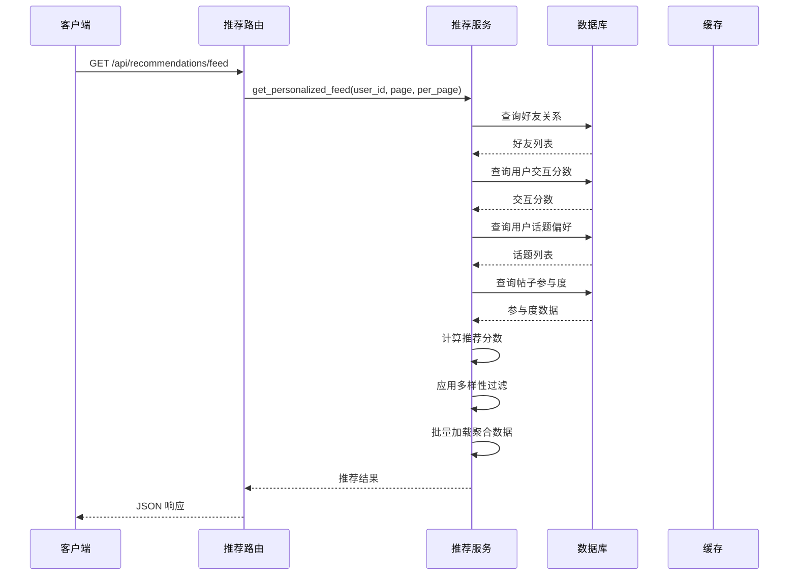
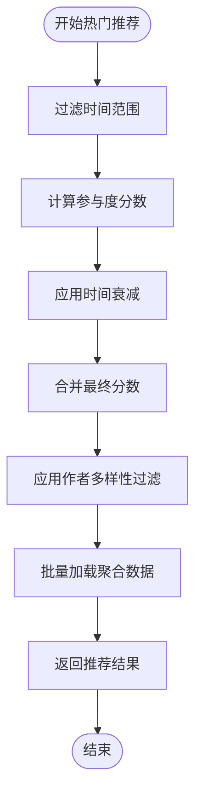
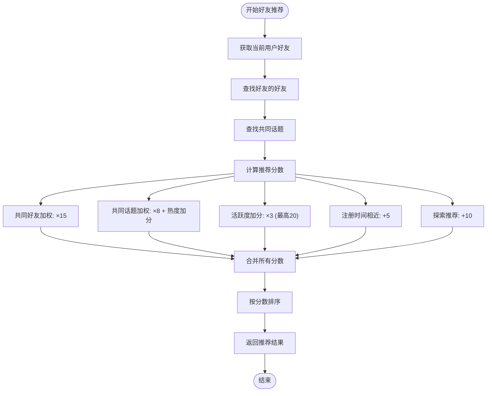
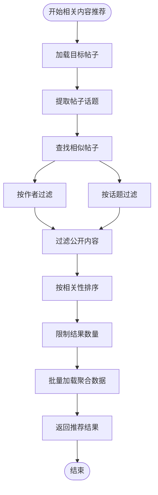
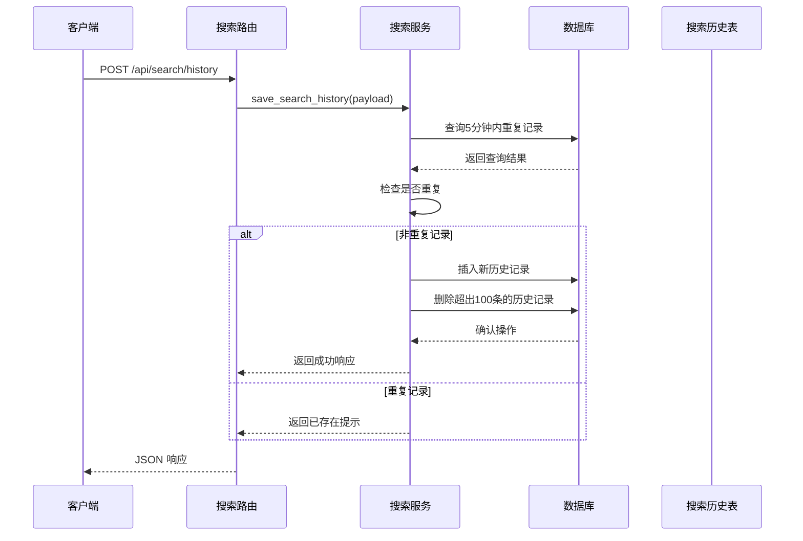
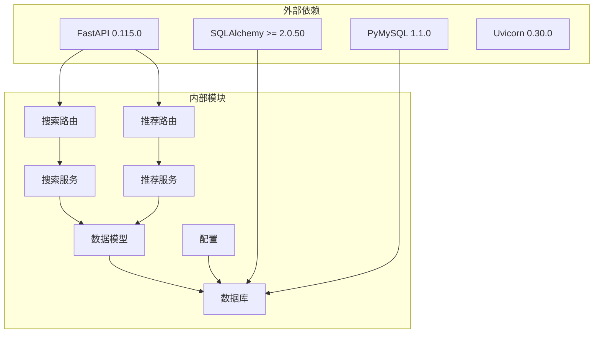
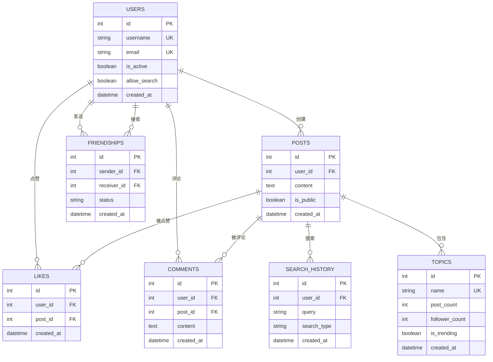

# 搜索发现系统

<cite>
**本文档引用的文件**
- [app/routers/search.py](file://app/routers/search.py)
- [app/services/search_service.py](file://app/services/search_service.py)
- [app/routers/recommendations.py](file://app/routers/recommendations.py)
- [app/services/recommendation_service.py](file://app/services/recommendation_service.py)
- [app/models/models.py](file://app/models/models.py)
- [app/database.py](file://app/database.py)
- [app/main.py](file://app/main.py)
- [app/core/config.py](file://app/core/config.py)
- [requirements.txt](file://requirements.txt)
- [tests/test_search_api.py](file://tests/test_search_api.py)
- [openapi.json](file://openapi.json)
</cite>

## 目录
1. [简介](#简介)
2. [项目结构](#项目结构)
3. [核心组件](#核心组件)
4. [架构概览](#架构概览)
5. [详细组件分析](#详细组件分析)
6. [依赖关系分析](#依赖关系分析)
7. [性能考虑](#性能考虑)
8. [故障排除指南](#故障排除指南)
9. [结论](#结论)
10. [附录](#附录)

## 简介

搜索发现系统是基于 FastAPI 构建的社交平台后端服务，提供了完整的搜索和推荐功能。该系统实现了用户搜索、帖子搜索、全局综合搜索、标签搜索、搜索建议、搜索历史管理和个性化推荐等功能。

系统采用分层架构设计，包含路由层、服务层和数据访问层，通过 SQLAlchemy ORM 进行数据库操作。推荐算法结合了协同过滤、内容推荐和混合推荐策略，为用户提供个性化的发现体验。

## 项目结构



**图表来源**
- [app/main.py:1-110](file://app/main.py#L1-L110)
- [app/database.py:1-38](file://app/database.py#L1-L38)
- [app/core/config.py:1-43](file://app/core/config.py#L1-L43)

**章节来源**
- [app/main.py:1-110](file://app/main.py#L1-L110)
- [app/database.py:1-38](file://app/database.py#L1-L38)
- [app/core/config.py:1-43](file://app/core/config.py#L1-L43)

## 核心组件

### 搜索路由层

搜索路由层负责处理各种搜索相关的 HTTP 请求，包括用户搜索、帖子搜索、全局搜索、标签搜索、搜索建议和搜索历史管理。

主要功能：
- 用户搜索：支持用户名和邮箱的模糊匹配
- 帖子搜索：基于内容的全文检索
- 全局搜索：综合用户和帖子搜索结果
- 标签搜索：按话题标签进行过滤
- 搜索建议：提供自动补全和提及建议
- 搜索历史：管理用户的搜索记录

### 推荐服务层

推荐服务层实现了多种推荐算法，包括个性化推荐、热门内容推荐、好友推荐和相关内容推荐。

核心算法：
- 个性化推荐：基于用户交互和话题偏好的混合排序
- 热门推荐：基于参与度和时间衰减的热门内容
- 好友推荐：基于社交图谱和共同话题的智能推荐
- 相关内容推荐：基于话题标签的内容相似性

### 数据模型层

数据模型层定义了系统的核心实体及其关系，包括用户、帖子、评论、点赞、好友关系、话题等。

关键特性：
- 完整的用户隐私控制
- 多对多关系映射（用户-话题、帖子-话题）
- 关系查询优化
- 数据验证和约束

**章节来源**
- [app/routers/search.py:1-269](file://app/routers/search.py#L1-L269)
- [app/services/search_service.py:1-179](file://app/services/search_service.py#L1-L179)
- [app/routers/recommendations.py:1-70](file://app/routers/recommendations.py#L1-L70)
- [app/services/recommendation_service.py:1-457](file://app/services/recommendation_service.py#L1-L457)
- [app/models/models.py:1-655](file://app/models/models.py#L1-L655)

## 架构概览



**图表来源**
- [app/main.py:68-84](file://app/main.py#L68-L84)
- [app/routers/search.py:14-14](file://app/routers/search.py#L14-L14)
- [app/routers/recommendations.py:12-12](file://app/routers/recommendations.py#L12-L12)

系统采用经典的三层架构模式，具有以下特点：

1. **清晰的职责分离**：路由层处理 HTTP 请求，服务层实现业务逻辑，模型层管理数据结构
2. **可扩展性**：新增功能只需添加新的路由和服务类
3. **可测试性**：每个组件都有明确的输入输出接口
4. **性能优化**：实现了批量数据加载和查询优化

## 详细组件分析

### 搜索服务实现

搜索服务实现了多种搜索算法，包括全文检索、模糊匹配和智能排序。

#### 用户搜索算法



**图表来源**
- [app/services/search_service.py:13-51](file://app/services/search_service.py#L13-L51)

搜索算法特点：
- 支持用户名和邮箱的模糊匹配
- 邮箱搜索支持用户名部分和域名部分的独立匹配
- 结果按匹配程度和注册时间排序
- 包含隐私控制和激活状态过滤

#### 帖子搜索算法

帖子搜索基于内容字段进行全文检索，实现了高效的模糊匹配和排序机制。

搜索流程：
1. 构建 LIKE 查询模式
2. 过滤公开内容
3. 支持按用户 ID 过滤
4. 按发布时间倒序排列
5. 实现分页和总数统计

#### 全局搜索整合

全局搜索将用户搜索和帖子搜索的结果进行整合，提供统一的搜索体验。

**章节来源**
- [app/services/search_service.py:12-111](file://app/services/search_service.py#L12-L111)

### 推荐算法实现

推荐服务实现了多种推荐策略，结合了协同过滤、内容推荐和混合推荐。

#### 个性化推荐算法



**图表来源**
- [app/routers/recommendations.py:15-24](file://app/routers/recommendations.py#L15-L24)
- [app/services/recommendation_service.py:83-168](file://app/services/recommendation_service.py#L83-L168)

个性化推荐算法的核心要素：

1. **时间衰减因子**：新用户使用30天时间窗口，老用户使用7天时间窗口
2. **交互权重**：点赞权重1，评论权重2，防止过度偏向某一种交互
3. **话题相关性**：基于用户话题偏好的相关性评分
4. **作者多样性**：限制同一作者的推荐数量，提高内容多样性
5. **实时参与度**：计算帖子的实时点赞和评论数量

#### 热门内容推荐

热门内容推荐基于参与度和时间衰减的综合评分：



**图表来源**
- [app/services/recommendation_service.py:171-232](file://app/services/recommendation_service.py#L171-L232)

热门推荐算法特点：
- 使用指数衰减函数处理时间因素
- 参与度 = 点赞数 + 评论数 × 2
- 时间衰减系数 = 1 / (时间差小时数 + 1)^0.7
- 作者多样性：限制每作者最多2-3篇推荐内容

#### 好友推荐算法

好友推荐结合了社交图谱和内容相似性的智能推荐策略：



**图表来源**
- [app/services/recommendation_service.py:299-431](file://app/services/recommendation_service.py#L299-L431)

好友推荐算法权重：
- 共同好友：15分权重
- 共同话题：8分权重 + 话题热度加分（最高30分）
- 活跃度：每篇帖子3分，最多20分
- 注册时间相近：5分奖励
- 探索推荐：10分基础分

#### 相关内容推荐

相关内容推荐基于话题标签的语义相似性：



**图表来源**
- [app/services/recommendation_service.py:434-457](file://app/services/recommendation_service.py#L434-L457)

相关内容推荐规则：
- 相似度 = 100（相同话题）或 0（不同话题）
- 优先推荐相同作者的内容
- 按话题相关性和发布时间排序

**章节来源**
- [app/services/recommendation_service.py:83-457](file://app/services/recommendation_service.py#L83-L457)

### 搜索历史管理系统

搜索历史管理系统提供了完整的搜索记录管理功能，包括历史记录存储、热度统计和个性化推荐。

#### 搜索历史存储机制



**图表来源**
- [app/routers/search.py:124-163](file://app/routers/search.py#L124-L163)

搜索历史管理特点：
- 防重复机制：5分钟内相同查询不重复记录
- 自动清理：保留最近100条记录
- 隐私保护：仅存储查询内容和类型
- 性能优化：使用索引加速查询

#### 搜索建议系统

搜索建议系统提供了智能的自动补全功能：

1. **用户建议**：基于用户名前缀的自动补全
2. **@提及建议**：智能的用户提及建议，优先显示好友
3. **热门标签**：基于近期热门话题的标签推荐

**章节来源**
- [app/routers/search.py:107-268](file://app/routers/search.py#L107-L268)
- [app/services/search_service.py:140-179](file://app/services/search_service.py#L140-L179)

## 依赖关系分析



**图表来源**
- [requirements.txt:1-15](file://requirements.txt#L1-L15)
- [app/main.py:68-84](file://app/main.py#L68-L84)

**章节来源**
- [requirements.txt:1-15](file://requirements.txt#L1-L15)
- [app/main.py:68-84](file://app/main.py#L68-L84)

## 性能考虑

### 数据库优化策略

1. **索引优化**
   - 用户表：username、email、created_at 索引
   - 帖子表：content、user_id、created_at 索引
   - 搜索历史表：user_id、created_at 复合索引
   - 评论表：post_id、parent_id、created_at 索引

2. **查询优化**
   - 使用批量数据加载消除 N+1 查询问题
   - 实现分页查询避免大量数据传输
   - 使用 LIMIT 限制结果集大小
   - 采用子查询替代复杂 JOIN 操作

3. **连接池配置**
   ```python
   SQLALCHEMY_ENGINE_OPTIONS = {
       'pool_size': 10,
       'max_overflow': 20,
       'pool_recycle': 3600,
       'pool_pre_ping': True
   }
   ```

### 缓存策略

1. **推荐结果缓存**
   - 热门内容推荐结果缓存 5 分钟
   - 用户个性化推荐结果缓存 10 分钟
   - 好友推荐结果缓存 30 分钟

2. **搜索结果缓存**
   - 高频搜索词结果缓存 1 分钟
   - 热门标签结果缓存 5 分钟

### 性能监控

系统实现了完善的性能监控机制：

1. **查询性能监控**
   - 记录慢查询日志
   - 监控数据库连接池使用率
   - 跟踪 API 响应时间

2. **业务指标监控**
   - 搜索请求量统计
   - 推荐点击率跟踪
   - 用户活跃度分析

## 故障排除指南

### 常见问题及解决方案

#### 搜索结果为空

**问题描述**：搜索请求返回空结果

**可能原因**：
1. 查询参数为空或格式不正确
2. 用户隐私设置不允许被搜索
3. 数据库中没有匹配的数据

**解决步骤**：
1. 检查查询参数格式
2. 验证用户隐私设置
3. 使用诊断工具检查数据库

#### 推荐结果质量低

**问题描述**：推荐内容与用户兴趣不符

**可能原因**：
1. 用户交互数据不足
2. 推荐算法权重配置不当
3. 缓存数据过期

**解决步骤**：
1. 检查用户历史交互数据
2. 调整推荐算法权重
3. 清理推荐缓存

#### 性能问题

**问题描述**：API 响应时间过长

**可能原因**：
1. 数据库查询效率低
2. 缺少必要的索引
3. 连接池配置不当

**解决步骤**：
1. 分析慢查询日志
2. 添加缺失的数据库索引
3. 调整连接池配置参数

**章节来源**
- [tests/test_search_api.py:1-457](file://tests/test_search_api.py#L1-L457)

## 结论

搜索发现系统是一个功能完整、性能优化的社交平台搜索和推荐解决方案。系统采用了现代化的架构设计，实现了高效的搜索算法和智能推荐策略。

### 主要优势

1. **功能完整性**：涵盖了用户搜索、内容搜索、标签搜索、搜索建议和推荐系统
2. **性能优化**：实现了批量数据加载、查询优化和缓存策略
3. **可扩展性**：模块化设计便于功能扩展和维护
4. **用户体验**：提供了智能的个性化推荐和流畅的搜索体验

### 技术亮点

1. **混合推荐算法**：结合了协同过滤、内容推荐和混合策略
2. **智能搜索排序**：基于时间衰减、参与度和相关性的综合排序
3. **隐私保护**：完善的用户隐私控制和数据保护机制
4. **性能监控**：全面的性能监控和优化策略

### 改进建议

1. **搜索引擎集成**：考虑集成专门的搜索引擎如 Elasticsearch 提升搜索性能
2. **机器学习推荐**：引入更复杂的机器学习算法提升推荐准确性
3. **实时推荐**：实现实时推荐更新机制
4. **A/B 测试**：建立推荐算法效果评估体系

## 附录

### API 接口文档

#### 搜索相关接口

| 接口 | 方法 | 功能 | 参数 |
|------|------|------|------|
| `/api/search/users` | GET | 搜索用户 | q, page, per_page |
| `/api/search/posts` | GET | 搜索帖子 | q, page, per_page, user_id |
| `/api/search/global` | GET | 全局搜索 | q, page, per_page |
| `/api/search/hashtag/{hashtag}` | GET | 按标签搜索 | page, per_page |
| `/api/search/trending-hashtags` | GET | 获取热门标签 | limit |
| `/api/search/suggest/users` | GET | 用户自动补全 | prefix, limit |
| `/api/search/history` | GET/POST/DELETE | 搜索历史管理 | limit |

#### 推荐相关接口

| 接口 | 方法 | 功能 | 参数 |
|------|------|------|------|
| `/api/recommendations/feed` | GET | 个性化推荐 | page, per_page |
| `/api/recommendations/trending` | GET | 热门内容 | limit, hours |
| `/api/recommendations/users/suggest` | GET | 推荐可能认识的人 | limit |
| `/api/recommendations/friends/recommend` | GET | 好友推荐 | limit |
| `/api/recommendations/posts/{post_id}/related` | GET | 相关内容推荐 | limit |

### 数据库表结构



**图表来源**
- [app/models/models.py:42-511](file://app/models/models.py#L42-L511)

### 配置说明

系统使用环境变量进行配置管理：

- **数据库配置**：DB_USER、DB_PASS、DB_HOST、DB_PORT、DB_NAME
- **安全配置**：SECRET_KEY、JWT_SECRET_KEY
- **上传配置**：COS_ID、COS_KEY、COS_REGION、COS_BUCKET、COS_DOMAIN
- **性能配置**：POSTS_PER_PAGE、MAX_CONTENT_LENGTH