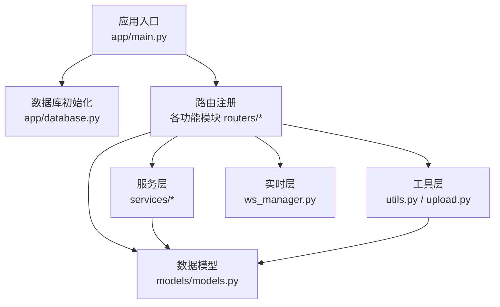
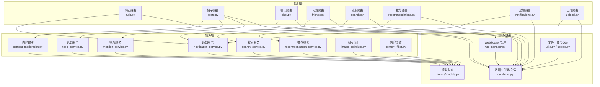
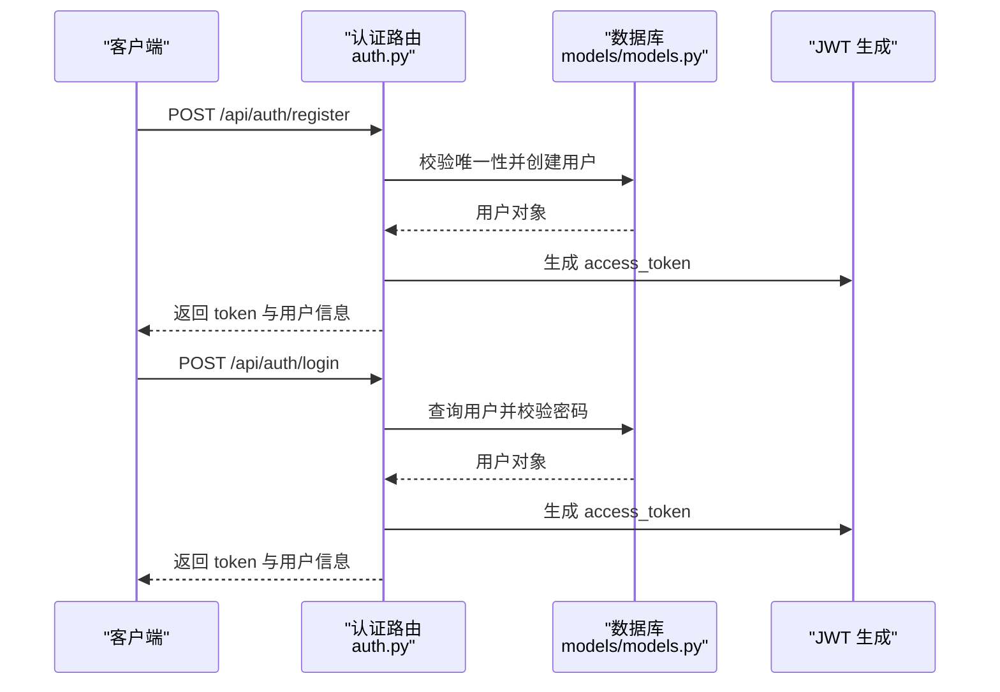
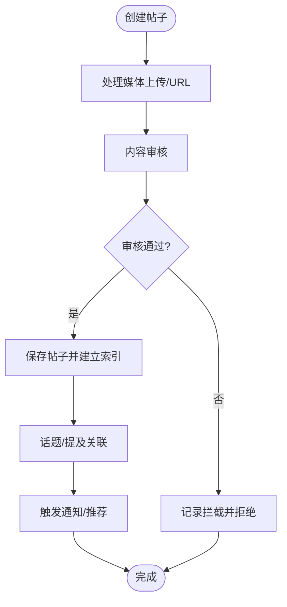
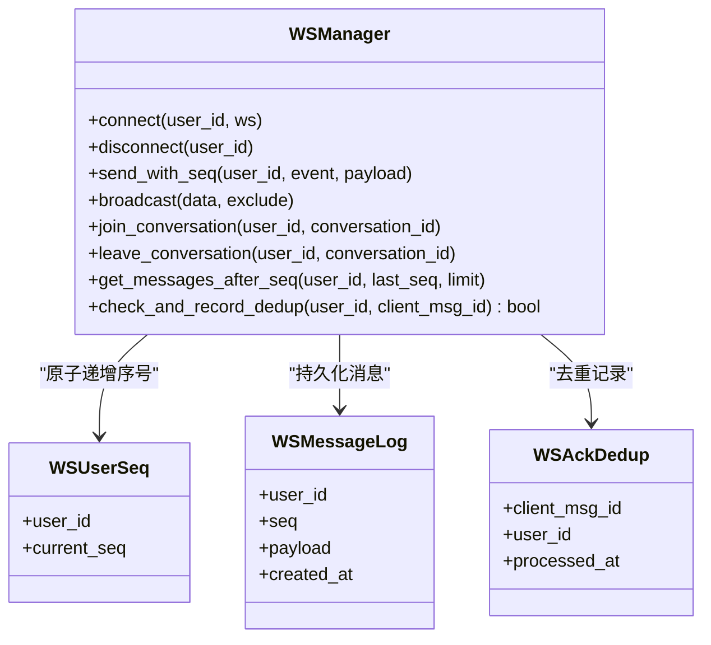
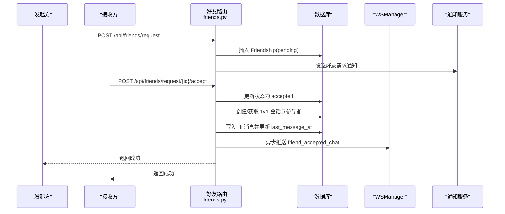
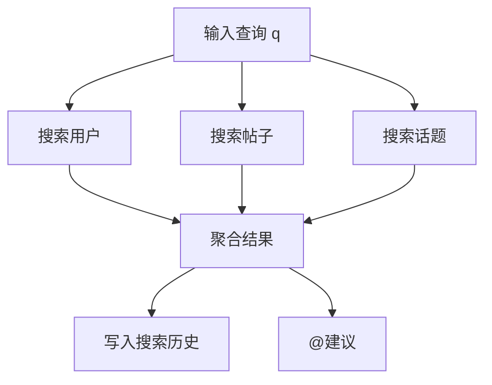
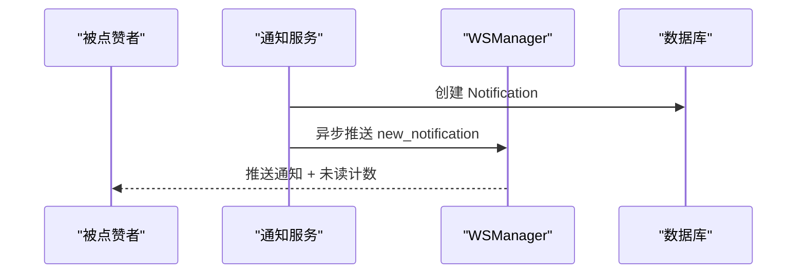
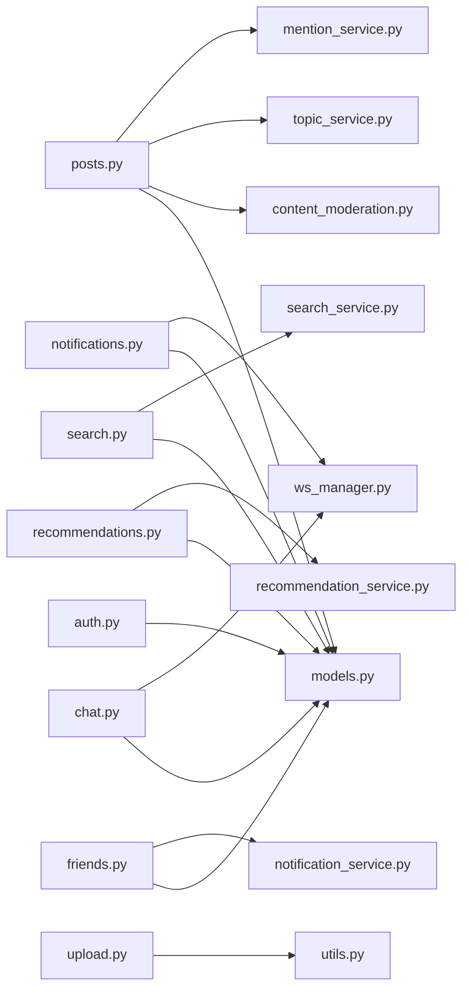

# 核心功能特性

<cite>
**本文档引用的文件**
- [app/main.py](file://app/main.py)
- [app/database.py](file://app/database.py)
- [app/models/models.py](file://app/models/models.py)
- [app/ws_manager.py](file://app/ws_manager.py)
- [app/utils.py](file://app/utils.py)
- [app/routers/auth.py](file://app/routers/auth.py)
- [app/routers/posts.py](file://app/routers/posts.py)
- [app/routers/friends.py](file://app/routers/friends.py)
- [app/routers/chat.py](file://app/routers/chat.py)
- [app/routers/notifications.py](file://app/routers/notifications.py)
- [app/routers/search.py](file://app/routers/search.py)
- [app/routers/recommendations.py](file://app/routers/recommendations.py)
- [app/routers/upload.py](file://app/routers/upload.py)
- [app/services/notification_service.py](file://app/services/notification_service.py)
- [app/services/content_moderation.py](file://app/services/content_moderation.py)
- [app/services/content_filter.py](file://app/services/content_filter.py)
- [app/services/image_optimizer.py](file://app/services/image_optimizer.py)
- [app/services/mention_service.py](file://app/services/mention_service.py)
- [app/services/recommendation_service.py](file://app/services/recommendation_service.py)
- [app/services/search_service.py](file://app/services/search_service.py)
- [app/services/topic_service.py](file://app/services/topic_service.py)
</cite>

## 目录
1. [简介](#简介)
2. [项目结构](#项目结构)
3. [核心组件](#核心组件)
4. [架构总览](#架构总览)
5. [详细组件分析](#详细组件分析)
6. [依赖关系分析](#依赖关系分析)
7. [性能考量](#性能考量)
8. [故障排查指南](#故障排查指南)
9. [结论](#结论)
10. [附录](#附录)

## 简介
本项目为基于 FastAPI 的社交平台后端，提供完整的用户认证、社交内容管理、实时通信、好友社交、搜索发现、通知推送等核心能力。系统采用模块化设计，围绕数据模型与服务层解耦，结合 WebSocket 实现实时交互，并通过腾讯云 COS 提供稳定的对象存储能力。

## 项目结构
- 应用入口与中间件：应用启动、CORS、安全头、路由注册
- 数据层：SQLAlchemy 2.0 模型与会话管理
- 路由层：按功能域划分的 API 控制器
- 服务层：内容审核、推荐、搜索、通知等业务逻辑
- 工具层：文件上传（COS）、图片优化等通用能力
- 实时层：WebSocket 管理器与消息序号机制

图表来源
- [app/main.py:1-110](file://app/main.py#L1-L110)
- [app/database.py:1-38](file://app/database.py#L1-L38)
- [app/models/models.py:1-655](file://app/models/models.py#L1-L655)

章节来源
- [app/main.py:1-110](file://app/main.py#L1-L110)
- [app/database.py:1-38](file://app/database.py#L1-L38)

## 核心组件
- 用户认证系统：JWT 令牌签发与校验、密码哈希兼容、隐私设置、忘记/重置密码
- 社交内容管理：帖子发布（文本/图片/视频）、内容审核、话题与@提及、浏览统计
- 实时通信系统：WebSocket 连接管理、消息序号与断线补发、ACK 去重、会话广播
- 好友社交系统：好友请求、接受/拒绝、会话创建、在线状态
- 搜索发现系统：用户/帖子/话题搜索、全局搜索、热门标签、搜索历史、@建议
- 通知系统：通知创建、推送、标记已读/全部已读、删除与偏好设置
- 文件上传系统：COS 预签名直传、确认与重命名、删除与信息查询

章节来源
- [app/routers/auth.py:1-486](file://app/routers/auth.py#L1-L486)
- [app/routers/posts.py:1-405](file://app/routers/posts.py#L1-L405)
- [app/routers/chat.py:1-538](file://app/routers/chat.py#L1-L538)
- [app/routers/friends.py:1-385](file://app/routers/friends.py#L1-L385)
- [app/routers/search.py:1-269](file://app/routers/search.py#L1-L269)
- [app/routers/notifications.py:1-208](file://app/routers/notifications.py#L1-L208)
- [app/routers/upload.py:1-224](file://app/routers/upload.py#L1-L224)
- [app/ws_manager.py:1-308](file://app/ws_manager.py#L1-L308)

## 架构总览
系统采用“路由-服务-模型-工具”的分层架构，WebSocket 作为实时通道与 HTTP API 并行工作，文件上传通过 COS 实现高可靠对象存储。

图表来源
- [app/routers/auth.py:1-486](file://app/routers/auth.py#L1-L486)
- [app/routers/posts.py:1-405](file://app/routers/posts.py#L1-L405)
- [app/routers/chat.py:1-538](file://app/routers/chat.py#L1-L538)
- [app/routers/friends.py:1-385](file://app/routers/friends.py#L1-L385)
- [app/routers/search.py:1-269](file://app/routers/search.py#L1-L269)
- [app/routers/recommendations.py:1-70](file://app/routers/recommendations.py#L1-L70)
- [app/routers/notifications.py:1-208](file://app/routers/notifications.py#L1-L208)
- [app/routers/upload.py:1-224](file://app/routers/upload.py#L1-L224)
- [app/services/notification_service.py:1-233](file://app/services/notification_service.py#L1-L233)
- [app/services/content_moderation.py:1-258](file://app/services/content_moderation.py#L1-L258)
- [app/services/recommendation_service.py](file://app/services/recommendation_service.py)
- [app/services/search_service.py](file://app/services/search_service.py)
- [app/services/topic_service.py](file://app/services/topic_service.py)
- [app/services/mention_service.py](file://app/services/mention_service.py)
- [app/services/image_optimizer.py](file://app/services/image_optimizer.py)
- [app/services/content_filter.py](file://app/services/content_filter.py)
- [app/models/models.py:1-655](file://app/models/models.py#L1-L655)
- [app/database.py:1-38](file://app/database.py#L1-L38)
- [app/ws_manager.py:1-308](file://app/ws_manager.py#L1-L308)
- [app/utils.py:1-220](file://app/utils.py#L1-L220)

## 详细组件分析

### 用户认证系统
- 核心价值：统一身份标识、安全访问控制、隐私与通知偏好管理
- 主要特性：
  - JWT 令牌签发与刷新，支持 HS256 算法
  - 密码哈希兼容（bcrypt 与旧版 scrypt），保障迁移期安全
  - 个人资料更新、隐私设置（可见性、搜索权限、好友请求策略）
  - 忘记密码验证码流程（内存令牌，15分钟有效期）
- 使用场景：用户注册/登录、资料维护、隐私控制、安全退出
- 实现要点：路由层参数校验与异常处理；服务层通过依赖注入获取数据库会话；模型字段映射与响应序列化

图表来源
- [app/routers/auth.py:184-246](file://app/routers/auth.py#L184-L246)
- [app/models/models.py:42-98](file://app/models/models.py#L42-L98)

章节来源
- [app/routers/auth.py:1-486](file://app/routers/auth.py#L1-L486)
- [app/models/models.py:1-655](file://app/models/models.py#L1-L655)

### 社交内容管理
- 核心价值：内容创作与传播、社区治理与体验优化
- 主要特性：
  - 帖子发布：文本、多图 URL、视频 URL；支持自定义可见性与指定可见用户
  - 内容审核：垃圾信息、敏感词、不当内容、仇恨言论检测与过滤
  - 话题与@提及：自动识别与关联，提升内容发现与互动
  - 浏览统计：浏览计数与去重记录
- 使用场景：用户发布动态、参与讨论、内容运营
- 实现要点：上传路由对接 COS；图片优化服务；内容审核服务集成敏感词过滤；话题/提及服务联动

图表来源
- [app/routers/posts.py:22-140](file://app/routers/posts.py#L22-L140)
- [app/services/content_moderation.py:74-126](file://app/services/content_moderation.py#L74-L126)
- [app/services/topic_service.py](file://app/services/topic_service.py)
- [app/services/mention_service.py](file://app/services/mention_service.py)

章节来源
- [app/routers/posts.py:1-405](file://app/routers/posts.py#L1-L405)
- [app/services/content_moderation.py:1-258](file://app/services/content_moderation.py#L1-L258)

### 实时通信系统
- 核心价值：低延迟消息传递、断线恢复、去重幂等
- 主要特性：
  - 连接管理：单用户连接、会话房间、在线状态
  - 消息序号：用户维度单调递增，持久化日志，断线补发
  - ACK 去重：clientMsgId 去重与定时清理
  - 广播与推送：会话内广播、用户级推送、错误通知
- 使用场景：即时聊天、好友互动、系统通知
- 实现要点：WSManager 单例管理连接与序号；消息持久化保证可靠性；与通知/聊天路由协同

图表来源
- [app/ws_manager.py:20-308](file://app/ws_manager.py#L20-L308)
- [app/models/models.py:625-655](file://app/models/models.py#L625-L655)

章节来源
- [app/ws_manager.py:1-308](file://app/ws_manager.py#L1-L308)
- [app/models/models.py:1-655](file://app/models/models.py#L1-L655)

### 好友社交系统
- 核心价值：关系网络构建、私密会话、社交发现
- 主要特性：
  - 好友请求：限制策略（所有人/仅好友/好友的朋友）
  - 接受/拒绝/取消：状态机与事务一致性
  - 会话创建：1v1 会话与参与者登记，自动 Hi 消息
  - 在线状态：基于 WSManager 的在线查询
- 使用场景：添加好友、私聊、社交发现
- 实现要点：通知服务异步推送；WSManager 协同推送 Hi 消息

图表来源
- [app/routers/friends.py:19-134](file://app/routers/friends.py#L19-L134)
- [app/services/notification_service.py:144-184](file://app/services/notification_service.py#L144-L184)
- [app/ws_manager.py:359-385](file://app/ws_manager.py#L359-L385)

章节来源
- [app/routers/friends.py:1-385](file://app/routers/friends.py#L1-L385)
- [app/services/notification_service.py:1-233](file://app/services/notification_service.py#L1-L233)

### 搜索发现系统
- 核心价值：信息检索与社交发现，提升用户粘性
- 主要特性：
  - 用户/帖子/话题搜索、全局综合搜索
  - 热门标签、搜索历史、@用户建议
  - 友好度排序：基于好友关系与活跃度
- 使用场景：查找用户、发现内容、社交导航
- 实现要点：SearchService 封装查询逻辑；TopicService/mention_service 协助内容关联

图表来源
- [app/routers/search.py:17-269](file://app/routers/search.py#L17-L269)
- [app/services/search_service.py](file://app/services/search_service.py)
- [app/services/topic_service.py](file://app/services/topic_service.py)

章节来源
- [app/routers/search.py:1-269](file://app/routers/search.py#L1-L269)
- [app/services/search_service.py](file://app/services/search_service.py)

### 通知系统
- 核心价值：及时反馈与闭环交互，降低用户流失
- 主要特性：
  - 通知类型：点赞、评论、好友请求/接受、消息、@提及
  - 实时推送：WSManager 推送未读计数与通知体
  - 偏好设置：推送/声音/消息提醒开关
- 使用场景：互动反馈、社交提醒、消息聚合
- 实现要点：NotificationService 统一封装创建与推送；异步事件避免阻塞

图表来源
- [app/services/notification_service.py:20-53](file://app/services/notification_service.py#L20-L53)
- [app/routers/notifications.py:64-120](file://app/routers/notifications.py#L64-L120)

章节来源
- [app/routers/notifications.py:1-208](file://app/routers/notifications.py#L1-L208)
- [app/services/notification_service.py:1-233](file://app/services/notification_service.py#L1-L233)

### 文件上传系统
- 核心价值：稳定高效的媒体资源管理
- 主要特性：
  - 预签名直传：生成短期有效 URL，前端直传 COS
  - 确认与重命名：临时文件确认后重命名并清理
  - 删除与信息查询：按 URL 删除与元数据查询
- 使用场景：头像/封面上传、帖子媒体、聊天附件
- 实现要点：FileUploader 封装 COS 操作；upload_type 映射目录；content_type 推断

章节来源
- [app/routers/upload.py:1-224](file://app/routers/upload.py#L1-L224)
- [app/utils.py:14-220](file://app/utils.py#L14-L220)

## 依赖关系分析
- 路由层依赖服务层与模型层，服务层依赖数据库会话与工具层
- WebSocket 与通知服务相互协作，确保实时性与可靠性
- 文件上传与内容审核贯穿帖子发布流程

图表来源
- [app/routers/auth.py:1-486](file://app/routers/auth.py#L1-L486)
- [app/routers/posts.py:1-405](file://app/routers/posts.py#L1-L405)
- [app/routers/chat.py:1-538](file://app/routers/chat.py#L1-L538)
- [app/routers/friends.py:1-385](file://app/routers/friends.py#L1-L385)
- [app/routers/search.py:1-269](file://app/routers/search.py#L1-L269)
- [app/routers/recommendations.py:1-70](file://app/routers/recommendations.py#L1-L70)
- [app/routers/notifications.py:1-208](file://app/routers/notifications.py#L1-L208)
- [app/routers/upload.py:1-224](file://app/routers/upload.py#L1-L224)
- [app/services/content_moderation.py:1-258](file://app/services/content_moderation.py#L1-L258)
- [app/services/topic_service.py](file://app/services/topic_service.py)
- [app/services/mention_service.py](file://app/services/mention_service.py)
- [app/services/recommendation_service.py](file://app/services/recommendation_service.py)
- [app/services/search_service.py](file://app/services/search_service.py)
- [app/services/notification_service.py:1-233](file://app/services/notification_service.py#L1-L233)
- [app/ws_manager.py:1-308](file://app/ws_manager.py#L1-L308)
- [app/utils.py:1-220](file://app/utils.py#L1-L220)
- [app/models/models.py:1-655](file://app/models/models.py#L1-L655)

章节来源
- [app/main.py:1-110](file://app/main.py#L1-L110)
- [app/database.py:1-38](file://app/database.py#L1-L38)

## 性能考量
- 数据库连接池：SQLAlchemy 会话工厂与连接参数配置，减少连接开销
- 批量查询：推荐服务批量加载帖子与统计，避免 N+1 查询
- 分页与限制：搜索/动态/消息均采用分页与上限控制，防止超大数据集
- WebSocket 序号与去重：原子序号与 ACK 去重降低重复投递与存储压力
- 图片优化：上传前压缩，降低带宽与存储成本

## 故障排查指南
- 认证失败：检查用户名/邮箱是否存在、密码哈希兼容性、JWT 秘钥配置
- 上传失败：确认 COS 配置、预签名 URL 生成与确认流程、文件类型与大小限制
- 内容审核拦截：查看敏感词过滤与垃圾信息规则，必要时调整策略
- WebSocket 掉线：检查序号持久化、断线补发与去重记录，确认客户端重连逻辑
- 通知未达：检查通知服务异步推送与 WSManager 在线状态

章节来源
- [app/routers/auth.py:365-409](file://app/routers/auth.py#L365-L409)
- [app/routers/upload.py:50-107](file://app/routers/upload.py#L50-L107)
- [app/services/content_moderation.py:74-126](file://app/services/content_moderation.py#L74-L126)
- [app/ws_manager.py:170-247](file://app/ws_manager.py#L170-L247)
- [app/services/notification_service.py:20-53](file://app/services/notification_service.py#L20-L53)

## 结论
NanTuPy 以模块化与分层设计为核心，结合内容审核、实时通信与推荐搜索，构建了完整的社交平台后端能力。通过 WebSocket 序号机制与通知服务，系统在可靠性与用户体验上取得平衡；借助 COS 与图片优化，兼顾性能与成本。建议持续完善推荐算法与审核策略，增强平台治理能力。

## 附录
- 配置项参考：JWT 秘钥、COS 参数、数据库连接池参数
- 常用接口：认证、帖子、聊天、好友、搜索、通知、上传
- 数据模型：用户、帖子、评论、点赞、好友、会话、消息、通知、话题、屏蔽、举报、搜索历史、漫展相关