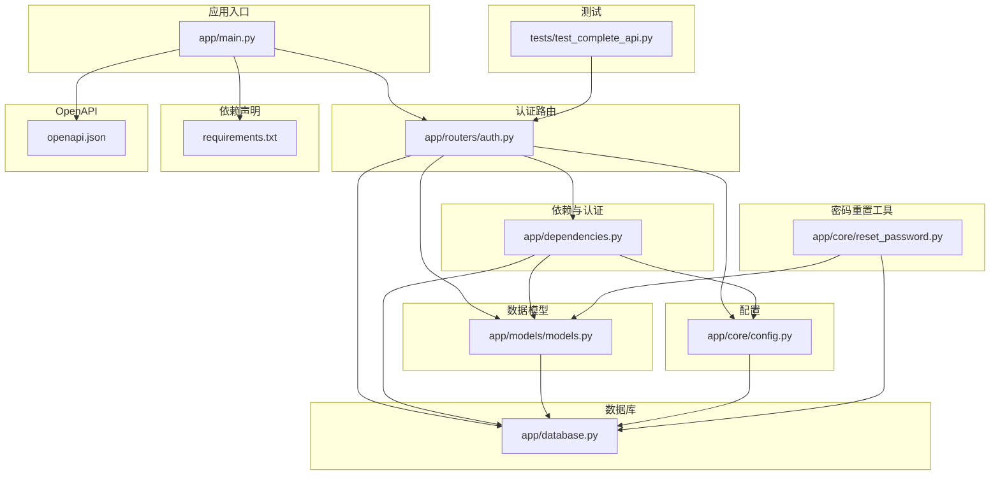
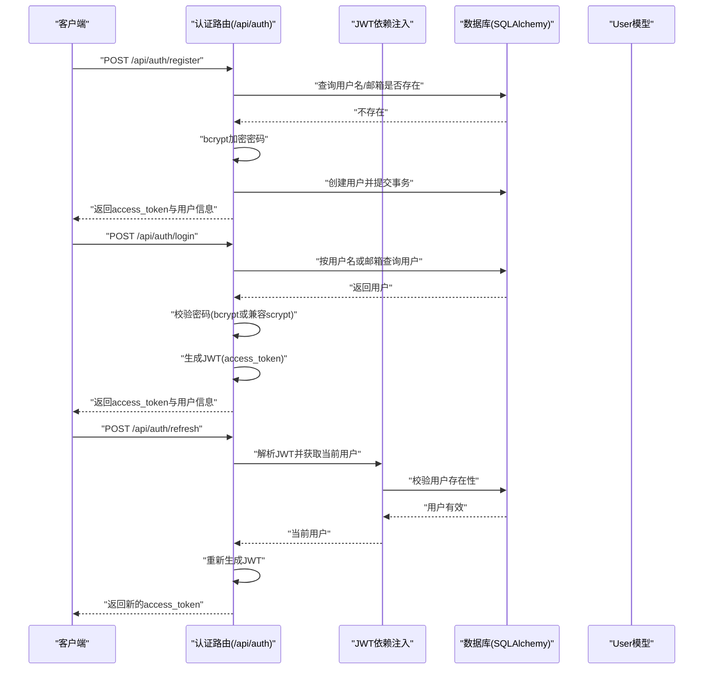
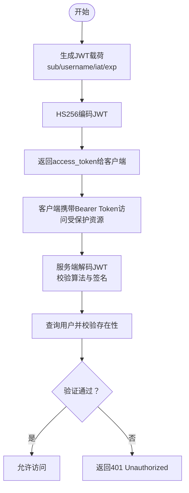
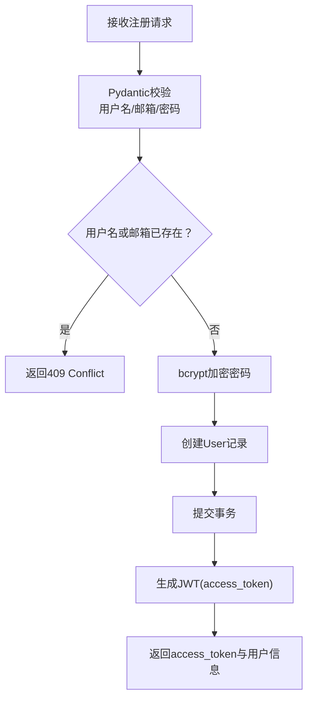
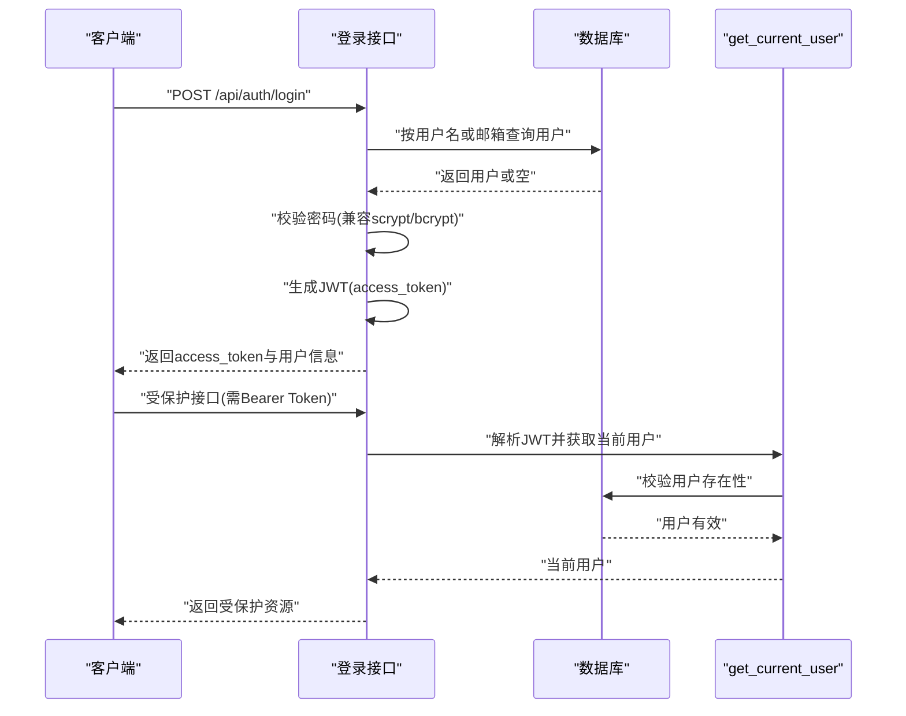
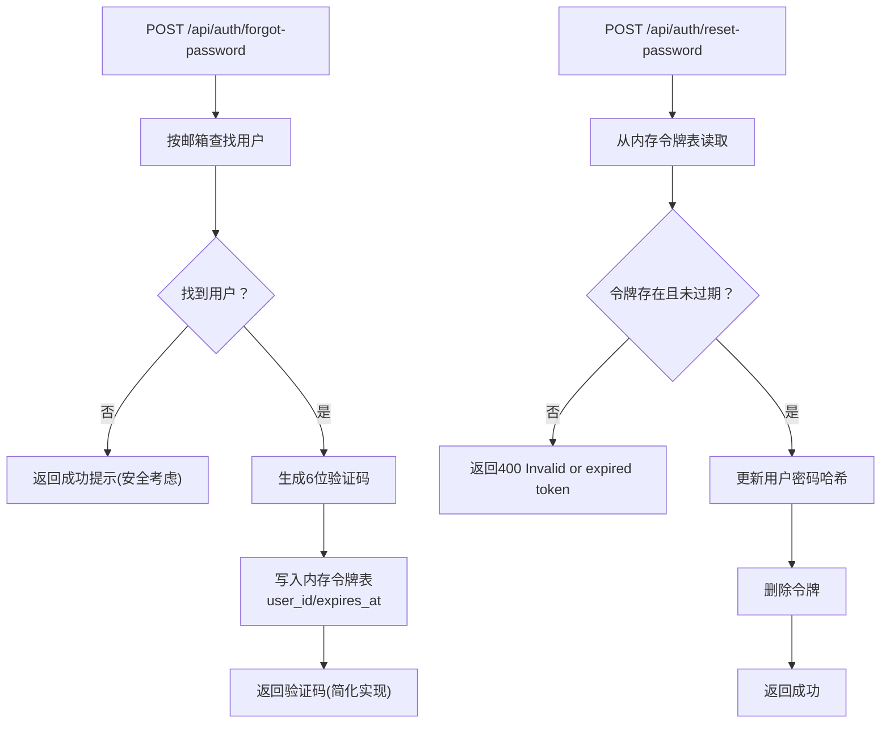
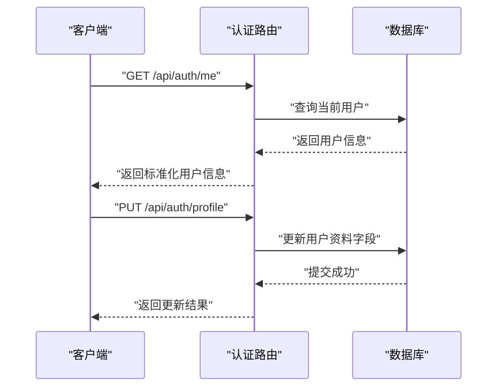
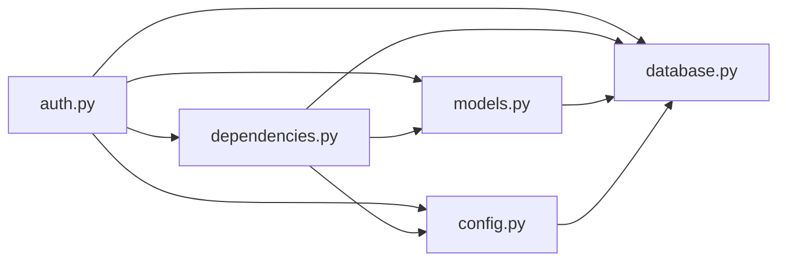

# 用户认证系统

<cite>
**本文档引用的文件**
- [app/routers/auth.py](file://app/routers/auth.py)
- [app/dependencies.py](file://app/dependencies.py)
- [app/models/models.py](file://app/models/models.py)
- [app/core/config.py](file://app/core/config.py)
- [app/database.py](file://app/database.py)
- [app/main.py](file://app/main.py)
- [requirements.txt](file://requirements.txt)
- [openapi.json](file://openapi.json)
- [app/core/reset_password.py](file://app/core/reset_password.py)
- [tests/test_complete_api.py](file://tests/test_complete_api.py)
</cite>

## 目录
1. [简介](#简介)
2. [项目结构](#项目结构)
3. [核心组件](#核心组件)
4. [架构总览](#架构总览)
5. [详细组件分析](#详细组件分析)
6. [依赖分析](#依赖分析)
7. [性能考虑](#性能考虑)
8. [故障排除指南](#故障排除指南)
9. [结论](#结论)
10. [附录](#附录)

## 简介
本文件为 NanTuPy 社交平台后端的用户认证系统技术文档，覆盖以下主题：
- JWT 令牌认证机制：令牌生成、验证与刷新流程
- 用户注册：数据验证、密码加密（bcrypt）、头像初始化
- 登录验证：权限检查、会话管理与安全防护
- 密码重置：令牌管理、时效控制与安全策略
- 完整 API 接口文档：请求参数、响应格式与错误处理
- 实际代码示例路径：帮助定位关键实现细节

该系统基于 FastAPI + SQLAlchemy + JWT + bcrypt 构建，提供 RESTful 认证接口与基础的隐私设置、个人资料管理能力。

## 项目结构
认证相关的核心模块分布如下：
- 路由层：认证路由集中于 app/routers/auth.py，包含注册、登录、刷新、密码重置、个人资料、隐私设置等接口
- 依赖注入与认证：app/dependencies.py 提供 JWT 解析、当前用户获取、可选用户获取、管理员权限校验
- 数据模型：app/models/models.py 定义 User 等核心模型，包含密码哈希字段与隐私设置
- 配置：app/core/config.py 提供 SECRET_KEY、JWT_SECRET_KEY、数据库连接等配置
- 数据库：app/database.py 提供 SQLAlchemy 引擎、Session 与表初始化
- 应用入口：app/main.py 注册路由、中间件与 CORS 设置
- 依赖声明：requirements.txt 指定 FastAPI、SQLAlchemy、python-jose、passlib[bcrypt] 等依赖
- OpenAPI：openapi.json 提供接口规范与安全方案
- 密码重置辅助：app/core/reset_password.py 提供命令行重置密码工具
- 测试：tests/test_complete_api.py 展示了注册、登录、获取当前用户资料等流程

**图表来源**
- [app/main.py:1-110](file://app/main.py#L1-L110)
- [app/routers/auth.py:1-486](file://app/routers/auth.py#L1-L486)
- [app/dependencies.py:1-63](file://app/dependencies.py#L1-L63)
- [app/models/models.py:1-655](file://app/models/models.py#L1-L655)
- [app/core/config.py:1-43](file://app/core/config.py#L1-L43)
- [app/database.py:1-38](file://app/database.py#L1-L38)
- [requirements.txt:1-15](file://requirements.txt#L1-L15)
- [openapi.json](file://openapi.json)
- [app/core/reset_password.py:1-52](file://app/core/reset_password.py#L1-L52)
- [tests/test_complete_api.py:157-194](file://tests/test_complete_api.py#L157-L194)

**章节来源**
- [app/main.py:1-110](file://app/main.py#L1-L110)
- [app/routers/auth.py:1-486](file://app/routers/auth.py#L1-L486)
- [app/dependencies.py:1-63](file://app/dependencies.py#L1-L63)
- [app/models/models.py:1-655](file://app/models/models.py#L1-L655)
- [app/core/config.py:1-43](file://app/core/config.py#L1-L43)
- [app/database.py:1-38](file://app/database.py#L1-L38)
- [requirements.txt:1-15](file://requirements.txt#L1-L15)
- [openapi.json](file://openapi.json)
- [app/core/reset_password.py:1-52](file://app/core/reset_password.py#L1-L52)
- [tests/test_complete_api.py:157-194](file://tests/test_complete_api.py#L157-L194)

## 核心组件
- 认证路由（/api/auth）：提供注册、登录、刷新、忘记密码、重置密码、个人资料、隐私设置等接口
- JWT 依赖注入：HTTPBearer 解析 Authorization 头，解码 HS256 JWT，校验过期与用户有效性
- 数据模型：User 模型包含用户名、邮箱、密码哈希、隐私设置等字段
- 配置：JWT_SECRET_KEY、数据库连接、上传限制等
- 数据库：SQLAlchemy 会话管理与表初始化
- 密码重置：内存令牌存储（简单实现），支持 15 分钟有效期

**章节来源**
- [app/routers/auth.py:18-486](file://app/routers/auth.py#L18-L486)
- [app/dependencies.py:16-63](file://app/dependencies.py#L16-L63)
- [app/models/models.py:42-98](file://app/models/models.py#L42-L98)
- [app/core/config.py:7-43](file://app/core/config.py#L7-L43)
- [app/database.py:9-38](file://app/database.py#L9-L38)
- [app/core/reset_password.py:12-52](file://app/core/reset_password.py#L12-L52)

## 架构总览
认证系统采用分层架构：
- 表现层：FastAPI 路由与 Pydantic Schema
- 业务层：认证逻辑（注册、登录、密码变更、密码重置、刷新）
- 数据访问层：SQLAlchemy ORM 操作 User 表
- 安全层：JWT HS256 加解密、bcrypt 密码哈希、HTTPBearer 依赖注入
- 配置层：环境变量驱动的密钥与数据库配置

**图表来源**
- [app/routers/auth.py:184-246](file://app/routers/auth.py#L184-L246)
- [app/routers/auth.py:465-470](file://app/routers/auth.py#L465-L470)
- [app/dependencies.py:16-36](file://app/dependencies.py#L16-L36)
- [app/models/models.py:42-98](file://app/models/models.py#L42-L98)

**章节来源**
- [app/routers/auth.py:184-246](file://app/routers/auth.py#L184-L246)
- [app/routers/auth.py:465-470](file://app/routers/auth.py#L465-L470)
- [app/dependencies.py:16-36](file://app/dependencies.py#L16-L36)
- [app/models/models.py:42-98](file://app/models/models.py#L42-L98)

## 详细组件分析

### JWT 令牌认证机制
- 令牌生成：在注册与登录成功后，服务端生成 HS256 JWT，载荷包含 sub（用户ID）、username、iat（签发时间）、exp（过期时间，默认7天）
- 令牌验证：HTTPBearer 依赖从 Authorization 头提取凭据，使用 Config.JWT_SECRET_KEY 解码并校验算法；随后根据 sub 查询用户并确认用户存在
- 令牌刷新：当前实现为“重新签发新令牌”，不维护刷新令牌存储

**图表来源**
- [app/routers/auth.py:476-485](file://app/routers/auth.py#L476-L485)
- [app/dependencies.py:16-36](file://app/dependencies.py#L16-L36)
- [app/core/config.py:8-10](file://app/core/config.py#L8-L10)

**章节来源**
- [app/routers/auth.py:476-485](file://app/routers/auth.py#L476-L485)
- [app/dependencies.py:16-36](file://app/dependencies.py#L16-L36)
- [app/core/config.py:8-10](file://app/core/config.py#L8-L10)

### 用户注册流程
- 数据验证：Pydantic 校验用户名长度与字符集、邮箱格式、密码长度
- 密码加密：使用 bcrypt 生成哈希并保存到 User.password_hash
- 默认头像：注册时生成 DiceBear 初始头像 URL
- 返回信息：同时返回 access_token 与用户信息，便于前端立即进入已登录状态

**图表来源**
- [app/routers/auth.py:184-212](file://app/routers/auth.py#L184-L212)
- [app/models/models.py:42-56](file://app/models/models.py#L42-L56)

**章节来源**
- [app/routers/auth.py:184-212](file://app/routers/auth.py#L184-L212)
- [app/models/models.py:42-56](file://app/models/models.py#L42-L56)

### 登录验证与权限检查
- 登录支持用户名或邮箱：优先使用 email 字段，回退到 login 字段
- 密码校验：兼容旧版 scrypt 哈希与新版 bcrypt 哈希
- 权限检查：get_current_user 依赖用于受保护接口；get_optional_user 用于可选认证场景
- 安全防护：HTTP 401/403/404 状态码明确区分无效凭据、权限不足与资源不存在

**图表来源**
- [app/routers/auth.py:215-246](file://app/routers/auth.py#L215-L246)
- [app/dependencies.py:16-36](file://app/dependencies.py#L16-L36)
- [app/models/models.py:42-98](file://app/models/models.py#L42-L98)

**章节来源**
- [app/routers/auth.py:215-246](file://app/routers/auth.py#L215-L246)
- [app/dependencies.py:16-36](file://app/dependencies.py#L16-L36)
- [app/models/models.py:42-98](file://app/models/models.py#L42-L98)

### 密码重置流程
- 发送重置令牌：输入邮箱，若用户存在则生成6位随机验证码，设置15分钟过期时间，存储在内存字典中
- 重置密码：提交验证码与新密码，校验令牌存在性与过期时间，成功后更新密码哈希并删除令牌

**图表来源**
- [app/routers/auth.py:365-408](file://app/routers/auth.py#L365-L408)
- [app/core/reset_password.py:12-39](file://app/core/reset_password.py#L12-L39)

**章节来源**
- [app/routers/auth.py:365-408](file://app/routers/auth.py#L365-L408)
- [app/core/reset_password.py:12-39](file://app/core/reset_password.py#L12-L39)

### 个人资料与隐私设置
- 获取当前用户资料：GET /api/auth/me，返回标准化用户信息
- 更新个人资料：PUT /api/auth/profile，支持 bio、avatar_url、cover_photo_url 等字段
- 隐私设置：GET/PUT /api/auth/privacy，支持多类隐私选项与通知偏好

**图表来源**
- [app/routers/auth.py:253-262](file://app/routers/auth.py#L253-L262)
- [app/routers/auth.py:269-292](file://app/routers/auth.py#L269-L292)

**章节来源**
- [app/routers/auth.py:253-262](file://app/routers/auth.py#L253-L262)
- [app/routers/auth.py:269-292](file://app/routers/auth.py#L269-L292)

### 管理员权限与安全防护
- 管理员校验：admin_required 依赖仅允许 is_admin=True 的用户访问
- 安全头：应用中间件设置 COOP/COEP，适配 Flutter Web WASM 场景
- CORS：使用正则匹配允许来源，避免简单请求路径与 credentials 冲突

**章节来源**
- [app/dependencies.py:53-62](file://app/dependencies.py#L53-L62)
- [app/main.py:60-66](file://app/main.py#L60-L66)
- [app/main.py:46-58](file://app/main.py#L46-L58)

## 依赖分析
- 外部依赖：FastAPI、SQLAlchemy、python-jose、passlib[bcrypt]、Werkzeug
- 组件耦合：认证路由依赖依赖注入模块与配置；依赖注入模块依赖配置与数据库；模型依赖数据库基类
- 循环依赖：未发现循环导入；各模块职责清晰

**图表来源**
- [app/routers/auth.py:18-22](file://app/routers/auth.py#L18-L22)
- [app/dependencies.py:4-10](file://app/dependencies.py#L4-L10)
- [app/models/models.py:10-11](file://app/models/models.py#L10-L11)
- [app/core/config.py:4-10](file://app/core/config.py#L4-L10)
- [app/database.py:5-19](file://app/database.py#L5-L19)

**章节来源**
- [requirements.txt:1-15](file://requirements.txt#L1-L15)
- [app/routers/auth.py:18-22](file://app/routers/auth.py#L18-L22)
- [app/dependencies.py:4-10](file://app/dependencies.py#L4-L10)
- [app/models/models.py:10-11](file://app/models/models.py#L10-L11)
- [app/core/config.py:4-10](file://app/core/config.py#L4-L10)
- [app/database.py:5-19](file://app/database.py#L5-L19)

## 性能考虑
- 令牌有效期：默认7天，平衡安全与用户体验
- 数据库连接池：SQLAlchemy 引擎配置 pool_size、max_overflow、pool_recycle、pool_pre_ping，提升并发稳定性
- 密码哈希成本：bcrypt 默认成本适中，可在生产环境根据硬件调整
- 日志与监控：应用入口配置日志输出到控制台与文件，便于问题排查

**章节来源**
- [app/core/config.py:22](file://app/core/config.py#L22)
- [app/database.py:9-16](file://app/database.py#L9-L16)
- [app/main.py:17-26](file://app/main.py#L17-L26)

## 故障排除指南
- 400 无效用户名/邮箱或密码：检查登录请求体字段 email 或 login 是否为空
- 401 无效或过期令牌：确认 Authorization 头格式为 Bearer Token，检查 JWT_SECRET_KEY 是否正确
- 401 用户不存在：确认用户已被创建且未被删除
- 403 需要管理员权限：确认当前用户 is_admin=True
- 409 用户名或邮箱已存在：更换用户名或邮箱后重试
- 404 资源不存在：检查用户 ID 或接口路径
- 500 服务器内部错误：查看应用日志，确认数据库事务提交/回滚逻辑

**章节来源**
- [app/routers/auth.py:219-228](file://app/routers/auth.py#L219-L228)
- [app/dependencies.py:25-35](file://app/dependencies.py#L25-L35)
- [app/routers/auth.py:365-374](file://app/routers/auth.py#L365-L374)
- [app/routers/auth.py:394-399](file://app/routers/auth.py#L394-L399)

## 结论
本认证系统以 JWT 为核心，结合 bcrypt 密码哈希与 SQLAlchemy 数据持久化，提供了完整的注册、登录、令牌刷新、密码重置与个人资料管理能力。系统具备良好的扩展性与安全性设计，建议在生产环境中：
- 使用强随机 JWT_SECRET_KEY 并妥善保管
- 将密码重置令牌迁移到持久化存储（如 Redis/数据库）
- 引入速率限制与账户锁定策略
- 增加审计日志与异常监控

## 附录

### API 接口文档

- 注册
  - 方法与路径：POST /api/auth/register
  - 请求体：RegisterRequest（username、email、password）
  - 成功响应：AuthResponse（message、access_token、user_id、username、user）
  - 错误：409 用户名或邮箱已存在

- 登录
  - 方法与路径：POST /api/auth/login
  - 请求体：LoginRequest（email 或 login、password）
  - 成功响应：AuthResponse（message、access_token、user_id、username、user）
  - 错误：400 缺少登录参数；401 无效用户名/邮箱或密码

- 获取当前用户资料
  - 方法与路径：GET /api/auth/me
  - 成功响应：UserResponse（id、username、email、display_name、bio、avatar_url、cover_photo_url、created_at）

- 更新个人资料
  - 方法与路径：PUT /api/auth/profile
  - 请求体：ProfileUpdateRequest（display_name、bio、avatar_url、cover_photo_url）
  - 成功响应：{"message": "Profile updated", "user": 用户信息}

- 修改密码
  - 方法与路径：POST /api/auth/change-password
  - 请求体：ChangePasswordRequest（old_password、new_password）
  - 成功响应：{"message": "Password changed successfully"}

- 忘记密码
  - 方法与路径：POST /api/auth/forgot-password
  - 请求体：ForgotPasswordRequest（email）
  - 成功响应：{"message": "Reset code generated", "code": 验证码}
  - 安全考虑：即使邮箱不存在也返回成功

- 重置密码
  - 方法与路径：POST /api/auth/reset-password
  - 请求体：ResetPasswordRequest（token、new_password）
  - 成功响应：{"message": "Password reset successfully"}
  - 错误：400 无效或过期令牌

- 令牌刷新
  - 方法与路径：POST /api/auth/refresh
  - 成功响应：{"access_token": 新令牌, "token_type": "bearer"}

- 获取隐私设置
  - 方法与路径：GET /api/auth/privacy
  - 成功响应：PrivacySettingsResponse（多项隐私与通知偏好）

- 更新隐私设置
  - 方法与路径：PUT /api/auth/privacy
  - 请求体：PrivacySettingsUpdateRequest（多项隐私与通知偏好字段）
  - 成功响应：{"message": "Privacy settings updated"}

- 获取公开用户信息
  - 方法与路径：GET /api/auth/users/{user_id}
  - 成功响应：PublicUserResponse（公开用户信息）
  - 错误：404 用户不存在

- 注销账号
  - 方法与路径：DELETE /api/auth/account
  - 成功响应：{"message": "Account deleted successfully"}

- 安全方案
  - BearerAuth：JWT 令牌认证，BearerFormat 为 JWT

**章节来源**
- [openapi.json](file://openapi.json)
- [app/routers/auth.py:184-470](file://app/routers/auth.py#L184-L470)

### 关键实现示例路径
- 令牌生成：[app/routers/auth.py:476-485](file://app/routers/auth.py#L476-L485)
- 令牌验证：[app/dependencies.py:16-36](file://app/dependencies.py#L16-L36)
- 注册流程：[app/routers/auth.py:184-212](file://app/routers/auth.py#L184-L212)
- 登录流程：[app/routers/auth.py:215-246](file://app/routers/auth.py#L215-L246)
- 密码重置：[app/routers/auth.py:365-408](file://app/routers/auth.py#L365-L408)
- 个人资料更新：[app/routers/auth.py:269-292](file://app/routers/auth.py#L269-L292)
- 隐私设置：[app/routers/auth.py:415-458](file://app/routers/auth.py#L415-L458)
- 管理员权限：[app/dependencies.py:53-62](file://app/dependencies.py#L53-L62)