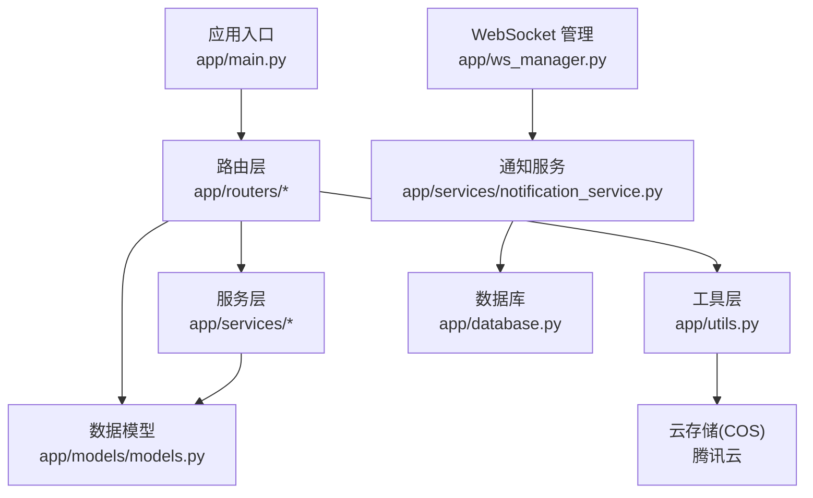
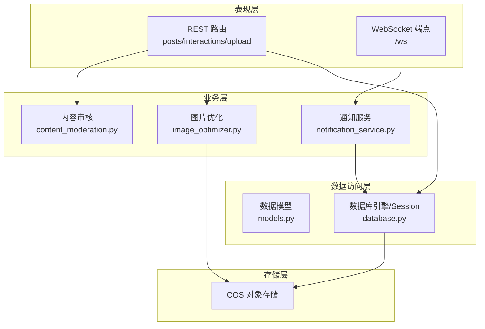
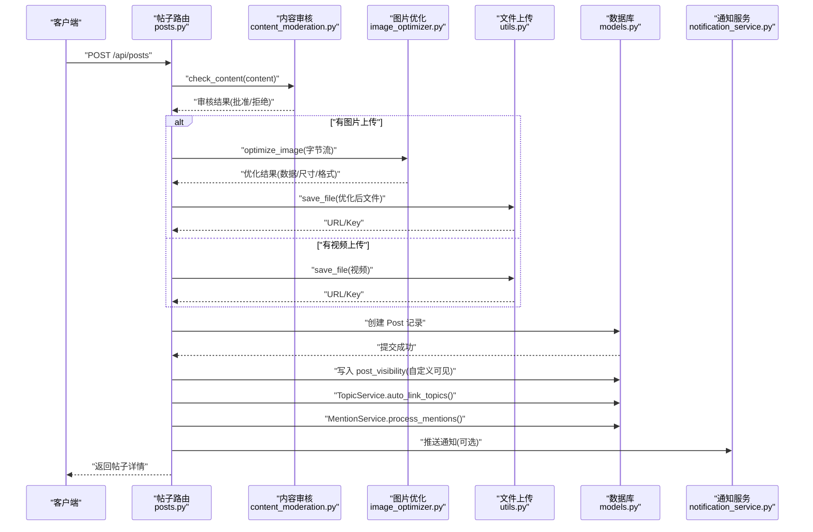
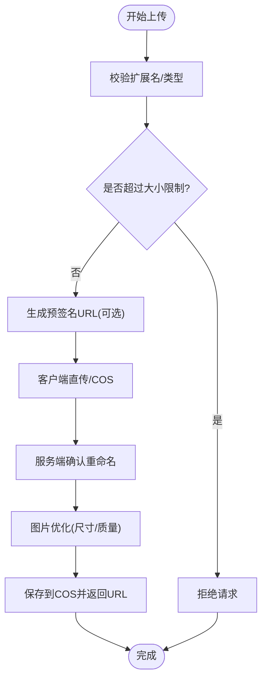
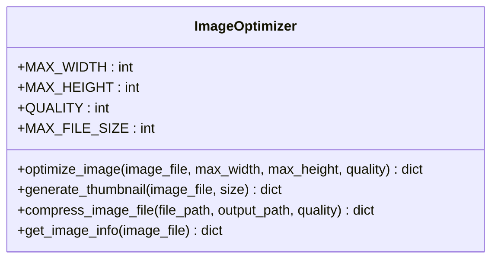
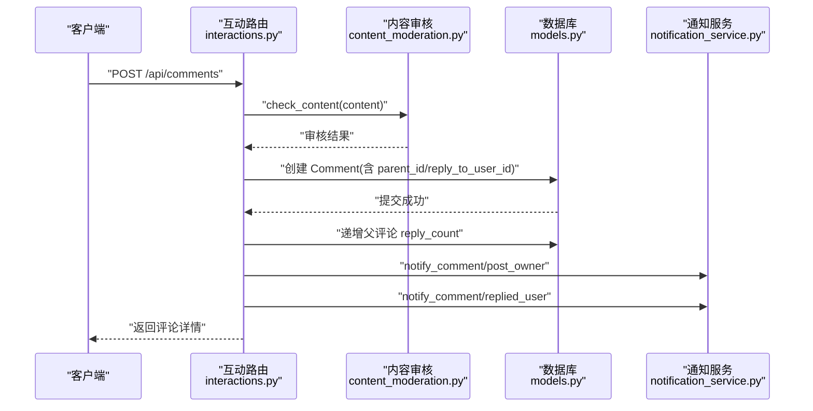
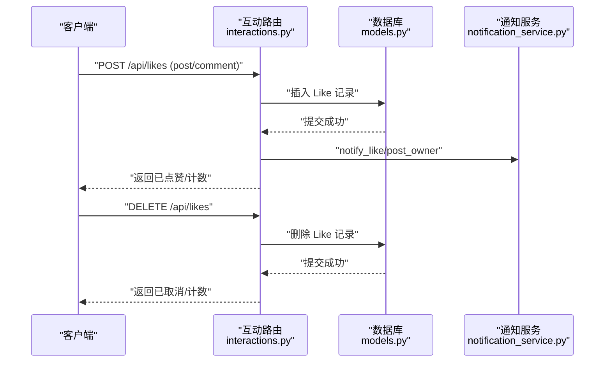
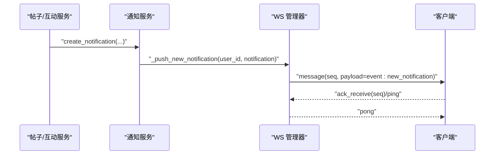
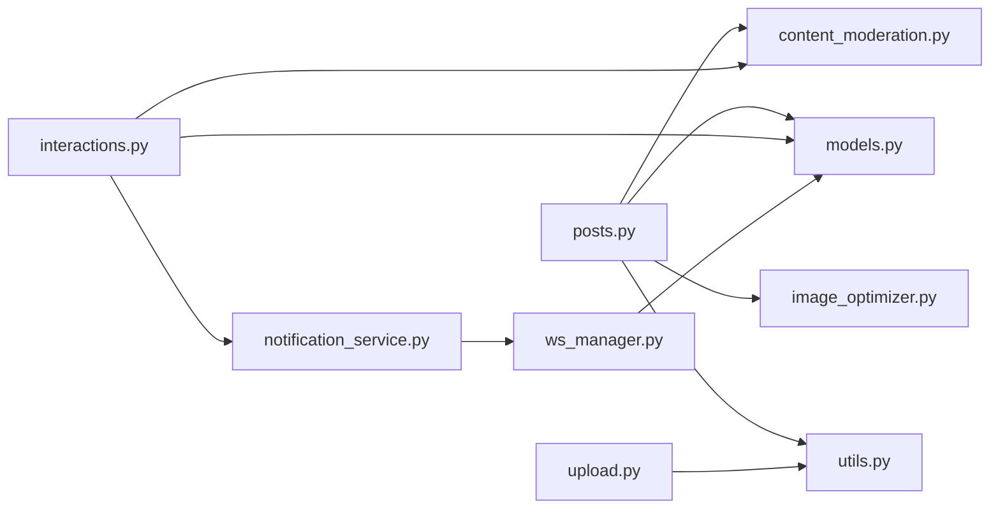

# 社交内容管理

<cite>
**本文档引用的文件**
- [app/main.py](file://app/main.py)
- [app/models/models.py](file://app/models/models.py)
- [app/routers/posts.py](file://app/routers/posts.py)
- [app/routers/upload.py](file://app/routers/upload.py)
- [app/routers/interactions.py](file://app/routers/interactions.py)
- [app/utils.py](file://app/utils.py)
- [app/services/image_optimizer.py](file://app/services/image_optimizer.py)
- [app/services/content_moderation.py](file://app/services/content_moderation.py)
- [app/services/notification_service.py](file://app/services/notification_service.py)
- [app/database.py](file://app/database.py)
- [app/core/config.py](file://app/core/config.py)
- [app/ws_manager.py](file://app/ws_manager.py)
- [websocket_api.json](file://websocket_api.json)
- [openapi.json](file://openapi.json)
</cite>

## 目录
1. [简介](#简介)
2. [项目结构](#项目结构)
3. [核心组件](#核心组件)
4. [架构总览](#架构总览)
5. [详细组件分析](#详细组件分析)
6. [依赖分析](#依赖分析)
7. [性能考虑](#性能考虑)
8. [故障排查指南](#故障排查指南)
9. [结论](#结论)
10. [附录](#附录)

## 简介
本项目为基于 FastAPI 的社交内容管理系统，提供完整的帖子发布、图片上传与优化、评论与互动、通知推送以及 WebSocket 实时通信能力。系统采用模块化设计，围绕数据模型、路由层、服务层与工具层协同工作，确保内容安全、性能与可扩展性。

## 项目结构
- 应用入口与中间件：在应用入口集中注册路由、CORS、安全头与生命周期管理。
- 数据模型：基于 SQLAlchemy 2.x 定义用户、帖子、评论、点赞、通知、会话等核心实体及索引。
- 路由层：按功能拆分，如帖子、上传、互动、通知、推荐、搜索、话题、上传等。
- 服务层：封装内容审核、图片优化、通知推送、推荐、话题与提及处理等业务逻辑。
- 工具层：封装腾讯云 COS 文件上传、预签名 URL 生成、文件信息查询与删除等。
- WebSocket：提供序号化协议、断线补发、ACK 去重与实时通知推送。

图表来源
- [app/main.py:39-84](file://app/main.py#L39-L84)
- [app/routers/posts.py:19-405](file://app/routers/posts.py#L19-L405)
- [app/routers/upload.py:16-224](file://app/routers/upload.py#L16-L224)
- [app/utils.py:14-220](file://app/utils.py#L14-L220)
- [app/models/models.py:42-655](file://app/models/models.py#L42-L655)
- [app/ws_manager.py:20-308](file://app/ws_manager.py#L20-L308)
- [app/services/notification_service.py:14-233](file://app/services/notification_service.py#L14-L233)
- [app/database.py:9-38](file://app/database.py#L9-L38)

章节来源
- [app/main.py:39-110](file://app/main.py#L39-L110)
- [app/database.py:9-38](file://app/database.py#L9-L38)

## 核心组件
- 数据模型与关系：用户、帖子、评论、点赞、通知、会话、消息、屏蔽、举报、话题、漫展相关实体，以及多对多关联表与索引。
- 路由与控制器：帖子发布、列表获取、详情、更新、删除；评论与回复；点赞与取消；上传与直传；通知与推荐。
- 服务与工具：内容审核（敏感词、垃圾信息、仇恨言论）、图片优化（压缩、缩放、格式转换）、文件上传（COS）、通知推送（WS 序号化）。
- WebSocket：认证、心跳、断线补发、ACK 去重、实时消息与通知推送。

章节来源
- [app/models/models.py:42-655](file://app/models/models.py#L42-L655)
- [app/routers/posts.py:22-140](file://app/routers/posts.py#L22-L140)
- [app/routers/interactions.py:54-170](file://app/routers/interactions.py#L54-L170)
- [app/routers/upload.py:50-129](file://app/routers/upload.py#L50-L129)
- [app/services/content_moderation.py:74-127](file://app/services/content_moderation.py#L74-L127)
- [app/services/image_optimizer.py:16-113](file://app/services/image_optimizer.py#L16-L113)
- [app/utils.py:37-188](file://app/utils.py#L37-L188)
- [app/services/notification_service.py:87-141](file://app/services/notification_service.py#L87-L141)
- [app/ws_manager.py:170-213](file://app/ws_manager.py#L170-L213)

## 架构总览
系统采用分层架构：
- 表现层：FastAPI 路由与依赖注入，提供 REST API 与 WebSocket。
- 业务层：服务类封装领域逻辑，如内容审核、图片优化、通知推送。
- 数据访问层：SQLAlchemy ORM 操作数据库，统一 Session 生命周期。
- 存储层：COS 对象存储，支持预签名直传、确认重命名与删除。

图表来源
- [app/routers/posts.py:22-140](file://app/routers/posts.py#L22-L140)
- [app/routers/interactions.py:54-170](file://app/routers/interactions.py#L54-L170)
- [app/routers/upload.py:50-129](file://app/routers/upload.py#L50-L129)
- [app/services/content_moderation.py:74-127](file://app/services/content_moderation.py#L74-L127)
- [app/services/image_optimizer.py:16-113](file://app/services/image_optimizer.py#L16-L113)
- [app/services/notification_service.py:87-141](file://app/services/notification_service.py#L87-L141)
- [app/models/models.py:42-655](file://app/models/models.py#L42-L655)
- [app/database.py:9-38](file://app/database.py#L9-L38)
- [app/utils.py:37-188](file://app/utils.py#L37-L188)

## 详细组件分析

### 帖子发布流程
帖子发布涉及内容验证、元数据处理、数据库存储与通知推送：
- 输入参数：支持文本内容、多图 URL、单张图片上传、视频上传、可见性与自定义可见用户列表。
- 内容审核：对文本进行敏感词、垃圾信息、仇恨言论检测，必要时替换为过滤文本并记录日志。
- 图片处理：对上传图片进行优化（压缩、缩放、格式转换为 JPEG），限制最大体积，生成最终 URL 并保存到 COS。
- 视频处理：直接上传到 COS，生成访问 URL。
- 数据持久化：创建 Post 记录，写入 images、video_url、post_type、visibility 等字段；若为自定义可见，写入 post_visibility 关联表。
- 元数据与关联：自动链接话题、处理 @ 提及，创建通知并推送。

图表来源
- [app/routers/posts.py:22-140](file://app/routers/posts.py#L22-L140)
- [app/services/content_moderation.py:74-127](file://app/services/content_moderation.py#L74-L127)
- [app/services/image_optimizer.py:16-113](file://app/services/image_optimizer.py#L16-L113)
- [app/utils.py:151-188](file://app/utils.py#L151-L188)
- [app/models/models.py:100-184](file://app/models/models.py#L100-L184)
- [app/services/notification_service.py:87-141](file://app/services/notification_service.py#L87-L141)

章节来源
- [app/routers/posts.py:22-140](file://app/routers/posts.py#L22-L140)
- [app/services/content_moderation.py:74-127](file://app/services/content_moderation.py#L74-L127)
- [app/services/image_optimizer.py:16-113](file://app/services/image_optimizer.py#L16-L113)
- [app/utils.py:151-188](file://app/utils.py#L151-L188)
- [app/models/models.py:100-184](file://app/models/models.py#L100-L184)
- [app/services/notification_service.py:87-141](file://app/services/notification_service.py#L87-L141)

### 图片上传处理机制
- 文件类型与大小：根据扩展名映射 content-type，限制上传大小与类型集合。
- 预签名直传：生成一次性上传 URL，客户端直传到 COS，服务端确认后重命名临时文件。
- 优化与存储：对上传图片进行压缩与缩放，必要时转换为 JPEG，限制最大体积，保存到 COS 并返回 URL。
- 删除与信息查询：支持删除 COS 文件与查询文件信息。

图表来源
- [app/routers/upload.py:50-129](file://app/routers/upload.py#L50-L129)
- [app/utils.py:37-188](file://app/utils.py#L37-L188)
- [app/services/image_optimizer.py:16-113](file://app/services/image_optimizer.py#L16-L113)

章节来源
- [app/routers/upload.py:50-129](file://app/routers/upload.py#L50-L129)
- [app/utils.py:37-188](file://app/utils.py#L37-L188)
- [app/services/image_optimizer.py:16-113](file://app/services/image_optimizer.py#L16-L113)

### 图片优化服务实现原理
- 压缩算法：基于 PIL，支持 PNG/GIF/JPEG 等格式；默认最大分辨率 1920x1080，JPEG 质量 85，最大文件 5MB。
- 缩放与格式转换：自动将 RGBA/PNG 转换为 RGB，按最长边缩放到目标尺寸，必要时二次压缩以满足大小限制。
- 输出信息：返回优化前后尺寸、压缩率、宽高、格式等指标，便于统计与质量控制。

图表来源
- [app/services/image_optimizer.py:6-230](file://app/services/image_optimizer.py#L6-L230)

章节来源
- [app/services/image_optimizer.py:16-113](file://app/services/image_optimizer.py#L16-L113)

### 评论系统设计架构
- 层级结构：支持父子评论，父评论作为主评论，子评论为回复；每条评论维护回复计数与点赞计数。
- 实时更新：评论创建后，通知被评论者与被回复者，并处理 @ 提及；点赞评论时更新计数。
- 性能优化：批量查询 is_liked、按需加载回复、分页与内嵌第一页回复，减少 N+1 查询。

图表来源
- [app/routers/interactions.py:175-241](file://app/routers/interactions.py#L175-L241)
- [app/services/content_moderation.py:74-127](file://app/services/content_moderation.py#L74-L127)
- [app/models/models.py:187-232](file://app/models/models.py#L187-L232)
- [app/services/notification_service.py:115-141](file://app/services/notification_service.py#L115-L141)

章节来源
- [app/routers/interactions.py:175-241](file://app/routers/interactions.py#L175-L241)
- [app/models/models.py:187-232](file://app/models/models.py#L187-L232)
- [app/services/notification_service.py:115-141](file://app/services/notification_service.py#L115-L141)

### 点赞、收藏等互动功能
- 点赞：支持帖子与评论点赞，重复点赞返回已存在状态；取消点赞时更新计数。
- 通知：点赞与评论触发通知推送，WS 自动下发新通知事件。
- 数据一致性：使用数据库事务与唯一约束，确保计数与关联数据一致。

图表来源
- [app/routers/interactions.py:54-99](file://app/routers/interactions.py#L54-L99)
- [app/models/models.py:234-259](file://app/models/models.py#L234-L259)
- [app/services/notification_service.py:87-113](file://app/services/notification_service.py#L87-L113)

章节来源
- [app/routers/interactions.py:54-99](file://app/routers/interactions.py#L54-L99)
- [app/models/models.py:234-259](file://app/models/models.py#L234-L259)
- [app/services/notification_service.py:87-113](file://app/services/notification_service.py#L87-L113)

### 通知推送与 WebSocket 实时通信
- 通知服务：创建通知并异步推送至 WebSocket；WS 管理器为每条推送分配用户维度的单调递增序号，支持断线补发与 ACK 去重。
- WebSocket 协议：基于原生 WebSocket，支持认证、心跳、断线补发、幂等 ACK、会话房间广播等。

图表来源
- [app/services/notification_service.py:21-53](file://app/services/notification_service.py#L21-L53)
- [app/ws_manager.py:74-95](file://app/ws_manager.py#L74-L95)
- [websocket_api.json:47-451](file://websocket_api.json#L47-L451)

章节来源
- [app/services/notification_service.py:21-53](file://app/services/notification_service.py#L21-L53)
- [app/ws_manager.py:74-95](file://app/ws_manager.py#L74-L95)
- [websocket_api.json:47-451](file://websocket_api.json#L47-L451)

## 依赖分析
- 组件耦合：路由层依赖服务层与工具层；服务层依赖模型与数据库；WS 依赖通知服务与数据库。
- 外部依赖：COS SDK、PIL、SQLAlchemy、FastAPI、Jinja（通过依赖注入）。
- 潜在循环：当前结构清晰，无明显循环依赖。

图表来源
- [app/routers/posts.py:22-140](file://app/routers/posts.py#L22-L140)
- [app/routers/interactions.py:54-170](file://app/routers/interactions.py#L54-L170)
- [app/routers/upload.py:50-129](file://app/routers/upload.py#L50-L129)
- [app/services/content_moderation.py:74-127](file://app/services/content_moderation.py#L74-L127)
- [app/services/image_optimizer.py:16-113](file://app/services/image_optimizer.py#L16-L113)
- [app/utils.py:37-188](file://app/utils.py#L37-L188)
- [app/services/notification_service.py:87-141](file://app/services/notification_service.py#L87-L141)
- [app/ws_manager.py:170-213](file://app/ws_manager.py#L170-L213)
- [app/models/models.py:42-655](file://app/models/models.py#L42-L655)

章节来源
- [app/routers/posts.py:22-140](file://app/routers/posts.py#L22-L140)
- [app/routers/interactions.py:54-170](file://app/routers/interactions.py#L54-L170)
- [app/routers/upload.py:50-129](file://app/routers/upload.py#L50-L129)
- [app/services/content_moderation.py:74-127](file://app/services/content_moderation.py#L74-L127)
- [app/services/image_optimizer.py:16-113](file://app/services/image_optimizer.py#L16-L113)
- [app/utils.py:37-188](file://app/utils.py#L37-L188)
- [app/services/notification_service.py:87-141](file://app/services/notification_service.py#L87-L141)
- [app/ws_manager.py:170-213](file://app/ws_manager.py#L170-L213)
- [app/models/models.py:42-655](file://app/models/models.py#L42-L655)

## 性能考虑
- 批量查询与 N+1 避免：评论列表与回复批量 enrichment，一次性查询 is_liked。
- 分页与索引：评论按创建时间分页，模型定义了常用索引（如评论 post_parent、parent_created）。
- 图片优化：先压缩后判断体积，必要时降低质量，避免超限。
- 数据库连接池：配置池大小、溢出与回收策略，减少连接开销。
- WS 序号与去重：通过序号与 clientMsgId 去重，减少重复处理与网络消耗。

## 故障排查指南
- 内容审核失败：检查敏感词过滤与垃圾信息规则，查看日志记录。
- 图片上传失败：确认 COS 配置、预签名 URL 生成与确认重命名流程。
- 点赞/评论异常：检查唯一约束与事务提交，查看数据库回滚日志。
- 通知未推送：确认 WS 连接状态、认证结果与消息序号分配。

章节来源
- [app/services/content_moderation.py:231-250](file://app/services/content_moderation.py#L231-L250)
- [app/utils.py:80-121](file://app/utils.py#L80-L121)
- [app/ws_manager.py:214-247](file://app/ws_manager.py#L214-L247)

## 结论
本系统通过清晰的分层设计与模块化服务，实现了从内容发布、图片优化、评论互动到实时通知的完整社交功能链路。借助内容审核与 WS 序号化协议，系统在安全性与用户体验方面具备良好保障。建议持续优化热点查询与缓存策略，进一步提升高并发场景下的性能与稳定性。

## 附录
- API 接口规范：参考自动生成的 OpenAPI 文档，包含认证方式、请求体与响应体示例。
- WebSocket 协议：参考 WebSocket API 文档，包含认证、心跳、断线补发与幂等 ACK 流程。

章节来源
- [openapi.json:1-200](file://openapi.json#L1-L200)
- [websocket_api.json:1-590](file://websocket_api.json#L1-L590)