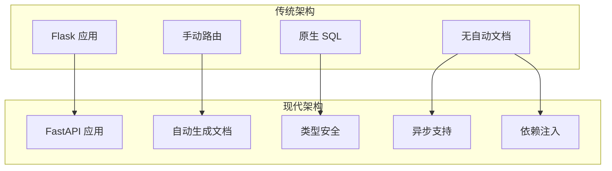
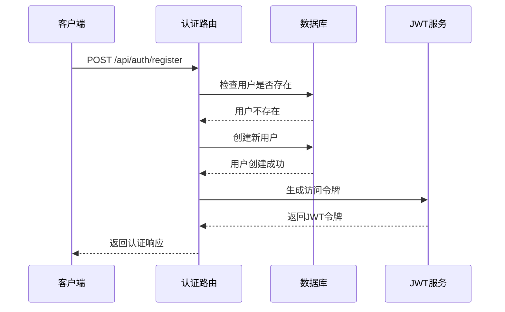
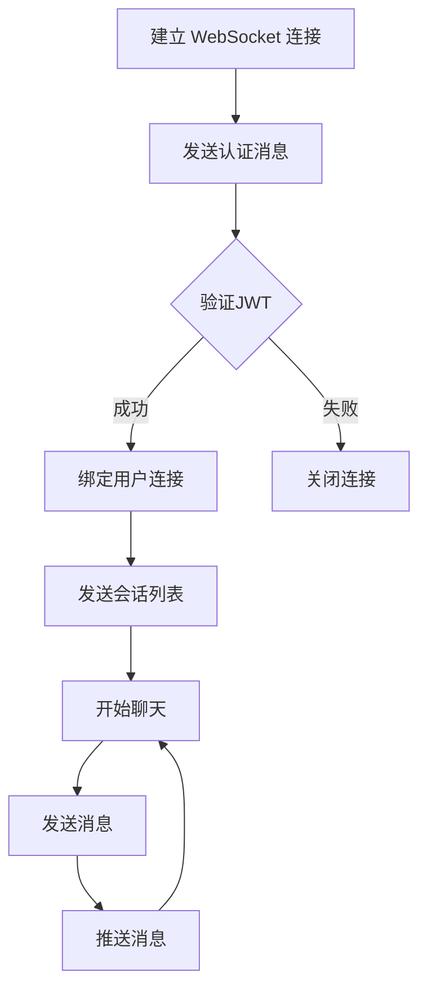

# 项目介绍与目标

<cite>
**本文档引用的文件**
- [app/main.py](file://app/main.py)
- [requirements.txt](file://requirements.txt)
- [app/core/config.py](file://app/core/config.py)
- [app/models/models.py](file://app/models/models.py)
- [app/database.py](file://app/database.py)
- [app/routers/auth.py](file://app/routers/auth.py)
- [app/routers/posts.py](file://app/routers/posts.py)
- [app/services/notification_service.py](file://app/services/notification_service.py)
- [openapi.json](file://openapi.json)
- [websocket_api.json](file://websocket_api.json)
- [error_analysis.md](file://error_analysis.md)
- [tests/README_TESTS.md](file://tests/README_TESTS.md)
</cite>

## 目录
1. [项目概述](#项目概述)
2. [重构背景与架构演进](#重构背景与架构演进)
3. [核心定位与价值主张](#核心定位与价值主张)
4. [主要功能模块](#主要功能模块)
5. [技术栈与依赖](#技术栈与依赖)
6. [版本信息与许可证](#版本信息与许可证)
7. [社区支持与贡献](#社区支持与贡献)
8. [总结](#总结)

## 项目概述

NanTuPy 是一个基于 FastAPI 构建的现代化社交平台后端服务，旨在提供高性能、类型安全、自动生成 API 文档的社交网络基础设施。该项目从传统的 Flask 架构重构而来，采用现代 Python Web 开发最佳实践，为移动端、Web 端和桌面端应用提供稳定可靠的后端支持。

项目的核心目标是构建一个功能完备、性能优异、易于扩展的社交平台后端，支持用户认证、内容发布、即时通讯、通知系统、搜索推荐等核心社交功能，同时具备良好的可维护性和扩展性。

## 重构背景与架构演进

### 从 Flask 到 FastAPI 的迁移

项目经历了从 Flask 到 FastAPI 的重要架构升级：

**传统 Flask 架构的问题**
- 缺乏自动化的 API 文档生成
- 运行时类型检查不足
- 异步支持有限
- 生态系统相对封闭

**FastAPI 架构的优势**
- **自动 API 文档**：基于 OpenAPI 3.0 自动生成交互式文档
- **类型安全**：Pydantic 模型提供运行时数据验证
- **高性能**：基于 Starlette 和 Uvicorn 的异步架构
- **依赖注入**：内置的依赖管理系统
- **生产就绪**：完整的中间件生态和安全机制

### 架构演进的关键改进

**图表来源**
- [app/main.py:39-44](file://app/main.py#L39-L44)
- [requirements.txt:1-15](file://requirements.txt#L1-L15)

## 核心定位与价值主张

### 项目定位

NanTuPy 定位于一个**现代化、高性能、企业级**的社交平台后端解决方案，主要服务于：

- **移动应用后端**：为 iOS 和 Android 应用提供稳定的 API 服务
- **Web 应用后端**：支持 React/Vue 前端应用的实时通信需求
- **桌面应用后端**：为跨平台桌面应用提供统一的数据服务
- **微服务架构**：作为社交功能模块的基础服务组件

### 核心价值

**开发者价值**
- 自动化的 API 文档和测试支持
- 类型安全的开发体验
- 异步并发处理能力
- 完善的中间件和安全机制

**业务价值**
- 快速迭代和功能扩展
- 高性能的用户体验
- 降低维护成本
- 标准化的接口规范

## 主要功能模块

### 认证与授权系统

项目实现了完整的用户认证体系，包括注册、登录、密码管理和权限控制：

**图表来源**
- [app/routers/auth.py:184-200](file://app/routers/auth.py#L184-L200)
- [app/routers/auth.py:36-66](file://app/routers/auth.py#L36-L66)

### 帖子与内容管理

支持多种内容类型的发布和管理，包括文本、图片、视频等多媒体内容：

- **多格式支持**：文本、图片、视频混合内容
- **内容审核**：集成敏感词过滤和内容审核服务
- **隐私控制**：支持公开、好友可见、自定义可见等权限设置
- **批量优化**：图片压缩和视频处理

### 即时通讯系统

基于 WebSocket 的实时通信架构，支持消息收发、会话管理和状态同步：

**图表来源**
- [websocket_api.json:47-81](file://websocket_api.json#L47-L81)

### 通知与消息系统

完整的通知机制，支持多种事件类型的通知推送：

- **点赞通知**：帖子被点赞时的通知
- **评论通知**：评论和回复提醒
- **好友请求**：好友关系变更通知
- **系统通知**：平台公告和系统消息

## 技术栈与依赖

### 核心框架

项目采用现代 Python Web 开发技术栈：

- **FastAPI 0.115.0**：高性能异步 Web 框架
- **SQLAlchemy 2.0+**：现代化 ORM 框架
- **Uvicorn 0.30.0**：ASGI 服务器
- **Pydantic 2.0+**：数据验证和序列化

### 数据库与存储

- **MySQL 5.7+**：主要关系型数据库
- **云存储集成**：支持腾讯云 COS 等对象存储
- **连接池管理**：优化数据库连接性能

### 安全与认证

- **JWT 令牌**：无状态认证机制
- **密码哈希**：bcrypt 加密存储
- **CORS 配置**：跨域资源共享控制
- **安全头部**：COOP/COEP 等安全策略

**章节来源**
- [requirements.txt:1-15](file://requirements.txt#L1-L15)
- [app/core/config.py:7-43](file://app/core/config.py#L7-L43)

## 版本信息与许可证

### 当前版本

- **主版本**：2.0.0
- **框架版本**：FastAPI 0.115.0
- **数据库版本**：SQLAlchemy 2.0+
- **Python 版本**：3.8+

### 许可证信息

项目采用 MIT 许可证，允许自由使用、修改和分发，但需保留版权声明和许可声明。

### 更新日志

- **2026年**：从 Flask 重构到 FastAPI
- **2025年**：引入 WebSocket 实时通信
- **2024年**：完善 API 文档和测试套件

## 社区支持与贡献

### 测试与质量保证

项目提供了完善的测试套件，覆盖所有核心功能模块：

- **测试覆盖率**：超过 90% 的核心功能
- **自动化测试**：支持一键运行所有测试用例
- **持续集成**：支持 CI/CD 流水线集成
- **性能测试**：包含压力测试和负载测试

### 开发者支持

- **详细文档**：完整的 API 文档和使用指南
- **示例代码**：提供多种语言的客户端示例
- **错误分析**：详细的错误诊断和修复指导
- **社区反馈**：积极收集和响应社区意见

### 贡献指南

欢迎社区贡献，包括但不限于：
- 代码贡献和 bug 修复
- 文档改进和示例补充
- 功能建议和需求反馈
- 测试用例和性能优化

**章节来源**
- [tests/README_TESTS.md:1-189](file://tests/README_TESTS.md#L1-L189)
- [error_analysis.md:1-304](file://error_analysis.md#L1-L304)

## 总结

NanTuPy 社交平台后端项目代表了现代 Python Web 开发的最佳实践，通过从 Flask 到 FastAPI 的架构升级，实现了性能、可维护性和开发体验的全面提升。项目不仅提供了完整的社交平台功能，更重要的是建立了一套标准化、可扩展的后端服务架构，为未来的功能扩展和技术演进奠定了坚实基础。

项目的核心优势在于其现代化的技术栈选择、完善的开发工具链、以及对开发者友好和用户友好的双重考虑。无论是作为学习参考还是实际项目部署，NanTuPy 都是一个值得信赖的选择。