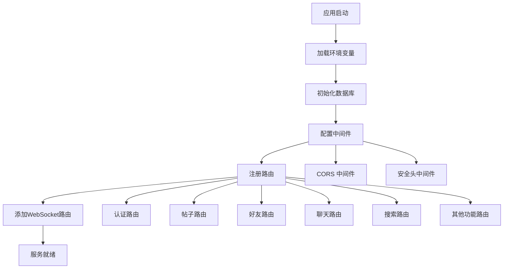
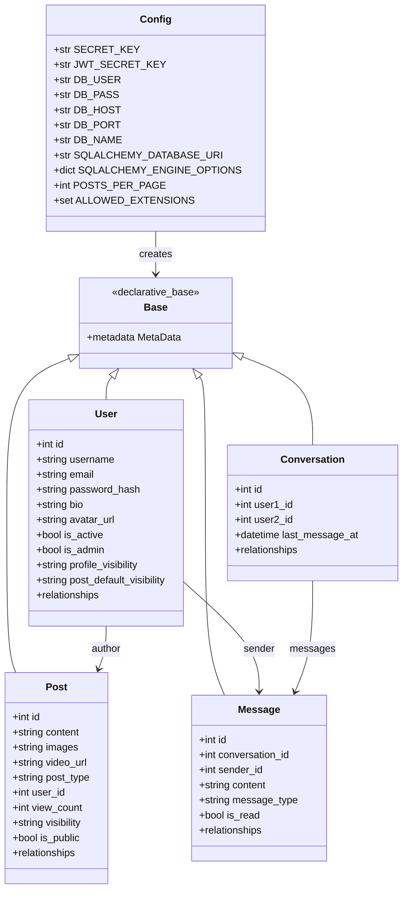
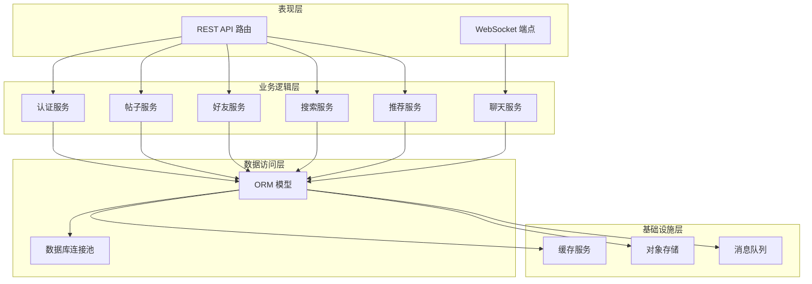
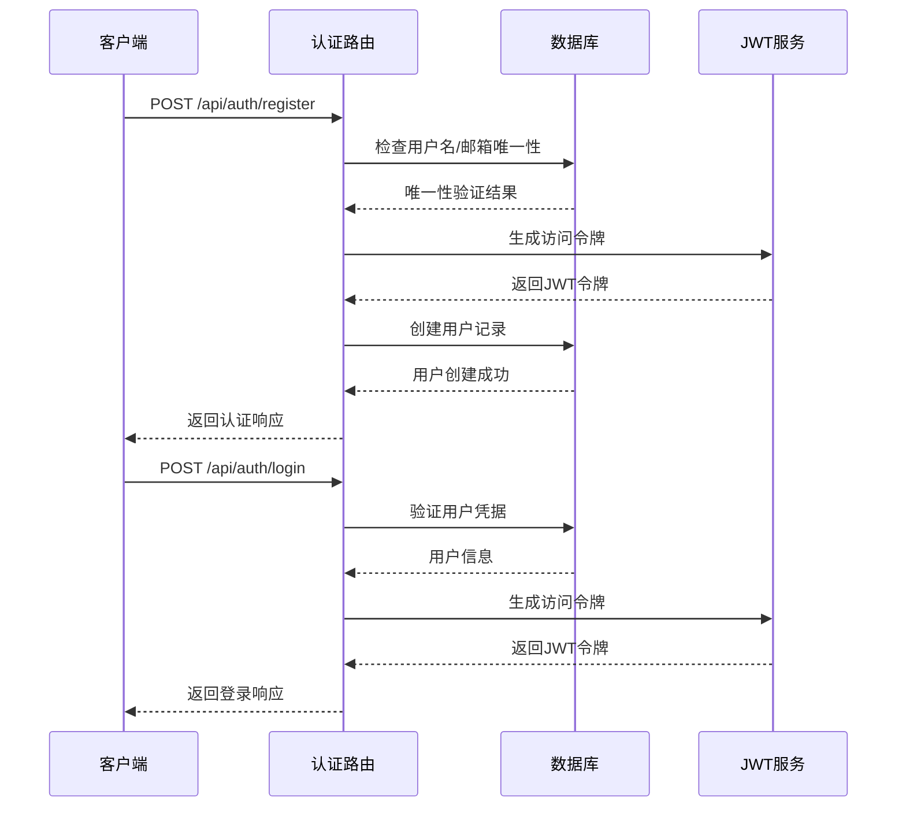
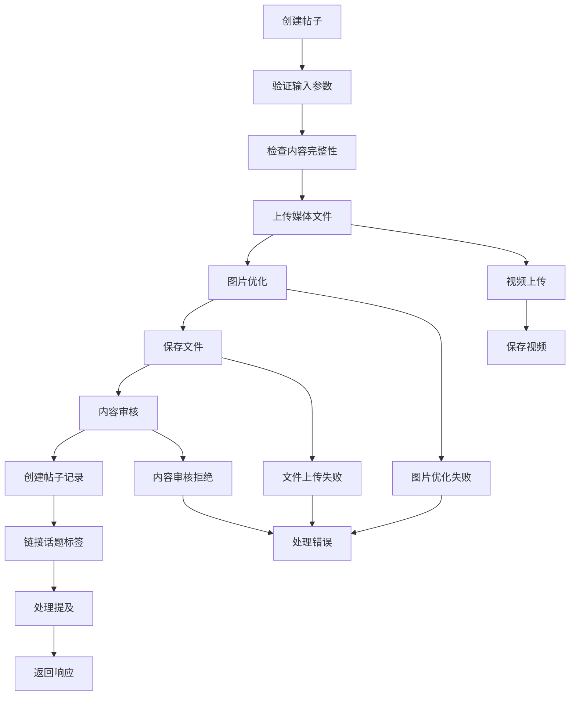
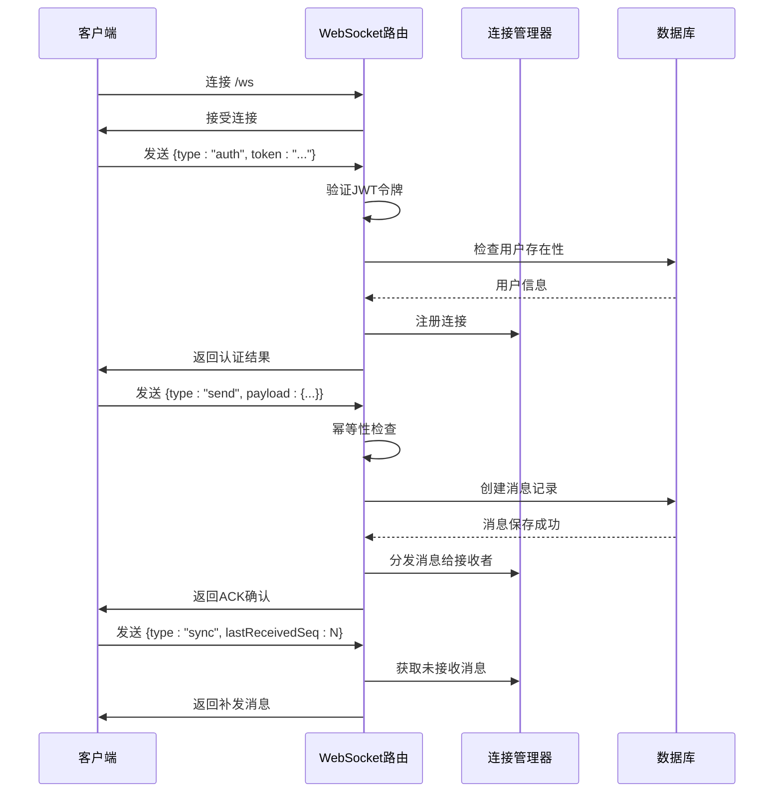
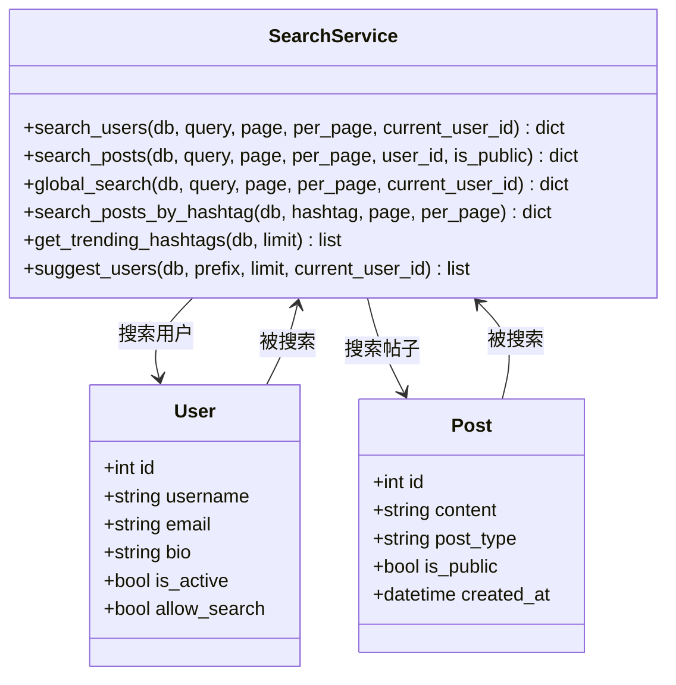
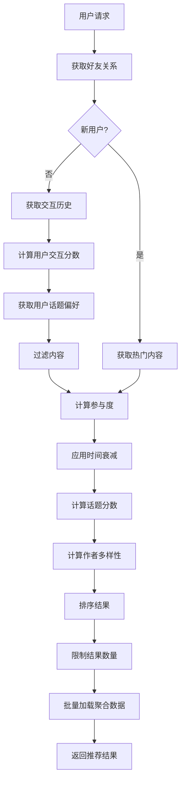

# 项目概述

<cite>
**本文档引用的文件**
- [app/main.py](file://app/main.py)
- [requirements.txt](file://requirements.txt)
- [app/core/config.py](file://app/core/config.py)
- [app/models/models.py](file://app/models/models.py)
- [app/database.py](file://app/database.py)
- [app/routers/auth.py](file://app/routers/auth.py)
- [app/routers/posts.py](file://app/routers/posts.py)
- [app/routers/ws.py](file://app/routers/ws.py)
- [app/services/recommendation_service.py](file://app/services/recommendation_service.py)
- [app/services/search_service.py](file://app/services/search_service.py)
- [openapi.json](file://openapi.json)
- [tests/README_TESTS.md](file://tests/README_TESTS.md)
</cite>

## 目录
1. [简介](#简介)
2. [项目结构](#项目结构)
3. [核心组件](#核心组件)
4. [架构概览](#架构概览)
5. [详细组件分析](#详细组件分析)
6. [依赖分析](#依赖分析)
7. [性能考虑](#性能考虑)
8. [故障排除指南](#故障排除指南)
9. [结论](#结论)
10. [附录](#附录)

## 简介

NanTuPy 是一个基于 FastAPI 的社交平台后端系统，该项目从传统的 Flask 框架重构而来，旨在提供现代化、高性能的社交网络服务。项目采用 Python 3.8+ 开发，使用 FastAPI 作为主要 Web 框架，结合 SQLAlchemy 2.0+ ORM 进行数据库操作。

### 重构背景与优势

从 Flask 到 FastAPI 的重构带来了以下显著优势：
- **自动 API 文档生成**：基于 Pydantic 模型自动生成 OpenAPI 文档
- **类型安全**：利用 Python 类型注解提供编译时类型检查
- **异步支持**：内置异步处理能力，提升并发性能
- **依赖注入**：简化了数据库连接和业务逻辑的组织
- **中间件生态**：更丰富的中间件支持和配置选项

### 主要特性

NanTuPy 提供完整的社交平台功能，包括：
- **用户认证系统**：支持用户名/邮箱登录、密码重置、隐私设置
- **社交内容管理**：帖子发布、图片/视频上传、内容审核
- **实时通信**：WebSocket 实时聊天，支持消息序号、去重、断线重连
- **好友系统**：好友请求、接受/拒绝、状态管理
- **搜索功能**：用户搜索、帖子搜索、全局搜索、话题标签搜索
- **个性化推荐**：基于用户交互的历史内容推荐算法
- **内容审核**：敏感词过滤和内容合规检查

## 项目结构

项目采用模块化的目录结构，按照功能域进行组织：

```mermaid
graph TB
subgraph "应用核心"
MAIN[app/main.py<br/>应用入口]
CONFIG[app/core/config.py<br/>配置管理]
DATABASE[app/database.py<br/>数据库配置]
UTILS[app/utils.py<br/>工具函数]
DEPS[app/dependencies.py<br/>依赖注入]
end
subgraph "数据模型层"
MODELS[app/models/models.py<br/>ORM 模型定义]
end
subgraph "路由层"
AUTH[app/routers/auth.py<br/>认证路由]
POSTS[app/routers/posts.py<br/>帖子路由]
FRIENDS[app/routers/friends.py<br/>好友路由]
CHAT[app/routers/chat.py<br/>聊天路由]
WS[app/routers/ws.py<br/>WebSocket路由]
SEARCH[app/routers/search.py<br/>搜索路由]
RECOMMEND[app/routers/recommendations.py<br/>推荐路由]
NOTIF[app/routers/notifications.py<br/>通知路由]
UPLOAD[app/routers/upload.py<br/>上传路由]
TOPICS[app/routers/topics.py<br/>话题路由]
BLOCKS[app/routers/blocks.py<br/>屏蔽路由]
REPORTS[app/routers/reports.py<br/>举报路由]
HEALTH[app/routers/health.py<br/>健康检查]
ADMIN[app/routers/admin.py<br/>管理员路由]
COMIC[app/routers/comic.py<br/>漫展路由]
end
subgraph "服务层"
REC_SERVICE[app/services/recommendation_service.py<br/>推荐服务]
SEARCH_SERVICE[app/services/search_service.py<br/>搜索服务]
CONTENT_FILTER[app/services/content_filter.py<br/>内容过滤]
NOTIF_SERVICE[app/services/notification_service.py<br/>通知服务]
IMAGE_OPT[app/services/image_optimizer.py<br/>图片优化]
MENTION[app/services/mention_service.py<br/>提及处理]
end
MAIN --> AUTH
MAIN --> POSTS
MAIN --> FRIENDS
MAIN --> CHAT
MAIN --> WS
MAIN --> SEARCH
MAIN --> RECOMMEND
MAIN --> NOTIF
MAIN --> UPLOAD
MAIN --> TOPICS
MAIN --> BLOCKS
MAIN --> REPORTS
MAIN --> HEALTH
MAIN --> ADMIN
MAIN --> COMIC
AUTH --> MODELS
POSTS --> MODELS
FRIENDS --> MODELS
CHAT --> MODELS
WS --> MODELS
SEARCH --> MODELS
RECOMMEND --> MODELS
NOTIF --> MODELS
UPLOAD --> MODELS
TOPICS --> MODELS
BLOCKS --> MODELS
REPORTS --> MODELS
HEALTH --> MODELS
ADMIN --> MODELS
COMIC --> MODELS
POSTS --> REC_SERVICE
SEARCH --> SEARCH_SERVICE
POSTS --> CONTENT_FILTER
CHAT --> NOTIF_SERVICE
POSTS --> IMAGE_OPT
POSTS --> MENTION
```



**图表来源**
- [app/main.py:1-110](file://app/main.py#L1-L110)
- [app/models/models.py:1-655](file://app/models/models.py#L1-L655)

**章节来源**
- [app/main.py:1-110](file://app/main.py#L1-L110)
- [app/core/config.py:1-43](file://app/core/config.py#L1-L43)

## 核心组件

### 应用入口与配置

应用入口文件 `app/main.py` 定义了整个系统的启动流程和中间件配置：



**图表来源**
- [app/main.py:29-84](file://app/main.py#L29-L84)

### 数据库配置与模型

项目使用 SQLAlchemy 2.0+ 进行数据库操作，支持多种数据库类型：



**图表来源**
- [app/core/config.py:7-43](file://app/core/config.py#L7-L43)
- [app/database.py:9-38](file://app/database.py#L9-L38)
- [app/models/models.py:42-312](file://app/models/models.py#L42-L312)

**章节来源**
- [app/core/config.py:1-43](file://app/core/config.py#L1-L43)
- [app/database.py:1-38](file://app/database.py#L1-L38)
- [app/models/models.py:1-655](file://app/models/models.py#L1-L655)

## 架构概览

NanTuPy 采用分层架构设计，确保各层职责清晰分离：



**图表来源**
- [app/main.py:13-84](file://app/main.py#L13-L84)
- [app/routers/auth.py:184-212](file://app/routers/auth.py#L184-L212)
- [app/routers/posts.py:22-140](file://app/routers/posts.py#L22-L140)

### 技术栈选择

项目采用现代 Python 生态系统的关键技术：

- **Web 框架**：FastAPI 0.115.0，提供异步支持和自动 API 文档
- **数据库**：SQLAlchemy 2.0+，支持多种数据库后端
- **认证**：JWT 令牌，支持密码哈希和令牌刷新
- **实时通信**：Socket.IO，支持消息序号和去重机制
- **文件存储**：支持本地存储和云存储（COS）
- **图像处理**：Pillow，支持图片优化和格式转换

**章节来源**
- [requirements.txt:1-15](file://requirements.txt#L1-L15)
- [app/main.py:39-44](file://app/main.py#L39-L44)

## 详细组件分析

### 认证系统

认证系统是社交平台的核心安全组件，支持多种认证方式和安全策略：



**图表来源**
- [app/routers/auth.py:184-212](file://app/routers/auth.py#L184-L212)
- [app/routers/auth.py:215-236](file://app/routers/auth.py#L215-L236)

认证系统的关键特性：
- **多字段登录**：支持用户名或邮箱登录
- **密码兼容性**：兼容 Flask 时代的 scrypt 哈希和 FastAPI 的 bcrypt 哈希
- **隐私设置**：用户可控制个人资料可见性和搜索权限
- **令牌管理**：支持访问令牌刷新和过期处理

**章节来源**
- [app/routers/auth.py:1-200](file://app/routers/auth.py#L1-L200)
- [app/models/models.py:42-98](file://app/models/models.py#L42-L98)

### 帖子管理系统

帖子系统支持富媒体内容发布和复杂的社交交互：



**图表来源**
- [app/routers/posts.py:22-140](file://app/routers/posts.py#L22-L140)

帖子系统的核心功能：
- **多媒体支持**：支持图片和视频上传，自动优化图片大小
- **内容审核**：集成敏感词过滤和内容合规检查
- **话题链接**：自动识别和链接话题标签
- **提及处理**：支持 @ 用户提及功能
- **可见性控制**：支持公开、好友可见、私密等多种可见性设置

**章节来源**
- [app/routers/posts.py:1-200](file://app/routers/posts.py#L1-L200)
- [app/services/search_service.py:114-138](file://app/services/search_service.py#L114-L138)

### 实时通信系统

WebSocket 实现实时聊天功能，采用高级协议确保消息可靠传输：



**图表来源**
- [app/routers/ws.py:442-546](file://app/routers/ws.py#L442-L546)
- [app/routers/ws.py:217-323](file://app/routers/ws.py#L217-L323)

实时通信系统的关键特性：
- **消息序号机制**：每个消息分配唯一序号，支持断线重连
- **幂等性保证**：客户端消息ID去重，防止重复处理
- **房间管理**：支持会话房间的加入和离开
- **状态广播**：支持打字状态等用户状态广播
- **ACK 确认**：消息确认机制，确保消息可靠传输

**章节来源**
- [app/routers/ws.py:1-546](file://app/routers/ws.py#L1-L546)

### 搜索系统

搜索系统提供多维度的内容检索功能：



**图表来源**
- [app/services/search_service.py:9-179](file://app/services/search_service.py#L9-L179)

搜索系统的核心功能：
- **用户搜索**：支持用户名和邮箱模糊匹配，考虑隐私设置
- **帖子搜索**：全文搜索帖子内容，支持按作者过滤
- **全局搜索**：同时搜索用户和帖子，整合结果
- **话题标签搜索**：支持 # 标签的精确匹配
- **热门话题**：基于最近内容统计热门标签
- **用户建议**：基于前缀的用户自动完成

**章节来源**
- [app/services/search_service.py:1-179](file://app/services/search_service.py#L1-L179)

### 推荐系统

推荐系统采用多因子融合算法，提供个性化的社交内容推荐：



**图表来源**
- [app/services/recommendation_service.py:83-168](file://app/services/recommendation_service.py#L83-L168)

推荐系统的关键算法：
- **交互分数**：基于用户点赞和评论历史计算相似度
- **话题偏好**：分析用户关注的话题，推荐相关内容
- **时间衰减**：新内容给予更高权重，保持时效性
- **作者多样性**：限制同一作者的内容比例，提高多样性
- **个性化权重**：根据用户特征调整不同因子的权重

**章节来源**
- [app/services/recommendation_service.py:1-200](file://app/services/recommendation_service.py#L1-L200)

## 依赖分析

项目依赖关系清晰，遵循单一职责原则：

```mermaid
graph TB
subgraph "核心依赖"
FASTAPI[fastapi==0.115.0]
UVICORN[uvicorn[standard]==0.30.0]
SQLALCHEMY[sqlalchemy>=2.0.50]
PYMYSQL[pymysql==1.1.0]
end
subgraph "认证依赖"
JOSE[python-jose[cryptography]==3.3.0]
PASSLIB[passlib[bcrypt]==1.7.4]
end
subgraph "文件处理"
MULTIPART[python-socketio==5.10.0]
PILLOW[Pillow>=10.2.0]
COS[cos-python-sdk-v5]
end
subgraph "数据验证"
PYDANTIC[pydantic>=2.0.0]
SETTINGS[pydantic-settings>=2.0.0]
end
subgraph "工具类"
WERKZEUG[werkzeug>=3.0.0]
MARKUPSAFE[markupsafe>=2.1.0]
end
FASTAPI --> SQLALCHEMY
FASTAPI --> PYDANTIC
FASTAPI --> JOSE
SQLALCHEMY --> PYMYSQL
PILLOW --> MULTIPART
```

**图表来源**
- [requirements.txt:1-15](file://requirements.txt#L1-L15)

**章节来源**
- [requirements.txt:1-15](file://requirements.txt#L1-L15)

## 性能考虑

### 数据库优化

项目采用了多项数据库性能优化策略：

1. **连接池配置**：预配置连接池大小和超时参数
2. **批量操作**：推荐系统使用批量数据加载消除 N+1 查询
3. **索引优化**：为常用查询字段建立复合索引
4. **查询优化**：使用 `EXISTS` 替代 `IN` 子查询

### 缓存策略

- **会话缓存**：WebSocket 连接状态和消息序号缓存
- **推荐缓存**：热门内容和趋势数据缓存
- **搜索缓存**：频繁搜索结果缓存

### 异步处理

- **文件上传**：异步处理图片优化和视频转码
- **内容审核**：异步执行敏感词过滤
- **通知推送**：异步发送推送通知

## 故障排除指南

### 常见问题诊断

1. **数据库连接问题**
   - 检查数据库配置参数
   - 验证连接池设置
   - 查看数据库服务状态

2. **JWT 认证失败**
   - 验证密钥配置
   - 检查令牌过期时间
   - 确认用户账户状态

3. **文件上传失败**
   - 检查文件大小限制
   - 验证文件类型
   - 查看存储权限

4. **WebSocket 连接异常**
   - 检查网络连接
   - 验证认证令牌
   - 查看服务器日志

### 日志分析

项目提供了详细的日志记录：
- **请求日志**：HTTP 请求和响应信息
- **错误日志**：异常堆栈和错误详情
- **性能日志**：慢查询和性能指标
- **业务日志**：关键业务操作记录

**章节来源**
- [app/main.py:17-26](file://app/main.py#L17-L26)
- [tests/README_TESTS.md:114-134](file://tests/README_TESTS.md#L114-L134)

## 结论

NanTuPy 社交平台后端系统展现了现代 Python Web 开发的最佳实践。通过从 Flask 到 FastAPI 的重构，项目获得了更好的性能、类型安全和开发体验。

### 技术优势

1. **现代化框架**：FastAPI 提供了优秀的开发体验和性能表现
2. **完整功能**：涵盖了社交平台的核心功能需求
3. **可扩展性**：模块化设计便于功能扩展和维护
4. **安全性**：完善的认证授权和数据保护机制
5. **实时性**：高效的 WebSocket 实现实时通信

### 发展方向

未来可以考虑的功能增强：
- **微服务架构**：将大型服务拆分为独立的微服务
- **容器化部署**：支持 Docker 和 Kubernetes 部署
- **监控告警**：集成 APM 和日志监控系统
- **国际化**：支持多语言界面和内容
- **移动端适配**：优化移动端 API 接口

## 附录

### 快速入门指南

#### 环境要求
- Python 3.8+
- MySQL 5.7+ 或兼容数据库
- 至少 4GB RAM
- 稳定的网络连接

#### 安装步骤

1. **克隆项目**
```bash
git clone https://github.com/your-repo/NanTuPy.git
cd NanTuPy
```

2. **创建虚拟环境**
```bash
python -m venv venv
source venv/bin/activate  # Linux/Mac
# 或
venv\Scripts\activate  # Windows
```

3. **安装依赖**
```bash
pip install -r requirements.txt
```

4. **配置环境变量**
```bash
# 创建 .env 文件
echo "SECRET_KEY=your-secret-key" > .env
echo "JWT_SECRET_KEY=your-jwt-secret" >> .env
echo "DB_USER=your-db-user" >> .env
echo "DB_PASS=your-db-password" >> .env
echo "DB_HOST=localhost" >> .env
echo "DB_PORT=3306" >> .env
echo "DB_NAME=nantupy" >> .env
```

5. **启动应用**
```bash
uvicorn app.main:app --host 0.0.0.0 --port 5000 --reload
```

#### 基本使用示例

1. **注册用户**
```bash
curl -X POST http://localhost:5000/api/auth/register \
  -H "Content-Type: application/json" \
  -d '{
    "username": "testuser",
    "email": "test@example.com",
    "password": "Password123"
  }'
```

2. **用户登录**
```bash
curl -X POST http://localhost:5000/api/auth/login \
  -H "Content-Type: application/json" \
  -d '{
    "email": "test@example.com",
    "password": "Password123"
  }'
```

3. **创建帖子**
```bash
curl -X POST http://localhost:5000/api/posts/ \
  -H "Authorization: Bearer YOUR_JWT_TOKEN" \
  -F "content=Hello World" \
  -F "image=@/path/to/image.jpg"
```

4. **获取推荐内容**
```bash
curl -X GET "http://localhost:5000/api/recommendations/feed?page=1&per_page=20" \
  -H "Authorization: Bearer YOUR_JWT_TOKEN"
```

#### API 文档

完整的 API 文档可通过以下地址访问：
- **OpenAPI 文档**：http://localhost:5000/docs
- **Redoc 文档**：http://localhost:5000/redoc
- **原始 OpenAPI**：http://localhost:5000/openapi.json

**章节来源**
- [tests/README_TESTS.md:23-61](file://tests/README_TESTS.md#L23-L61)
- [openapi.json:1-800](file://openapi.json#L1-L800)